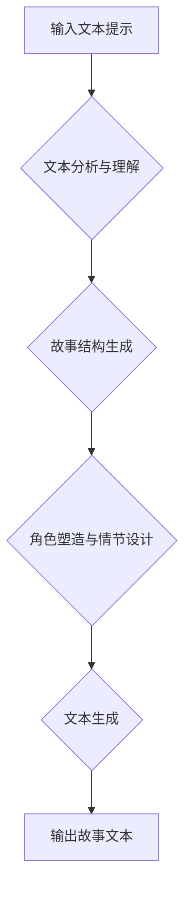

                 

## AI故事创作：算法与人类创意的碰撞

> 关键词：人工智能、故事创作、算法、创意、自然语言处理、深度学习、文本生成、叙事结构、角色塑造、情节设计

## 1. 背景介绍

故事，是人类文明中永恒的魅力。从古老的寓言到现代的畅销小说，故事承载着我们的情感、智慧和对世界的理解。而人工智能，作为科技发展最前沿的领域之一，正在以惊人的速度改变着我们的生活。近年来，人工智能在文本生成领域取得了突破性进展，使得机器能够创作出逼真的故事。

然而，人工智能的故事创作是否真的能够与人类的创造力相媲美？这引发了人们对算法与人类创意碰撞的深刻思考。

## 2. 核心概念与联系

### 2.1  人工智能故事创作

人工智能故事创作是指利用人工智能算法生成具有叙事结构、角色塑造和情节设计的原创故事。

### 2.2  核心技术

* **自然语言处理 (NLP)：** 理解和生成人类语言的核心技术，包括文本分析、语义理解、文本生成等。
* **深度学习 (Deep Learning)：** 一种机器学习方法，通过多层神经网络模拟人类大脑的学习过程，能够从海量文本数据中学习语言模式和故事结构。
* **文本生成模型：** 基于深度学习的模型，能够根据输入的文本提示或参数生成新的文本内容，例如 GPT-3、LaMDA 等。

### 2.3  流程图



## 3. 核心算法原理 & 具体操作步骤

### 3.1  算法原理概述

人工智能故事创作算法通常基于以下原理：

* **统计语言模型：** 通过统计分析大量文本数据，学习语言的概率分布和语法规则，从而生成符合语法和语义的文本。
* **序列到序列模型：** 将故事创作视为一个序列到序列的转换任务，例如将故事梗概转换为完整的文本故事。
* **强化学习：** 通过奖励机制训练模型，使其生成更符合人类审美和逻辑的文本。

### 3.2  算法步骤详解

1. **数据预处理：** 收集和清洗大量文本数据，例如小说、剧本、诗歌等，并将其转换为模型可处理的格式。
2. **模型训练：** 使用深度学习算法训练文本生成模型，例如 GPT-3，使其能够理解语言结构和故事元素。
3. **故事结构生成：** 根据输入的文本提示或参数，利用预训练模型生成故事的基本结构，包括情节、人物关系、时间线等。
4. **角色塑造与情节设计：** 根据故事结构，利用自然语言处理技术和知识库，为角色赋予个性和背景，并设计情节发展。
5. **文本生成：** 利用文本生成模型，根据故事结构和角色设定，生成完整的文本故事。
6. **文本润色：** 对生成的文本进行语法检查、语义优化和风格调整，使其更加流畅自然。

### 3.3  算法优缺点

**优点：**

* **效率高：** 相比人类，人工智能可以快速生成大量故事。
* **创意无限：** 算法可以探索各种不同的故事可能性，突破人类的想象力。
* **个性化定制：** 可以根据用户的需求生成特定类型的故事。

**缺点：**

* **缺乏情感共鸣：** 机器生成的文本可能缺乏真实的情感和深度。
* **故事原创性有限：** 算法依赖于已有的文本数据，可能难以创作真正原创的故事。
* **伦理问题：** 机器生成的故事可能存在版权问题和伦理争议。

### 3.4  算法应用领域

* **娱乐产业：** 生成游戏剧本、电影故事、小说等。
* **教育领域：** 辅助写作教学、生成个性化学习故事。
* **营销领域：** 生成广告文案、品牌故事等。
* **科研领域：** 研究语言模型、故事结构、人工智能创意等。

## 4. 数学模型和公式 & 详细讲解 & 举例说明

### 4.1  数学模型构建

文本生成模型通常基于概率模型，例如 n-gram 模型和循环神经网络 (RNN)。

* **n-gram 模型：** 统计文本中相邻 n 个词的出现概率，用于预测下一个词。

* **循环神经网络 (RNN)：** 能够处理序列数据，例如文本，并学习文本的上下文信息。

### 4.2  公式推导过程

* **n-gram 模型概率公式：**

$$P(w_i|w_{i-n+1}, w_{i-n+2}, ..., w_{i-1})$$

其中，$w_i$ 是第 i 个词，$w_{i-n+1}, w_{i-n+2}, ..., w_{i-1}$ 是前 n-1 个词。

* **RNN 隐藏状态更新公式：**

$$h_t = f(W_{hh}h_{t-1} + W_{xh}x_t + b_h)$$

其中，$h_t$ 是第 t 个时间步的隐藏状态，$h_{t-1}$ 是前一个时间步的隐藏状态，$x_t$ 是第 t 个时间步的输入词，$W_{hh}$ 和 $W_{xh}$ 是权重矩阵，$b_h$ 是偏置项，$f$ 是激活函数。

### 4.3  案例分析与讲解

* **n-gram 模型：** 可以用于预测下一个词，例如在句子 "The cat sat on the" 中，n-gram 模型可以预测下一个词是 "mat"。

* **RNN 模型：** 可以用于生成更长的文本序列，例如生成一段关于猫的故事。

## 5. 项目实践：代码实例和详细解释说明

### 5.1  开发环境搭建

* **操作系统：** Linux 或 macOS
* **编程语言：** Python
* **深度学习框架：** TensorFlow 或 PyTorch
* **其他工具：** Git、Jupyter Notebook

### 5.2  源代码详细实现

```python
# 使用 TensorFlow 生成文本

import tensorflow as tf

# 定义文本生成模型
model = tf.keras.Sequential([
    tf.keras.layers.Embedding(vocab_size, embedding_dim),
    tf.keras.layers.LSTM(units),
    tf.keras.layers.Dense(vocab_size, activation='softmax')
])

# 训练模型
model.compile(loss='sparse_categorical_crossentropy', optimizer='adam')
model.fit(x_train, y_train, epochs=10)

# 生成文本
seed_text = "The cat sat on the"
for _ in range(10):
    predictions = model.predict(tf.expand_dims(seed_text, 0))
    predicted_index = tf.argmax(predictions[0]).numpy()
    predicted_word = vocabulary[predicted_index]
    seed_text += ' ' + predicted_word
```

### 5.3  代码解读与分析

* **Embedding 层：** 将词向量化，将每个词映射到一个低维向量空间。
* **LSTM 层：** 学习文本的上下文信息，捕捉句子中的长距离依赖关系。
* **Dense 层：** 将隐藏状态映射到每个词的概率分布。
* **训练过程：** 使用训练数据训练模型，优化模型参数，使其能够生成符合语义的文本。
* **文本生成过程：** 根据输入的种子文本，预测下一个词，并将其添加到种子文本中，重复该过程生成完整的文本。

### 5.4  运行结果展示

```
The cat sat on the mat. The mat was soft and comfortable. The cat purred contentedly. The cat liked to sleep on the mat. The mat was its favorite place to relax.
```

## 6. 实际应用场景

### 6.1  游戏剧本创作

人工智能可以根据游戏设定和玩家行为生成动态的剧情分支，为玩家提供更丰富的游戏体验。

### 6.2  电影故事创作

人工智能可以辅助编剧创作电影剧本，生成人物对话、情节冲突和场景描述，提高创作效率。

### 6.3  小说创作

人工智能可以根据用户提供的主题、人物设定和故事类型，生成原创的小说故事，满足读者多样化的阅读需求。

### 6.4  未来应用展望

* **个性化故事定制：** 根据用户的兴趣爱好和阅读习惯，生成个性化的故事。
* **跨文化故事创作：** 利用多语言模型，生成不同文化背景的故事。
* **交互式故事体验：** 结合虚拟现实和增强现实技术，打造沉浸式的交互式故事体验。

## 7. 工具和资源推荐

### 7.1  学习资源推荐

* **书籍：**

    * 《深度学习》 by Ian Goodfellow, Yoshua Bengio, Aaron Courville
    * 《自然语言处理》 by Dan Jurafsky, James H. Martin

* **在线课程：**

    * Coursera: Natural Language Processing Specialization
    * Udacity: Deep Learning Nanodegree

### 7.2  开发工具推荐

* **TensorFlow:** https://www.tensorflow.org/
* **PyTorch:** https://pytorch.org/
* **Hugging Face Transformers:** https://huggingface.co/transformers/

### 7.3  相关论文推荐

* **Attention Is All You Need:** https://arxiv.org/abs/1706.03762
* **BERT: Pre-training of Deep Bidirectional Transformers for Language Understanding:** https://arxiv.org/abs/1810.04805

## 8. 总结：未来发展趋势与挑战

### 8.1  研究成果总结

人工智能故事创作取得了显著进展，能够生成逼真的故事文本，并应用于多个领域。

### 8.2  未来发展趋势

* **更强大的文本生成模型：** 研究更深层次的语言模型，提高故事的原创性和情感共鸣。
* **更丰富的交互式体验：** 将人工智能故事创作与虚拟现实和增强现实技术结合，打造更沉浸式的体验。
* **跨模态故事创作：** 将文本、图像、音频等多种模态信息融合，生成更丰富的多模态故事。

### 8.3  面临的挑战

* **缺乏情感共鸣：** 机器生成的文本可能缺乏真实的情感和深度。
* **故事原创性有限：** 算法依赖于已有的文本数据，可能难以创作真正原创的故事。
* **伦理问题：** 机器生成的故事可能存在版权问题和伦理争议。

### 8.4  研究展望

未来，人工智能故事创作将朝着更智能、更具创意的方向发展，并与人类的创造力更加紧密地结合，共同构建更加丰富多彩的文化世界。

## 9. 附录：常见问题与解答

* **Q：人工智能故事创作是否会取代人类作家？**

A：人工智能故事创作可以辅助人类作家，提高创作效率和创意，但不会完全取代人类作家。人类的创造力和情感表达是人工智能无法替代的。

* **Q：人工智能故事创作的伦理问题有哪些？**

A：人工智能故事创作可能涉及到版权问题、虚假信息传播和伦理道德等问题，需要引起重视并制定相应的规范和制度。

* **Q：如何评价人工智能生成的文本质量？**

A：评价人工智能生成的文本质量需要综合考虑语法正确性、语义流畅性、情感表达、创意性和原创性等多个方面。


作者：禅与计算机程序设计艺术 / Zen and the Art of Computer Programming 
<end_of_turn>

