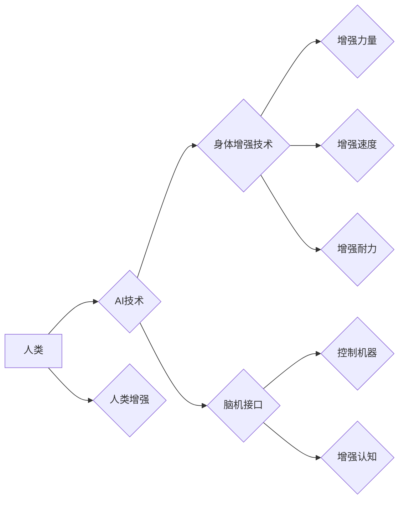

                 

## AI时代的人类增强：道德考虑与身体增强技术的未来发展方向

> 关键词： 人类增强、AI、身体增强技术、道德伦理、未来趋势、神经接口、生物技术、可持续发展

### 1. 背景介绍

人类文明自诞生以来，就一直在探索如何超越自身的局限性。从使用工具到发明火，从农业革命到工业革命，每一次进步都标志着人类对自身能力的提升。如今，人工智能（AI）和生物技术的飞速发展，为我们开启了新的篇章——人类增强。

人类增强是指利用技术手段提升人类的认知、物理、情感等方面的能力，使其超越自然界赋予的局限。这并非科幻小说中的幻想，而是正在逐渐成为现实。AI驱动的智能 prosthetics、基因编辑技术、脑机接口等，都为人类增强提供了强大的工具。

然而，人类增强也引发了广泛的伦理和社会争议。如何确保技术发展造福人类，而不是带来新的不平等和风险？如何平衡技术进步与人类尊严？这些问题迫切需要我们认真思考和探讨。

### 2. 核心概念与联系

#### 2.1 人类增强

人类增强是指利用技术手段提升人类的认知、物理、情感等方面的能力，使其超越自然界赋予的局限。

#### 2.2 AI技术

人工智能（AI）是指模拟人类智能行为的计算机系统。AI技术在机器学习、自然语言处理、计算机视觉等领域取得了突破性进展，为人类增强提供了强大的技术支撑。

#### 2.3 身体增强技术

身体增强技术是指利用技术手段提升人类的物理能力，例如增强力量、速度、耐力等。常见的例子包括智能 prosthetics、基因编辑技术、纳米机器人等。

#### 2.4 脑机接口

脑机接口（BMI）是指将大脑与外部设备直接连接的技术。BMI可以实现人类与机器的无障碍交互，为人类增强提供了新的可能性。

**Mermaid 流程图**



### 3. 核心算法原理 & 具体操作步骤

#### 3.1 算法原理概述

人类增强技术涉及多种算法，例如机器学习、深度学习、强化学习等。这些算法可以帮助AI系统理解人类行为、预测人类需求，并提供相应的增强方案。

#### 3.2 算法步骤详解

1. **数据收集:** 收集大量人类行为、生理数据等信息。
2. **数据预处理:** 对收集到的数据进行清洗、转换、特征提取等处理。
3. **模型训练:** 利用机器学习算法训练AI模型，使其能够识别人类需求并提供相应的增强方案。
4. **模型评估:** 对训练好的模型进行评估，并根据评估结果进行调整和优化。
5. **应用部署:** 将训练好的模型部署到实际应用场景中，为用户提供人类增强服务。

#### 3.3 算法优缺点

**优点:**

* **个性化定制:** AI算法可以根据用户的具体需求和特征，提供个性化的增强方案。
* **持续优化:** AI模型可以通过不断学习和迭代，不断优化增强效果。
* **跨领域应用:** 人类增强技术可以应用于医疗、教育、娱乐等多个领域。

**缺点:**

* **数据依赖:** AI算法需要大量数据进行训练，数据质量直接影响模型性能。
* **算法黑盒:** 一些AI算法的决策过程难以解释，这可能导致伦理和信任问题。
* **技术风险:** 人类增强技术还处于发展初期，存在一定的技术风险和未知因素。

#### 3.4 算法应用领域

* **医疗保健:** 辅助诊断、个性化治疗、康复训练等。
* **教育:** 个性化学习、智能辅导、远程教育等。
* **娱乐:** 增强现实游戏、虚拟现实体验等。
* **工业生产:** 人机协作、智能制造等。

### 4. 数学模型和公式 & 详细讲解 & 举例说明

#### 4.1 数学模型构建

人类增强技术涉及多个数学模型，例如强化学习中的价值函数、神经网络中的激活函数等。这些模型可以帮助AI系统学习和决策，实现人类增强目标。

**价值函数:**

价值函数用于评估某个状态下AI系统的预期回报。

$$V(s) = E[\sum_{t=0}^{\infty} \gamma^t r(s_t)]$$

其中:

* $V(s)$ 是状态 $s$ 的价值
* $r(s_t)$ 是在状态 $s_t$ 下获得的回报
* $\gamma$ 是折扣因子，控制未来回报的权重
* $E$ 表示期望值

**激活函数:**

激活函数用于将神经网络的输入转换为输出，并引入非线性特性。常见的激活函数包括 sigmoid 函数、ReLU 函数等。

$$f(x) = \frac{1}{1 + e^{-x}}$$

#### 4.2 公式推导过程

强化学习中的价值函数可以通过 Bellman 方程进行迭代更新:

$$V(s) = \max_{\alpha} \sum_{s'} P(s' | s, \alpha) [r(s, s', \alpha) + \gamma V(s')]$$

其中:

* $\alpha$ 是AI系统采取的动作
* $P(s' | s, \alpha)$ 是从状态 $s$ 执行动作 $\alpha$ 进入状态 $s'$ 的概率
* $r(s, s', \alpha)$ 是从状态 $s$ 执行动作 $\alpha$ 进入状态 $s'$ 得到的回报

#### 4.3 案例分析与讲解

例如，在训练一个AI系统控制机器人手臂进行抓取任务时，可以利用价值函数来评估机器人手臂在不同状态下的预期回报。通过不断迭代更新价值函数，AI系统可以学习到最佳的抓取策略。

### 5. 项目实践：代码实例和详细解释说明

#### 5.1 开发环境搭建

* 操作系统: Ubuntu 20.04
* Python 版本: 3.8
* 必要的库: TensorFlow, PyTorch, OpenCV等

#### 5.2 源代码详细实现

```python
# 使用 TensorFlow 实现简单的价值函数估计
import tensorflow as tf

# 定义价值函数模型
model = tf.keras.Sequential([
    tf.keras.layers.Dense(64, activation='relu', input_shape=(10,)),
    tf.keras.layers.Dense(1)
])

# 训练模型
model.compile(optimizer='adam', loss='mse')
model.fit(X_train, y_train, epochs=100)

# 使用模型预测价值
predicted_value = model.predict(X_test)
```

#### 5.3 代码解读与分析

* 代码首先定义了一个简单的价值函数模型，包含两层全连接神经网络。
* 然后使用 Adam 优化器和均方误差损失函数训练模型。
* 最后使用训练好的模型预测测试数据对应的价值。

#### 5.4 运行结果展示

训练完成后，可以评估模型的性能，例如使用均方误差来衡量预测值与真实值的差异。

### 6. 实际应用场景

#### 6.1 医疗保健

* **辅助诊断:** AI系统可以分析患者的医疗影像数据，辅助医生进行诊断。
* **个性化治疗:** AI系统可以根据患者的基因信息和病史，制定个性化的治疗方案。
* **康复训练:** AI系统可以为患者提供个性化的康复训练计划，帮助他们恢复功能。

#### 6.2 教育

* **个性化学习:** AI系统可以根据学生的学习进度和能力，提供个性化的学习内容和教学方式。
* **智能辅导:** AI系统可以为学生提供智能辅导，帮助他们解决学习上的困难。
* **远程教育:** AI系统可以支持远程教育，让更多人有机会获得优质教育资源。

#### 6.3 娱乐

* **增强现实游戏:** AI系统可以为增强现实游戏提供更逼真的游戏体验。
* **虚拟现实体验:** AI系统可以为虚拟现实体验提供更沉浸式的体验。

#### 6.4 未来应用展望

随着AI技术和生物技术的不断发展，人类增强技术将应用于更多领域，例如：

* **增强人类认知能力:** 通过脑机接口，可以增强人类的记忆力、注意力、学习能力等。
* **增强人类物理能力:** 通过基因编辑和纳米机器人，可以增强人类的肌肉力量、速度、耐力等。
* **延长人类寿命:** 通过生物技术和医疗技术，可以延长人类的寿命和健康寿命。

### 7. 工具和资源推荐

#### 7.1 学习资源推荐

* **书籍:**

    * 《深度学习》
    * 《人工智能：一种现代方法》
    * 《人机交互》

* **在线课程:**

    * Coursera: 人工智能课程
    * edX: 深度学习课程
    * Udacity: 人工智能工程师课程

#### 7.2 开发工具推荐

* **TensorFlow:** 开源深度学习框架
* **PyTorch:** 开源深度学习框架
* **OpenCV:** 图像处理库

#### 7.3 相关论文推荐

* **AlphaGo论文:** DeepMind 的 AlphaGo 论文
* **GPT-3论文:** OpenAI 的 GPT-3 论文
* **Brain-Computer Interfaces论文:** 脑机接口领域的最新论文

### 8. 总结：未来发展趋势与挑战

#### 8.1 研究成果总结

人类增强技术取得了显著进展，AI算法、脑机接口、生物技术等领域都取得了突破性成果。这些成果为人类提供了新的可能性，但也带来了新的挑战。

#### 8.2 未来发展趋势

* **更智能的AI算法:** 未来AI算法将更加智能，能够更好地理解人类需求和行为。
* **更安全的脑机接口:** 未来脑机接口将更加安全可靠，能够更好地与人类大脑交互。
* **更精准的生物技术:** 未来生物技术将更加精准，能够更好地改造人类身体。

#### 8.3 面临的挑战

* **伦理问题:** 人类增强技术可能会带来新的伦理问题，例如公平性、隐私性、人性的本质等。
* **社会影响:** 人类增强技术可能会改变社会结构和价值观，需要我们认真思考其社会影响。
* **技术风险:** 人类增强技术还处于发展初期，存在一定的技术风险和未知因素。

#### 8.4 研究展望

未来，我们需要加强对人类增强技术的伦理、社会和技术风险的评估和研究，制定相应的政策和规范，确保技术发展造福人类。同时，还需要加强国际合作，共同应对人类增强技术带来的挑战。

### 9. 附录：常见问题与解答

* **Q1: 人类增强技术会取代人类吗？**

A1: 人类增强技术旨在提升人类能力，而不是取代人类。AI和生物技术将成为人类的工具，帮助我们更好地生活和工作。

* **Q2: 人类增强技术会带来新的不平等吗？**

A2: 人类增强技术可能会加剧社会的不平等，因为只有少数人能够负担得起这些技术。我们需要制定相应的政策，确保技术发展造福全体人类。

* **Q3: 人类增强技术对人类尊严有什么影响？**

A3: 人类增强技术可能会引发对人类尊严的质疑，例如，是否应该改造人类身体和大脑？我们需要认真思考这些问题，并制定相应的伦理规范。


作者：禅与计算机程序设计艺术 / Zen and the Art of Computer Programming 
<end_of_turn>

