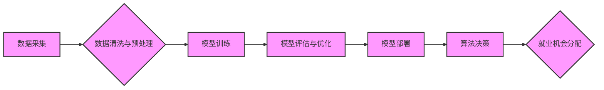

                 

## AI时代的就业公平:算法歧视和就业机会平等

> 关键词：人工智能、算法歧视、就业公平、机器学习、偏见、数据驱动、伦理、社会影响

## 1. 背景介绍

人工智能（AI）技术的飞速发展正在深刻地改变着我们的生活，包括就业市场。AI驱动的自动化技术可以提高效率、降低成本，但也引发了关于算法歧视和就业机会平等的担忧。

随着机器学习算法的应用越来越广泛，从招聘筛选到贷款审批，AI系统开始扮演着越来越重要的角色。然而，这些算法的训练数据往往反映了社会中的现有偏见，导致算法本身也产生歧视性结果。例如，一个基于简历筛选的AI系统，如果训练数据中男性占据了更多高管职位，那么它可能会倾向于选择男性候选人，从而加剧性别不平等。

这种算法歧视不仅会损害个人的公平机会，还会加剧社会的不平等，阻碍社会进步。因此，探讨AI时代的就业公平，解决算法歧视问题，对于构建一个更加公正、包容的社会至关重要。

## 2. 核心概念与联系

### 2.1 算法歧视

算法歧视是指由算法产生的不公平或偏见结果，导致特定群体受到不利的待遇。

### 2.2 数据偏见

数据偏见是指训练算法的数据中存在不均衡或不代表性的信息，导致算法学习到错误的模式或偏见。

### 2.3 就业机会平等

就业机会平等是指所有具有相同能力和资质的人，无论其种族、性别、宗教、文化背景等，都应该拥有平等的就业机会。

**Mermaid 流程图**



## 3. 核心算法原理 & 具体操作步骤

### 3.1  算法原理概述

常见的算法歧视问题主要源于机器学习算法的训练过程。机器学习算法通过学习大量数据来建立预测模型，但如果训练数据本身存在偏见，那么算法就会学习到这些偏见，并将其应用于决策过程中。

例如，在招聘筛选中，如果训练数据中男性占据了更多高管职位，那么算法可能会认为男性更适合领导职位，从而倾向于选择男性候选人。

### 3.2  算法步骤详解

1. **数据收集:** 收集用于训练算法的数据。
2. **数据清洗与预处理:** 清洗和预处理数据，去除噪声和异常值，并进行格式转换。
3. **特征工程:** 选择和提取特征，这些特征将用于训练算法。
4. **模型选择:** 选择合适的机器学习算法，例如逻辑回归、决策树、支持向量机等。
5. **模型训练:** 使用训练数据训练模型，调整模型参数以获得最佳性能。
6. **模型评估与优化:** 使用测试数据评估模型性能，并根据评估结果进行模型优化。
7. **模型部署:** 将训练好的模型部署到实际应用场景中。

### 3.3  算法优缺点

**优点:**

* 自动化决策，提高效率和准确性。
* 减少人为偏见的影响。
* 能够处理海量数据，发现隐藏的模式。

**缺点:**

* 容易受到数据偏见的影响。
* 缺乏透明度和可解释性。
* 可能导致不公平或歧视性结果。

### 3.4  算法应用领域

* 招聘筛选
* 贷款审批
* 刑事司法
* 医疗诊断
* 教育评估

## 4. 数学模型和公式 & 详细讲解 & 举例说明

### 4.1  数学模型构建

在机器学习中，常用的数学模型是线性回归模型。线性回归模型试图找到一条直线，将输入特征与输出结果进行拟合。

**公式:**

$$y = w_0 + w_1x_1 + w_2x_2 + ... + w_nx_n + \epsilon$$

其中：

* $y$ 是输出结果
* $w_0, w_1, w_2, ..., w_n$ 是模型参数
* $x_1, x_2, ..., x_n$ 是输入特征
* $\epsilon$ 是误差项

### 4.2  公式推导过程

线性回归模型的参数可以通过最小二乘法进行估计。最小二乘法试图找到一组参数，使得模型预测值与实际值之间的误差平方和最小。

**公式:**

$$\min_{w_0, w_1, ..., w_n} \sum_{i=1}^{n}(y_i - (w_0 + w_1x_{i1} + w_2x_{i2} + ... + w_nx_{in}))^2$$

### 4.3  案例分析与讲解

假设我们有一个数据集，包含学生的学习时间和考试成绩。我们可以使用线性回归模型来预测学生的考试成绩。

如果训练数据中存在性别偏见，例如女性学生的学习时间普遍较少，那么模型可能会学习到女性学生的考试成绩普遍较低，从而导致性别歧视的结果。

## 5. 项目实践：代码实例和详细解释说明

### 5.1  开发环境搭建

* Python 3.x
* scikit-learn 库

### 5.2  源代码详细实现

```python
from sklearn.linear_model import LinearRegression
from sklearn.model_selection import train_test_split
import pandas as pd

# 加载数据
data = pd.read_csv('student_data.csv')

# 分割数据
X = data[['study_time']]
y = data['exam_score']
X_train, X_test, y_train, y_test = train_test_split(X, y, test_size=0.2, random_state=42)

# 创建线性回归模型
model = LinearRegression()

# 训练模型
model.fit(X_train, y_train)

# 预测测试数据
y_pred = model.predict(X_test)

# 评估模型性能
print('模型系数:', model.coef_)
print('模型截距:', model.intercept_)
```

### 5.3  代码解读与分析

* 首先，我们加载数据并将其分割成训练集和测试集。
* 然后，我们创建了一个线性回归模型，并使用训练集训练模型。
* 训练完成后，我们可以使用测试集来评估模型的性能。
* 代码中还打印了模型的系数和截距，这些参数可以帮助我们理解模型是如何进行预测的。

### 5.4  运行结果展示

运行结果会显示模型的系数和截距，以及模型在测试集上的预测结果。

## 6. 实际应用场景

### 6.1  招聘筛选

AI驱动的招聘筛选系统可以自动分析简历，识别候选人的技能和经验，并根据预设的标准进行筛选。然而，如果训练数据中存在性别、种族或其他类型的偏见，那么AI系统可能会导致不公平的招聘结果。

### 6.2  贷款审批

银行和金融机构使用AI系统来评估贷款申请人的信用风险。如果训练数据中存在社会经济地位或种族偏见，那么AI系统可能会拒绝一些有资格的申请人，从而加剧社会不平等。

### 6.3  刑事司法

AI系统被用于分析犯罪数据，预测犯罪风险，并辅助司法判决。然而，如果训练数据中存在种族或地域偏见，那么AI系统可能会导致对特定群体的过度监控和歧视性判决。

### 6.4  未来应用展望

随着AI技术的不断发展，其应用场景将会更加广泛，例如医疗诊断、教育评估、自动驾驶等。因此，解决算法歧视问题变得更加重要。

## 7. 工具和资源推荐

### 7.1  学习资源推荐

* **在线课程:** Coursera, edX, Udacity 等平台提供关于机器学习和AI伦理的在线课程。
* **书籍:** 《AI Superpowers》 by Kai-Fu Lee, 《Weapons of Math Destruction》 by Cathy O'Neil 等书籍探讨了AI的社会影响和伦理问题。
* **研究论文:** arXiv, ACL Anthology 等平台提供最新的AI研究论文。

### 7.2  开发工具推荐

* **Python:** Python 是机器学习和AI开发的常用语言。
* **scikit-learn:** scikit-learn 是一个强大的机器学习库，提供各种算法和工具。
* **TensorFlow, PyTorch:** TensorFlow 和 PyTorch 是深度学习框架，用于训练复杂的AI模型。

### 7.3  相关论文推荐

* **On the Dangers of Stochastic Parrots: Can Language Models Be Too Big?** by Emily M. Bender et al.
* **Gender Shades: Intersectional Accuracy Disparities in Commercial Gender Classification** by Joy Buolamwini and Timnit Gebru
* **Algorithmic Fairness** by Solon Barocas and Andrew Selbst

## 8. 总结：未来发展趋势与挑战

### 8.1  研究成果总结

近年来，研究人员已经取得了一些进展，例如开发出公平性感知的机器学习算法，并提出了算法透明度和可解释性的标准。

### 8.2  未来发展趋势

* **公平性感知的机器学习算法:** 开发出能够识别和缓解算法偏见的算法。
* **数据多样化:** 收集和使用更加多样化的训练数据，以减少数据偏见的影响。
* **算法透明度和可解释性:** 使AI算法更加透明和可解释，以便人们能够理解其决策过程。
* **伦理规范和监管:** 制定相关的伦理规范和监管政策，确保AI技术的负责任发展。

### 8.3  面临的挑战

* **数据偏见难以消除:** 数据偏见是根深蒂固的问题，难以完全消除。
* **算法复杂性:** 复杂的AI模型难以解释，其决策过程难以被理解。
* **伦理困境:** AI技术的应用可能会引发各种伦理困境，需要社会广泛讨论和共识。

### 8.4  研究展望

未来，我们需要继续加强对算法歧视问题的研究，开发出更加公平、透明、可解释的AI技术，并制定相应的伦理规范和监管政策，确保AI技术造福人类。

## 9. 附录：常见问题与解答

### 9.1  如何识别算法歧视？

* 分析算法的输入数据和输出结果，是否存在特定群体的过度或不足代表？
* 使用公平性评估指标，例如准确率、召回率、F1-score 等，比较不同群体的算法性能。
* 对算法进行解释性分析，了解其决策过程，识别潜在的偏见因素。

### 9.2  如何缓解算法歧视？

* 使用更加多样化的训练数据，减少数据偏见的影响。
* 开发出公平性感知的机器学习算法，例如使用对抗训练或正则化技术。
* 对算法进行定期评估和监控，及时发现和解决潜在的偏见问题。
* 提高算法的透明度和可解释性，以便人们能够理解其决策过程。

### 9.3  如何制定算法伦理规范？

* 广泛征求社会各界的意见，形成共识。
* 明确算法的用途和边界，避免其用于歧视或侵犯人权。
* 确保算法的透明度和可解释性，以便人们能够理解其决策过程。
* 建立有效的监督机制，对算法的开发和应用进行监管。


作者：禅与计算机程序设计艺术 / Zen and the Art of Computer Programming 
<end_of_turn>

