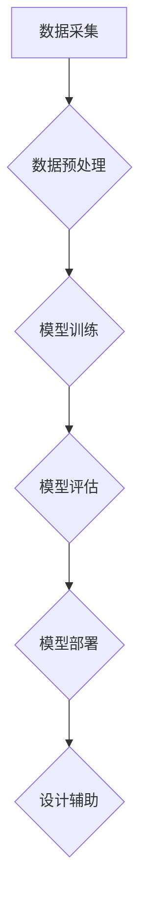

                 

## AI时尚设计软件：为设计师提供创意灵感、原型创建和趋势预测

> 关键词：人工智能、时尚设计、创意灵感、原型设计、趋势预测、机器学习、深度学习、计算机视觉

## 1. 背景介绍

时尚行业是一个充满创意和变革的领域，设计师们需要不断探索新的风格和趋势，以满足不断变化的消费者需求。传统的时尚设计流程往往耗时费力，需要设计师进行大量的草图绘制、样衣制作和修改。随着人工智能技术的快速发展，AI时尚设计软件应运而生，为设计师提供了一种全新的设计工具，帮助他们提高效率、激发灵感和洞察市场趋势。

AI时尚设计软件利用机器学习、深度学习和计算机视觉等技术，可以从海量的数据中学习时尚风格、趋势和设计元素，并将其应用于实际的设计工作中。它可以帮助设计师完成以下任务：

* **创意灵感：** 基于设计师的偏好和目标市场，AI可以生成多种不同的设计方案，提供创意灵感和突破瓶颈。
* **原型创建：** AI可以根据设计师的描述或草图，自动生成服装的3D模型，并进行虚拟试穿和效果展示，缩短设计周期和成本。
* **趋势预测：** AI可以分析市场数据、社交媒体趋势和流行元素，预测未来的时尚趋势，帮助设计师提前布局和设计。

## 2. 核心概念与联系

AI时尚设计软件的核心概念包括：

* **机器学习：** AI通过学习大量数据，识别模式和规律，从而进行预测和决策。
* **深度学习：** 深度学习是一种更高级的机器学习方法，利用多层神经网络模拟人类大脑的学习过程，可以处理更复杂的数据和任务。
* **计算机视觉：** 计算机视觉使计算机能够“看”和理解图像，可以用于识别服装款式、颜色、图案等信息。

这些核心概念相互关联，共同构成了AI时尚设计软件的强大功能。

**Mermaid 流程图：**



## 3. 核心算法原理 & 具体操作步骤

### 3.1  算法原理概述

AI时尚设计软件中常用的算法包括：

* **卷积神经网络（CNN）：** CNN擅长处理图像数据，可以用于识别服装款式、颜色、图案等信息。
* **循环神经网络（RNN）：** RNN擅长处理序列数据，可以用于分析时尚趋势和预测未来风格。
* **生成对抗网络（GAN）：** GAN由两个网络组成，一个是生成器，一个是鉴别器，通过相互对抗的方式生成新的图像数据，可以用于生成新的服装设计。

### 3.2  算法步骤详解

**以CNN为例，详细说明其在AI时尚设计软件中的应用步骤：**

1. **数据采集：** 收集大量服装图片数据，包括不同款式、颜色、图案、材质等信息。
2. **数据预处理：** 对图像数据进行清洗、裁剪、缩放等处理，使其符合模型训练的要求。
3. **模型训练：** 使用CNN模型对预处理后的图像数据进行训练，学习服装特征和分类规则。
4. **模型评估：** 使用测试数据评估模型的性能，例如准确率、召回率等指标。
5. **模型部署：** 将训练好的模型部署到AI时尚设计软件中，供设计师使用。

### 3.3  算法优缺点

**CNN算法的优点：**

* 能够有效地提取图像特征，识别服装款式、颜色、图案等信息。
* 训练效率高，可以处理大量图像数据。

**CNN算法的缺点：**

* 对数据质量要求较高，需要大量高质量的图像数据进行训练。
* 难以处理复杂的设计场景，例如服装搭配和风格融合。

### 3.4  算法应用领域

CNN算法在AI时尚设计软件中的应用领域包括：

* **服装款式识别：** 根据输入的图像，识别服装的款式、颜色、图案等信息。
* **服装风格分类：** 将服装图像分类到不同的风格类别，例如休闲、正式、时尚等。
* **服装趋势预测：** 分析流行趋势，预测未来的服装款式和风格。

## 4. 数学模型和公式 & 详细讲解 & 举例说明

### 4.1  数学模型构建

在AI时尚设计软件中，常用的数学模型包括：

* **线性回归模型：** 用于预测连续变量，例如服装价格、销量等。
* **逻辑回归模型：** 用于预测分类变量，例如服装款式、风格等。
* **支持向量机（SVM）：** 用于分类和回归问题，可以处理高维数据。

### 4.2  公式推导过程

以线性回归模型为例，其目标是找到一条直线，使得预测值与实际值之间的误差最小。

**公式：**

$$y = wx + b$$

其中：

* $y$ 是预测值
* $x$ 是输入特征
* $w$ 是权重系数
* $b$ 是偏置项

**损失函数：**

$$L = \frac{1}{n} \sum_{i=1}^{n} (y_i - \hat{y}_i)^2$$

其中：

* $n$ 是样本数量
* $y_i$ 是实际值
* $\hat{y}_i$ 是预测值

**优化目标：**

$$min_w,b L(w,b)$$

通过梯度下降算法，可以迭代更新 $w$ 和 $b$ 的值，使得损失函数最小化。

### 4.3  案例分析与讲解

假设我们想要预测服装的价格，输入特征包括服装的材质、款式、品牌等信息。我们可以使用线性回归模型，根据历史数据训练模型，并使用训练好的模型预测新服装的价格。

## 5. 项目实践：代码实例和详细解释说明

### 5.1  开发环境搭建

AI时尚设计软件的开发环境通常包括：

* **操作系统：** Windows、macOS、Linux 等
* **编程语言：** Python、C++ 等
* **深度学习框架：** TensorFlow、PyTorch 等
* **计算机视觉库：** OpenCV、Dlib 等

### 5.2  源代码详细实现

以下是一个使用Python和TensorFlow实现服装款式识别的简单代码示例：

```python
import tensorflow as tf
from tensorflow.keras.models import Sequential
from tensorflow.keras.layers import Conv2D, MaxPooling2D, Flatten, Dense

# 定义模型结构
model = Sequential()
model.add(Conv2D(32, (3, 3), activation='relu', input_shape=(128, 128, 3)))
model.add(MaxPooling2D((2, 2)))
model.add(Conv2D(64, (3, 3), activation='relu'))
model.add(MaxPooling2D((2, 2)))
model.add(Flatten())
model.add(Dense(10, activation='softmax'))

# 编译模型
model.compile(optimizer='adam',
              loss='categorical_crossentropy',
              metrics=['accuracy'])

# 训练模型
model.fit(x_train, y_train, epochs=10)

# 评估模型
loss, accuracy = model.evaluate(x_test, y_test)
print('Loss:', loss)
print('Accuracy:', accuracy)
```

### 5.3  代码解读与分析

这段代码定义了一个简单的CNN模型，用于服装款式识别。

* **Conv2D层：** 用于提取图像特征。
* **MaxPooling2D层：** 用于降维，减少计算量。
* **Flatten层：** 将多维特征转换为一维向量。
* **Dense层：** 用于分类，输出10个类别的概率。

### 5.4  运行结果展示

训练完成后，可以使用测试数据评估模型的性能，例如准确率、召回率等指标。

## 6. 实际应用场景

AI时尚设计软件已经开始在时尚行业中得到应用，例如：

* **服装设计：** 设计师可以使用AI工具生成新的服装设计方案，并进行虚拟试穿和效果展示。
* **服装生产：** AI可以帮助优化服装生产流程，提高效率和降低成本。
* **服装营销：** AI可以分析消费者数据，推荐个性化的服装搭配和风格。

### 6.4  未来应用展望

未来，AI时尚设计软件将更加智能化和个性化，例如：

* **更精准的趋势预测：** AI可以分析更细粒度的市场数据，预测更精准的时尚趋势。
* **更个性化的设计：** AI可以根据用户的喜好和身材特点，生成更个性化的服装设计。
* **更智能的生产：** AI可以实现服装生产的自动化和智能化，提高效率和降低成本。

## 7. 工具和资源推荐

### 7.1  学习资源推荐

* **书籍：**
    * 《深度学习》
    * 《机器学习实战》
* **在线课程：**
    * Coursera
    * edX
    * Udacity

### 7.2  开发工具推荐

* **编程语言：** Python
* **深度学习框架：** TensorFlow、PyTorch
* **计算机视觉库：** OpenCV、Dlib

### 7.3  相关论文推荐

* **《Fashion-MNIST: A Novel Dataset for Benchmarking Fashion Image Classification》**
* **《DeepFashion: Powering Deep Learning for Fashion》**

## 8. 总结：未来发展趋势与挑战

### 8.1  研究成果总结

AI时尚设计软件已经取得了显著的成果，例如：

* **提高了设计效率：** AI可以帮助设计师快速生成设计方案，缩短设计周期。
* **激发了创意灵感：** AI可以提供新的设计思路和灵感，帮助设计师突破瓶颈。
* **洞察市场趋势：** AI可以分析市场数据，预测未来的时尚趋势。

### 8.2  未来发展趋势

未来，AI时尚设计软件将朝着以下方向发展：

* **更智能化：** AI将更加智能化，能够理解设计师的意图，并自动生成更符合设计师需求的设计方案。
* **更个性化：** AI将更加个性化，能够根据用户的喜好和身材特点，生成更符合用户需求的设计方案。
* **更融合：** AI将更加融合，与其他技术，例如虚拟现实、增强现实等，实现更沉浸式的设计体验。

### 8.3  面临的挑战

AI时尚设计软件也面临一些挑战：

* **数据质量：** AI模型的性能依赖于数据质量，需要大量高质量的图像数据进行训练。
* **算法复杂度：** 复杂的时尚设计场景，例如服装搭配和风格融合，需要更复杂的算法进行处理。
* **伦理问题：** AI生成的服装设计是否会侵犯版权，如何确保AI设计的公平性和公正性等伦理问题需要进一步探讨。

### 8.4  研究展望

未来，我们需要继续研究以下问题：

* 如何提高AI模型的泛化能力，使其能够处理更复杂的时尚设计场景。
* 如何解决AI生成的服装设计是否会侵犯版权等伦理问题。
* 如何将AI技术与其他技术融合，实现更沉浸式的时尚设计体验。


## 9. 附录：常见问题与解答

**Q1：AI时尚设计软件是否会取代设计师？**

A1：AI时尚设计软件可以帮助设计师提高效率和激发灵感，但它并不会取代设计师。设计师仍然需要发挥自己的创意和审美能力，引导AI工具，并最终做出最终的设计决策。

**Q2：AI时尚设计软件需要哪些技术基础？**

A2：开发AI时尚设计软件需要一定的编程、机器学习和计算机视觉基础。

**Q3：AI时尚设计软件的成本如何？**

A3：AI时尚设计软件的成本取决于其功能和复杂度，从开源工具到商业软件，价格范围广泛。

作者：禅与计算机程序设计艺术 / Zen and the Art of Computer Programming 


<end_of_turn>

