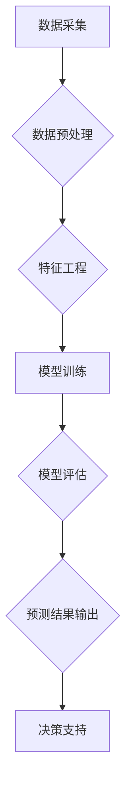

                 

## AI时尚预测平台：为时尚行业提供数据驱动的预测和决策支持

> 关键词：人工智能、时尚预测、数据驱动、机器学习、深度学习、时装趋势、商业智能、预测模型

## 1. 背景介绍

时尚行业是一个充满创意和变革的领域，它对时事、文化和社会趋势高度敏感。然而，时尚的快速变化和消费者需求的多样性使得预测未来趋势变得异常困难。传统的市场调研和趋势分析方法往往滞后，难以捕捉到瞬息万变的时尚潮流。

近年来，人工智能（AI）技术蓬勃发展，为时尚行业带来了新的机遇。AI算法能够从海量数据中识别出隐藏的模式和趋势，为时尚品牌提供更精准、更及时的预测和决策支持。

## 2. 核心概念与联系

**2.1 核心概念**

* **时尚预测:** 利用数据分析和机器学习技术，预测未来一段时间内流行的服装款式、颜色、材质等时尚元素。
* **数据驱动:** 基于大量历史数据、市场趋势、社交媒体信息等进行分析和预测，而非依赖主观判断。
* **机器学习:** 一种人工智能技术，通过训练算法识别数据中的模式和规律，从而进行预测和决策。
* **深度学习:** 一种更高级的机器学习技术，利用多层神经网络模拟人类大脑的学习过程，能够处理更复杂的数据和进行更精准的预测。

**2.2 架构图**



**2.3 核心联系**

AI时尚预测平台的核心是将数据采集、预处理、特征工程、模型训练、评估和预测结果输出等环节有机结合，最终为时尚品牌提供决策支持。

## 3. 核心算法原理 & 具体操作步骤

**3.1 算法原理概述**

AI时尚预测平台通常采用以下几种核心算法：

* **回归算法:** 用于预测连续型变量，例如销售额、价格等。常见的回归算法包括线性回归、逻辑回归、支持向量机回归等。
* **分类算法:** 用于预测离散型变量，例如服装款式、颜色等。常见的分类算法包括决策树、随机森林、支持向量机分类等。
* **聚类算法:** 用于将数据点根据相似性进行分组，例如识别流行趋势、分析消费者群体等。常见的聚类算法包括K-means聚类、层次聚类等。

**3.2 算法步骤详解**

1. **数据采集:** 收集各种与时尚相关的历史数据，例如销售记录、市场趋势、社交媒体信息、天气数据等。
2. **数据预处理:** 对收集到的数据进行清洗、转换、归一化等处理，使其适合模型训练。
3. **特征工程:** 从原始数据中提取有价值的特征，例如服装款式、颜色、材质、价格、季节等，这些特征将作为模型的输入。
4. **模型训练:** 选择合适的算法，并利用训练数据训练模型，使其能够学习数据中的模式和规律。
5. **模型评估:** 使用测试数据评估模型的性能，例如准确率、召回率、F1-score等指标。
6. **模型优化:** 根据评估结果，调整模型参数或选择其他算法，以提高模型性能。
7. **预测结果输出:** 利用训练好的模型对未来数据进行预测，例如预测未来一段时间内流行的服装款式、颜色、材质等。

**3.3 算法优缺点**

* **优点:**

    * 数据驱动，预测结果更精准。
    * 能够捕捉到隐藏的趋势和模式。
    * 自动化程度高，提高效率。

* **缺点:**

    * 需要大量高质量的数据进行训练。
    * 模型训练需要专业知识和技术。
    * 算法本身存在局限性，无法完全预测未来。

**3.4 算法应用领域**

* **服装设计:** 预测未来流行的服装款式、颜色、材质等。
* **库存管理:** 预测未来商品需求，优化库存水平。
* **营销推广:** 针对不同消费者群体进行个性化营销。
* **趋势分析:** 分析市场趋势，识别新的商机。

## 4. 数学模型和公式 & 详细讲解 & 举例说明

**4.1 数学模型构建**

AI时尚预测平台通常采用以下数学模型进行预测：

* **线性回归模型:** 用于预测连续型变量，假设目标变量与输入特征之间存在线性关系。

$$
y = \beta_0 + \beta_1x_1 + \beta_2x_2 + ... + \beta_nx_n + \epsilon
$$

其中：

* $y$ 是目标变量
* $x_1, x_2, ..., x_n$ 是输入特征
* $\beta_0, \beta_1, ..., \beta_n$ 是模型参数
* $\epsilon$ 是误差项

* **逻辑回归模型:** 用于预测离散型变量，假设目标变量服从伯努利分布。

$$
P(y=1|x) = \frac{1}{1 + e^{-( \beta_0 + \beta_1x_1 + \beta_2x_2 + ... + \beta_nx_n )}}
$$

其中：

* $P(y=1|x)$ 是目标变量为1的概率
* $x_1, x_2, ..., x_n$ 是输入特征
* $\beta_0, \beta_1, ..., \beta_n$ 是模型参数

**4.2 公式推导过程**

线性回归模型的参数可以通过最小二乘法进行估计，逻辑回归模型的参数可以通过最大似然估计进行估计。

**4.3 案例分析与讲解**

假设我们想要预测服装销售额，输入特征包括服装款式、颜色、材质、价格、季节等。我们可以使用线性回归模型进行预测，并根据模型参数分析不同特征对销售额的影响。例如，如果模型参数表明“新款服装”的系数为正值，则说明新款服装对销售额有正向影响。

## 5. 项目实践：代码实例和详细解释说明

**5.1 开发环境搭建**

* Python 3.x
* Jupyter Notebook
* TensorFlow 或 PyTorch
* pandas、numpy、scikit-learn 等数据科学库

**5.2 源代码详细实现**

```python
import pandas as pd
from sklearn.model_selection import train_test_split
from sklearn.linear_model import LinearRegression
from sklearn.metrics import mean_squared_error

# 加载数据
data = pd.read_csv('fashion_data.csv')

# 划分训练集和测试集
X = data[['款式', '颜色', '材质', '价格', '季节']]
y = data['销售额']
X_train, X_test, y_train, y_test = train_test_split(X, y, test_size=0.2, random_state=42)

# 创建线性回归模型
model = LinearRegression()

# 训练模型
model.fit(X_train, y_train)

# 预测测试集数据
y_pred = model.predict(X_test)

# 计算模型性能
mse = mean_squared_error(y_test, y_pred)
print(f'Mean Squared Error: {mse}')
```

**5.3 代码解读与分析**

* 首先，我们加载数据并划分训练集和测试集。
* 然后，我们创建线性回归模型并训练模型。
* 最后，我们使用训练好的模型预测测试集数据，并计算模型性能。

**5.4 运行结果展示**

运行代码后，会输出模型的平均平方误差（MSE）值，该值越小，模型的预测性能越好。

## 6. 实际应用场景

AI时尚预测平台可以应用于以下场景：

* **服装设计:** 根据预测结果，设计师可以设计更符合市场需求的服装款式。
* **库存管理:** 根据预测结果，品牌可以优化库存水平，避免积压或缺货。
* **营销推广:** 根据预测结果，品牌可以针对不同消费者群体进行个性化营销，提高营销效果。
* **趋势分析:** 分析预测结果，可以识别新的时尚趋势，为品牌提供新的商机。

**6.4 未来应用展望**

随着人工智能技术的不断发展，AI时尚预测平台将更加智能化、个性化和精准化。未来，AI时尚预测平台可能能够：

* 利用虚拟现实和增强现实技术，为消费者提供更身临其境的时尚体验。
* 与社交媒体平台深度整合，实时捕捉消费者喜好和趋势变化。
* 利用个性化推荐算法，为每个消费者提供定制化的时尚建议。

## 7. 工具和资源推荐

**7.1 学习资源推荐**

* **书籍:**

    * 《深度学习》
    * 《机器学习实战》
    * 《Python数据科学手册》

* **在线课程:**

    * Coursera
    * edX
    * Udacity

**7.2 开发工具推荐**

* **Python:** 

    * TensorFlow
    * PyTorch
    * scikit-learn

* **数据可视化工具:**

    * Matplotlib
    * Seaborn
    * Plotly

**7.3 相关论文推荐**

* **Fashion-MNIST:** https://github.com/zalandoresearch/fashion-mnist
* **Deep Fashion:** https://arxiv.org/abs/1703.07308

## 8. 总结：未来发展趋势与挑战

**8.1 研究成果总结**

AI时尚预测平台已经取得了显著的成果，能够帮助时尚品牌提高预测精度、优化决策，并获得更大的商业价值。

**8.2 未来发展趋势**

未来，AI时尚预测平台将朝着以下方向发展：

* **更精准的预测:** 利用更先进的算法和更丰富的训练数据，提高预测精度。
* **更个性化的服务:** 利用个性化推荐算法，为每个消费者提供定制化的时尚建议。
* **更全面的应用场景:** 将AI时尚预测平台应用于更多场景，例如服装设计、库存管理、营销推广等。

**8.3 面临的挑战**

AI时尚预测平台也面临一些挑战：

* **数据质量:** 训练模型需要大量高质量的数据，而时尚行业的数据往往分散、不完整、难以获取。
* **算法复杂度:** 训练和部署复杂的AI模型需要强大的计算能力和技术人才。
* **伦理问题:** AI时尚预测平台可能会带来一些伦理问题，例如数据隐私、算法偏见等。

**8.4 研究展望**

未来，我们需要继续研究以下问题：

* 如何提高数据质量和获取效率？
* 如何开发更简洁、高效的AI算法？
* 如何解决AI时尚预测平台带来的伦理问题？


## 9. 附录：常见问题与解答

* **Q1: AI时尚预测平台真的可以准确预测未来趋势吗？**

A1: AI时尚预测平台可以根据历史数据和趋势分析，提供更精准的预测结果，但无法完全预测未来。时尚行业充满变数，外部因素也会影响趋势变化。

* **Q2: 如何选择合适的AI算法？**

A2: 选择合适的AI算法需要根据具体应用场景和数据特点进行选择。例如，预测连续型变量可以使用线性回归模型，预测离散型变量可以使用逻辑回归模型。

* **Q3: 如何解决数据隐私问题？**

A3: 在开发AI时尚预测平台时，需要严格保护用户数据隐私，采用加密、匿名化等技术手段，并遵守相关法律法规。


作者：禅与计算机程序设计艺术 / Zen and the Art of Computer Programming 
<end_of_turn>

