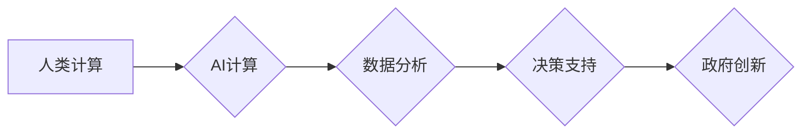

                 

## AI驱动的创新：人类计算在政府中的价值

> 关键词：人工智能、政府、人类计算、数据分析、决策支持、效率提升、透明度、问责制、伦理

## 1. 背景介绍

在当今数据爆炸的时代，政府机构面临着前所未有的挑战和机遇。传统的手工处理方式已难以应对海量数据的分析和处理需求，而人工智能（AI）技术的快速发展为政府数字化转型提供了强有力的支撑。AI驱动的创新正在深刻地改变着政府的服务模式、决策机制和治理结构，为提升政府效率、服务质量和社会效益提供了新的路径。

政府作为社会的重要机构，肩负着为公民提供公共服务、维护社会秩序和促进经济发展等重要职责。然而，传统的政府运作模式往往存在着效率低下、信息孤岛、决策滞后等问题。AI技术的应用可以有效解决这些问题，帮助政府实现以下目标：

* **提升政府效率：** AI可以自动化处理大量重复性任务，例如数据录入、信息检索、审批流程等，释放人力资源，提高工作效率。
* **优化资源配置：** AI可以对政府数据进行分析，识别资源配置的瓶颈和优化方向，帮助政府更好地规划和分配资源。
* **提升服务质量：** AI可以为公民提供个性化、智能化的公共服务，例如在线咨询、预约服务、智能问答等，提高服务效率和用户体验。
* **增强决策科学性：** AI可以对海量数据进行分析，提供决策支持，帮助政府制定更科学、更有效的政策。
* **促进社会透明度：** AI可以帮助政府公开透明地发布信息，提高公众对政府工作的了解和参与度。

## 2. 核心概念与联系

**2.1 人类计算与AI计算**

人类计算是指人类利用自身的认知能力和经验进行信息处理和决策的过程。AI计算是指利用人工智能算法和模型，模拟人类智能，对数据进行分析、学习和决策的过程。

**2.2 AI驱动的政府创新**

AI驱动的政府创新是指利用人工智能技术，对政府的运作模式、服务模式和决策机制进行革新，提升政府效率、服务质量和社会效益的过程。

**2.3 核心概念架构**



## 3. 核心算法原理 & 具体操作步骤

**3.1 算法原理概述**

AI驱动的政府创新主要依赖于以下核心算法：

* **机器学习（Machine Learning）：** 算法能够从数据中学习模式和规律，并根据学习到的知识进行预测和决策。
* **深度学习（Deep Learning）：** 算法利用多层神经网络，能够处理更复杂的数据，并实现更精准的预测和决策。
* **自然语言处理（Natural Language Processing）：** 算法能够理解和处理人类语言，例如文本分析、语音识别、机器翻译等。
* **计算机视觉（Computer Vision）：** 算法能够理解和分析图像和视频数据，例如图像识别、物体检测、场景理解等。

**3.2 算法步骤详解**

以机器学习为例，其基本步骤如下：

1. **数据收集和预处理：** 收集相关数据，并进行清洗、转换、特征提取等预处理工作。
2. **模型选择：** 根据具体任务选择合适的机器学习模型，例如线性回归、逻辑回归、决策树、支持向量机等。
3. **模型训练：** 利用训练数据训练模型，调整模型参数，使其能够准确地预测或分类数据。
4. **模型评估：** 利用测试数据评估模型的性能，例如准确率、召回率、F1-score等。
5. **模型部署：** 将训练好的模型部署到实际应用场景中，用于进行预测或分类。

**3.3 算法优缺点**

**优点：**

* **自动化处理：** 可以自动化处理大量数据，提高效率。
* **精准预测：** 可以根据数据学习模式，进行精准的预测和决策。
* **个性化服务：** 可以根据用户数据提供个性化的服务。

**缺点：**

* **数据依赖：** 算法性能依赖于数据的质量和数量。
* **黑盒效应：** 某些算法的决策过程难以解释，缺乏透明度。
* **伦理风险：** 算法可能存在偏见和歧视，需要谨慎使用。

**3.4 算法应用领域**

* **公共安全：** 人脸识别、视频监控、犯罪预测等。
* **医疗保健：** 疾病诊断、药物研发、患者管理等。
* **教育：** 个性化学习、智能辅导、考试批改等。
* **交通运输：** 交通流量预测、智能交通管理、自动驾驶等。
* **环境保护：** 环境监测、污染预测、资源管理等。

## 4. 数学模型和公式 & 详细讲解 & 举例说明

**4.1 数学模型构建**

在AI驱动的政府创新中，常用的数学模型包括线性回归、逻辑回归、决策树、支持向量机等。

**4.2 公式推导过程**

以线性回归为例，其目标是找到一条直线，使得预测值与真实值之间的误差最小。

线性回归模型的公式为：

$$y = wx + b$$

其中：

* $y$ 是预测值
* $x$ 是输入特征
* $w$ 是权重系数
* $b$ 是偏置项

损失函数用于衡量预测值与真实值之间的误差，常用的损失函数是均方误差（MSE）：

$$MSE = \frac{1}{n} \sum_{i=1}^{n} (y_i - \hat{y}_i)^2$$

其中：

* $n$ 是样本数量
* $y_i$ 是真实值
* $\hat{y}_i$ 是预测值

通过最小化损失函数，可以求解出最佳的权重系数 $w$ 和偏置项 $b$。

**4.3 案例分析与讲解**

例如，政府可以使用线性回归模型预测人口增长趋势，输入特征可以是历史人口数据、经济发展水平、社会政策等，输出预测值可以是未来人口数量。

## 5. 项目实践：代码实例和详细解释说明

**5.1 开发环境搭建**

* 操作系统：Windows/Linux/macOS
* Python版本：3.6+
* 必要的库：NumPy、Pandas、Scikit-learn等

**5.2 源代码详细实现**

```python
import pandas as pd
from sklearn.linear_model import LinearRegression

# 加载数据
data = pd.read_csv('population_data.csv')

# 选择特征和目标变量
X = data[['economic_development', 'social_policy']]
y = data['population']

# 创建线性回归模型
model = LinearRegression()

# 训练模型
model.fit(X, y)

# 预测未来人口数量
future_data = pd.DataFrame({'economic_development': [7.5], 'social_policy': [0.8]})
future_population = model.predict(future_data)

# 打印预测结果
print(f'未来人口数量预测为：{future_population[0]}')
```

**5.3 代码解读与分析**

* 首先，加载人口数据，并选择特征和目标变量。
* 然后，创建线性回归模型，并使用训练数据训练模型。
* 最后，使用训练好的模型预测未来人口数量，并打印预测结果。

**5.4 运行结果展示**

运行代码后，会输出未来人口数量的预测值。

## 6. 实际应用场景

**6.1 公共安全**

* **犯罪预测：** 利用历史犯罪数据，预测未来犯罪高发区域，加强警力部署。
* **人脸识别：** 用于身份验证、嫌疑人追踪、失联人员寻找等。
* **视频监控：** 利用AI算法分析视频监控画面，识别异常行为，提高安全防范能力。

**6.2 医疗保健**

* **疾病诊断：** 利用AI算法分析患者症状、检查结果等数据，辅助医生进行疾病诊断。
* **药物研发：** 利用AI算法分析药物分子结构和生物活性，加速药物研发过程。
* **患者管理：** 利用AI算法分析患者健康数据，提供个性化的健康管理建议。

**6.3 教育**

* **个性化学习：** 根据学生的学习进度和能力，提供个性化的学习内容和教学方式。
* **智能辅导：** 利用AI算法解答学生的疑问，提供学习指导。
* **考试批改：** 利用AI算法自动批改客观题和部分主观题，提高批改效率。

**6.4 未来应用展望**

* **智能城市：** 利用AI技术打造智慧交通、智慧能源、智慧环境等智能城市应用。
* **数字政府：** 利用AI技术提升政府服务效率、透明度和问责制。
* **社会治理：** 利用AI技术加强社会风险防控、公共安全保障和社会服务管理。

## 7. 工具和资源推荐

**7.1 学习资源推荐**

* **在线课程：** Coursera、edX、Udacity等平台提供丰富的AI课程。
* **书籍：** 《深度学习》、《机器学习实战》等书籍。
* **开源社区：** TensorFlow、PyTorch等开源社区提供丰富的学习资源和代码示例。

**7.2 开发工具推荐**

* **Python：** 广泛应用于AI开发，拥有丰富的库和工具。
* **Jupyter Notebook：** 用于编写和运行Python代码，方便进行数据分析和模型开发。
* **TensorFlow、PyTorch：** 深度学习框架，用于构建和训练深度学习模型。

**7.3 相关论文推荐**

* **《ImageNet Classification with Deep Convolutional Neural Networks》**
* **《Attention Is All You Need》**
* **《BERT: Pre-training of Deep Bidirectional Transformers for Language Understanding》**

## 8. 总结：未来发展趋势与挑战

**8.1 研究成果总结**

AI驱动的政府创新取得了显著成果，在公共安全、医疗保健、教育等领域取得了突破性进展。

**8.2 未来发展趋势**

* **更智能的算法：** 发展更智能、更精准的AI算法，例如强化学习、迁移学习等。
* **更广泛的应用场景：** 将AI技术应用到更多政府领域，例如税收管理、社会福利、环境保护等。
* **更强的解释性：** 提高AI算法的解释性，增强公众对AI技术的信任。

**8.3 面临的挑战**

* **数据安全和隐私保护：** 政府数据涉及到公民隐私，需要加强数据安全和隐私保护措施。
* **算法公平性和可解释性：** 算法可能存在偏见和歧视，需要确保算法公平性和可解释性。
* **伦理风险：** AI技术可能带来伦理风险，需要制定相应的伦理规范和法律法规。

**8.4 研究展望**

未来，AI驱动的政府创新将继续发展，为政府提供更智能、更高效、更透明的服务，提升政府治理能力和社会福祉。


## 9. 附录：常见问题与解答

**9.1 如何确保AI算法的公平性和可解释性？**

* **数据预处理：** 在数据收集和预处理阶段，需要避免数据偏差，确保数据代表性。
* **算法设计：** 选择公平性和可解释性较高的算法模型，例如决策树、线性回归等。
* **算法评估：** 对算法进行公平性和可解释性评估，识别和解决潜在的偏见和歧视问题。

**9.2 如何保护政府数据安全和隐私？**

* **数据加密：** 对敏感数据进行加密，防止未经授权的访问。
* **访问控制：** 设置严格的访问控制机制，限制数据访问权限。
* **数据备份和恢复：** 定期备份数据，并建立数据恢复机制，防止数据丢失。

**9.3 如何应对AI技术带来的伦理风险？**

* **制定伦理规范：** 制定AI技术应用的伦理规范，明确AI技术的边界和应用范围。
* **加强监管：** 加强对AI技术的监管，防止AI技术被滥用。
* **公众参与：** 鼓励公众参与AI技术发展的讨论和决策，促进社会对AI技术的理解和接受。


作者：禅与计算机程序设计艺术 / Zen and the Art of Computer Programming 
<end_of_turn>

