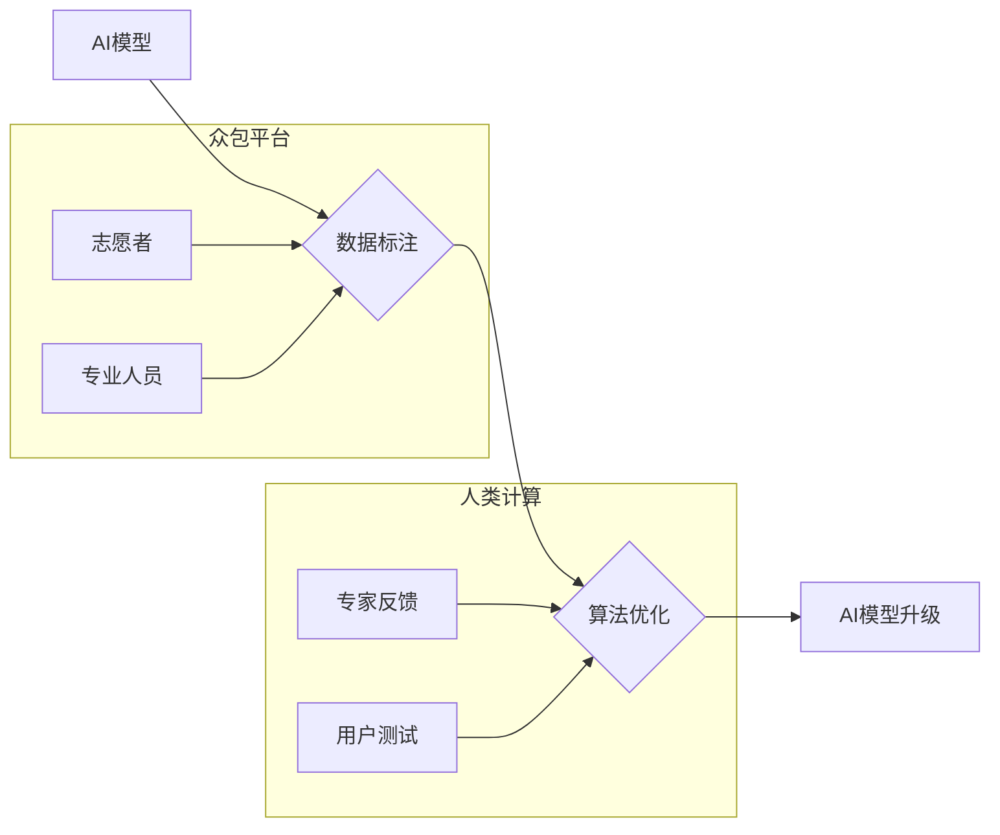

                 

## AI驱动的创新：众包与人类计算

> 关键词：人工智能、众包、人类计算、协同智能、数据标注、机器学习、算法优化

### 1. 背景介绍

人工智能（AI）正以惊人的速度发展，其影响力正在深刻地改变着我们生活的方方面面。从自动驾驶汽车到智能语音助手，AI技术正在推动着科技的进步，并为人类社会带来前所未有的机遇。然而，AI的发展也面临着一些挑战，其中之一就是数据标注和算法优化。

众包，即利用互联网平台招募大众参与特定任务，成为了一种有效的解决数据标注和算法优化的途径。众包平台可以汇聚来自全球各地的志愿者和专业人员，为AI模型提供海量数据标注和反馈，从而加速AI算法的训练和优化。

人类计算，是指利用人类的智慧和认知能力来辅助AI系统完成复杂的任务。人类计算可以弥补AI算法在理解和解释复杂信息方面的不足，并为AI系统提供更精准的反馈和指导。

### 2. 核心概念与联系

**2.1 众包与人类计算的融合**

众包和人类计算的结合，形成了一个强大的协同智能体系，能够有效地推动AI技术的进步。

**2.2 协同智能架构**



**2.3 协同智能的优势**

* **数据标注效率提升:** 众包平台可以快速收集大量数据标注，大幅提高数据标注效率。
* **算法优化效果增强:** 人类计算可以提供更精准的反馈和指导，帮助AI算法更快地找到最优解。
* **AI模型的泛化能力增强:** 通过众包和人类计算，AI模型可以接触到更多样化的数据和反馈，从而提升其泛化能力。

### 3. 核心算法原理 & 具体操作步骤

**3.1 算法原理概述**

众包和人类计算在AI驱动的创新中扮演着重要的角色，其核心算法原理主要包括：

* **数据标注算法:** 用于将原始数据转换为AI模型可以理解的格式，例如图像分类、文本情感分析等。
* **算法优化算法:** 用于根据人类反馈和数据标注结果，调整AI模型的参数，提高其性能。

**3.2 算法步骤详解**

**数据标注算法:**

1. **数据收集:** 从互联网、数据库等渠道收集原始数据。
2. **数据预处理:** 对数据进行清洗、格式化等处理，使其符合AI模型的输入要求。
3. **数据标注:** 利用众包平台招募志愿者或专业人员对数据进行标注，例如图像识别中的物体标记、文本分类中的情感标签等。
4. **数据验证:** 对标注结果进行验证，确保其准确性和一致性。
5. **数据存储:** 将标注好的数据存储到数据库或文件系统中，供AI模型训练使用。

**算法优化算法:**

1. **收集人类反馈:** 通过用户测试、专家评估等方式收集人类对AI模型的反馈。
2. **分析反馈数据:** 对人类反馈数据进行分析，识别出AI模型的不足之处。
3. **调整模型参数:** 根据分析结果，调整AI模型的参数，例如学习率、神经网络结构等。
4. **重新训练模型:** 使用调整后的模型参数，重新训练AI模型。
5. **评估模型性能:** 对重新训练后的模型进行评估，验证其性能是否提升。

**3.3 算法优缺点**

**数据标注算法:**

* **优点:** 效率高、成本低、数据多样化。
* **缺点:** 标注质量难以保证、数据偏见问题。

**算法优化算法:**

* **优点:** 可以有效地提高AI模型的性能。
* **缺点:** 需要大量的计算资源、人类反馈数据质量对算法优化效果有很大影响。

**3.4 算法应用领域**

* **图像识别:** 用于自动识别图像中的物体、场景、人物等。
* **自然语言处理:** 用于理解和生成人类语言，例如机器翻译、文本摘要、聊天机器人等。
* **语音识别:** 用于将语音转换为文本。
* **推荐系统:** 用于根据用户的兴趣和行为，推荐相关商品或服务。

### 4. 数学模型和公式 & 详细讲解 & 举例说明

**4.1 数学模型构建**

众包和人类计算的协同智能系统可以抽象为一个数学模型，其中AI模型、数据标注、算法优化等环节可以用数学公式来描述。

例如，我们可以用一个简单的线性回归模型来描述AI模型的学习过程：

$$y = mx + c$$

其中：

* $y$ 是预测结果
* $x$ 是输入特征
* $m$ 是模型参数
* $c$ 是模型偏差

**4.2 公式推导过程**

通过最小化模型误差，我们可以通过梯度下降算法来优化模型参数 $m$ 和 $c$。

梯度下降算法的公式如下：

$$m = m - \alpha \frac{\partial Loss}{\partial m}$$

$$c = c - \alpha \frac{\partial Loss}{\partial c}$$

其中：

* $\alpha$ 是学习率
* $Loss$ 是模型误差函数

**4.3 案例分析与讲解**

假设我们有一个AI模型用于预测房价，输入特征包括房屋面积、房间数量、地理位置等。

通过众包平台收集大量房价数据，并由志愿者进行标注，得到训练数据。

然后，利用梯度下降算法，根据训练数据优化模型参数，最终得到一个能够准确预测房价的AI模型。

### 5. 项目实践：代码实例和详细解释说明

**5.1 开发环境搭建**

* 操作系统: Ubuntu 20.04
* Python 版本: 3.8
* 必要的库: TensorFlow, PyTorch, scikit-learn

**5.2 源代码详细实现**

```python
# 数据标注
import pandas as pd

# 加载数据
data = pd.read_csv("house_data.csv")

# 标记房屋类别
data["category"] = data["area"] > 100.0

# 保存标注数据
data.to_csv("house_data_labeled.csv", index=False)

# 算法优化
from sklearn.linear_model import LinearRegression

# 加载标注数据
data = pd.read_csv("house_data_labeled.csv")

# 训练模型
model = LinearRegression()
model.fit(data[["area", "rooms"]], data["price"])

# 预测房价
new_data = pd.DataFrame({"area": [120, 150], "rooms": [3, 4]})
predicted_price = model.predict(new_data)

# 打印预测结果
print(predicted_price)
```

**5.3 代码解读与分析**

* 数据标注部分: 使用pandas库加载数据，根据房屋面积大于100平方米标记房屋类别，并保存标注数据。
* 算法优化部分: 使用sklearn库中的线性回归模型训练模型，并使用训练好的模型预测新的房屋价格。

**5.4 运行结果展示**

运行代码后，将输出预测的房价结果。

### 6. 实际应用场景

**6.1 图像识别**

* **医疗诊断:** 利用AI模型识别医学图像中的病灶，辅助医生进行诊断。
* **自动驾驶:** 利用AI模型识别道路上的车辆、行人、交通信号等，帮助自动驾驶汽车安全行驶。

**6.2 自然语言处理**

* **机器翻译:** 利用AI模型将文本从一种语言翻译成另一种语言。
* **聊天机器人:** 利用AI模型模拟人类对话，为用户提供服务。

**6.3 语音识别**

* **语音助手:** 利用AI模型识别用户的语音指令，并执行相应的操作。
* **语音搜索:** 利用AI模型识别用户的语音搜索词，并返回相关结果。

**6.4 推荐系统**

* **电商推荐:** 利用AI模型根据用户的购买历史和浏览记录，推荐相关商品。
* **音乐推荐:** 利用AI模型根据用户的音乐喜好，推荐相关歌曲。

**6.5 未来应用展望**

* **个性化教育:** 利用AI模型根据学生的学习情况，提供个性化的学习方案。
* **精准医疗:** 利用AI模型分析患者的基因信息和病史，提供精准的医疗方案。
* **智能制造:** 利用AI模型优化生产流程，提高生产效率。

### 7. 工具和资源推荐

**7.1 学习资源推荐**

* **在线课程:** Coursera, edX, Udacity
* **书籍:** 《深度学习》、《人工智能：一种现代方法》
* **博客:** Towards Data Science, Machine Learning Mastery

**7.2 开发工具推荐**

* **Python:** TensorFlow, PyTorch, scikit-learn
* **云平台:** AWS, Azure, Google Cloud

**7.3 相关论文推荐**

* **《ImageNet Classification with Deep Convolutional Neural Networks》**
* **《Attention Is All You Need》**
* **《BERT: Pre-training of Deep Bidirectional Transformers for Language Understanding》**

### 8. 总结：未来发展趋势与挑战

**8.1 研究成果总结**

众包和人类计算在AI驱动的创新中取得了显著的成果，例如数据标注效率提升、算法优化效果增强、AI模型泛化能力提升等。

**8.2 未来发展趋势**

* **更智能的众包平台:** 利用AI技术，自动分配任务、评估质量、提供反馈等，提高众包平台的智能化水平。
* **更有效的算法优化方法:** 利用人类计算和AI协同，开发更有效的算法优化方法，例如进化算法、强化学习等。
* **更广泛的应用场景:** 众包和人类计算将应用于更多领域，例如医疗、教育、金融等。

**8.3 面临的挑战**

* **数据标注质量问题:** 众包平台上标注数据的质量难以保证，需要开发更有效的质量控制机制。
* **算法偏见问题:** AI算法可能存在偏见，需要开发更公平、更公正的算法。
* **隐私安全问题:** 众包平台收集的用户数据需要保障隐私安全。

**8.4 研究展望**

未来，我们将继续研究众包和人类计算在AI驱动的创新中的应用，开发更智能、更有效的协同智能系统，推动AI技术向更广泛的领域扩展。

### 9. 附录：常见问题与解答

**9.1 如何保证数据标注质量？**

* 使用多轮标注，由多个标注者对数据进行标注，并进行比对和修正。
* 开发自动标注工具，利用AI技术辅助数据标注。
* 建立完善的标注规范和质量控制机制。

**9.2 如何解决算法偏见问题？**

* 使用多样化的训练数据，减少算法对特定群体或特征的偏好。
* 开发公平性评估指标，评估算法的公平性。
* 利用人类反馈，调整算法参数，减少算法偏见。

**9.3 如何保障用户隐私安全？**

* 对用户数据进行匿名化处理，避免直接识别用户身份。
* 使用加密技术保护用户数据安全。
* 建立完善的隐私政策，明确用户数据的使用范围和权限。


作者：禅与计算机程序设计艺术 / Zen and the Art of Computer Programming 
<end_of_turn>

