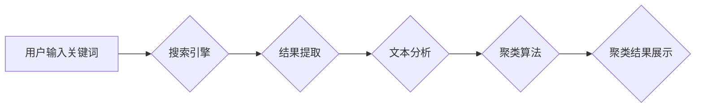

                 

## AI驱动的搜索结果聚类展示

> 关键词：搜索结果聚类、人工智能、机器学习、自然语言处理、信息检索、用户体验、推荐系统

## 1. 背景介绍

在信息爆炸的时代，海量数据无处不在，搜索引擎作为信息获取的主要入口，面临着如何有效地组织和呈现海量搜索结果的挑战。传统的搜索引擎主要依靠关键词匹配算法，往往导致搜索结果冗余、缺乏结构化，难以满足用户多样化的信息需求。

AI驱动的搜索结果聚类展示技术应运而生，它利用人工智能和机器学习算法，对搜索结果进行智能分析和分类，将相关结果进行聚合，以更清晰、更直观的方式呈现给用户，提升用户搜索体验。

## 2. 核心概念与联系

**2.1 核心概念**

* **搜索结果聚类:** 将搜索结果根据语义相似度、主题相关性等特征进行分组，形成多个主题相关的聚类结果。
* **人工智能 (AI):** 人工智能是指模拟人类智能行为的计算机系统，包括机器学习、深度学习、自然语言处理等技术。
* **机器学习 (ML):** 机器学习是人工智能的一个分支，通过算法学习数据中的模式和规律，从而进行预测和决策。
* **自然语言处理 (NLP):** 自然语言处理是指让计算机能够理解、处理和生成人类语言的技术。

**2.2 架构关系**



**2.3 核心联系**

AI驱动的搜索结果聚类展示技术将人工智能技术与搜索引擎技术相结合，通过机器学习算法对搜索结果进行分析和分类，实现智能化聚类展示，提升用户搜索体验。

## 3. 核心算法原理 & 具体操作步骤

**3.1 算法原理概述**

常用的搜索结果聚类算法包括K-Means聚类、层次聚类、DBSCAN聚类等。这些算法都基于对文本数据的语义相似度计算，将具有相似主题或内容的搜索结果进行分组。

**3.2 算法步骤详解**

以K-Means聚类为例，其具体操作步骤如下：

1. **数据预处理:** 对搜索结果进行文本清洗、分词、词干提取等预处理，提取文本特征。
2. **特征向量化:** 将文本特征转换为数值向量，以便算法进行计算。常用的特征向量化方法包括TF-IDF、Word2Vec等。
3. **初始化聚类中心:** 随机选择K个数据点作为初始聚类中心。
4. **分配数据点:** 计算每个数据点与每个聚类中心的距离，将每个数据点分配到距离最近的聚类中心。
5. **更新聚类中心:** 计算每个聚类中心的平均值作为新的聚类中心。
6. **重复步骤4-5:** 直到聚类中心不再发生变化或达到最大迭代次数。

**3.3 算法优缺点**

* **优点:** 算法简单易实现，计算效率高。
* **缺点:** 需要预先设定聚类数量K，对初始聚类中心的选择敏感，容易陷入局部最优解。

**3.4 算法应用领域**

K-Means聚类算法广泛应用于搜索结果聚类、文档分类、图像识别等领域。

## 4. 数学模型和公式 & 详细讲解 & 举例说明

**4.1 数学模型构建**

K-Means聚类算法的目标是将数据点划分为K个簇，使得每个簇内的数据点彼此相似，而不同簇之间的数据点差异最大。

**4.2 公式推导过程**

* **距离度量:** 使用欧氏距离作为数据点之间的距离度量。

$$
d(x, c) = \sqrt{\sum_{i=1}^{n}(x_i - c_i)^2}
$$

其中，$x$为数据点，$c$为聚类中心，$n$为特征维度。

* **目标函数:** 

$$
J = \sum_{i=1}^{K} \sum_{x \in C_i} d(x, c_i)^2
$$

其中，$J$为目标函数，$K$为聚类数量，$C_i$为第i个簇。

* **优化目标:** 寻找最优的聚类中心，使得目标函数最小。

**4.3 案例分析与讲解**

假设有5个数据点，需要将其聚类为2个簇。

1. 随机选择两个数据点作为初始聚类中心。
2. 计算每个数据点与两个聚类中心的距离，将每个数据点分配到距离最近的聚类中心。
3. 计算每个聚类中心的平均值作为新的聚类中心。
4. 重复步骤2-3，直到聚类中心不再发生变化。

## 5. 项目实践：代码实例和详细解释说明

**5.1 开发环境搭建**

* Python 3.x
* scikit-learn库

**5.2 源代码详细实现**

```python
from sklearn.cluster import KMeans
import numpy as np

# 数据预处理
# ...

# 特征向量化
# ...

# 初始化KMeans聚类器
kmeans = KMeans(n_clusters=2, random_state=0)

# 训练模型
kmeans.fit(X)

# 获取聚类标签
labels = kmeans.labels_

# 获取聚类中心
centroids = kmeans.cluster_centers_

# 聚类结果展示
# ...
```

**5.3 代码解读与分析**

* `KMeans(n_clusters=2, random_state=0)`: 初始化KMeans聚类器，指定聚类数量为2，随机种子为0。
* `kmeans.fit(X)`: 训练模型，将数据点X进行聚类。
* `kmeans.labels_`: 获取每个数据点的聚类标签。
* `kmeans.cluster_centers_`: 获取每个聚类的中心点。

**5.4 运行结果展示**

运行代码后，可以得到每个数据点的聚类标签和聚类中心，并根据标签将数据点进行分组展示。

## 6. 实际应用场景

AI驱动的搜索结果聚类展示技术在以下场景中具有广泛应用价值：

* **新闻搜索:** 将新闻文章根据主题进行聚类，例如“科技”、“财经”、“体育”等，帮助用户快速找到感兴趣的信息。
* **电商搜索:** 将商品根据类别、属性、价格等进行聚类，提高用户购物体验。
* **学术搜索:** 将学术论文根据研究领域、主题、作者等进行聚类，帮助用户找到相关研究成果。

**6.4 未来应用展望**

随着人工智能技术的不断发展，AI驱动的搜索结果聚类展示技术将更加智能化、个性化。未来，我们可以期待：

* 基于用户行为和偏好的个性化聚类展示。
* 多模态搜索结果聚类，例如结合文本、图像、视频等多种数据类型进行聚类。
* 更深入的语义理解，能够对搜索结果进行更精准的分类和聚合。

## 7. 工具和资源推荐

**7.1 学习资源推荐**

* **书籍:**
    * “机器学习” by Tom Mitchell
    * “自然语言处理入门” by Bird, Klein, and Loper
* **在线课程:**
    * Coursera: Machine Learning
    * edX: Natural Language Processing

**7.2 开发工具推荐**

* **Python:** 
    * scikit-learn: 机器学习库
    * NLTK: 自然语言处理库
    * Gensim: 主题模型库

**7.3 相关论文推荐**

* “K-Means Clustering” by MacQueen, J. B. (1967)
* “A Survey of Text Clustering Algorithms” by Wang, S., & Manning, C. D. (2012)

## 8. 总结：未来发展趋势与挑战

**8.1 研究成果总结**

AI驱动的搜索结果聚类展示技术取得了显著进展，能够有效地组织和呈现海量搜索结果，提升用户搜索体验。

**8.2 未来发展趋势**

未来，该技术将朝着更加智能化、个性化、多模态的方向发展。

**8.3 面临的挑战**

* 如何更好地理解用户需求和语义，进行更精准的聚类。
* 如何处理海量数据，提高算法效率。
* 如何保证聚类结果的准确性和可靠性。

**8.4 研究展望**

未来研究将重点关注以下几个方面：

* 深度学习在搜索结果聚类中的应用。
* 基于用户行为和偏好的个性化聚类算法。
* 多模态搜索结果聚类技术。


## 9. 附录：常见问题与解答

**9.1 如何选择合适的聚类算法？**

选择合适的聚类算法取决于具体应用场景和数据特点。

* **K-Means:** 简单易实现，适用于数据分布较为均匀的情况。
* **层次聚类:** 可以生成层次结构，适用于数据规模较小的情况。
* **DBSCAN:** 适用于数据分布不均匀的情况，可以发现任意形状的簇。

**9.2 如何评估聚类结果的质量？**

常用的聚类结果评估指标包括Silhouette Score、Dunn Index等。

**9.3 如何处理文本数据中的停用词和噪声？**

可以使用文本预处理技术，例如词干提取、去除停用词等，对文本数据进行清洗和处理。


作者：禅与计算机程序设计艺术 / Zen and the Art of Computer Programming 
<end_of_turn>

