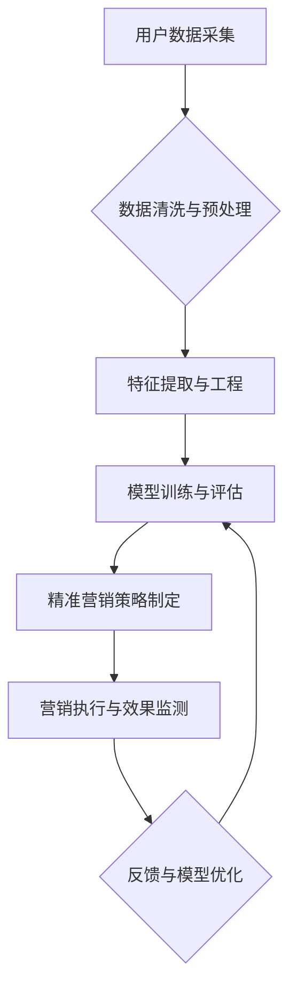

                 

## AI驱动的精准营销：原理与实践

> 关键词：人工智能、精准营销、机器学习、深度学习、自然语言处理、数据分析、推荐系统

## 1. 背景介绍

在当今数据爆炸的时代，精准营销已成为企业获取客户、提升转化率的关键策略。传统营销方式往往采用“广播式”传播，难以精准触达目标用户，导致资源浪费和效果不佳。而人工智能（AI）技术的快速发展为精准营销提供了强大的工具和手段。

AI驱动的精准营销是指利用人工智能技术分析用户数据，洞察用户需求和行为模式，从而实现个性化推荐、精准投放和智能互动。它能够帮助企业打破传统营销的局限，实现更高效、更精准的营销效果。

## 2. 核心概念与联系

**2.1 精准营销的核心概念**

精准营销的核心是“精准”，即针对特定目标用户进行个性化营销。它需要对用户进行细分，了解用户的需求、兴趣、行为等特征，并根据这些特征定制相应的营销内容和策略。

**2.2 AI技术在精准营销中的应用**

AI技术在精准营销中的应用主要包括以下几个方面：

* **数据分析:** AI算法能够从海量用户数据中挖掘出隐藏的模式和趋势，帮助企业了解用户行为、需求和偏好。
* **用户画像:** 基于数据分析，AI可以构建用户画像，对用户进行细分和分类，为精准营销提供基础数据。
* **个性化推荐:** AI算法可以根据用户的历史行为、兴趣爱好等信息，推荐个性化的产品、服务和内容。
* **智能广告投放:** AI可以根据用户的特征和行为，智能地投放广告，提高广告的点击率和转化率。
* **智能客服:** AI驱动的聊天机器人可以提供24小时在线客服，解答用户疑问，提高用户体验。

**2.3 AI驱动的精准营销架构**



## 3. 核心算法原理 & 具体操作步骤

**3.1 算法原理概述**

AI驱动的精准营销主要依赖于机器学习算法，其中包括监督学习、无监督学习和强化学习等。

* **监督学习:** 利用已标记的数据训练模型，预测未知数据的结果。例如，根据用户的历史购买记录预测用户的未来购买行为。
* **无监督学习:** 从未标记的数据中发现隐藏的模式和结构。例如，根据用户的浏览记录聚类用户，形成不同的用户群体。
* **强化学习:** 通过试错学习，让模型在特定环境中获得最大奖励。例如，通过调整广告投放策略，最大化广告点击率。

**3.2 算法步骤详解**

1. **数据收集:** 收集用户数据，包括用户 demographics、行为数据、兴趣爱好等。
2. **数据清洗与预处理:** 清洗数据，去除噪声和异常值，并对数据进行标准化处理。
3. **特征提取与工程:** 从原始数据中提取特征，例如用户年龄、性别、购买频率等。
4. **模型选择与训练:** 选择合适的机器学习算法，并根据训练数据训练模型。
5. **模型评估与优化:** 使用测试数据评估模型性能，并根据评估结果对模型进行优化。
6. **部署与应用:** 将训练好的模型部署到生产环境中，用于精准营销策略的制定和执行。

**3.3 算法优缺点**

* **优点:**

    * 能够精准识别用户需求和行为模式。
    * 提高营销效率和转化率。
    * 提供个性化用户体验。

* **缺点:**

    * 需要大量的数据进行训练。
    * 模型训练和部署需要一定的技术门槛。
    * 存在数据隐私和安全问题。

**3.4 算法应用领域**

* **电商推荐:** 根据用户的购买历史和浏览记录，推荐个性化的商品。
* **广告投放:** 根据用户的兴趣爱好和行为特征，精准投放广告。
* **内容推荐:** 根据用户的阅读习惯和兴趣爱好，推荐个性化的内容。
* **客户关系管理:** 通过分析客户数据，提供个性化的客户服务。

## 4. 数学模型和公式 & 详细讲解 & 举例说明

**4.1 数学模型构建**

在精准营销中，常用的数学模型包括线性回归、逻辑回归、决策树、支持向量机等。这些模型可以用来预测用户行为、分类用户群体、识别用户特征等。

**4.2 公式推导过程**

例如，线性回归模型的公式如下：

$$
y = \beta_0 + \beta_1x_1 + \beta_2x_2 + ... + \beta_nx_n + \epsilon
$$

其中：

* $y$ 是预测变量，例如用户的购买概率。
* $x_1, x_2, ..., x_n$ 是特征变量，例如用户的年龄、收入、购买频率等。
* $\beta_0, \beta_1, ..., \beta_n$ 是模型参数，需要通过训练数据进行估计。
* $\epsilon$ 是误差项。

**4.3 案例分析与讲解**

假设我们想要预测用户的购买概率，可以使用线性回归模型。我们可以收集用户的年龄、收入、购买频率等数据，并将其作为特征变量。然后，我们可以使用训练数据训练线性回归模型，估计模型参数。最后，我们可以使用训练好的模型预测新用户的购买概率。

## 5. 项目实践：代码实例和详细解释说明

**5.1 开发环境搭建**

* Python 3.x
* Jupyter Notebook
* scikit-learn

**5.2 源代码详细实现**

```python
from sklearn.linear_model import LogisticRegression
from sklearn.model_selection import train_test_split
from sklearn.metrics import accuracy_score

# 加载数据
data = pd.read_csv('user_data.csv')

# 划分训练集和测试集
X = data[['age', 'income', 'purchase_frequency']]
y = data['purchase_probability']
X_train, X_test, y_train, y_test = train_test_split(X, y, test_size=0.2, random_state=42)

# 训练模型
model = LogisticRegression()
model.fit(X_train, y_train)

# 预测测试集结果
y_pred = model.predict(X_test)

# 评估模型性能
accuracy = accuracy_score(y_test, y_pred)
print(f'模型准确率: {accuracy}')
```

**5.3 代码解读与分析**

* 首先，我们加载用户数据，并划分训练集和测试集。
* 然后，我们使用逻辑回归模型训练模型，并使用测试集评估模型性能。
* 逻辑回归模型是一种分类模型，可以用来预测用户的购买概率。

**5.4 运行结果展示**

运行代码后，会输出模型的准确率。

## 6. 实际应用场景

**6.1 电商推荐系统**

AI驱动的精准营销可以应用于电商推荐系统，根据用户的购买历史和浏览记录，推荐个性化的商品。例如，淘宝、京东等电商平台都使用了AI驱动的推荐系统，提高了用户的购物体验和转化率。

**6.2 广告精准投放**

AI可以分析用户的兴趣爱好和行为特征，精准投放广告，提高广告的点击率和转化率。例如，Google Ads、Facebook Ads等广告平台都使用了AI技术进行广告投放优化。

**6.3 内容推荐系统**

AI可以根据用户的阅读习惯和兴趣爱好，推荐个性化的内容，例如新闻、视频、文章等。例如，Netflix、YouTube等平台都使用了AI驱动的推荐系统，提高了用户的观看体验和用户粘性。

**6.4 客户关系管理**

AI可以分析客户数据，识别客户的潜在需求和问题，提供个性化的客户服务。例如，一些企业使用AI驱动的聊天机器人，为客户提供24小时在线客服，提高客户满意度。

**6.5 未来应用展望**

随着AI技术的不断发展，AI驱动的精准营销将应用到更多领域，例如：

* **个性化营销:** 根据用户的个性化需求，定制个性化的营销内容和策略。
* **智能客服:** 更智能、更人性化的聊天机器人，能够更好地理解用户的需求，提供更精准的帮助。
* **预测分析:** 利用AI预测用户的未来行为，提前做好营销准备。
* **跨渠道营销:** 将线上线下营销渠道整合起来，提供更全面的用户体验。

## 7. 工具和资源推荐

**7.1 学习资源推荐**

* **书籍:**

    * 《深度学习》
    * 《机器学习实战》
    * 《Python机器学习》

* **在线课程:**

    * Coursera
    * edX
    * Udacity

**7.2 开发工具推荐**

* **Python:** 

    * scikit-learn
    * TensorFlow
    * PyTorch

* **数据分析工具:**

    * Pandas
    * NumPy
    * Matplotlib

**7.3 相关论文推荐**

* **推荐系统:**

    * Collaborative Filtering for Implicit Feedback Datasets
    * Deep Learning for Recommender Systems

* **广告精准投放:**

    * Deep Reinforcement Learning for Online Advertising
    * Contextualized Attention Networks for Ad Click Prediction

## 8. 总结：未来发展趋势与挑战

**8.1 研究成果总结**

AI驱动的精准营销取得了显著的成果，提高了营销效率和转化率，为企业带来了巨大的经济效益。

**8.2 未来发展趋势**

* **更精准的个性化:** 利用更先进的AI算法，对用户进行更细致的画像，提供更精准的个性化营销。
* **更智能的互动:** 利用自然语言处理技术，实现更智能的营销互动，例如聊天机器人、语音助手等。
* **更全面的跨渠道营销:** 将线上线下营销渠道整合起来，提供更全面的用户体验。

**8.3 面临的挑战**

* **数据隐私和安全:** AI驱动的精准营销需要大量用户数据，如何保护用户隐私和数据安全是一个重要的挑战。
* **算法透明度和可解释性:** 许多AI算法是黑箱模型，难以解释其决策过程，这可能会导致用户对AI营销的信任度下降。
* **伦理问题:** AI驱动的精准营销可能会带来一些伦理问题，例如歧视、操控等，需要谨慎对待。

**8.4 研究展望**

未来，AI驱动的精准营销将继续发展，需要进一步研究以下问题:

* 如何开发更安全、更透明的AI算法。
* 如何更好地解决数据隐私和安全问题。
* 如何制定更合理的AI营销伦理规范。


## 9. 附录：常见问题与解答

**9.1 如何选择合适的AI算法？**

选择合适的AI算法取决于具体的应用场景和数据特点。例如，如果要预测用户的购买概率，可以使用逻辑回归模型；如果要对用户进行分类，可以使用决策树模型。

**9.2 如何处理不完整的数据？**

处理不完整的数据可以使用多种方法，例如删除缺失值、填充缺失值、使用机器学习算法进行预测等。

**9.3 如何评估AI模型的性能？**

常用的评估指标包括准确率、召回率、F1-score等。

**9.4 如何防止AI模型过拟合？**

过拟合是指模型在训练数据上表现很好，但在测试数据上表现较差。可以使用正则化、交叉验证等方法来防止模型过拟合。


作者：禅与计算机程序设计艺术 / Zen and the Art of Computer Programming 
<end_of_turn>

