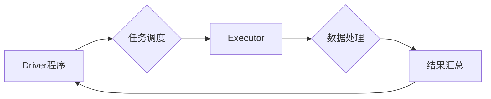

                 

## Apache Spark：大规模数据处理的利器

> 关键词：Apache Spark, 大规模数据处理, 分布式计算,  Spark SQL,  Spark Streaming,  机器学习,  数据分析

## 1. 背景介绍

在当今数据爆炸的时代，海量数据的处理和分析已成为各行各业的核心竞争力。传统的单机数据处理方式已难以满足对处理速度和规模的需求。分布式计算技术应运而生，为大规模数据处理提供了高效的解决方案。Apache Spark作为一款开源的分布式计算框架，凭借其高性能、易用性和丰富的生态系统，迅速成为大数据处理领域的领导者。

Spark的出现填补了Hadoop MapReduce在处理实时数据和复杂计算上的不足。它采用内存计算模型，将数据存储在内存中，并通过一系列迭代操作进行处理，从而大幅提升了计算速度。此外，Spark还提供了丰富的API和生态系统，支持多种编程语言和数据处理任务，例如SQL查询、流式处理、机器学习等。

## 2. 核心概念与联系

### 2.1  分布式计算

分布式计算是指将计算任务分解成多个子任务，并分别在不同的计算节点上执行，最终将结果汇总在一起。这种方式可以充分利用多台机器的计算资源，提高处理速度和吞吐量。

### 2.2  Spark架构

Spark的架构主要由以下几个组件组成：

* **Driver程序:** 负责调度任务、分配资源和收集结果。
* **Executor:** 负责执行计算任务，并与Driver程序进行通信。
* **Cluster Manager:** 负责管理集群资源，例如YARN、Mesos等。
* **Storage:** 负责存储数据，例如HDFS、S3等。

**Spark 架构流程图**



### 2.3  RDD（Resilient Distributed Datasets）

RDD是Spark的核心数据结构，它是一个分布式、可恢复的数据集。RDD可以由多种方式创建，例如从文件系统读取、从其他RDD转换等。RDD具有以下特点：

* **分布式:** RDD数据分布在集群中的多个节点上。
* **可恢复:** 如果节点发生故障，Spark可以从其他节点恢复数据。
* **操作高效:** Spark提供了一系列高效的算子，可以对RDD进行各种操作，例如过滤、聚合、排序等。

## 3. 核心算法原理 & 具体操作步骤

### 3.1  算法原理概述

Spark的核心算法是基于**迭代计算**的。它将数据存储在内存中，并通过一系列迭代操作进行处理。每个迭代操作都会对数据进行转换，最终得到最终结果。

Spark的迭代计算模型具有以下优点：

* **高性能:** 将数据存储在内存中，可以大幅提升计算速度。
* **易于编程:** 使用Spark API进行编程，可以简化数据处理逻辑。
* **灵活度高:** 可以根据不同的数据处理需求，选择不同的迭代算法。

### 3.2  算法步骤详解

1. **数据加载:** 将数据从外部存储系统加载到Spark集群中。
2. **RDD创建:** 将加载的数据转换为RDD。
3. **数据转换:** 使用Spark API中的算子对RDD进行各种操作，例如过滤、聚合、排序等。
4. **结果收集:** 将最终结果从Spark集群中收集到本地。

### 3.3  算法优缺点

**优点:**

* 高性能
* 易于编程
* 灵活度高

**缺点:**

* 对于海量数据，内存压力较大
* 迭代计算模型可能导致代码复杂度增加

### 3.4  算法应用领域

Spark的迭代计算模型广泛应用于以下领域:

* **数据分析:** 对海量数据进行统计分析、趋势预测等。
* **机器学习:** 对数据进行特征提取、模型训练等。
* **流式处理:** 实时处理来自各种数据源的数据流。

## 4. 数学模型和公式 & 详细讲解 & 举例说明

### 4.1  数学模型构建

Spark的迭代计算模型可以抽象为一个数学模型：

$$
X_{t+1} = f(X_t)
$$

其中：

* $X_t$ 表示在第t次迭代时的数据集。
* $f$ 表示迭代操作函数。
* $X_{t+1}$ 表示在第t+1次迭代时的数据集。

### 4.2  公式推导过程

迭代操作函数 $f$ 可以根据具体的算法而不同。例如，对于聚合操作，$f$ 可以表示为数据元素的求和。

### 4.3  案例分析与讲解

假设我们有一个RDD包含一系列数字，我们想要计算它们的平均值。可以使用Spark的聚合操作来实现：

```python
# 使用Spark API计算平均值
average = data.reduce(lambda x, y: x + y) / data.count()
```

在这个例子中，$f$ 函数表示将两个数字相加，最终结果就是所有数字的总和除以数据个数。

## 5. 项目实践：代码实例和详细解释说明

### 5.1  开发环境搭建

为了使用Spark进行开发，需要搭建一个开发环境。

* **安装Java:** Spark依赖于Java运行环境。
* **安装Spark:** 可以从Spark官网下载Spark安装包，并按照官方文档进行安装。
* **配置集群:** Spark可以运行在本地集群或云平台集群上。

### 5.2  源代码详细实现

以下是一个简单的Spark程序，用于计算一个文本文件中的单词频率：

```python
from pyspark import SparkContext

# 创建SparkContext
sc = SparkContext("local", "WordCount")

# 读取文本文件
text = sc.textFile("input.txt")

# 将文本文件中的单词转换为RDD
words = text.flatMap(lambda line: line.split())

# 计算单词频率
wordCounts = words.map(lambda word: (word, 1)).reduceByKey(lambda a, b: a + b)

# 打印结果
wordCounts.collect()
```

### 5.3  代码解读与分析

* `SparkContext` 是Spark程序的入口点，用于连接到Spark集群。
* `textFile()` 方法用于读取文本文件。
* `flatMap()` 方法用于将每个单词拆分成一个独立的元素。
* `map()` 方法用于将每个单词转换为元组 (word, 1)。
* `reduceByKey()` 方法用于计算每个单词的频率。
* `collect()` 方法用于将结果从Spark集群收集到本地。

### 5.4  运行结果展示

运行该程序后，会输出一个包含单词频率的列表。例如，如果输入文件 `input.txt` 包含以下内容：

```
hello world
world spark
spark scala
```

则输出结果为：

```
('hello', 1)
('world', 2)
('spark', 2)
('scala', 1)
```

## 6. 实际应用场景

### 6.1  电商推荐系统

Spark可以用于构建电商推荐系统，分析用户行为数据，推荐个性化商品。

### 6.2  社交网络分析

Spark可以用于分析社交网络数据，挖掘用户关系、传播趋势等信息。

### 6.3  金融风险控制

Spark可以用于分析金融数据，识别欺诈行为、预测风险等。

### 6.4  未来应用展望

随着大数据时代的到来，Spark的应用场景将更加广泛，例如：

* **实时数据分析:** Spark Streaming可以用于实时处理来自各种数据源的数据流，例如传感器数据、社交媒体数据等。
* **机器学习:** Spark MLlib提供了丰富的机器学习算法，可以用于构建各种机器学习模型，例如分类、回归、聚类等。
* **云计算:** Spark可以运行在云平台上，例如AWS、Azure、GCP等，方便用户进行大规模数据处理。

## 7. 工具和资源推荐

### 7.1  学习资源推荐

* **Apache Spark 官方文档:** https://spark.apache.org/docs/latest/
* **Spark 中文社区:** https://spark.apache.org/docs/latest/zh-cn/
* **Spark 入门教程:** https://spark.apache.org/docs/latest/getting-started.html

### 7.2  开发工具推荐

* **IntelliJ IDEA:** https://www.jetbrains.com/idea/
* **Eclipse:** https://www.eclipse.org/

### 7.3  相关论文推荐

* **Spark: Cluster Computing with Working Sets**
* **Resilient Distributed Datasets: A Fault-Tolerant Abstraction for In-Memory Cluster Computing**

## 8. 总结：未来发展趋势与挑战

### 8.1  研究成果总结

Spark已经成为大数据处理领域的领导者，其高性能、易用性和丰富的生态系统使其在各种应用场景中得到广泛应用。

### 8.2  未来发展趋势

* **更强大的机器学习功能:** Spark MLlib将继续发展，提供更强大的机器学习算法和功能。
* **更完善的流式处理能力:** Spark Streaming将继续改进，支持更复杂的流式处理任务。
* **更易于使用的界面:** Spark的界面将继续改进，更加易于使用。

### 8.3  面临的挑战

* **海量数据处理:** 随着数据量的不断增长，Spark需要不断提升其处理能力。
* **异构数据处理:** Spark需要支持处理不同类型的数据，例如结构化数据、非结构化数据、半结构化数据等。
* **安全性和隐私保护:** Spark需要提供更完善的安全性和隐私保护机制。

### 8.4  研究展望

未来，Spark的研究方向将集中在以下几个方面:

* **提高处理效率:** 研究更有效的算法和数据结构，提升Spark的处理效率。
* **支持更多数据类型:** 研究处理不同类型数据的算法和机制，扩展Spark的应用场景。
* **增强安全性和隐私保护:** 研究更完善的安全性和隐私保护机制，保障数据安全。

## 9. 附录：常见问题与解答

### 9.1  Spark和Hadoop的区别

Spark和Hadoop都是分布式计算框架，但它们在架构、数据处理方式和应用场景上有所区别。

* **架构:** Spark采用内存计算模型，而Hadoop采用磁盘计算模型。
* **数据处理方式:** Spark使用迭代计算模型，而Hadoop使用批处理计算模型。
* **应用场景:** Spark更适合处理实时数据和复杂计算，而Hadoop更适合处理海量静态数据。

### 9.2  Spark的编程语言

Spark支持多种编程语言，例如Python、Scala、Java、R等。

### 9.3  Spark的生态系统

Spark拥有丰富的生态系统，包括各种第三方库、工具和服务。

作者：禅与计算机程序设计艺术 / Zen and the Art of Computer Programming


<end_of_turn>

