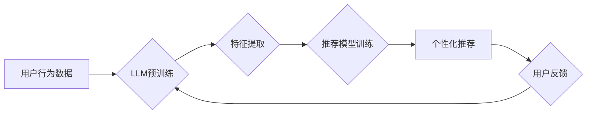

                 

## ChatGPT在推荐场景中的表现

> 关键词：ChatGPT,推荐系统,自然语言处理,大语言模型,用户行为预测,个性化推荐,信息过滤

## 1. 背景介绍

推荐系统作为信息过滤和个性化内容呈现的关键技术，在电商、社交媒体、视频平台等领域发挥着越来越重要的作用。传统的推荐系统主要依赖于协同过滤、内容过滤等方法，但这些方法在面对稀疏数据、冷启动问题以及用户行为的多样性时，表现力有限。近年来，随着深度学习和自然语言处理技术的快速发展，基于大语言模型（LLM）的推荐系统逐渐成为研究热点。

ChatGPT作为一款强大的开源大语言模型，其强大的文本理解和生成能力为推荐系统带来了新的可能性。它能够理解用户的意图和需求，并生成个性化的推荐内容，从而提升用户体验和推荐效果。

## 2. 核心概念与联系

### 2.1 推荐系统概述

推荐系统旨在根据用户的历史行为、偏好和上下文信息，预测用户对特定物品的兴趣，并提供个性化的推荐列表。

### 2.2 大语言模型（LLM）

大语言模型是一种基于深度学习的强大人工智能模型，能够理解和生成人类语言。它通过训练海量文本数据，学习语言的语法、语义和上下文关系，从而具备强大的文本理解、生成、翻译、问答等能力。

### 2.3 ChatGPT

ChatGPT是一个开源的对话式大语言模型，由OpenAI开发。它基于Transformer架构，拥有1750亿参数，能够进行流畅自然的对话，并完成多种文本任务，例如文本生成、翻译、摘要、问答等。

### 2.4  LLM在推荐系统中的应用

将LLM融入推荐系统，可以提升推荐的精准度、个性化程度和用户体验。

**Mermaid 流程图**



## 3. 核心算法原理 & 具体操作步骤

### 3.1  算法原理概述

基于ChatGPT的推荐系统主要利用其强大的文本理解能力，从用户的历史行为数据中提取特征，并结合推荐模型进行个性化推荐。

**具体步骤：**

1. **数据收集和预处理:** 收集用户的历史行为数据，例如浏览记录、购买记录、评分记录等，并进行清洗、格式化和编码处理。
2. **特征提取:** 利用ChatGPT对用户的历史行为数据进行文本分析，提取用户的兴趣、偏好、需求等特征。例如，可以分析用户的评论、搜索词、浏览过的商品类别等信息。
3. **推荐模型训练:** 将提取的特征作为输入，训练推荐模型，例如基于深度学习的协同过滤模型、内容过滤模型或混合模型。
4. **个性化推荐:** 根据用户的当前上下文信息和训练好的推荐模型，生成个性化的推荐列表。
5. **用户反馈:** 收集用户的反馈信息，例如点击、购买、评分等，并将其反馈到模型训练中，不断优化推荐效果。

### 3.2  算法步骤详解

1. **数据收集和预处理:**

   - 收集用户行为数据：从数据库、日志文件等来源收集用户历史行为数据。
   - 数据清洗：去除无效数据、重复数据和噪声数据。
   - 数据格式化：将数据转换为统一的格式，方便后续处理。
   - 数据编码：将文本数据转换为数字格式，方便模型训练。

2. **特征提取:**

   - 利用ChatGPT进行文本分析：将用户的历史行为数据作为输入，让ChatGPT进行文本分析，提取用户的兴趣、偏好、需求等特征。
   - 特征工程：根据业务需求，设计和提取更丰富的特征，例如用户画像、商品属性、用户行为模式等。

3. **推荐模型训练:**

   - 选择合适的推荐模型：根据业务需求和数据特点，选择合适的推荐模型，例如基于深度学习的协同过滤模型、内容过滤模型或混合模型。
   - 模型训练：利用训练数据，训练推荐模型，并进行模型评估和调优。

4. **个性化推荐:**

   - 根据用户的当前上下文信息，例如用户的浏览历史、搜索词、位置信息等，预测用户的兴趣和需求。
   - 利用训练好的推荐模型，生成个性化的推荐列表。

5. **用户反馈:**

   - 收集用户的反馈信息：例如用户点击、购买、评分等行为。
   - 将用户反馈信息反馈到模型训练中，不断优化推荐效果。

### 3.3  算法优缺点

**优点:**

- 能够理解用户的复杂需求和意图。
- 能够生成更个性化、更相关的推荐内容。
- 能够适应用户行为的多样性和动态变化。

**缺点:**

- 需要大量的训练数据和计算资源。
- 模型训练和部署成本较高。
- 存在潜在的偏差和公平性问题。

### 3.4  算法应用领域

- 电子商务推荐：商品推荐、个性化营销、跨界推荐。
- 社交媒体推荐：好友推荐、内容推荐、兴趣小组推荐。
- 视频平台推荐：视频推荐、用户画像、内容分类。
- 音乐平台推荐：歌曲推荐、音乐人推荐、个性化歌单。

## 4. 数学模型和公式 & 详细讲解 & 举例说明

### 4.1  数学模型构建

基于ChatGPT的推荐系统通常采用深度学习模型，例如Transformer网络，来学习用户行为数据和商品特征之间的关系。

**Transformer网络结构:**

Transformer网络由编码器和解码器组成，其中编码器用于提取用户行为数据和商品特征的表示，解码器用于生成推荐列表。

**编码器结构:**

编码器由多层Transformer模块组成，每个模块包含多头自注意力机制和前馈神经网络。

**解码器结构:**

解码器也由多层Transformer模块组成，每个模块包含多头自注意力机制、跨编码器注意力机制和前馈神经网络。

### 4.2  公式推导过程

Transformer网络的注意力机制是其核心组成部分，用于学习用户行为数据和商品特征之间的关系。

**注意力机制公式:**

$$
Attention(Q, K, V) = \frac{exp(Q \cdot K^T / \sqrt{d_k})}{exp(Q \cdot K^T / \sqrt{d_k})} \cdot V
$$

其中：

- $Q$：查询矩阵
- $K$：键矩阵
- $V$：值矩阵
- $d_k$：键向量的维度

### 4.3  案例分析与讲解

假设用户A浏览了商品A、B、C，并对商品A和C进行了评分。

- $Q$：用户A浏览历史的向量表示
- $K$：商品A、B、C的向量表示
- $V$：商品A、B、C的评分向量

通过注意力机制，模型可以学习到用户A对商品A和C的偏好，并将其作为推荐商品的依据。

## 5. 项目实践：代码实例和详细解释说明

### 5.1  开发环境搭建

- Python 3.7+
- PyTorch 1.7+
- Transformers 4.10+
- CUDA 11.0+

### 5.2  源代码详细实现

```python
import torch
from transformers import AutoModelForSequenceClassification, AutoTokenizer

# 加载预训练模型和词典
model_name = "gpt2"
tokenizer = AutoTokenizer.from_pretrained(model_name)
model = AutoModelForSequenceClassification.from_pretrained(model_name)

# 用户行为数据
user_behavior = ["浏览商品A", "购买商品B", "评论商品C"]

# 将用户行为数据转换为文本序列
input_ids = tokenizer(user_behavior, return_tensors="pt").input_ids

# 使用预训练模型提取特征
outputs = model(input_ids)

# 获取模型输出
logits = outputs.logits

# 将模型输出转换为概率分布
probs = torch.softmax(logits, dim=1)

# 根据概率分布生成推荐列表
recommended_items = torch.argmax(probs, dim=1)

# 打印推荐列表
print(recommended_items)
```

### 5.3  代码解读与分析

- 代码首先加载预训练模型和词典。
- 然后将用户行为数据转换为文本序列，并使用预训练模型提取特征。
- 模型输出经过softmax函数转换为概率分布，根据概率分布生成推荐列表。

### 5.4  运行结果展示

运行代码后，将输出一个包含推荐商品索引的列表。

## 6. 实际应用场景

### 6.1  电商推荐

- 基于用户浏览历史、购买记录、评分等数据，推荐个性化的商品。
- 跨界推荐：根据用户的兴趣爱好，推荐与现有商品相关的其他商品。

### 6.2  社交媒体推荐

- 基于用户的关注关系、点赞记录、评论等数据，推荐相关的用户、内容和兴趣小组。
- 个性化内容推荐：根据用户的兴趣爱好，推荐个性化的新闻、视频、文章等内容。

### 6.3  视频平台推荐

- 基于用户的观看历史、点赞记录、评论等数据，推荐相关的视频。
- 个性化视频推荐：根据用户的兴趣爱好，推荐个性化的视频内容。

### 6.4  未来应用展望

- 更精准的个性化推荐：利用更丰富的用户数据和更先进的模型，实现更精准的个性化推荐。
- 多模态推荐：结合文本、图像、音频等多模态数据，实现更丰富的推荐体验。
- 协同推荐：利用用户之间的关系和行为相似性，实现更有效的协同推荐。

## 7. 工具和资源推荐

### 7.1  学习资源推荐

- **书籍:**
    - Deep Learning by Ian Goodfellow
    - Natural Language Processing with Python by Steven Bird
- **在线课程:**
    - Stanford CS224N: Natural Language Processing with Deep Learning
    - DeepLearning.AI TensorFlow Specialization

### 7.2  开发工具推荐

- **Python:** 
    - PyTorch
    - TensorFlow
- **自然语言处理库:**
    - Transformers
    - NLTK
    - spaCy

### 7.3  相关论文推荐

- Attention Is All You Need
- BERT: Pre-training of Deep Bidirectional Transformers for Language Understanding
- GPT-3: Language Models are Few-Shot Learners

## 8. 总结：未来发展趋势与挑战

### 8.1  研究成果总结

基于ChatGPT的推荐系统在提升推荐精准度、个性化程度和用户体验方面取得了显著成果。

### 8.2  未来发展趋势

- 更深层次的理解用户需求：利用更先进的自然语言理解模型，更深入地理解用户的需求和意图。
- 多模态融合推荐：结合文本、图像、音频等多模态数据，实现更丰富的推荐体验。
- 增强推荐的可解释性：提高推荐结果的可解释性，帮助用户理解推荐背后的逻辑。

### 8.3  面临的挑战

- 数据隐私和安全：如何保护用户隐私数据，并确保推荐系统的安全性和可靠性。
- 模型公平性和偏见：如何避免模型训练过程中引入的偏见，确保推荐结果公平公正。
- 计算资源和成本：训练大型语言模型需要大量的计算资源和成本，如何降低成本并提高效率。

### 8.4  研究展望

未来，基于ChatGPT的推荐系统将朝着更智能、更个性化、更可解释的方向发展。

## 9. 附录：常见问题与解答

**Q1：ChatGPT在推荐系统中的应用有哪些？**

**A1：** ChatGPT在推荐系统中可以用于：

- 用户行为分析：提取用户的兴趣、偏好、需求等特征。
- 内容理解：理解商品描述、用户评论等文本内容。
- 推荐生成：根据用户的特征和商品信息，生成个性化的推荐列表。

**Q2：ChatGPT的推荐效果如何？**

**A2：** ChatGPT的推荐效果取决于多种因素，例如训练数据、模型架构、特征工程等。

**Q3：如何评估ChatGPT的推荐效果？**

**A3：** 可以使用多种指标来评估ChatGPT的推荐效果，例如点击率、转化率、用户满意度等。

**Q4：ChatGPT的推荐系统有哪些挑战？**

**A4：** ChatGPT的推荐系统面临的挑战包括：

- 数据隐私和安全
- 模型公平性和偏见
- 计算资源和成本

**Q5：ChatGPT的推荐系统未来发展趋势是什么？**

**A5：** ChatGPT的推荐系统未来将朝着更智能、更个性化、更可解释的方向发展。


作者：禅与计算机程序设计艺术 / Zen and the Art of Computer Programming 
<end_of_turn>

