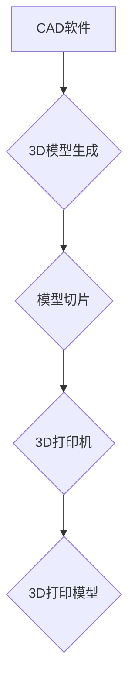

                 

## 3D打印创业：个性化制造的未来

> 关键词：3D打印、个性化制造、增材制造、创业、技术趋势、未来应用

## 1. 背景介绍

近年来，3D打印技术（也称为增材制造）经历了飞速发展，从最初的原型制作工具逐渐演变为生产定制化产品、个性化服务的重要手段。其核心原理是通过逐层堆积材料，根据数字化模型构建三维实体，打破了传统制造业的生产模式，为个性化制造提供了全新的可能性。

3D打印技术的应用领域日益广泛，涵盖医疗、航空航天、汽车、教育、文化创意等多个领域。在医疗领域，3D打印可以用于制作定制化医疗器械、假肢、组织模型等，满足患者个性化需求；在航空航天领域，3D打印可以用于制造轻量化、高性能的航空部件，降低飞机重量，提高燃油效率；在汽车领域，3D打印可以用于制造汽车零部件，缩短生产周期，降低成本。

随着3D打印技术的不断进步和成本下降，其商业化应用前景广阔。越来越多的创业者看到了3D打印的巨大潜力，纷纷涌入这个领域，开发新的应用场景和商业模式。

## 2. 核心概念与联系

### 2.1 3D打印技术概述

3D打印技术是一种利用计算机辅助设计（CAD）软件生成的数字化模型，通过逐层堆积材料，构建三维实体的制造工艺。其工作原理是将三维模型分解成多个二维平面，然后通过打印机将这些平面逐层打印出来，最终形成完整的三维实体。

### 2.2 3D打印技术分类

3D打印技术根据不同的材料、打印方式和应用场景，可以分为多种类型：

* **材料分类:**
    * **塑料类:** ABS、PLA、尼龙等
    * **金属类:** 不锈钢、钛合金、铝合金等
    * **陶瓷类:** 陶瓷粉末、金属陶瓷等
    * **复合材料类:** 碳纤维增强塑料、玻璃纤维增强塑料等
* **打印方式分类:**
    * **熔融沉积模型（FDM）:** 将热塑性材料熔化后挤出，逐层堆积形成模型。
    * **立体光固化（SLA）:** 利用光固化树脂，通过激光或UV光照固化，逐层构建模型。
    * **选择性激光熔化（SLM）:** 利用高功率激光熔化金属粉末，逐层构建模型。
    * **电子束熔化（EBM）:** 利用电子束熔化金属粉末，逐层构建模型。

* **应用场景分类:**
    * **原型制作:** 快速制作产品原型，用于设计验证和测试。
    * **定制化制造:** 根据客户需求，制作个性化产品，满足特殊需求。
    * **小批量生产:** 生产少量特殊产品，降低生产成本。
    * **工业制造:** 生产复杂、高性能的工业部件。

### 2.3 3D打印技术架构



**图 2.1 3D打印技术架构**

## 3. 核心算法原理 & 具体操作步骤

### 3.1 算法原理概述

3D打印的核心算法主要包括：

* **三维建模算法:** 用于生成三维模型，常用的建模软件包括SolidWorks、Autodesk Inventor、Blender等。
* **模型切片算法:** 将三维模型分解成多个二维平面，并生成打印指令，指导打印机逐层打印。
* **路径规划算法:** 用于规划打印头运动轨迹，优化打印速度和效率。
* **温度控制算法:** 用于控制打印头温度，确保材料熔化和固化状态。

### 3.2 算法步骤详解

1. **三维建模:** 使用CAD软件设计三维模型，并进行参数化设置。
2. **模型切片:** 将三维模型导入切片软件，根据打印机参数和材料特性，将模型切片成多个二维平面。
3. **路径规划:** 根据切片结果，规划打印头运动轨迹，并生成打印指令文件。
4. **打印机控制:** 3D打印机根据打印指令文件，控制打印头运动，逐层堆积材料，构建三维模型。
5. **后处理:** 打印完成后，进行模型去支持、表面处理等后处理操作。

### 3.3 算法优缺点

**优点:**

* **个性化定制:** 可以根据客户需求，制作个性化产品。
* **快速原型制作:** 可以快速制作产品原型，缩短设计周期。
* **小批量生产:** 可以生产少量特殊产品，降低生产成本。
* **复杂形状制造:** 可以制造复杂、难以加工的形状。

**缺点:**

* **打印速度慢:** 相比传统制造方式，3D打印速度较慢。
* **材料选择有限:** 目前3D打印材料种类相对有限。
* **精度有限:** 3D打印精度相对传统制造方式较低。
* **成本较高:** 3D打印设备和材料成本较高。

### 3.4 算法应用领域

3D打印技术广泛应用于以下领域:

* **医疗:** 定制化医疗器械、假肢、组织模型等。
* **航空航天:** 轻量化、高性能航空部件。
* **汽车:** 汽车零部件、模型制作。
* **教育:** 教学模型、实验装置。
* **文化创意:** 艺术品、模型制作、个性化定制品。

## 4. 数学模型和公式 & 详细讲解 & 举例说明

### 4.1 数学模型构建

3D打印过程可以抽象为一个多层叠加的数学模型。每个层面的模型可以用二维平面方程来描述，而整个三维模型可以通过一系列二维平面方程的叠加来构建。

### 4.2 公式推导过程

假设一个三维模型可以用以下方程来描述：

$$
z = f(x,y)
$$

其中，$z$代表高度，$x$和$y$代表平面坐标。

为了进行3D打印，需要将这个三维模型分解成多个二维平面，每个平面代表一个打印层。

每个打印层的厚度可以表示为$\Delta z$，则每个打印层的平面方程可以表示为：

$$
z = f(x,y) + k\Delta z
$$

其中，$k$代表打印层的序号。

### 4.3 案例分析与讲解

以一个简单的圆柱体为例，其三维模型方程可以表示为：

$$
x^2 + y^2 = r^2
$$

其中，$r$代表圆柱体的半径。

为了进行3D打印，需要将这个圆柱体分解成多个圆形平面，每个圆形平面代表一个打印层。

每个打印层的厚度可以表示为$\Delta z$，则每个打印层的平面方程可以表示为：

$$
x^2 + y^2 = r^2 - k\Delta z
$$

其中，$k$代表打印层的序号。

## 5. 项目实践：代码实例和详细解释说明

### 5.1 开发环境搭建

* **操作系统:** Windows、macOS、Linux
* **编程语言:** Python、C++、Java等
* **3D建模软件:** Blender、Fusion 360、SolidWorks等
* **切片软件:** Cura、PrusaSlicer、Simplify3D等

### 5.2 源代码详细实现

以下是一个使用Python语言实现3D打印模型切片的基本代码示例：

```python
import numpy as np

# 模型数据
model_data = np.array([
    [0, 0, 0],
    [1, 0, 0],
    [1, 1, 0],
    [0, 1, 0],
    [0, 0, 1],
    [1, 0, 1],
    [1, 1, 1],
    [0, 1, 1],
])

# 打印层厚度
layer_height = 0.2

# 切片结果
slices = []

# 循环遍历模型数据，生成每个打印层
for k in range(int(np.max(model_data[:, 2]) / layer_height) + 1):
    slice_data = model_data[model_data[:, 2] == k * layer_height]
    slices.append(slice_data)

# 输出切片结果
print(slices)
```

### 5.3 代码解读与分析

* 该代码首先定义了模型数据，这是一个三维点云数据。
* 然后定义了打印层厚度，即每个打印层的厚度。
* 接着，代码循环遍历模型数据，根据打印层厚度，将模型数据切片成多个二维平面。
* 最后，代码输出切片结果，每个切片代表一个打印层。

### 5.4 运行结果展示

运行该代码后，会输出一个包含多个二维平面数据的列表，每个二维平面数据代表一个打印层。这些数据可以被3D打印机读取，并逐层打印出模型。

## 6. 实际应用场景

### 6.1 医疗领域

* **定制化医疗器械:** 3D打印可以用于制作个性化的医疗器械，例如假肢、义肢、矫形器等，满足患者的特殊需求。
* **组织模型:** 3D打印可以用于制作患者的组织模型，用于手术模拟、药物测试等。
* **生物打印:** 3D打印可以用于打印生物组织和器官，为器官移植提供新的解决方案。

### 6.2 航空航天领域

* **轻量化航空部件:** 3D打印可以用于制造轻量化、高性能的航空部件，例如飞机发动机叶片、机翼结构等，降低飞机重量，提高燃油效率。
* **定制化航空工具:** 3D打印可以用于制造定制化的航空工具，例如维修工具、测试工具等，满足航空航天行业的特殊需求。

### 6.3 汽车领域

* **汽车零部件:** 3D打印可以用于制造汽车零部件，例如发动机部件、车身部件等，降低生产成本，缩短生产周期。
* **汽车模型:** 3D打印可以用于制作汽车模型，用于设计验证、市场推广等。

### 6.4 教育领域

* **教学模型:** 3D打印可以用于制作各种教学模型，例如人体模型、动物模型、机械模型等，帮助学生更好地理解知识。
* **实验装置:** 3D打印可以用于制作实验装置，例如物理实验装置、化学实验装置等，方便学生进行实验操作。

### 6.5 文化创意领域

* **艺术品:** 3D打印可以用于制作各种艺术品，例如雕塑、绘画、珠宝等，为艺术家提供新的创作工具。
* **模型制作:** 3D打印可以用于制作各种模型，例如建筑模型、玩具模型、收藏模型等，满足人们的个性化需求。

### 6.4 未来应用展望

3D打印技术的发展前景广阔，未来将有更多新的应用场景和商业模式出现。例如：

* **个性化服装:** 3D打印可以用于制作个性化的服装，满足人们的独特审美需求。
* **可穿戴设备:** 3D打印可以用于制作可穿戴设备，例如智能手表、智能眼镜等，提供更舒适、更个性化的佩戴体验。
* **建筑打印:** 3D打印可以用于建造房屋、桥梁等建筑结构，提高建筑效率，降低成本。

## 7. 工具和资源推荐

### 7.1 学习资源推荐

* **书籍:**
    * 《3D打印技术入门》
    * 《3D打印：未来制造的革命》
* **在线课程:**
    * Coursera: 3D Printing and Additive Manufacturing
    * edX: Introduction to 3D Printing
* **网站:**
    * 3D Hubs: https://www.3dhubs.com/
    * Thingiverse: https://www.thingiverse.com/

### 7.2 开发工具推荐

* **3D建模软件:**
    * Blender: https://www.blender.org/
    * Fusion 360: https://www.autodesk.com/products/fusion-360/overview
    * SolidWorks: https://www.solidworks.com/
* **切片软件:**
    * Cura: https://ultimaker.com/software/cura
    * PrusaSlicer: https://www.prusa3d.com/prusa-slicer/
    * Simplify3D: https://www.simplify3d.com/

### 7.3 相关论文推荐

* **Additive Manufacturing: A Review**
* **3D Printing: Technologies, Applications, and Future Trends**
* **The Impact of 3D Printing on Manufacturing**

## 8. 总结：未来发展趋势与挑战

### 8.1 研究成果总结

3D打印技术已经取得了显著的进展，其应用领域不断拓展，对制造业、医疗、教育等多个领域产生了深远的影响。

### 8.2 未来发展趋势

* **材料创新:** 研发新的3D打印材料，例如金属、陶瓷、复合材料等，拓展3D打印的应用范围。
* **打印精度提升:** 提高3D打印的精度和分辨率，满足更高要求的应用场景。
* **智能化打印:** 开发智能化的3D打印系统，实现自动设计、自动切片、自动打印等功能。
* **大规模化打印:** 研究大规模化3D打印技术，实现批量生产。

### 8.3 面临的挑战

* **成本问题:** 3D打印设备和材料成本较高，制约了其大规模应用。
* **技术瓶颈:** 3D打印技术还存在一些技术瓶颈，例如打印速度慢、精度有限等。
* **标准化问题:** 3D打印行业缺乏统一的标准，导致设备和材料兼容性问题。

### 8.4 研究展望

未来，3D打印技术将继续发展，并与人工智能、大数据、云计算等新兴技术融合，形成更加智能化、高效化、个性化的制造模式。


## 9. 附录：常见问题与解答

**Q1: 3D打印和传统制造相比有什么优势？**

**A1:** 3D打印相比传统制造具有以下优势：

* **个性化定制:** 可以根据客户需求，制作个性化产品。
* **快速原型制作:** 可以快速制作产品原型，缩短设计周期。
* **小批量生产:** 可以生产少量特殊产品，降低生产成本。
* **复杂形状制造:** 可以制造复杂、难以加工的形状。

**Q2: 3D打印有哪些应用领域？**

**A2:** 3D打印的应用领域非常广泛，包括：

* 医疗
* 航空航天
* 汽车
* 教育
* 文化创意

**Q3: 3D打印的成本如何？**

**A3:** 3D打印的成本取决于多种因素，例如打印机类型、材料类型、打印尺寸等。总体来说，3D打印的成本在某些情况下可能比传统制造更低，但在其他情况下可能更高。

**Q4: 3D打印的精度如何？**

**A4:** 3D打印的精度取决于打印机类型、材料类型、打印参数等。目前3D打印的精度已经达到很高水平，但仍然低于传统制造。

**Q5: 3D打印的未来发展趋势是什么？**

**A5:** 3D打印的未来发展趋势包括：

* 材料创新
* 打印精度提升
* 智能化打印
* 大规模化打印


作者：禅与计算机程序设计艺术 / Zen and the Art of Computer Programming<end_of_turn>

