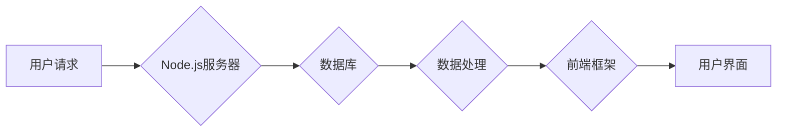

                 

## JavaScript全栈开发：Node.js与前端框架的结合

> 关键词：JavaScript, Node.js, 全栈开发, 前端框架, React, Angular, Vue, Express, MongoDB, RESTful API

### 1. 背景介绍

在当今软件开发领域，全栈开发越来越受到重视。全栈开发是指能够熟练掌握前端和后端开发技术的程序员，他们能够独立完成一个项目的开发，从用户界面设计到数据库管理，都能胜任。JavaScript作为一种跨平台、多用途的编程语言，凭借其灵活性和广泛的应用场景，成为了全栈开发的首选语言之一。

Node.js作为JavaScript运行时环境，为后端开发提供了强大的支持。它基于事件驱动、非阻塞 I/O 模型，能够高效处理大量并发请求，使其成为构建高性能、实时应用的理想选择。

前端框架，如React、Angular和Vue，则提供了构建复杂用户界面的结构化和高效的解决方案。它们通过组件化、数据绑定等机制，简化了前端开发流程，提高了开发效率和代码可维护性。

结合Node.js和前端框架，开发者能够构建完整的Web应用，实现前后端代码的统一，简化开发流程，提高开发效率。

### 2. 核心概念与联系

#### 2.1 Node.js

Node.js是一个基于Chrome V8引擎的开源、跨平台的JavaScript运行时环境。它允许开发者使用JavaScript编写服务器端应用程序，并利用其非阻塞、事件驱动模型处理并发请求。

#### 2.2 前端框架

前端框架是用于构建用户界面的JavaScript库或集合，它们提供了一套预定义的组件、指令和数据绑定机制，简化了前端开发流程，提高了代码可维护性和复用性。

#### 2.3 全栈开发

全栈开发是指能够熟练掌握前端和后端开发技术的程序员，他们能够独立完成一个项目的开发，从用户界面设计到数据库管理，都能胜任。

#### 2.4 核心概念联系

Node.js和前端框架共同构成了全栈开发的基础。Node.js为后端开发提供强大的支持，前端框架则为用户界面构建提供了高效的解决方案。

通过将Node.js和前端框架结合起来，开发者能够构建完整的Web应用，实现前后端代码的统一，简化开发流程，提高开发效率。

**Mermaid 流程图**



### 3. 核心算法原理 & 具体操作步骤

#### 3.1 算法原理概述

全栈开发涉及到多种算法和技术，例如：

* **RESTful API设计**: 用于定义应用程序接口，实现前后端数据交互。
* **异步编程**: Node.js基于事件驱动、非阻塞 I/O 模型，需要使用异步编程技术处理并发请求。
* **数据结构**: 构建高效的数据结构，例如树、图、链表等，用于存储和处理数据。
* **算法**: 使用各种算法，例如排序算法、搜索算法等，提高数据处理效率。

#### 3.2 算法步骤详解

**RESTful API设计步骤**:

1. **定义资源**: 确定应用程序要提供的资源，例如用户、商品、订单等。
2. **设计接口**: 为每个资源定义相应的接口，例如获取、创建、更新、删除等操作。
3. **选择HTTP方法**: 根据操作类型选择合适的HTTP方法，例如GET、POST、PUT、DELETE等。
4. **定义请求参数**: 确定接口所需的请求参数，例如用户ID、商品ID等。
5. **返回响应**: 根据操作结果返回相应的响应，例如成功、失败、错误信息等。

**异步编程步骤**:

1. **使用回调函数**: 将异步操作的结果传递给回调函数。
2. **使用Promise**: 使用Promise对象来管理异步操作，并处理成功或失败的结果。
3. **使用async/await**: 使用async/await语法简化异步代码的编写。

#### 3.3 算法优缺点

**RESTful API设计**:

* **优点**: 简单易用、标准化、可扩展性强。
* **缺点**: 对于复杂业务场景，可能需要设计大量的接口。

**异步编程**:

* **优点**: 提高了程序的并发能力，能够高效处理大量请求。
* **缺点**: 代码逻辑复杂，容易出现错误。

#### 3.4 算法应用领域

* **RESTful API**: 用于构建Web服务、移动应用、API接口等。
* **异步编程**: 用于构建高并发、实时应用，例如聊天应用、游戏服务器等。

### 4. 数学模型和公式 & 详细讲解 & 举例说明

#### 4.1 数学模型构建

在全栈开发中，数学模型可以用于分析和优化应用程序性能，例如：

* **数据结构复杂度**: 使用数学公式计算数据结构的插入、删除、查找等操作的时间复杂度，选择最优的数据结构。
* **算法效率**: 使用数学公式分析算法的时间复杂度和空间复杂度，选择最优的算法。
* **网络传输**: 使用数学模型分析网络传输延迟和带宽，优化数据传输效率。

#### 4.2 公式推导过程

**时间复杂度**:

时间复杂度是指算法执行时间随输入数据大小变化的趋势。常用的时间复杂度表示方法有：

* **O(1)**: 常数时间复杂度，执行时间与输入数据大小无关。
* **O(log n)**: 对数时间复杂度，执行时间随输入数据大小的增加而线性增长。
* **O(n)**: 线性时间复杂度，执行时间与输入数据大小成正比。
* **O(n log n)**: 线性对数时间复杂度，执行时间随输入数据大小的增加而增长。
* **O(n^2)**: 平方时间复杂度，执行时间随输入数据大小的平方增长。

#### 4.3 案例分析与讲解

**示例**:

假设有一个包含n个元素的数组，需要查找某个元素是否存在。

* **线性搜索**: 逐个遍历数组，直到找到目标元素或遍历完整个数组。时间复杂度为O(n)。
* **二分搜索**: 首先将数组排序，然后从中间元素开始比较，如果目标元素小于中间元素，则继续搜索左半部分；否则，继续搜索右半部分。时间复杂度为O(log n)。

二分搜索的时间复杂度比线性搜索低很多，因此对于大型数组，二分搜索效率更高。

### 5. 项目实践：代码实例和详细解释说明

#### 5.1 开发环境搭建

* **Node.js**: 下载并安装Node.js，https://nodejs.org/
* **npm**: Node.js自带的包管理器，用于安装第三方库。
* **代码编辑器**: 选择一款适合的代码编辑器，例如VS Code、Atom等。

#### 5.2 源代码详细实现

**示例项目**: 一个简单的RESTful API，用于管理用户数据。

```javascript
// server.js
const express = require('express');
const app = express();
const port = 3000;

// 模拟用户数据
let users = [
  { id: 1, name: 'John Doe' },
  { id: 2, name: 'Jane Doe' }
];

// 获取所有用户
app.get('/users', (req, res) => {
  res.json(users);
});

// 获取单个用户
app.get('/users/:id', (req, res) => {
  const id = parseInt(req.params.id);
  const user = users.find(u => u.id === id);
  if (!user) {
    return res.status(404).send('用户不存在');
  }
  res.json(user);
});

// 创建新用户
app.post('/users', (req, res) => {
  const newUser = {
    id: users.length + 1,
    name: req.body.name
  };
  users.push(newUser);
  res.status(201).json(newUser);
});

// 启动服务器
app.listen(port, () => {
  console.log(`Server listening at http://localhost:${port}`);
});
```

#### 5.3 代码解读与分析

* **express**: 使用Express框架构建RESTful API。
* **路由**: 使用`app.get()`、`app.post()`等方法定义路由，处理不同的HTTP请求。
* **数据处理**: 使用`req.params`获取URL参数，使用`req.body`获取POST请求数据。
* **响应**: 使用`res.json()`返回JSON数据，使用`res.status()`设置响应状态码。

#### 5.4 运行结果展示

运行代码后，可以使用浏览器或工具访问API接口，例如：

* `http://localhost:3000/users`: 获取所有用户数据。
* `http://localhost:3000/users/1`: 获取用户ID为1的用户数据。
* `http://localhost:3000/users`: 创建新用户。

### 6. 实际应用场景

#### 6.1  电商平台

* **前端**: 使用React、Angular或Vue构建用户界面，展示商品信息、购物车、订单等。
* **后端**: 使用Node.js构建API接口，处理商品数据、用户数据、订单数据等。

#### 6.2  社交媒体平台

* **前端**: 使用React、Angular或Vue构建用户界面，展示用户动态、消息、好友列表等。
* **后端**: 使用Node.js构建API接口，处理用户数据、消息数据、动态数据等。

#### 6.3  实时聊天应用

* **前端**: 使用React、Angular或Vue构建用户界面，展示聊天窗口、消息列表等。
* **后端**: 使用Node.js构建WebSocket服务器，实现实时消息推送。

#### 6.4  未来应用展望

随着JavaScript生态系统的不断发展，全栈开发将更加灵活、高效和强大。

* **Serverless**: 使用Serverless架构，更加简化后端开发，提高资源利用率。
* **微服务**: 将大型应用程序拆分成多个小型服务，提高开发效率和可维护性。
* **人工智能**: 将人工智能技术融入到全栈开发中，构建更加智能的应用程序。

### 7. 工具和资源推荐

#### 7.1 学习资源推荐

* **书籍**:
    * 《JavaScript全栈开发》
    * 《Node.js权威指南》
    * 《React权威指南》
    * 《Angular权威指南》
    * 《Vue.js权威指南》
* **在线课程**:
    * Udemy
    * Coursera
    * Pluralsight

#### 7.2 开发工具推荐

* **代码编辑器**: VS Code, Atom, Sublime Text
* **调试工具**: Chrome DevTools, Node Inspector
* **版本控制**: Git, GitHub

#### 7.3 相关论文推荐

* **Node.js**:
    * "Node.js: A Scalable and Efficient JavaScript Runtime Environment"
* **前端框架**:
    * "React: A Declarative JavaScript Library for Building User Interfaces"
    * "Angular: A Comprehensive Framework for Building Web Applications"
    * "Vue.js: A Progressive JavaScript Framework for Building User Interfaces"

### 8. 总结：未来发展趋势与挑战

#### 8.1 研究成果总结

全栈开发技术已经取得了显著的成果，为软件开发带来了更高的效率和灵活性。Node.js和前端框架的结合，为构建现代Web应用提供了强大的工具和技术支持。

#### 8.2 未来发展趋势

* **Serverless**: Serverless架构将更加普及，简化后端开发，提高资源利用率。
* **微服务**: 微服务架构将更加成熟，帮助开发者构建更加灵活、可扩展的应用程序。
* **人工智能**: 人工智能技术将更加融入到全栈开发中，构建更加智能的应用程序。

#### 8.3 面临的挑战

* **技术复杂性**: 全栈开发涉及到多种技术，需要开发者具备更广泛的知识和技能。
* **生态系统演变**: JavaScript生态系统不断发展，需要开发者持续学习和更新知识。
* **安全问题**: 全栈应用程序需要关注安全问题，防止攻击和数据泄露。

#### 8.4 研究展望

未来，全栈开发技术将继续发展，更加灵活、高效和强大。研究者将继续探索新的技术和方法，解决全栈开发面临的挑战，为软件开发带来更大的创新和进步。

### 9. 附录：常见问题与解答

**常见问题**:

* **Node.js和Express框架有什么区别？**

Node.js是一个运行时环境，而Express是一个基于Node.js的Web应用框架。Express简化了Node.js的开发流程，提供了更方便的路由、模板引擎、中间件等功能。

* **如何选择合适的前端框架？**

选择前端框架需要根据项目需求和开发团队的经验进行考虑。React、Angular和Vue都是优秀的框架，各有优缺点。

* **如何优化Node.js应用程序性能？**

可以使用异步编程、缓存、负载均衡等技术优化Node.js应用程序性能。

* **如何保证全栈应用程序的安全？**

需要关注用户身份验证、数据加密、输入验证等安全问题，并使用安全最佳实践来保护应用程序。


作者：禅与计算机程序设计艺术 / Zen and the Art of Computer Programming 
<end_of_turn>

