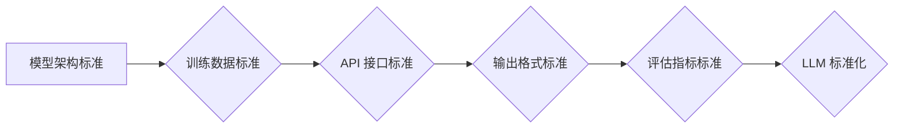

                 

## LLM 标准化：促进互操作性与兼容性

> 关键词：LLM、标准化、互操作性、兼容性、API、模型架构、数据格式、评估指标

### 1. 背景介绍

大型语言模型（LLM）近年来取得了令人瞩目的进展，在自然语言处理、文本生成、代码编写等领域展现出强大的能力。然而，随着 LLMs 的蓬勃发展，其多样性也带来了新的挑战。目前，不同厂商和研究机构开发的 LLMs 在模型架构、训练数据、API 接口、输出格式等方面存在着显著差异，这导致了 LLMs 之间缺乏互操作性和兼容性，阻碍了其在实际应用中的广泛推广和协同发展。

标准化是解决这一问题的关键。通过建立统一的标准，可以确保不同 LLMs 可以相互理解和交互，促进其资源共享、功能互补和协同创新。

### 2. 核心概念与联系

#### 2.1 互操作性与兼容性

* **互操作性**是指不同系统或软件能够相互交换信息和数据，并能够理解和处理这些信息。
* **兼容性**是指不同系统或软件能够共同运行，相互协作，互不冲突。

LLM 标准化旨在提高 LLMs 之间的互操作性和兼容性，使其能够更灵活地集成到不同的应用场景中。

#### 2.2 标准化架构

LLM 标准化架构通常包括以下几个关键方面：

* **模型架构标准:** 定义 LLMs 的基本结构和功能，例如层数、神经元数量、激活函数等。
* **训练数据标准:** 规范 LLMs 的训练数据格式、内容和质量，确保不同 LLMs 能够使用相同的训练数据进行训练。
* **API 接口标准:** 统一 LLMs 的接口定义，使不同 LLMs 可以通过相同的接口进行调用和交互。
* **输出格式标准:** 规定 LLMs 的输出格式，例如文本、代码、数据结构等，确保不同 LLMs 的输出能够被其他系统理解和处理。
* **评估指标标准:** 定义用于评估 LLMs 性能的标准指标，例如准确率、流畅度、鲁棒性等，方便比较不同 LLMs 的优劣。

**Mermaid 流程图**



### 3. 核心算法原理 & 具体操作步骤

#### 3.1 算法原理概述

LLM 标准化算法的核心是基于机器学习和深度学习的模型训练和优化技术。通过训练大量的文本数据，LLMs 可以学习到语言的语法、语义和上下文关系，从而能够生成流畅、自然的文本，并完成各种自然语言处理任务。

#### 3.2 算法步骤详解

1. **数据预处理:** 收集和清洗训练数据，将其转换为模型能够理解的格式。
2. **模型构建:** 根据模型架构标准，构建 LLM 模型。
3. **模型训练:** 使用训练数据训练 LLM 模型，通过反向传播算法不断优化模型参数。
4. **模型评估:** 使用评估指标标准评估模型性能，并根据评估结果进行模型调优。
5. **标准化接口开发:** 基于 API 接口标准，开发 LLM 的接口，使其能够与其他系统进行交互。

#### 3.3 算法优缺点

**优点:**

* 能够生成高质量的文本，并完成各种自然语言处理任务。
* 能够学习和理解复杂的语言关系。
* 能够不断学习和改进，随着训练数据的增加，模型性能会不断提升。

**缺点:**

* 训练数据量大，需要大量的计算资源和时间。
* 模型参数量大，部署和推理成本较高。
* 容易受到训练数据偏差的影响，可能生成带有偏见或错误的信息。

#### 3.4 算法应用领域

LLM 标准化算法在以下领域具有广泛的应用前景：

* **自然语言理解:** 文本分类、情感分析、问答系统等。
* **文本生成:** 文章写作、故事创作、代码生成等。
* **机器翻译:** 将一种语言翻译成另一种语言。
* **对话系统:** 与人类进行自然流畅的对话。

### 4. 数学模型和公式 & 详细讲解 & 举例说明

#### 4.1 数学模型构建

LLM 的核心数学模型是 Transformer，它是一种基于注意力机制的神经网络架构。Transformer 模型由编码器和解码器两部分组成。

* **编码器:** 将输入文本序列转换为隐藏表示，捕捉文本序列中的语义信息。
* **解码器:** 根据编码器的输出生成目标文本序列。

#### 4.2 公式推导过程

Transformer 模型的核心是注意力机制，它允许模型关注输入序列中与当前位置相关的词语，从而更好地理解上下文关系。注意力机制的计算公式如下：

$$
Attention(Q, K, V) = softmax(\frac{QK^T}{\sqrt{d_k}})V
$$

其中：

* $Q$：查询矩阵
* $K$：键矩阵
* $V$：值矩阵
* $d_k$：键向量的维度
* $softmax$：softmax 函数

#### 4.3 案例分析与讲解

假设我们有一个句子 "The cat sat on the mat"，我们要计算 "sat" 这个词语的注意力权重。

1. 将句子编码成词向量表示。
2. 计算查询矩阵 $Q$、键矩阵 $K$ 和值矩阵 $V$。
3. 使用注意力机制公式计算 "sat" 这个词语的注意力权重。
4. 将注意力权重与值矩阵相乘，得到 "sat" 这个词语的上下文表示。

### 5. 项目实践：代码实例和详细解释说明

#### 5.1 开发环境搭建

* Python 3.7+
* PyTorch 或 TensorFlow
* CUDA 和 cuDNN (可选)

#### 5.2 源代码详细实现

```python
import torch
import torch.nn as nn

class Transformer(nn.Module):
    def __init__(self, vocab_size, embedding_dim, num_heads, num_layers):
        super(Transformer, self).__init__()
        self.embedding = nn.Embedding(vocab_size, embedding_dim)
        self.encoder = nn.TransformerEncoder(nn.TransformerEncoderLayer(embedding_dim, num_heads), num_layers)
        self.decoder = nn.TransformerDecoder(nn.TransformerDecoderLayer(embedding_dim, num_heads), num_layers)
        self.linear = nn.Linear(embedding_dim, vocab_size)

    def forward(self, src, tgt):
        src = self.embedding(src)
        tgt = self.embedding(tgt)
        encoder_output = self.encoder(src)
        decoder_output = self.decoder(tgt, encoder_output)
        output = self.linear(decoder_output)
        return output
```

#### 5.3 代码解读与分析

* `Transformer` 类定义了 Transformer 模型的结构。
* `embedding` 层将词语转换为词向量表示。
* `encoder` 和 `decoder` 层分别负责编码和解码文本序列。
* `linear` 层将解码器的输出转换为预测概率分布。

#### 5.4 运行结果展示

训练好的 Transformer 模型可以用于各种自然语言处理任务，例如机器翻译、文本摘要、问答系统等。

### 6. 实际应用场景

#### 6.1 聊天机器人

LLM 标准化可以使不同的聊天机器人能够相互理解和交互，从而实现更智能、更自然的对话体验。

#### 6.2 文本生成

LLM 标准化可以使不同的文本生成模型能够相互协作，生成更丰富、更具创意的文本内容。

#### 6.3 代码生成

LLM 标准化可以使不同的代码生成模型能够相互补充，生成更准确、更完整的代码。

#### 6.4 未来应用展望

随着 LLM 标准化的发展，其应用场景将更加广泛，例如：

* **个性化教育:** 根据学生的学习情况，提供个性化的学习内容和辅导。
* **医疗诊断:** 辅助医生进行疾病诊断和治疗方案制定。
* **法律服务:** 自动生成法律文件和提供法律咨询。

### 7. 工具和资源推荐

#### 7.1 学习资源推荐

* **论文:** "Attention Is All You Need"
* **书籍:** "Deep Learning"
* **在线课程:** Coursera, edX

#### 7.2 开发工具推荐

* **PyTorch:** https://pytorch.org/
* **TensorFlow:** https://www.tensorflow.org/

#### 7.3 相关论文推荐

* "BERT: Pre-training of Deep Bidirectional Transformers for Language Understanding"
* "GPT-3: Language Models are Few-Shot Learners"
* "T5: Text-to-Text Transfer Transformer"

### 8. 总结：未来发展趋势与挑战

#### 8.1 研究成果总结

LLM 标准化取得了显著进展，为 LLMs 的互操作性和兼容性提供了解决方案。

#### 8.2 未来发展趋势

* **更完善的标准规范:** 针对不同应用场景，制定更细致、更完善的标准规范。
* **开源模型和工具:** 推广开源 LLMs 和标准化工具，促进社区协同发展。
* **跨语言标准化:** 探索跨语言 LLMs 的标准化方案，实现语言之间的互通。

#### 8.3 面临的挑战

* **标准制定和维护:** 需要跨机构、跨领域的合作，制定和维护统一的标准规范。
* **模型兼容性:** 不同 LLMs 的模型架构和训练数据存在差异，需要解决模型兼容性问题。
* **数据隐私和安全:** LLM 的训练数据可能包含敏感信息，需要保障数据隐私和安全。

#### 8.4 研究展望

LLM 标准化是一个持续发展的领域，未来将继续探索新的标准和技术，推动 LLMs 的更广泛应用。

### 9. 附录：常见问题与解答

* **Q: 为什么需要 LLMs 标准化？**

A: LLMs 标准化可以提高 LLMs 之间的互操作性和兼容性，促进其资源共享、功能互补和协同创新。

* **Q: LLMs 标准化有哪些具体内容？**

A: LLMs 标准化包括模型架构标准、训练数据标准、API 接口标准、输出格式标准和评估指标标准等方面。

* **Q: LLMs 标准化有哪些挑战？**

A: LLMs 标准化面临着标准制定和维护、模型兼容性和数据隐私和安全等挑战。


作者：禅与计算机程序设计艺术 / Zen and the Art of Computer Programming 
<end_of_turn>

