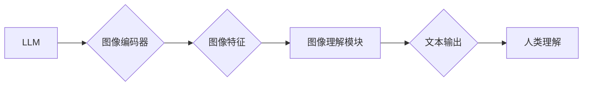

                 

## LLM与传统图像处理技术的融合：视觉智能新时代

> 关键词：大型语言模型（LLM）、图像处理、视觉智能、跨模态学习、深度学习、计算机视觉

## 1. 背景介绍

近年来，人工智能（AI）领域取得了令人瞩目的进展，其中大型语言模型（LLM）和传统图像处理技术分别在自然语言处理和计算机视觉领域展现出强大的能力。LLM能够理解和生成人类语言，而传统图像处理技术则擅长识别、分类和分析图像信息。然而，这两个领域长期以来相对独立，各自发展。随着跨模态学习技术的兴起，LLM与传统图像处理技术的融合成为一个新的研究热点，为构建更智能、更全面的视觉智能系统提供了新的可能性。

传统图像处理技术主要依赖于手工设计的特征提取方法和规则化算法，在处理复杂场景和理解图像语义方面存在局限性。而LLM的出现，凭借其强大的语义理解和文本生成能力，为图像处理带来了新的思路。通过将图像信息转换为文本表示，LLM可以利用其丰富的语言知识进行图像理解和分析，从而提升图像处理的准确性和智能化程度。

## 2. 核心概念与联系

### 2.1 核心概念

* **大型语言模型（LLM）：** 训练于海量文本数据，能够理解和生成人类语言的深度学习模型。例如GPT-3、BERT、LaMDA等。
* **传统图像处理技术：** 利用数学算法和图像处理技巧对图像进行分析、识别和处理的领域。例如边缘检测、图像分割、目标检测等。
* **跨模态学习：** 训练模型能够理解和处理多种模态数据（如文本、图像、音频等）的学习方法。

### 2.2 架构关系



**图 1：LLM与传统图像处理技术的融合架构**

该架构将LLM与传统图像处理技术结合起来，利用LLM的语义理解能力和传统图像处理技术的图像分析能力，实现更智能的图像理解和处理。

## 3. 核心算法原理 & 具体操作步骤

### 3.1 算法原理概述

LLM与传统图像处理技术的融合主要基于以下核心算法原理：

* **图像编码：** 将图像转换为文本表示，以便LLM能够理解。常用的方法包括：
    * **视觉语言模型（VLMs）：** 训练模型能够将图像和文本映射到同一个嵌入空间，从而实现图像和文本的联合表示。
    * **图像描述生成：** 利用LLM生成图像的文本描述，将图像信息转换为文本形式。
* **图像理解：** 利用LLM的语义理解能力对图像进行分析和理解。例如：
    * **图像分类：** 根据图像内容进行分类。
    * **目标检测：** 在图像中识别和定位目标。
    * **图像问答：** 回答关于图像的问题。
* **文本输出：** 将图像理解的结果转换为文本输出，方便人类理解。

### 3.2 算法步骤详解

1. **图像预处理：** 对图像进行尺寸调整、色彩规范化等预处理操作，以提高模型的输入质量。
2. **图像编码：** 使用视觉语言模型或图像描述生成模型将图像转换为文本表示。
3. **文本输入LLM：** 将生成的文本输入到预训练的LLM模型中。
4. **图像理解：** 利用LLM的语义理解能力对文本进行分析，提取图像的关键信息。
5. **文本输出：** 将图像理解的结果转换为文本输出，例如图像分类结果、目标检测结果或图像描述。

### 3.3 算法优缺点

**优点：**

* **提升图像理解能力：** 利用LLM的语义理解能力，可以更准确地理解图像内容。
* **跨模态学习：** 可以将图像信息与其他模态数据（如文本、音频）结合起来，实现更全面的智能分析。
* **自动化图像分析：** 可以自动生成图像描述、回答图像问题，提高图像分析的效率。

**缺点：**

* **计算资源消耗：** 训练和使用LLM模型需要大量的计算资源。
* **数据依赖性：** LLM模型的性能依赖于训练数据的质量和数量。
* **可解释性问题：** LLM模型的决策过程相对复杂，难以解释其推理逻辑。

### 3.4 算法应用领域

* **医疗图像分析：** 辅助医生诊断疾病、分析病理图像。
* **自动驾驶：** 识别道路场景、交通标志、行人等，提高自动驾驶系统的安全性。
* **机器人视觉：** 帮助机器人理解周围环境、进行目标识别和导航。
* **内容创作：** 自动生成图像描述、图像 captions，辅助内容创作。

## 4. 数学模型和公式 & 详细讲解 & 举例说明

### 4.1 数学模型构建

在LLM与传统图像处理技术的融合中，常用的数学模型包括：

* **视觉语言嵌入模型（VLMs）：** 将图像和文本映射到同一个嵌入空间，通过学习图像和文本之间的关系来实现跨模态理解。

* **图像描述生成模型：** 利用Transformer网络结构，将图像特征编码为文本序列，生成图像描述。

### 4.2 公式推导过程

VLMs通常使用以下公式进行训练：

$$
\mathcal{L} = -\sum_{i=1}^{N} \log p(t_i | i)
$$

其中：

* $\mathcal{L}$ 是损失函数。
* $N$ 是图像文本对的数量。
* $t_i$ 是图像 $i$ 的真实文本标签。
* $p(t_i | i)$ 是模型预测的图像 $i$ 的文本标签概率。

### 4.3 案例分析与讲解

例如，使用VLMs模型训练一个图像分类任务，可以将图像和对应的类别标签作为输入，训练模型学习图像和类别之间的关系。在测试阶段，将新的图像输入到模型中，模型会输出图像属于各个类别的概率分布，从而实现图像分类。

## 5. 项目实践：代码实例和详细解释说明

### 5.1 开发环境搭建

* Python 3.7+
* PyTorch 或 TensorFlow
* CUDA 和 cuDNN

### 5.2 源代码详细实现

```python
# 使用预训练的VLMs模型进行图像分类
from transformers import ViTFeatureExtractor, ViTForImageClassification

# 加载预训练模型和特征提取器
feature_extractor = ViTFeatureExtractor.from_pretrained("google/vit-base-patch16-224")
model = ViTForImageClassification.from_pretrained("google/vit-base-patch16-224")

# 预处理图像
image = feature_extractor(images=..., return_tensors="pt")

# 进行图像分类
outputs = model(**image)
logits = outputs.logits

# 获取分类结果
predicted_class_id = logits.argmax().item()
```

### 5.3 代码解读与分析

* 该代码示例使用HuggingFace Transformers库加载预训练的ViT模型进行图像分类。
* ViT模型是一种基于Transformer网络结构的视觉语言模型，能够将图像转换为文本表示，并进行分类。
* 代码首先加载预训练的模型和特征提取器，然后对图像进行预处理，并将预处理后的图像输入到模型中进行分类。
* 最后，代码获取模型预测的分类结果。

### 5.4 运行结果展示

运行该代码后，会输出图像属于各个类别的概率分布，并选择概率最高的类别作为最终分类结果。

## 6. 实际应用场景

### 6.1 医疗图像分析

LLM与传统图像处理技术的融合可以帮助医生更准确地诊断疾病。例如，可以利用LLM分析医学影像，识别肿瘤、骨折等异常情况，并生成详细的报告，辅助医生做出诊断。

### 6.2 自动驾驶

自动驾驶系统需要识别道路场景、交通标志、行人等信息，LLM可以帮助自动驾驶系统更好地理解图像信息，提高驾驶安全性。例如，可以利用LLM识别交通信号灯的颜色和状态，判断行人是否在过马路，从而做出更安全的驾驶决策。

### 6.3 机器人视觉

机器人视觉系统需要识别目标、导航、避障等，LLM可以帮助机器人更好地理解周围环境，提高其自主性。例如，可以利用LLM识别物体类别、位置和姿态，帮助机器人抓取和搬运物体。

### 6.4 未来应用展望

LLM与传统图像处理技术的融合还存在着巨大的潜力，未来可以应用于更多领域，例如：

* **智能家居：** 利用LLM分析家庭场景图像，实现智能家居设备的自动化控制。
* **教育培训：** 利用LLM分析学生作业图像，提供个性化的学习建议。
* **艺术创作：** 利用LLM生成图像描述，辅助艺术家创作艺术作品。

## 7. 工具和资源推荐

### 7.1 学习资源推荐

* **论文：**
    * [An Image is Worth 16x16 Words: Transformers for Image Recognition at Scale](https://arxiv.org/abs/2010.11929)
    * [DALL-E 2: Hierarchical Text-Conditional Image Generation with CLIP Latents](https://arxiv.org/abs/2102.12092)
* **书籍：**
    * Deep Learning with Python
    * Hands-On Machine Learning with Scikit-Learn, Keras & TensorFlow

### 7.2 开发工具推荐

* **HuggingFace Transformers:** https://huggingface.co/docs/transformers/index
* **PyTorch:** https://pytorch.org/
* **TensorFlow:** https://www.tensorflow.org/

### 7.3 相关论文推荐

* **Vision Transformer (ViT):** https://arxiv.org/abs/2010.11929
* **CLIP:** https://arxiv.org/abs/2103.00020
* **DALL-E 2:** https://arxiv.org/abs/2102.12092

## 8. 总结：未来发展趋势与挑战

### 8.1 研究成果总结

LLM与传统图像处理技术的融合取得了显著的成果，在图像分类、目标检测、图像描述生成等领域取得了突破性进展。

### 8.2 未来发展趋势

* **模型规模和性能提升：** 随着计算资源的不断发展，LLM模型的规模和性能将进一步提升，能够处理更复杂、更精细的图像信息。
* **跨模态学习的深入研究：** 将图像信息与其他模态数据（如文本、音频、视频）结合起来，实现更全面的智能分析。
* **可解释性研究：** 研究LLM模型的决策过程，提高模型的可解释性和透明度。

### 8.3 面临的挑战

* **数据获取和标注：** 训练高质量的LLM模型需要海量图像数据和文本数据，数据获取和标注成本较高。
* **计算资源消耗：** 训练和使用LLM模型需要大量的计算资源，成本较高。
* **伦理和安全问题：** LLM模型的应用可能带来伦理和安全问题，例如数据隐私泄露、算法偏见等，需要引起重视。

### 8.4 研究展望

未来，LLM与传统图像处理技术的融合将继续推动视觉智能的发展，为我们带来更多智能应用。


## 9. 附录：常见问题与解答

**Q1：LLM与传统图像处理技术的融合有哪些优势？**

**A1：** 

* 提升图像理解能力：利用LLM的语义理解能力，可以更准确地理解图像内容。
* 跨模态学习：可以将图像信息与其他模态数据（如文本、音频）结合起来，实现更全面的智能分析。
* 自动化图像分析：可以自动生成图像描述、回答图像问题，提高图像分析的效率。

**Q2：LLM与传统图像处理技术的融合有哪些挑战？**

**A2：**

* 数据获取和标注：训练高质量的LLM模型需要海量图像数据和文本数据，数据获取和标注成本较高。
* 计算资源消耗：训练和使用LLM模型需要大量的计算资源，成本较高。
* 伦理和安全问题：LLM模型的应用可能带来伦理和安全问题，例如数据隐私泄露、算法偏见等，需要引起重视。


作者：禅与计算机程序设计艺术 / Zen and the Art of Computer Programming 
<end_of_turn>

