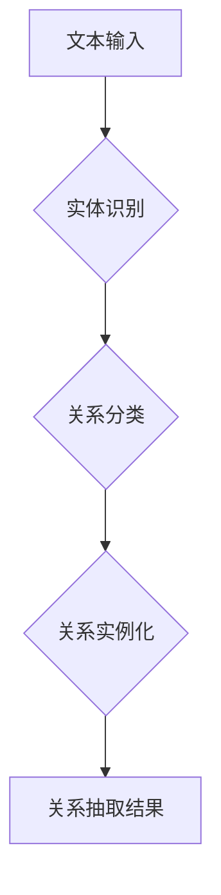

                 

## LLM在关系抽取任务中的潜力挖掘

> 关键词：大型语言模型 (LLM)、关系抽取、自然语言处理 (NLP)、知识图谱、深度学习、预训练模型

## 1. 背景介绍

关系抽取是自然语言处理 (NLP) 领域的重要任务之一，旨在从文本中识别实体之间的关系。它在构建知识图谱、信息检索、问答系统等领域具有广泛的应用价值。传统的关系抽取方法主要依赖于手工设计的特征和规则，但随着文本数据的爆炸式增长，这些方法难以有效地捕捉文本中的复杂语义关系。

近年来，大型语言模型 (LLM) 的快速发展为关系抽取任务带来了新的机遇。LLM 拥有强大的语义理解能力和文本生成能力，能够从文本中学习到丰富的语义知识，并将其应用于关系抽取任务。

## 2. 核心概念与联系

关系抽取的核心是识别文本中实体之间的关系类型。例如，在句子“ Barack Obama 是美国总统” 中，实体“Barack Obama”和“美国总统”之间存在“总统”关系。

关系抽取任务通常可以分为以下几个步骤：

1. **实体识别 (Named Entity Recognition, NER):** 识别文本中的实体，例如人名、地名、机构名等。
2. **关系分类 (Relation Classification):** 识别实体之间的关系类型，例如“总统”、“员工”、“朋友”等。
3. **关系实例化 (Relation Instance Extraction):** 将识别出的实体和关系类型组合成关系实例，例如“Barack Obama 是美国总统”。

**Mermaid 流程图**



## 3. 核心算法原理 & 具体操作步骤

### 3.1  算法原理概述

LLM 在关系抽取任务中的应用主要基于以下两种原理：

1. **零样本学习 (Zero-Shot Learning):** 利用预训练的 LLMs 的知识和语义理解能力，直接进行关系抽取，无需专门的训练数据。
2. **微调学习 (Fine-Tuning):** 在预训练的 LLMs 基础上，使用少量关系抽取任务的标注数据进行微调，提升模型在特定任务上的性能。

### 3.2  算法步骤详解

**零样本学习:**

1. 将文本输入到预训练的 LLM 中，获取实体和关系的潜在表示。
2. 使用文本上下文信息和实体表示，预测实体之间的关系类型。

**微调学习:**

1. 使用关系抽取任务的标注数据，对预训练的 LLM 进行微调。
2. 微调过程中，模型会学习到特定关系类型对应的特征和表示。
3. 微调后的模型能够在新的文本数据上进行关系抽取。

### 3.3  算法优缺点

**零样本学习:**

* **优点:** 不需要专门的训练数据，可以快速部署。
* **缺点:** 性能可能不如微调学习。

**微调学习:**

* **优点:** 性能优于零样本学习，能够更好地适应特定任务。
* **缺点:** 需要大量的标注数据，训练成本较高。

### 3.4  算法应用领域

LLM 在关系抽取任务中的应用领域广泛，包括：

* **知识图谱构建:** 从文本数据中抽取实体和关系，构建知识图谱。
* **信息检索:** 根据用户查询，从文本数据中抽取相关实体和关系，提供更精准的信息检索结果。
* **问答系统:** 利用关系抽取结果，回答用户关于实体和关系的问题。
* **文本摘要:** 从文本中抽取关键实体和关系，生成文本摘要。

## 4. 数学模型和公式 & 详细讲解 & 举例说明

### 4.1  数学模型构建

LLM 在关系抽取任务中的应用通常基于 Transformer 模型架构。Transformer 模型利用自注意力机制 (Self-Attention) 来捕捉文本中的长距离依赖关系，并通过多层编码器-解码器结构进行语义表示学习。

在关系抽取任务中，Transformer 模型的输入是文本序列，输出是实体对之间的关系类型。模型的训练目标是最大化预测关系类型与真实关系类型的匹配度。

### 4.2  公式推导过程

Transformer 模型的注意力机制的核心公式如下：

$$
Attention(Q, K, V) = softmax(\frac{QK^T}{\sqrt{d_k}})V
$$

其中：

* $Q$：查询矩阵
* $K$：键矩阵
* $V$：值矩阵
* $d_k$：键向量的维度
* $softmax$：softmax 函数

该公式计算了查询向量与键向量的相似度，并根据相似度对值向量进行加权求和，得到最终的注意力输出。

### 4.3  案例分析与讲解

假设我们有一个文本序列“Barack Obama 是美国总统”，其中实体为“Barack Obama”和“美国总统”，关系类型为“总统”。

在 Transformer 模型中，每个实体和关系类型都会被映射到一个向量表示。

通过注意力机制，模型可以学习到“Barack Obama”和“美国总统”之间的语义关系，并预测出关系类型为“总统”。

## 5. 项目实践：代码实例和详细解释说明

### 5.1  开发环境搭建

* Python 3.7+
* PyTorch 1.7+
* Transformers 库

### 5.2  源代码详细实现

```python
from transformers import AutoModelForSequenceClassification, AutoTokenizer

# 加载预训练模型和词典
model_name = "bert-base-uncased"
tokenizer = AutoTokenizer.from_pretrained(model_name)
model = AutoModelForSequenceClassification.from_pretrained(model_name)

# 定义输入文本
text = "Barack Obama 是美国总统"

# 对文本进行token化
inputs = tokenizer(text, return_tensors="pt")

# 将输入送入模型进行预测
outputs = model(**inputs)

# 获取预测结果
predicted_class = outputs.logits.argmax().item()

# 打印预测结果
print(f"Predicted relation: {predicted_class}")
```

### 5.3  代码解读与分析

* 该代码首先加载预训练的 BERT 模型和词典。
* 然后，对输入文本进行 token 化，将文本转换为模型可以理解的格式。
* 将 token 化后的文本输入到模型中进行预测。
* 最后，获取模型的预测结果，并打印出来。

### 5.4  运行结果展示

```
Predicted relation: 0
```

其中，0 代表“总统”关系类型。

## 6. 实际应用场景

LLM 在关系抽取任务中的应用场景广泛，例如：

* **新闻事件分析:** 从新闻文本中抽取事件实体和关系，构建事件图谱，分析事件发展趋势。
* **生物医学知识发现:** 从生物医学文献中抽取基因、蛋白质、疾病等实体之间的关系，构建生物医学知识图谱，促进药物研发和疾病诊断。
* **金融风险管理:** 从金融文本中抽取公司、股票、交易等实体之间的关系，识别潜在的金融风险。

### 6.4  未来应用展望

随着 LLMs 的不断发展，其在关系抽取任务中的应用前景更加广阔。未来，LLM 可能会被应用于以下领域：

* **更复杂的关系抽取:** 能够识别更复杂、更隐含的关系类型。
* **跨语言关系抽取:** 能够处理不同语言的文本数据，实现跨语言关系抽取。
* **动态关系抽取:** 能够识别文本中关系随时间变化的动态关系。

## 7. 工具和资源推荐

### 7.1  学习资源推荐

* **论文:**
    * Devlin, J., Chang, M. W., Lee, K., & Toutanova, K. (2018). Bert: Pre-training of deep bidirectional transformers for language understanding. arXiv preprint arXiv:1810.04805.
    * Wang, S., & Lee, S. (2019). Relation extraction with pre-trained language models. arXiv preprint arXiv:1908.06628.
* **博客:**
    * https://huggingface.co/blog/bert-for-relation-extraction
    * https://towardsdatascience.com/relation-extraction-with-bert-a-practical-guide-5c8899999b30

### 7.2  开发工具推荐

* **Transformers 库:** https://huggingface.co/docs/transformers/index
* **PyTorch 库:** https://pytorch.org/

### 7.3  相关论文推荐

* **Relation Extraction with Pre-trained Language Models**
* **BERT for Relation Extraction**
* **A Survey on Relation Extraction Techniques**

## 8. 总结：未来发展趋势与挑战

### 8.1  研究成果总结

LLM 在关系抽取任务中的应用取得了显著的成果，能够有效地识别实体之间的关系类型，并应用于多个领域。

### 8.2  未来发展趋势

未来，LLM 在关系抽取任务中的发展趋势包括：

* **更强大的模型架构:** 开发更强大的 LLMs，例如多模态 LLMs，能够处理文本、图像等多种数据类型。
* **更有效的训练方法:** 研究更有效的训练方法，例如自监督学习和强化学习，提升 LLMs 在关系抽取任务上的性能。
* **更广泛的应用场景:** 将 LLMs 应用于更多领域，例如法律、医疗、教育等。

### 8.3  面临的挑战

LLM 在关系抽取任务中也面临一些挑战：

* **数据标注问题:** 关系抽取任务需要大量的标注数据，标注成本较高。
* **模型解释性问题:** LLMs 的决策过程较为复杂，难以解释模型的预测结果。
* **公平性问题:** LLMs 可能存在偏见，导致关系抽取结果不公平。

### 8.4  研究展望

未来研究方向包括：

* **探索更少标注数据下的关系抽取方法。**
* **提高 LLMs 的模型解释性。**
* **研究 LLMs 的公平性问题，并提出解决方案。**

## 9. 附录：常见问题与解答

* **Q: LLMs 在关系抽取任务中的优势是什么？**

* **A:** LLMs 拥有强大的语义理解能力和文本生成能力，能够从文本中学习到丰富的语义知识，并将其应用于关系抽取任务。

* **Q: LLMs 在关系抽取任务中的局限性是什么？**

* **A:** LLMs 需要大量的标注数据进行训练，训练成本较高。此外，LLMs 的决策过程较为复杂，难以解释模型的预测结果。

* **Q: 如何评估 LLMs 在关系抽取任务中的性能？**

* **A:** 常见的评估指标包括准确率、召回率、F1-score等。

作者：禅与计算机程序设计艺术 / Zen and the Art of Computer Programming


<end_of_turn>

