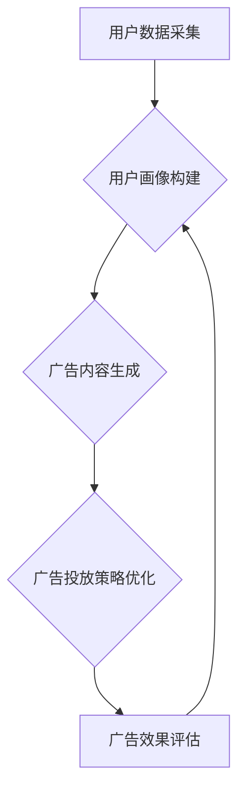

                 

## LLM在智能个性化广告投放中的应用前景

> 关键词：LLM, 个性化广告, 广告投放, 深度学习, 自然语言处理, 用户画像, 预估模型, 算法优化

## 1. 背景介绍

广告投放一直是互联网商业模式的核心，其目标是将广告精准地展示给目标用户，从而提高广告转化率和商业价值。传统的广告投放方式往往依赖于用户基本信息和行为数据，例如年龄、性别、兴趣爱好等，但这些信息往往过于粗糙，无法满足用户个性化需求。随着深度学习和自然语言处理技术的快速发展，大型语言模型（LLM）的出现为智能个性化广告投放带来了新的机遇。

LLM 拥有强大的文本理解和生成能力，能够从海量文本数据中学习用户兴趣、偏好和需求，并生成个性化的广告内容，从而实现更精准的广告投放。

## 2. 核心概念与联系

### 2.1  个性化广告

个性化广告是指根据用户的个人特征、行为模式和兴趣爱好，定制化的广告内容和投放策略。其核心目标是提高广告的吸引力和转化率，提升用户体验。

### 2.2  广告投放

广告投放是指将广告信息发布到合适的平台和渠道，并针对目标用户进行展示和传播的过程。其目标是将广告信息有效地传递给目标用户，并引导用户进行相应的行为，例如点击、购买等。

### 2.3  LLM

大型语言模型（LLM）是一种基于深度学习的强大人工智能模型，能够理解和生成人类语言。它通过训练海量文本数据，学习语言的语法、语义和上下文关系，从而具备强大的文本理解、生成、翻译、问答等能力。

### 2.4  核心架构

LLM在智能个性化广告投放中的应用，主要涉及以下几个核心环节：



**用户数据采集:** 从各种渠道收集用户数据，包括但不限于用户行为数据、浏览记录、社交媒体信息、购买历史等。

**用户画像构建:** 利用 LLM 对用户数据进行分析和处理，构建用户画像，包括用户的兴趣爱好、消费习惯、价值观等。

**广告内容生成:** 根据用户画像，LLM 可以生成个性化的广告文案、图片、视频等内容，以吸引用户的注意力。

**广告投放策略优化:** LLM 可以根据用户的行为特征和广告效果数据，优化广告投放策略，例如选择合适的广告平台、时间段和投放频率等。

**广告效果评估:**  评估广告的点击率、转化率等指标，并反馈给系统，用于优化后续的广告投放策略。

## 3. 核心算法原理 & 具体操作步骤

### 3.1  算法原理概述

LLM 在智能个性化广告投放中的应用主要基于以下核心算法：

* **自然语言处理 (NLP):** 用于分析和理解用户文本数据，例如评论、搜索词、社交媒体帖子等，提取用户兴趣、偏好和需求。
* **深度学习 (DL):** 用于构建用户画像模型，预测用户的行为和偏好，并优化广告投放策略。
* **推荐系统:** 用于根据用户的兴趣和行为，推荐相关的广告内容。

### 3.2  算法步骤详解

1. **数据收集和预处理:** 收集用户数据，包括文本数据、行为数据、画像数据等，并进行清洗、格式化和转换等预处理操作。
2. **用户画像构建:** 利用 NLP 算法对文本数据进行分析，提取用户特征，并结合其他数据构建用户画像。
3. **广告内容生成:** 根据用户画像，利用 LLM 生成个性化的广告文案、图片、视频等内容。
4. **广告投放策略优化:** 利用 DL 算法优化广告投放策略，例如选择合适的广告平台、时间段和投放频率等。
5. **广告效果评估:** 评估广告的点击率、转化率等指标，并反馈给系统，用于优化后续的广告投放策略。

### 3.3  算法优缺点

**优点:**

* **个性化程度高:** LLM 可以根据用户的个性化需求生成个性化的广告内容，提高广告的吸引力和转化率。
* **精准度高:** LLM 可以从海量数据中学习用户特征，实现更精准的广告投放。
* **自动化程度高:** LLM 可以自动生成广告内容和优化投放策略，降低人工成本。

**缺点:**

* **数据依赖性强:** LLM 的性能依赖于训练数据的质量和数量。
* **计算资源消耗大:** LLM 的训练和推理过程需要大量的计算资源。
* **伦理风险:** LLM 可能被用于生成虚假信息或进行恶意广告投放，需要加强伦理监管。

### 3.4  算法应用领域

LLM 在智能个性化广告投放领域的应用前景广阔，可以应用于以下领域：

* **电商广告:** 根据用户的购物历史、浏览记录和兴趣爱好，推荐相关的商品广告。
* **社交媒体广告:** 根据用户的社交关系、兴趣爱好和行为模式，推荐相关的品牌广告和活动信息。
* **内容平台广告:** 根据用户的阅读习惯、观看记录和兴趣爱好，推荐相关的视频、文章和音频广告。
* **金融广告:** 根据用户的金融需求和风险偏好，推荐相关的金融产品和服务广告。

## 4. 数学模型和公式 & 详细讲解 & 举例说明

### 4.1  数学模型构建

在智能个性化广告投放中，常用的数学模型包括：

* **用户画像模型:** 用于构建用户的兴趣、偏好和行为特征的数学模型，例如基于因子分解的协同过滤模型、深度神经网络模型等。
* **广告效果预测模型:** 用于预测广告的点击率、转化率等指标的数学模型，例如逻辑回归模型、支持向量机模型、深度学习模型等。

### 4.2  公式推导过程

**用户画像模型:**

假设用户 $u$ 的兴趣向量为 $p_u$，广告 $a$ 的特征向量为 $q_a$，则用户 $u$ 对广告 $a$ 的兴趣评分可以表示为：

$$score(u, a) = p_u \cdot q_a$$

其中，$\cdot$ 表示向量的点积运算。

**广告效果预测模型:**

假设广告 $a$ 的点击率为 $CTR(a)$，则可以使用逻辑回归模型来预测广告 $a$ 的点击率：

$$CTR(a) = \frac{1}{1 + exp(-(w_0 + w_1 * f_1(a) + w_2 * f_2(a) + ... + w_n * f_n(a)))}$$

其中，$w_0, w_1, w_2, ..., w_n$ 是模型参数，$f_1(a), f_2(a), ..., f_n(a)$ 是广告 $a$ 的特征函数。

### 4.3  案例分析与讲解

**案例:**

假设一个电商平台想要推荐商品广告给用户。

**用户画像模型:**

平台可以收集用户的购物历史、浏览记录、评价等数据，并利用因子分解的协同过滤模型构建用户的兴趣向量。

**广告效果预测模型:**

平台可以收集商品的特征信息，例如价格、类别、品牌等，并利用逻辑回归模型预测商品广告的点击率。

**个性化广告投放:**

平台可以根据用户的兴趣向量和商品广告的点击率预测值，推荐最符合用户需求的商品广告。

## 5. 项目实践：代码实例和详细解释说明

### 5.1  开发环境搭建

* **操作系统:** Linux/macOS/Windows
* **编程语言:** Python
* **深度学习框架:** TensorFlow/PyTorch
* **自然语言处理库:** NLTK/spaCy
* **数据存储:** MySQL/MongoDB

### 5.2  源代码详细实现

```python
# 用户画像构建
from sklearn.decomposition import NMF

# 用户行为数据
user_behavior_data = ...

# 构建用户兴趣向量
n_components = 10
model = NMF(n_components=n_components)
user_embeddings = model.fit_transform(user_behavior_data)

# 广告内容生成
from transformers import GPT2LMHeadModel, GPT2Tokenizer

# 预训练模型和词典
model_name = "gpt2"
tokenizer = GPT2Tokenizer.from_pretrained(model_name)
model = GPT2LMHeadModel.from_pretrained(model_name)

# 根据用户兴趣向量生成广告文案
user_interest = user_embeddings[0]
prompt = f"根据用户兴趣向量 {user_interest}, 生成一个吸引人的广告文案。"
input_ids = tokenizer.encode(prompt, return_tensors="pt")
output = model.generate(input_ids, max_length=50)
generated_text = tokenizer.decode(output[0], skip_special_tokens=True)

# 广告投放策略优化
from sklearn.linear_model import LogisticRegression

# 广告特征数据
ad_feature_data = ...

# 训练广告效果预测模型
model = LogisticRegression()
model.fit(ad_feature_data, target_variable)

# 根据模型预测值优化广告投放策略
predicted_ctr = model.predict_proba(new_ad_feature_data)[:, 1]
```

### 5.3  代码解读与分析

* **用户画像构建:** 利用 NMF 模型对用户行为数据进行降维，构建用户兴趣向量。
* **广告内容生成:** 利用预训练的 GPT-2 模型，根据用户兴趣向量生成个性化的广告文案。
* **广告投放策略优化:** 利用逻辑回归模型预测广告效果，并根据预测值优化广告投放策略。

### 5.4  运行结果展示

运行上述代码后，可以生成个性化的广告文案，并根据预测值优化广告投放策略。

## 6. 实际应用场景

### 6.1  电商平台

电商平台可以利用 LLM 生成个性化的商品推荐广告，提高用户转化率。例如，根据用户的购物历史和浏览记录，推荐相关的商品广告，并根据用户的兴趣爱好和价格偏好，生成个性化的广告文案。

### 6.2  社交媒体平台

社交媒体平台可以利用 LLM 生成个性化的品牌广告和活动信息，提高用户参与度。例如，根据用户的社交关系和兴趣爱好，推荐相关的品牌广告和活动信息，并根据用户的语言风格和喜好，生成个性化的广告文案。

### 6.3  内容平台

内容平台可以利用 LLM 生成个性化的视频、文章和音频广告，提高用户观看和阅读时长。例如，根据用户的阅读习惯和观看记录，推荐相关的视频、文章和音频广告，并根据用户的兴趣爱好和知识水平，生成个性化的广告文案。

### 6.4  未来应用展望

LLM 在智能个性化广告投放领域的应用前景广阔，未来可能应用于以下领域：

* **更精准的广告投放:** 利用更先进的深度学习算法和自然语言处理技术，实现更精准的广告投放，提高广告效果。
* **更个性化的广告内容:** 利用 LLM 生成更个性化的广告内容，例如视频、音频、图片等，提高用户体验。
* **更智能的广告交互:** 利用 LLM 实现更智能的广告交互，例如与用户进行对话、回答用户问题等，提高用户参与度。

## 7. 工具和资源推荐

### 7.1  学习资源推荐

* **书籍:**
    * Deep Learning by Ian Goodfellow, Yoshua Bengio, and Aaron Courville
    * Natural Language Processing with Python by Steven Bird, Ewan Klein, and Edward Loper
* **在线课程:**
    * Stanford CS224N: Natural Language Processing with Deep Learning
    * DeepLearning.AI TensorFlow Specialization

### 7.2  开发工具推荐

* **深度学习框架:** TensorFlow, PyTorch
* **自然语言处理库:** NLTK, spaCy
* **数据存储:** MySQL, MongoDB

### 7.3  相关论文推荐

* **BERT: Pre-training of Deep Bidirectional Transformers for Language Understanding**
* **GPT-3: Language Models are Few-Shot Learners**
* **Attention Is All You Need**

## 8. 总结：未来发展趋势与挑战

### 8.1  研究成果总结

LLM 在智能个性化广告投放领域取得了显著的成果，例如：

* **提高广告精准度:** LLM 可以根据用户的个性化需求生成个性化的广告内容，提高广告的精准度。
* **提升广告转化率:** LLM 可以优化广告投放策略，提高广告的转化率。
* **增强用户体验:** LLM 可以生成更吸引人的广告内容，增强用户的广告体验。

### 8.2  未来发展趋势

LLM 在智能个性化广告投放领域的未来发展趋势包括：

* **更强大的模型:** 开发更强大的 LLMs，例如多模态 LLMs，能够理解和生成多种类型的媒体内容。
* **更精准的个性化:** 利用更先进的算法和数据分析技术，实现更精准的个性化广告投放。
* **更智能的交互:** 利用 LLM 实现更智能的广告交互，例如与用户进行对话、回答用户问题等。

### 8.3  面临的挑战

LLM 在智能个性化广告投放领域也面临一些挑战：

* **数据隐私:** LLM 的训练和应用需要大量用户数据，如何保护用户数据隐私是一个重要的挑战。
* **算法公平性:** LLM 可能存在算法偏见，导致广告投放不公平，需要加强算法公平性研究。
* **伦理风险:** LLM 可能被用于生成虚假信息或进行恶意广告投放，需要加强伦理监管。

### 8.4  研究展望

未来，LLM 在智能个性化广告投放领域的应用将更加广泛和深入，需要进一步加强模型研究、算法优化、数据安全和伦理监管等方面的研究，以推动 LLM 在广告领域的健康发展。

## 9. 附录：常见问题与解答

**Q1: LLM 如何生成个性化的广告文案？**

A1: LLM 可以根据用户的兴趣向量和广告目标，利用预训练的语言模型生成个性化的广告文案。

**Q2: LLM 如何优化广告投放策略？**

A2: LLM 可以利用广告特征数据和用户行为数据，训练广告效果预测模型，并根据模型预测值优化广告投放策略。

**Q3: LLM 在广告投放中存在哪些伦理风险？**

A3: LLM 可能被用于生成虚假信息或进行恶意广告投放，需要加强伦理监管。

**作者：禅与计算机程序设计艺术 / Zen and the Art of Computer Programming**<end_of_turn>

