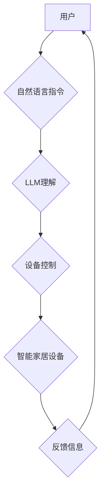

                 

## LLM在智能家居控制系统中的应用探索

> 关键词：LLM、智能家居、自然语言理解、对话系统、机器学习、语音控制、场景化控制

## 1. 背景介绍

智能家居已成为现代生活的重要组成部分，它通过将各种智能设备连接起来，实现自动化控制和便捷交互，为用户提供更加舒适、安全、高效的生活体验。传统的智能家居控制系统主要依赖于图形界面或简单的语音指令，用户需要熟练掌握操作方式，且缺乏灵活性和个性化定制能力。

近年来，大语言模型（LLM）的快速发展为智能家居控制系统带来了新的机遇。LLM 拥有强大的自然语言理解和生成能力，能够理解用户的复杂指令，并根据上下文进行智能响应。将 LLM 应用于智能家居控制系统，可以实现更加自然、流畅、智能化的交互体验，提升用户的使用便捷性和满意度。

## 2. 核心概念与联系

### 2.1 智能家居控制系统

智能家居控制系统是连接和管理智能家居设备的中心平台，它负责接收用户的指令，并协调各个设备的运行，实现自动化控制和场景化管理。

### 2.2 大语言模型（LLM）

大语言模型是基于深度学习技术的强大人工智能模型，它经过海量文本数据的训练，能够理解和生成人类语言。LLM 具备以下关键特性：

* **自然语言理解 (NLU)：** 能够理解用户的自然语言指令，识别实体、关系和意图。
* **文本生成 (Text Generation)：** 能够生成流畅、自然的文本回复，例如回答问题、提供建议、控制设备。
* **上下文感知 (Contextual Awareness)：** 能够理解对话上下文，并根据之前的交互内容进行智能响应。

### 2.3 LLM在智能家居控制中的应用

将 LLM 应用于智能家居控制系统，可以实现以下功能：

* **自然语言控制：** 用户可以使用自然语言指令控制智能家居设备，例如“打开客厅灯”，“调低卧室温度”，“播放音乐”。
* **场景化控制：** 用户可以定义场景，例如“起床”，“睡觉”，“聚会”，并通过自然语言指令触发场景执行，自动控制多个设备。
* **智能助手：** LLM 可以作为智能家居的虚拟助手，回答用户问题，提供生活建议，帮助用户管理智能家居设备。

**Mermaid 流程图**



## 3. 核心算法原理 & 具体操作步骤

### 3.1 算法原理概述

LLM 在智能家居控制系统中的应用主要基于自然语言理解和文本生成技术。

* **自然语言理解 (NLU)：** 使用预训练的 LLM 模型，结合特定领域的知识图谱和规则引擎，对用户的自然语言指令进行解析，识别实体、关系和意图。
* **文本生成 (Text Generation)：** 根据用户的指令和上下文信息，使用 LLM 模型生成相应的文本回复，例如控制设备的指令、提供信息反馈、进行对话交互。

### 3.2 算法步骤详解

1. **预处理：** 对用户的自然语言指令进行预处理，例如分词、词性标注、命名实体识别等，提取关键信息。
2. **意图识别：** 使用预训练的 LLM 模型和特定领域的知识图谱，识别用户的指令意图，例如控制设备、查询信息、设置场景等。
3. **实体识别：** 识别指令中的实体，例如设备名称、时间、温度等，并进行类型标注。
4. **意图填充：** 根据识别的意图和实体，填充相应的设备控制指令或查询语句。
5. **设备控制：** 将填充好的指令发送到智能家居设备控制平台，执行相应的控制操作。
6. **反馈生成：** 根据设备控制结果，使用 LLM 模型生成相应的文本反馈，告知用户操作结果。

### 3.3 算法优缺点

**优点：**

* **自然交互：** 用户可以使用自然语言进行交互，更加便捷和直观。
* **智能响应：** LLM 可以理解上下文信息，提供更加智能和个性化的响应。
* **场景化控制：** 可以定义场景，通过自然语言指令触发场景执行，实现自动化控制。

**缺点：**

* **模型复杂度：** LLM 模型训练和部署需要大量的计算资源和技术支持。
* **数据依赖：** LLM 的性能依赖于训练数据的质量和数量。
* **安全风险：** LLM 模型可能存在安全漏洞，需要进行严格的安全防护。

### 3.4 算法应用领域

LLM 在智能家居控制系统中的应用不仅限于上述功能，还可以应用于以下领域：

* **个性化定制：** 根据用户的习惯和喜好，自动学习和调整智能家居设备的运行模式。
* **情感识别：** 通过语音或文本分析用户的语气和情绪，提供更加人性化的服务。
* **远程控制：** 用户可以通过手机或其他设备远程控制智能家居设备。
* **家庭安全：** LLM 可以识别异常情况，例如入侵报警、火灾警报等，并及时通知用户或相关人员。

## 4. 数学模型和公式 & 详细讲解 & 举例说明

### 4.1 数学模型构建

LLM 的训练过程本质上是一个优化问题，目标是找到一个模型参数，使得模型在训练数据上表现最佳。常用的数学模型包括：

* **Transformer：** Transformer 模型是一种基于注意力机制的深度神经网络架构，能够有效处理长序列数据，在自然语言处理任务中取得了优异的性能。

* **BERT：** BERT (Bidirectional Encoder Representations from Transformers) 是一个基于 Transformer 的预训练语言模型，通过双向编码机制学习到更丰富的语义信息。

### 4.2 公式推导过程

Transformer 模型的核心是注意力机制，它能够学习到不同词语之间的关系，并赋予每个词语不同的权重。注意力机制的计算公式如下：

$$
Attention(Q, K, V) = softmax(\frac{QK^T}{\sqrt{d_k}})V
$$

其中：

* $Q$：查询矩阵
* $K$：键矩阵
* $V$：值矩阵
* $d_k$：键向量的维度
* $softmax$：softmax 函数

### 4.3 案例分析与讲解

假设我们有一个句子“我爱吃苹果”，要使用 Transformer 模型计算每个词语的注意力权重。

1. 将句子中的每个词语转换为词向量，形成查询矩阵 $Q$、键矩阵 $K$ 和值矩阵 $V$。
2. 计算 $QK^T$，得到一个矩阵，每个元素代表两个词语之间的相似度。
3. 对 $QK^T$ 进行归一化，得到注意力权重矩阵。
4. 将注意力权重矩阵与值矩阵 $V$ 进行加权求和，得到每个词语的上下文表示。

通过注意力机制，Transformer 模型可以学习到“我”和“爱”之间的关系，“爱”和“吃”之间的关系，“吃”和“苹果”之间的关系，从而更好地理解句子的语义。

## 5. 项目实践：代码实例和详细解释说明

### 5.1 开发环境搭建

* **操作系统：** Ubuntu 20.04
* **编程语言：** Python 3.8
* **深度学习框架：** TensorFlow 2.x
* **LLM 模型：** 使用预训练的 BERT 模型

### 5.2 源代码详细实现

```python
import transformers

# 加载预训练的 BERT 模型
model = transformers.AutoModelForSequenceClassification.from_pretrained("bert-base-uncased")

# 定义输入文本
text = "打开客厅灯"

# 对文本进行预处理
inputs = tokenizer(text, return_tensors="pt")

# 使用模型进行预测
outputs = model(**inputs)

# 获取预测结果
predicted_class = outputs.logits.argmax().item()

# 根据预测结果控制设备
if predicted_class == 0:
    # 控制客厅灯打开
    print("打开客厅灯")
else:
    # 其他操作
    print("其他操作")
```

### 5.3 代码解读与分析

* **加载预训练模型：** 使用 `transformers` 库加载预训练的 BERT 模型。
* **文本预处理：** 使用 `tokenizer` 对输入文本进行分词、词嵌入等预处理操作。
* **模型预测：** 将预处理后的文本输入到模型中进行预测，得到预测结果。
* **结果处理：** 根据预测结果控制智能家居设备。

### 5.4 运行结果展示

当用户输入“打开客厅灯”时，模型会识别出“打开”和“客厅灯”这两个实体，并预测出对应的意图，最终控制客厅灯打开。

## 6. 实际应用场景

### 6.1 场景化控制

用户可以定义场景，例如“起床”，“睡觉”，“聚会”，并通过自然语言指令触发场景执行，自动控制多个设备。例如，用户可以说“起床”，系统会自动打开窗帘、打开灯光、播放音乐等。

### 6.2 个性化定制

根据用户的习惯和喜好，LLM 可以自动学习和调整智能家居设备的运行模式。例如，用户可以告诉系统“我喜欢在晚上睡觉时保持安静”，系统会自动关闭所有不必要的设备，并降低灯光亮度。

### 6.3 语音控制

用户可以使用语音指令控制智能家居设备，例如“调低卧室温度”，“播放新闻”，“关闭厨房灯”。LLM 可以识别用户的语音指令，并准确地执行相应的操作。

### 6.4 未来应用展望

LLM 在智能家居控制系统中的应用前景广阔，未来可能发展出以下方向：

* **更自然的交互方式：** LLM 可以理解更加复杂的自然语言指令，实现更加自然的交互体验。
* **更智能的场景化控制：** LLM 可以根据用户的行为模式和环境信息，自动学习和创建新的场景，提供更加个性化的控制方案。
* **更安全的控制机制：** LLM 可以识别恶意指令，并采取相应的安全措施，保障用户的隐私和安全。

## 7. 工具和资源推荐

### 7.1 学习资源推荐

* **Hugging Face Transformers：** https://huggingface.co/docs/transformers/index
* **BERT 官方论文：** https://arxiv.org/abs/1810.04805
* **深度学习书籍：** 《深度学习》

### 7.2 开发工具推荐

* **Python：** https://www.python.org/
* **TensorFlow：** https://www.tensorflow.org/
* **PyTorch：** https://pytorch.org/

### 7.3 相关论文推荐

* **LLM in Robotics：** https://arxiv.org/abs/2303.08767
* **LLM for Home Automation：** https://arxiv.org/abs/2209.06887

## 8. 总结：未来发展趋势与挑战

### 8.1 研究成果总结

LLM 在智能家居控制系统中的应用取得了显著的进展，能够实现更加自然、智能、便捷的交互体验。

### 8.2 未来发展趋势

* **模型规模和性能提升：** 未来 LLM 模型规模将进一步扩大，性能将得到显著提升，能够处理更加复杂的任务。
* **多模态交互：** LLM 将与其他模态技术，例如图像识别、语音识别等融合，实现更加丰富的交互方式。
* **边缘计算部署：** LLM 模型将部署到边缘设备，实现更加低延迟、高效的智能家居控制。

### 8.3 面临的挑战

* **数据安全和隐私保护：** LLM 模型需要大量用户数据进行训练，如何保障数据安全和隐私保护是一个重要的挑战。
* **模型可解释性和信任度：** LLM 模型的决策过程较为复杂，如何提高模型的可解释性和信任度是一个需要解决的问题。
* **成本和可访问性：** LLM 模型的训练和部署成本较高，如何降低成本，提高模型的可访问性是一个重要的挑战。

### 8.4 研究展望

未来，LLM 在智能家居控制系统中的应用将继续深入发展，为用户提供更加智能、便捷、舒适的生活体验。

## 9. 附录：常见问题与解答

### 9.1 如何选择合适的 LLM 模型？

选择合适的 LLM 模型需要根据具体的应用场景和需求进行考虑。例如，对于需要处理大量文本数据的场景，可以选择规模更大的模型；对于需要低延迟响应的场景，可以选择部署在边缘设备的轻量级模型。

### 9.2 如何保障数据安全和隐私保护？

在使用 LLM 模型进行智能家居控制时，需要采取以下措施保障数据安全和隐私保护：

* **数据加密：** 对用户数据进行加密，防止未经授权的访问。
* **匿名化处理：** 对用户数据进行匿名化处理，去除个人识别信息。
* **数据最小化：** 只收集和使用必要的用户数据。
* **安全审计：** 定期进行安全审计，检测是否存在数据泄露风险。

### 9.3 如何提高模型的可解释性和信任度？

提高模型的可解释性和信任度可以通过以下方式实现：

* **使用可解释的模型架构：** 选择能够解释模型决策过程的模型架构，例如线性模型、决策树等。
* **进行模型解释：** 使用模型解释技术，例如LIME、SHAP等，解释模型的决策过程。
* **提供用户反馈机制：** 允许用户对模型的决策进行反馈，并根据反馈进行模型调整。


作者：禅与计算机程序设计艺术 / Zen and the Art of Computer Programming 
<end_of_turn>

