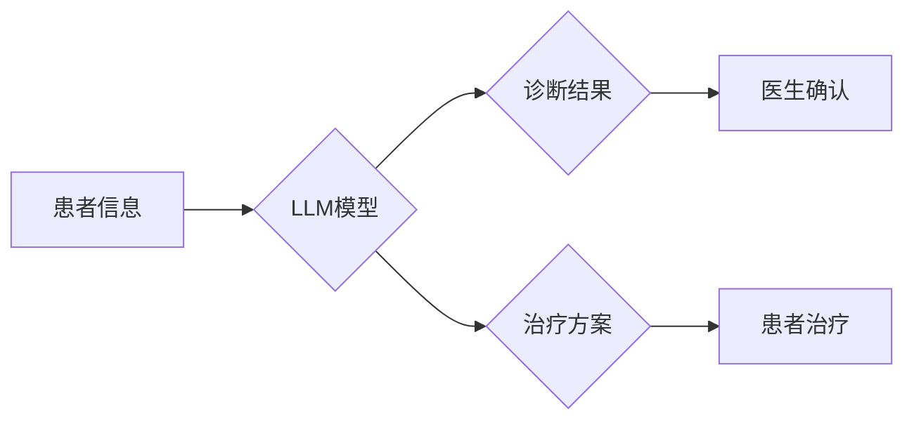

                 

## LLM的医疗革新：AI辅助诊断与治疗

> 关键词：LLM, 大语言模型, 医疗诊断, 治疗方案, AI辅助, 自然语言处理, 医疗图像分析, 知识图谱

## 1. 背景介绍

医疗领域正处于一场由人工智能（AI）驱动的变革之中。大语言模型（LLM）作为AI领域最前沿的技术之一，凭借其强大的文本理解和生成能力，正在迅速改变医疗诊断、治疗方案制定、药物研发等多个领域。

传统医疗诊断主要依赖于医生的经验和专业知识，而LLM能够通过学习海量医疗数据，识别疾病的潜在模式和症状，辅助医生做出更准确的诊断。在治疗方案制定方面，LLM可以分析患者的病史、基因信息和最新的医学研究，为医生提供个性化的治疗建议。此外，LLM还可以加速药物研发，通过分析药物的化学结构和生物活性，预测其潜在的疗效和副作用。

## 2. 核心概念与联系

### 2.1  LLM概述

LLM是一种基于深度学习的强大人工智能模型，能够理解和生成人类语言。它们通过训练在海量文本数据上，学习语言的语法、语义和上下文关系。

### 2.2  LLM在医疗领域的应用

LLM在医疗领域的应用主要集中在以下几个方面：

* **辅助诊断:** LLM可以分析患者的病历、症状描述和医学影像，识别潜在的疾病风险，辅助医生做出更准确的诊断。
* **个性化治疗:** LLM可以分析患者的基因信息、病史和生活方式，为医生提供个性化的治疗方案建议。
* **药物研发:** LLM可以分析药物的化学结构和生物活性，预测其潜在的疗效和副作用，加速药物研发过程。
* **医疗知识管理:** LLM可以帮助整理和分析海量医疗文献，为医生提供最新的医学知识和研究成果。

**Mermaid 流程图**



## 3. 核心算法原理 & 具体操作步骤

### 3.1  算法原理概述

LLM的核心算法是**Transformer**，它是一种基于注意力机制的深度神经网络架构。Transformer能够有效地捕捉文本序列中的长距离依赖关系，从而实现更准确的文本理解和生成。

### 3.2  算法步骤详解

1. **词嵌入:** 将输入的文本序列中的每个单词转换为一个低维向量，称为词嵌入。
2. **多头注意力:** 使用多个注意力头来捕捉文本序列中不同单词之间的关系，并生成一个加权表示。
3. **前馈神经网络:** 对每个单词的加权表示进行处理，提取更深层的语义信息。
4. **堆叠层:** 将多头注意力和前馈神经网络层堆叠在一起，形成一个深度网络结构。
5. **输出层:** 将网络的输出转换为预测结果，例如疾病诊断、治疗方案建议等。

### 3.3  算法优缺点

**优点:**

* 能够捕捉长距离依赖关系，实现更准确的文本理解。
* 训练效率高，能够处理海量文本数据。
* 可迁移性强，可以应用于多种自然语言处理任务。

**缺点:**

* 计算资源需求高，训练和推理都需要强大的计算能力。
* 对训练数据质量要求高，训练数据不充分或质量低劣会导致模型性能下降。
* 缺乏可解释性，难以理解模型的决策过程。

### 3.4  算法应用领域

Transformer算法广泛应用于自然语言处理领域，例如机器翻译、文本摘要、问答系统、对话系统等。在医疗领域，Transformer算法可以用于辅助诊断、个性化治疗、药物研发等。

## 4. 数学模型和公式 & 详细讲解 & 举例说明

### 4.1  数学模型构建

LLM的数学模型主要基于**概率论**和**统计学**。模型的目标是学习一个概率分布，该分布能够描述输入文本序列的下一个单词出现的概率。

### 4.2  公式推导过程

LLM的训练过程使用**最大似然估计**方法，即通过最大化模型预测的文本序列概率来优化模型参数。

假设输入文本序列为 $x = (x_1, x_2, ..., x_T)$，其中 $x_i$ 表示序列中第 $i$ 个单词。模型的目标是学习一个概率分布 $p(x)$，该分布能够描述整个序列的概率。

最大似然估计的目标函数为：

$$
\mathcal{L} = \prod_{t=1}^{T} p(x_t | x_{<t})
$$

其中，$x_{<t}$ 表示序列中第 $t$ 个单词之前的单词。

### 4.3  案例分析与讲解

例如，假设输入文本序列为 "The cat sat on the mat"，模型需要预测每个单词的下一个单词。

对于 "The"，模型需要预测下一个单词可能是 "cat"、"dog"、"house" 等。模型会根据训练数据中 "The" 出现的上下文，以及每个单词出现的概率，计算出每个单词出现的概率。

最终，模型会选择概率最高的单词作为预测结果。

## 5. 项目实践：代码实例和详细解释说明

### 5.1  开发环境搭建

LLM的开发环境通常需要强大的计算资源，例如GPU。常用的开发框架包括 TensorFlow、PyTorch 等。

### 5.2  源代码详细实现

LLM的源代码实现非常复杂，涉及大量的数学公式和编程代码。这里只提供一个简单的示例代码，用于演示LLM的基本原理。

```python
import tensorflow as tf

# 定义一个简单的Transformer模型
class SimpleTransformer(tf.keras.Model):
    def __init__(self, vocab_size, embedding_dim, num_heads):
        super(SimpleTransformer, self).__init__()
        self.embedding = tf.keras.layers.Embedding(vocab_size, embedding_dim)
        self.multi_head_attention = tf.keras.layers.MultiHeadAttention(num_heads=num_heads, key_dim=embedding_dim)
        self.feed_forward_network = tf.keras.layers.Dense(embedding_dim * 4, activation="relu")

    def call(self, inputs):
        # 词嵌入
        embeddings = self.embedding(inputs)
        # 多头注意力
        attention_output = self.multi_head_attention(embeddings, embeddings, embeddings)
        # 前馈神经网络
        output = self.feed_forward_network(attention_output)
        return output

# 实例化模型
model = SimpleTransformer(vocab_size=10000, embedding_dim=128, num_heads=8)

# 训练模型
model.compile(optimizer="adam", loss="sparse_categorical_crossentropy", metrics=["accuracy"])
model.fit(x_train, y_train, epochs=10)
```

### 5.3  代码解读与分析

这段代码定义了一个简单的Transformer模型，并演示了模型的训练过程。

* `SimpleTransformer` 类定义了模型的结构，包括词嵌入层、多头注意力层和前馈神经网络层。
* `call` 方法定义了模型的输入和输出关系。
* `model.compile` 方法配置了模型的训练参数，包括优化器、损失函数和评价指标。
* `model.fit` 方法训练了模型，使用训练数据 `x_train` 和 `y_train`。

### 5.4  运行结果展示

训练完成后，模型可以用于预测新的文本序列。

## 6. 实际应用场景

### 6.1  辅助诊断

LLM可以分析患者的病历、症状描述和医学影像，识别潜在的疾病风险，辅助医生做出更准确的诊断。例如，LLM可以帮助医生识别肺癌、糖尿病、心脏病等疾病的早期症状。

### 6.2  个性化治疗

LLM可以分析患者的基因信息、病史和生活方式，为医生提供个性化的治疗方案建议。例如，LLM可以帮助医生根据患者的基因信息，选择最有效的药物和治疗方案。

### 6.3  药物研发

LLM可以分析药物的化学结构和生物活性，预测其潜在的疗效和副作用，加速药物研发过程。例如，LLM可以帮助科学家筛选出具有治疗潜力的药物候选物。

### 6.4  未来应用展望

LLM在医疗领域的应用前景广阔，未来可能在以下方面得到进一步发展：

* **更精准的诊断:** LLM可以结合更多类型的医疗数据，例如基因信息、血液检查结果等，实现更精准的疾病诊断。
* **更个性化的治疗:** LLM可以根据患者的个体差异，提供更个性化的治疗方案，提高治疗效果。
* **更快的药物研发:** LLM可以加速药物研发过程，帮助科学家更快地开发出新的治疗药物。
* **虚拟医疗助手:** LLM可以作为虚拟医疗助手，为患者提供远程医疗服务，例如在线问诊、预约挂号等。

## 7. 工具和资源推荐

### 7.1  学习资源推荐

* **书籍:**
    * "Deep Learning" by Ian Goodfellow, Yoshua Bengio, and Aaron Courville
    * "Natural Language Processing with Python" by Steven Bird, Ewan Klein, and Edward Loper
* **在线课程:**
    * Coursera: "Deep Learning Specialization" by Andrew Ng
    * Udacity: "Deep Learning Nanodegree"
* **博客和网站:**
    * The Gradient: https://thegradient.pub/
    * Towards Data Science: https://towardsdatascience.com/

### 7.2  开发工具推荐

* **TensorFlow:** https://www.tensorflow.org/
* **PyTorch:** https://pytorch.org/
* **Hugging Face Transformers:** https://huggingface.co/transformers/

### 7.3  相关论文推荐

* "Attention Is All You Need" by Vaswani et al. (2017)
* "BERT: Pre-training of Deep Bidirectional Transformers for Language Understanding" by Devlin et al. (2018)
* "GPT-3: Language Models are Few-Shot Learners" by Brown et al. (2020)

## 8. 总结：未来发展趋势与挑战

### 8.1  研究成果总结

LLM在医疗领域的应用取得了显著的进展，例如辅助诊断、个性化治疗、药物研发等方面都展现出了巨大的潜力。

### 8.2  未来发展趋势

未来，LLM在医疗领域的应用将朝着以下方向发展：

* **更强大的模型:** 研究人员将继续开发更强大的LLM模型，例如参数规模更大、性能更优的模型。
* **更广泛的应用场景:** LLM将应用于更多类型的医疗任务，例如手术机器人辅助、医疗影像分析等。
* **更强的可解释性:** 研究人员将致力于提高LLM的可解释性，帮助医生更好地理解模型的决策过程。

### 8.3  面临的挑战

LLM在医疗领域的应用也面临着一些挑战：

* **数据隐私和安全:** 医疗数据非常敏感，需要采取有效的措施保护患者隐私和数据安全。
* **模型可靠性和安全性:** LLM模型的决策结果需要经过严格的验证和测试，确保其可靠性和安全性。
* **伦理问题:** LLM的应用可能会引发一些伦理问题，例如算法偏见、医疗决策的责任归属等。

### 8.4  研究展望

未来，LLM在医疗领域的应用将继续发展，为人类健康带来更多福祉。

## 9. 附录：常见问题与解答

### 9.1  LLM模型训练需要多少数据？

LLM模型的训练数据量通常非常大，通常需要数百万甚至数十亿个文本样本。

### 9.2  LLM模型的训练时间有多长？

LLM模型的训练时间取决于模型规模、数据量和计算资源等因素，通常需要数天甚至数周的时间。

### 9.3  LLM模型的应用场景有哪些？

LLM模型的应用场景非常广泛，例如自然语言处理、计算机视觉、语音识别等。

### 9.4  LLM模型的未来发展趋势是什么？

LLM模型的未来发展趋势是模型规模更大、性能更强、应用场景更广泛。

作者：禅与计算机程序设计艺术 / Zen and the Art of Computer Programming 


<end_of_turn>

