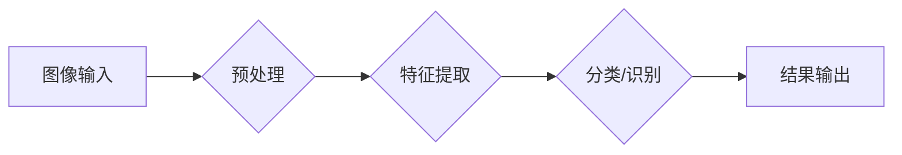

                 

## OpenCV 计算机视觉：人脸识别和物体检测

> 关键词：OpenCV, 计算机视觉, 人脸识别, 物体检测, 深度学习, 图像处理, 机器学习

## 1. 背景介绍

计算机视觉作为人工智能领域的重要分支，致力于赋予计算机“看”的能力，使其能够理解和解释图像和视频信息。OpenCV（Open Source Computer Vision Library）是一个开源的计算机视觉库，提供了广泛的图像和视频处理算法，为开发者提供了强大的工具，助力他们在人脸识别、物体检测等领域进行创新。

近年来，深度学习的兴起极大地推动了计算机视觉的发展。卷积神经网络（CNN）凭借其强大的特征提取能力，在人脸识别和物体检测等任务中取得了突破性的进展。OpenCV也紧跟时代步伐，集成了一些流行的深度学习模型，使得开发者能够更方便地利用深度学习技术进行计算机视觉应用开发。

## 2. 核心概念与联系

**2.1 人脸识别**

人脸识别是指通过分析图像或视频中的人脸特征，将其与数据库中的已知人脸进行匹配，从而识别出该人的身份。

**2.2 物体检测**

物体检测是指在图像或视频中识别出特定物体的类别和位置。

**2.3 OpenCV 与 深度学习的结合**

OpenCV 提供了丰富的图像处理和计算机视觉算法，而深度学习模型则能够学习更复杂的特征，提高识别精度。两者结合，可以构建更强大的计算机视觉应用。

**2.4 流程图**



## 3. 核心算法原理 & 具体操作步骤

### 3.1  算法原理概述

人脸识别和物体检测的核心算法原理主要基于深度学习，特别是卷积神经网络（CNN）。CNN 通过多个卷积层和池化层，学习图像的特征，并将其映射到一个特征向量空间。然后，通过全连接层将特征向量分类或识别。

### 3.2  算法步骤详解

**3.2.1 数据预处理**

* 调整图像大小和格式
* 数据增强（旋转、翻转、缩放等）
* 归一化像素值

**3.2.2 特征提取**

* 使用预训练的 CNN 模型提取图像特征
* 也可以使用自定义的 CNN 模型进行训练

**3.2.3 分类/识别**

* 使用支持向量机（SVM）、随机森林等分类器对提取的特征进行分类
* 或者使用回归算法预测物体的边界框

**3.2.4 后处理**

* 非极大值抑制（NMS）去除冗余检测结果
* 绘制边界框和标签

### 3.3  算法优缺点

**优点:**

* 高识别精度
* 可处理复杂场景
* 可进行实时检测

**缺点:**

* 需要大量训练数据
* 计算量大，需要强大的硬件支持
* 对数据分布变化敏感

### 3.4  算法应用领域

* 人脸识别门禁系统
* 人脸验证支付系统
* 视频监控和安防
* 自动驾驶汽车
* 物体识别和跟踪

## 4. 数学模型和公式 & 详细讲解 & 举例说明

### 4.1  数学模型构建

人脸识别和物体检测的数学模型主要基于深度学习，其核心是卷积神经网络（CNN）。CNN 通过多个卷积层和池化层，学习图像的特征，并将其映射到一个特征向量空间。

**4.1.1 卷积层**

卷积层使用卷积核（filter）对图像进行卷积运算，提取图像的局部特征。卷积核是一个小的矩阵，其元素代表着对图像像素的加权系数。卷积运算的结果是一个特征图，其中每个像素值代表着该区域的特征响应。

**4.1.2 池化层**

池化层对特征图进行降维操作，减少计算量并提高模型的鲁棒性。常用的池化方法有最大池化和平均池化。

**4.1.3 全连接层**

全连接层将特征向量映射到一个分类或识别结果空间。全连接层中的每个神经元都与前一层的所有神经元连接。

### 4.2  公式推导过程

**4.2.1 卷积运算公式**

$$
f(x,y) = \sum_{i=0}^{m-1} \sum_{j=0}^{n-1} w(i,j) \cdot I(x+i,y+j)
$$

其中：

* $f(x,y)$ 是卷积核输出的像素值
* $w(i,j)$ 是卷积核的元素值
* $I(x+i,y+j)$ 是输入图像的像素值
* $m$ 和 $n$ 是卷积核的大小

**4.2.2 最大池化公式**

$$
P(x,y) = \max_{i=0}^{k-1} \max_{j=0}^{l-1} I(x \cdot s + i, y \cdot s + j)
$$

其中：

* $P(x,y)$ 是池化层的输出像素值
* $I(x \cdot s + i, y \cdot s + j)$ 是输入特征图的像素值
* $s$ 是池化窗口的大小
* $k$ 和 $l$ 是池化窗口的大小

### 4.3  案例分析与讲解

**4.3.1 人脸识别案例**

使用预训练的 FaceNet 模型进行人脸识别。FaceNet 将人脸图像映射到一个嵌入空间，其中相似的脸会被映射到相近的点。通过计算两个嵌入向量的余弦相似度，可以判断两个脸是否相似。

**4.3.2 物体检测案例**

使用 YOLOv5 模型进行物体检测。YOLOv5 将图像划分为多个网格，每个网格负责检测该区域内的物体。模型会预测每个网格内的物体类别和边界框。

## 5. 项目实践：代码实例和详细解释说明

### 5.1  开发环境搭建

* 安装 Python 3.x
* 安装 OpenCV 库：`pip install opencv-python`
* 安装深度学习框架（如 TensorFlow 或 PyTorch）

### 5.2  源代码详细实现

```python
import cv2

# 加载预训练的人脸识别模型
face_cascade = cv2.CascadeClassifier(cv2.data.haarcascades + 'haarcascade_frontalface_default.xml')

# 读取图像
image = cv2.imread('image.jpg')

# 将图像转换为灰度图像
gray = cv2.cvtColor(image, cv2.COLOR_BGR2GRAY)

# 检测人脸
faces = face_cascade.detectMultiScale(gray, 1.1, 4)

# 绘制人脸边界框
for (x, y, w, h) in faces:
    cv2.rectangle(image, (x, y), (x+w, y+h), (0, 255, 0), 2)

# 显示图像
cv2.imshow('Faces detected', image)
cv2.waitKey(0)
cv2.destroyAllWindows()
```

### 5.3  代码解读与分析

* 使用 `cv2.CascadeClassifier` 加载预训练的人脸识别模型。
* 使用 `cv2.cvtColor` 将彩色图像转换为灰度图像。
* 使用 `face_cascade.detectMultiScale` 检测图像中的人脸。
* 使用 `cv2.rectangle` 绘制人脸边界框。
* 使用 `cv2.imshow` 显示图像。

### 5.4  运行结果展示

运行代码后，将显示一张带有人脸边界框的图像。

## 6. 实际应用场景

### 6.1 人脸识别门禁系统

使用人脸识别技术实现门禁控制，通过识别用户的身份，控制门锁的开关。

### 6.2 人脸验证支付系统

使用人脸识别技术验证用户的身份，进行支付操作。

### 6.3 视频监控和安防

使用人脸识别技术对视频监控画面进行分析，识别可疑人员，提高安防效率。

### 6.4 自动驾驶汽车

使用物体检测技术识别道路上的车辆、行人、交通信号灯等物体，辅助自动驾驶汽车进行决策。

### 6.5 未来应用展望

随着深度学习技术的不断发展，人脸识别和物体检测技术将更加成熟，应用场景也将更加广泛。例如，在医疗领域，可以用于病人的身份识别和疾病诊断；在教育领域，可以用于学生的身份识别和学习行为分析；在零售领域，可以用于顾客行为分析和个性化推荐。

## 7. 工具和资源推荐

### 7.1  学习资源推荐

* OpenCV 官方文档：https://docs.opencv.org/
* 深度学习框架官方文档：TensorFlow：https://www.tensorflow.org/，PyTorch：https://pytorch.org/
* 计算机视觉课程：Coursera、edX 等平台

### 7.2  开发工具推荐

* Python 3.x
* Jupyter Notebook
* Visual Studio Code

### 7.3  相关论文推荐

* FaceNet: A Unified Embedding for Face Recognition and Clustering
* You Only Look Once: Unified, Real-Time Object Detection

## 8. 总结：未来发展趋势与挑战

### 8.1  研究成果总结

近年来，人脸识别和物体检测技术取得了显著进展，其识别精度和速度不断提高。深度学习技术的应用极大地推动了这一发展。

### 8.2  未来发展趋势

* **更准确、更鲁棒的算法:** 研究更先进的深度学习算法，提高识别精度和鲁棒性，能够应对更复杂的环境和场景。
* **更轻量级的模型:** 研究更轻量级的模型，降低计算量，能够在移动设备上进行实时检测。
* **更隐私安全的应用:** 研究更隐私安全的算法和技术，保护用户的个人信息安全。

### 8.3  面临的挑战

* **数据标注问题:** 深度学习模型需要大量标注数据进行训练，数据标注成本高，效率低。
* **模型解释性问题:** 深度学习模型的决策过程难以解释，缺乏透明度，难以获得用户的信任。
* **公平性问题:** 深度学习模型可能存在偏见，导致识别结果不公平。

### 8.4  研究展望

未来，人脸识别和物体检测技术将继续发展，应用场景将更加广泛。需要加强算法研究，解决数据标注、模型解释性和公平性等问题，推动技术向更安全、更可靠、更公平的方向发展。

## 9. 附录：常见问题与解答

**9.1  如何选择合适的深度学习模型？**

选择合适的深度学习模型需要根据具体应用场景和需求进行考虑。例如，对于人脸识别任务，FaceNet、ArcFace 等模型效果较好；对于物体检测任务，YOLOv5、Faster R-CNN 等模型较为流行。

**9.2  如何解决数据标注问题？**

数据标注是深度学习模型训练的关键环节，需要大量标注数据。可以采用以下方法解决数据标注问题：

* 利用人工标注工具进行标注
* 使用自动标注工具进行辅助标注
* 探索数据合成技术，生成更多标注数据

**9.3  如何提高模型的鲁棒性？**

提高模型的鲁棒性可以采用以下方法：

* 使用数据增强技术，增加训练数据的多样性
* 使用正则化技术，防止模型过拟合
* 使用对抗训练技术，提高模型对对抗样本的抵抗能力


作者：禅与计算机程序设计艺术 / Zen and the Art of Computer Programming 
<end_of_turn>

