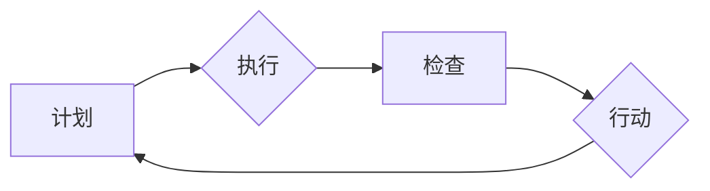

                 

## PDCA戴明环:持续改进的指南

> 关键词：PDCA, 戴明环, 持续改进, 流程优化, 质量管理, 软件开发, 项目管理

## 1. 背景介绍

在瞬息万变的科技时代，持续改进已成为企业和个人保持竞争力的关键。无论是软件开发、项目管理还是日常工作，高效的流程和不断优化的方法论至关重要。PDCA戴明环，作为一种经典的管理方法，为我们提供了持续改进的框架和指南。

PDCA戴明环，全称为Plan-Do-Check-Act，意为计划-执行-检查-行动。它是一种循环式改进方法，通过不断重复计划、执行、检查和行动的步骤，逐步提升工作效率和质量。

## 2. 核心概念与联系

PDCA戴明环的核心概念是循环迭代，通过四个阶段不断完善工作流程。

**2.1  计划 (Plan)**

计划阶段是整个循环的起点，需要明确目标、分析现状、制定计划和策略。

* **明确目标:**  首先要明确需要改进的目标是什么，以及期望达成的结果。
* **分析现状:**  深入了解当前工作流程的现状，包括优缺点、瓶颈和潜在问题。
* **制定计划:**  根据目标和现状分析，制定具体的改进计划，包括步骤、资源、时间安排等。

**2.2  执行 (Do)**

执行阶段是将计划付诸实践的阶段，需要按照计划执行改进措施，并收集相关数据。

* **实施计划:**  按照计划步骤，逐步执行改进措施。
* **数据收集:**  在执行过程中，收集相关数据，例如时间、成本、效率等，以便后续进行检查和分析。

**2.3  检查 (Check)**

检查阶段是评估改进效果的阶段，需要分析收集的数据，判断改进措施是否有效，并找出潜在问题。

* **数据分析:**  对收集的数据进行分析，评估改进措施的效果，并找出偏差或问题。
* **问题识别:**  识别出改进过程中遇到的问题和挑战，并分析其根源。

**2.4  行动 (Act)**

行动阶段是根据检查结果进行调整和优化，并将其纳入日常工作流程的阶段。

* **制定调整方案:**  根据检查结果，制定调整和优化方案，例如修改计划、改进措施等。
* **流程优化:**  将改进措施纳入日常工作流程，并持续监控和改进。

**2.5  流程图**



## 3. 核心算法原理 & 具体操作步骤

PDCA戴明环本身不是一个算法，而是一种管理方法。它提供了一个循环迭代的框架，帮助我们不断改进工作流程。

**3.1  算法原理概述**

PDCA戴明环的核心原理是基于持续改进的循环迭代。通过不断重复计划、执行、检查和行动的步骤，我们可以逐步发现问题、解决问题、优化流程，最终实现目标。

**3.2  算法步骤详解**

1. **计划阶段:** 明确目标、分析现状、制定计划和策略。
2. **执行阶段:** 按照计划执行改进措施，并收集相关数据。
3. **检查阶段:** 分析收集的数据，评估改进效果，并找出潜在问题。
4. **行动阶段:** 根据检查结果，制定调整和优化方案，并将其纳入日常工作流程。

**3.3  算法优缺点**

**优点:**

* 简单易懂，易于实施。
* 适用于各种领域和场景。
* 能够促进团队协作和沟通。
* 能够持续改进工作流程，提高效率和质量。

**缺点:**

* 需要持续投入时间和精力。
* 难以量化改进效果。
* 可能需要多次迭代才能达到预期效果。

**3.4  算法应用领域**

PDCA戴明环广泛应用于各个领域，例如：

* 软件开发
* 项目管理
* 质量管理
* 生产制造
* 服务业

## 4. 数学模型和公式 & 详细讲解 & 举例说明

PDCA戴明环本身没有固定的数学模型和公式，但我们可以使用一些数学工具来量化改进效果和分析数据。例如：

* **效率指标:** 可以使用时间、成本、产量等指标来衡量工作效率。
* **质量指标:** 可以使用缺陷率、客户满意度等指标来衡量工作质量。
* **统计分析:** 可以使用统计分析方法来分析数据，发现趋势和异常。

**4.1  数学模型构建**

我们可以根据具体情况构建数学模型来描述工作流程和改进效果。例如，我们可以构建一个线性回归模型来预测改进措施对效率的影响。

**4.2  公式推导过程**

线性回归模型的公式如下：

$$y = mx + c$$

其中：

* $y$ 是效率指标
* $x$ 是改进措施的投入
* $m$ 是回归系数，表示改进措施对效率的影响
* $c$ 是截距，表示在没有投入改进措施时的效率

**4.3  案例分析与讲解**

假设我们想通过改进软件开发流程来提高开发效率。我们可以收集开发时间、代码行数等数据，并构建一个线性回归模型来分析改进措施对效率的影响。

如果回归系数 $m$ 为正值，则表明改进措施对效率有正向影响。反之，如果 $m$ 为负值，则表明改进措施对效率有负向影响。

## 5. 项目实践：代码实例和详细解释说明

以下是一个使用Python语言实现PDCA戴明环的简单代码实例：

```python
class PDCA:
    def __init__(self, goal, current_state):
        self.goal = goal
        self.current_state = current_state
        self.plan = None
        self.data = []

    def plan(self, strategy):
        self.plan = strategy

    def do(self):
        # 执行计划
        # ...

    def check(self):
        # 收集数据
        # ...
        self.data.append(data)

    def act(self):
        # 分析数据，调整计划
        # ...

# 示例用法
pdca = PDCA("提高开发效率", "开发时间过长")
pdca.plan("优化代码结构")
pdca.do()
pdca.check()
pdca.act()
```

**5.1  开发环境搭建**

该代码示例可以使用任何支持Python语言的开发环境进行运行。

**5.2  源代码详细实现**

代码示例定义了一个PDCA类，包含四个方法：

* `__init__`: 初始化PDCA对象，设置目标和当前状态。
* `plan`: 设置改进计划。
* `do`: 执行改进计划。
* `check`: 收集数据并存储。
* `act`: 分析数据，调整计划。

**5.3  代码解读与分析**

代码示例展示了PDCA戴明环的基本流程，包括计划、执行、检查和行动。

**5.4  运行结果展示**

代码示例没有具体的运行结果展示，因为具体的运行结果取决于实际的改进计划和数据收集。

## 6. 实际应用场景

PDCA戴明环在软件开发、项目管理、质量管理等领域都有广泛的应用场景。

**6.1  软件开发**

在软件开发中，可以使用PDCA戴明环来改进开发流程，提高开发效率和软件质量。例如，可以针对代码质量、测试覆盖率、开发时间等指标进行改进。

**6.2  项目管理**

在项目管理中，可以使用PDCA戴明环来管理项目风险、优化项目进度和提高项目成功率。例如，可以针对项目计划、资源分配、进度跟踪等方面进行改进。

**6.3  质量管理**

在质量管理中，可以使用PDCA戴明环来识别和解决质量问题，提高产品质量和客户满意度。例如，可以针对产品缺陷率、客户投诉率、质量标准等方面进行改进。

**6.4  未来应用展望**

随着人工智能和自动化技术的不断发展，PDCA戴明环将有更多新的应用场景。例如，可以利用人工智能技术自动收集数据、分析数据和生成改进建议，从而提高PDCA戴明环的效率和准确性。

## 7. 工具和资源推荐

**7.1  学习资源推荐**

* 《质量管理的艺术》
* 《PDCA循环：持续改进的指南》
* 《戴明环：持续改进的实践指南》

**7.2  开发工具推荐**

* Jira
* Trello
* Asana

**7.3  相关论文推荐**

* "The Deming Cycle: A Framework for Continuous Improvement"
* "Applying the PDCA Cycle to Software Development"
* "The PDCA Cycle in Project Management"

## 8. 总结：未来发展趋势与挑战

PDCA戴明环是一种经典的管理方法，它为我们提供了持续改进的框架和指南。随着科技的进步和社会的发展，PDCA戴明环将继续演进，并应用于更多新的领域。

**8.1  研究成果总结**

PDCA戴明环已被广泛应用于各个领域，并取得了显著的成果。它帮助企业和个人提高效率、提升质量、降低成本，最终实现持续发展。

**8.2  未来发展趋势**

未来，PDCA戴明环将更加智能化、自动化和数据化。人工智能技术将被应用于数据分析、改进建议生成等环节，提高PDCA戴明环的效率和准确性。

**8.3  面临的挑战**

PDCA戴明环的实施需要克服一些挑战，例如：

* 需要持续投入时间和精力。
* 需要团队成员的积极参与和配合。
* 需要有效的沟通和协作机制。

**8.4  研究展望**

未来，研究者将继续探索PDCA戴明环的应用场景和改进方法，使其更加适应新的技术环境和社会需求。

## 9. 附录：常见问题与解答

**9.1  问题:** 如何才能有效地实施PDCA戴明环？

**解答:**

* 明确目标和现状分析。
* 制定详细的计划和策略。
* 确保团队成员的积极参与和配合。
* 持续收集数据，并进行分析和改进。

**9.2  问题:** PDCA戴明环的改进效果如何量化？

**解答:**

可以使用效率指标、质量指标等指标来量化改进效果。

**9.3  问题:** PDCA戴明环适用于哪些领域？

**解答:**

PDCA戴明环适用于各个领域，例如软件开发、项目管理、质量管理等。


作者：禅与计算机程序设计艺术 / Zen and the Art of Computer Programming 
<end_of_turn>

