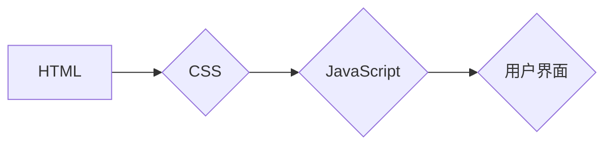

                 

## Web 前端开发：HTML、CSS 和 JavaScript

> 关键词：HTML, CSS, JavaScript, Web 前端, 网页开发, DOM, 响应式设计, 前端框架

## 1. 背景介绍

随着互联网的蓬勃发展，网页成为了信息传播和交流的重要载体。Web 前端开发作为构建用户界面和交互体验的核心技术，扮演着至关重要的角色。HTML、CSS 和 JavaScript 作为 Web 前端开发的三大核心语言，共同构成了网页的结构、样式和交互逻辑。

HTML (HyperText Markup Language) 负责网页的结构和内容组织，它使用标记语言定义网页元素，例如标题、段落、图像和链接等。CSS (Cascading Style Sheets) 则负责网页的样式和美观，它定义了网页元素的字体、颜色、布局和动画效果等。JavaScript (JS) 则赋予网页交互性和动态性，它可以处理用户事件、修改网页内容、实现动画效果和与服务器进行数据交互等。

掌握 HTML、CSS 和 JavaScript 对于任何想要从事 Web 前端开发的开发者来说都是必不可少的。本文将深入探讨这三大语言的原理、应用和最佳实践，帮助读者全面理解 Web 前端开发的核心知识。

## 2. 核心概念与联系

### 2.1  HTML

HTML 是用于构建网页结构的标记语言。它使用标签来定义网页元素，标签通常成对出现，例如 `<p>` 标签表示段落，`</p>` 标签表示段落结束。HTML 元素可以嵌套，形成层次结构，从而构建复杂的网页结构。

### 2.2  CSS

CSS 是用于定义网页样式的语言。它使用选择器来选择 HTML 元素，然后使用属性和值来指定元素的样式。CSS 可以定义元素的字体、颜色、背景、边框、布局等各种属性。

### 2.3  JavaScript

JavaScript 是用于添加交互性和动态性的编程语言。它可以处理用户事件，例如鼠标点击、键盘输入和页面加载等。JavaScript 可以修改 HTML 元素的内容和样式，实现动画效果，以及与服务器进行数据交互。

### 2.4  Mermaid 流程图



**图 1：HTML、CSS 和 JavaScript 的关系**

从图 1 可以看出，HTML 提供网页结构，CSS 定义网页样式，JavaScript 则赋予网页交互性和动态性，最终共同构建用户界面。

## 3. 核心算法原理 & 具体操作步骤

### 3.1  算法原理概述

Web 前端开发中涉及到许多算法，例如 DOM 操作、CSS 选择器匹配、事件处理等。这些算法的原理通常基于数据结构和算法设计思想，例如树形结构、图论、搜索算法等。

### 3.2  算法步骤详解

**3.2.1 DOM 操作**

DOM (Document Object Model) 是一个树形结构，它将 HTML 文档表示为一棵树，每个节点代表一个 HTML 元素。DOM 操作是指对这个树形结构进行操作，例如获取元素、修改元素属性、添加元素、删除元素等。

**步骤：**

1. 使用 JavaScript 的 `document` 对象获取 DOM 树根节点。
2. 使用选择器 API (例如 `getElementById`, `querySelector`, `querySelectorAll`) 选择目标元素。
3. 使用 DOM 操作方法 (例如 `textContent`, `setAttribute`, `appendChild`, `removeChild`) 对目标元素进行操作。

**3.2.2 CSS 选择器匹配**

CSS 选择器用于选择 HTML 元素，以便应用样式。选择器可以根据元素的标签名、类名、ID、属性值等进行匹配。

**步骤：**

1. CSS 选择器解析器将选择器表达式解析为一个抽象语法树。
2. 遍历 DOM 树，根据选择器表达式匹配元素。
3. 匹配到的元素将应用相应的 CSS 样式。

**3.2.3 事件处理**

事件处理是指在用户与网页交互时，JavaScript 代码根据用户事件执行相应的操作。

**步骤：**

1. 使用 `addEventListener` 方法将事件监听器绑定到目标元素上。
2. 当目标元素触发事件时，事件监听器会执行相应的回调函数。
3. 回调函数可以访问事件对象，获取事件相关信息，并执行相应的操作。

### 3.3  算法优缺点

**3.3.1 DOM 操作**

* **优点：** 灵活、强大，可以对网页元素进行各种操作。
* **缺点：** 操作 DOM 树可能会导致性能问题，尤其是在处理大量元素时。

**3.3.2 CSS 选择器匹配**

* **优点：** 简洁、易用，可以快速选择目标元素。
* **缺点：** 选择器表达式可能比较复杂，难以理解和维护。

**3.3.3 事件处理**

* **优点：** 响应用户交互，使网页更加交互式。
* **缺点：** 事件处理逻辑可能会比较复杂，需要仔细设计和调试。

### 3.4  算法应用领域

* **DOM 操作：** 动态更新网页内容、实现网页动画、处理用户交互等。
* **CSS 选择器匹配：** 样式化网页元素、实现网页布局、创建响应式设计等。
* **事件处理：** 响应用户点击、鼠标移动、键盘输入等事件，实现网页交互功能。

## 4. 数学模型和公式 & 详细讲解 & 举例说明

### 4.1  数学模型构建

Web 前端开发中涉及到许多数学模型，例如布局算法、动画效果计算等。这些模型通常基于几何学、代数和微积分等数学基础。

### 4.2  公式推导过程

**4.2.1 布局算法**

网页布局算法通常基于盒模型，将每个元素视为一个矩形盒子。盒模型包含内容区域、边框、内边距和外边距等部分。

**公式：**

* 元素宽度 = 内容宽度 + 边框宽度 + 内边距宽度 + 外边距宽度
* 元素高度 = 内容高度 + 边框高度 + 内边距高度 + 外边距高度

**4.2.2 动画效果计算**

网页动画效果通常使用数学函数来描述运动轨迹。例如，匀速运动可以使用线性函数，加速运动可以使用二次函数等。

**公式：**

* 匀速运动： $d = vt$
* 加速运动： $d = \frac{1}{2}at^2$

其中，$d$ 表示位移，$v$ 表示速度，$t$ 表示时间，$a$ 表示加速度。

### 4.3  案例分析与讲解

**4.3.1 布局算法案例**

使用 CSS 的 `display` 属性可以控制元素的布局方式。例如，`display: block` 表示元素占据整行，`display: inline` 表示元素与其他元素排列在一行。

**案例：**

```css
.container {
  display: flex;
}

.item {
  width: 200px;
  height: 100px;
  margin: 10px;
}
```

在这个案例中，`.container` 元素使用 `display: flex` 属性定义为一个 flex 布局容器，`.item` 元素则作为 flex 布局的子元素，每个子元素宽度为 200px，高度为 100px，之间有 10px 的间距。

**4.3.2 动画效果案例**

使用 CSS 的 `transition` 属性可以实现元素的动画效果。例如，`transition: all 1s ease` 表示所有属性的动画持续时间为 1 秒，动画效果为 ease。

**案例：**

```css
.box {
  width: 100px;
  height: 100px;
  background-color: red;
  transition: all 1s ease;
}

.box:hover {
  background-color: blue;
}
```

在这个案例中，`.box` 元素的背景颜色在鼠标悬停时会从红色变为蓝色，动画持续时间为 1 秒，动画效果为 ease。

## 5. 项目实践：代码实例和详细解释说明

### 5.1  开发环境搭建

Web 前端开发需要一个合适的开发环境，包括文本编辑器、浏览器和版本控制系统等。

* **文本编辑器：** VS Code, Sublime Text, Atom 等
* **浏览器：** Chrome, Firefox, Safari 等
* **版本控制系统：** Git

### 5.2  源代码详细实现

**5.2.1  简单的 HTML 页面**

```html
<!DOCTYPE html>
<html>
<head>
  <title>我的第一个网页</title>
</head>
<body>
  <h1>Hello, World!</h1>
  <p>这是一个简单的网页。</p>
</body>
</html>
```

**代码解释：**

* `<!DOCTYPE html>`: 声明文档类型为 HTML5。
* `<html>`: 根元素，包含整个网页内容。
* `<head>`: 包含网页元信息，例如标题、样式表等。
* `<title>`: 设置网页标题，显示在浏览器标签栏中。
* `<body>`: 包含网页可视内容。
* `<h1>`: 表示标题，级别为 1。
* `<p>`: 表示段落。

**5.2.2  添加 CSS 样式**

```css
body {
  font-family: sans-serif;
  margin: 0;
  padding: 20px;
}

h1 {
  color: blue;
  text-align: center;
}
```

**代码解释：**

* `body`: 选择 body 元素，设置字体、边距和内边距。
* `h1`: 选择 h1 元素，设置颜色和文本对齐方式。

**5.2.3  添加 JavaScript 交互**

```javascript
document.addEventListener('DOMContentLoaded', function() {
  const button = document.createElement('button');
  button.textContent = '点击我';
  document.body.appendChild(button);

  button.addEventListener('click', function() {
    alert('你好！');
  });
});
```

**代码解释：**

* `DOMContentLoaded`: 监听 DOM 树加载完成事件。
* `document.createElement('button')`: 创建一个按钮元素。
* `button.textContent = '点击我'`: 设置按钮文本内容。
* `document.body.appendChild(button)`: 将按钮添加到 body 元素中。
* `button.addEventListener('click', function() { ... })`: 监听按钮点击事件，执行相应的操作。

### 5.3  代码解读与分析

以上代码示例展示了 HTML、CSS 和 JavaScript 的基本用法。HTML 定义了网页结构，CSS 定义了网页样式，JavaScript 添加了交互功能。

### 5.4  运行结果展示

运行以上代码，将会打开一个网页，包含一个标题、一个段落和一个按钮。点击按钮将会弹出“你好！”的提示框。

## 6. 实际应用场景

### 6.1  电商网站

电商网站需要展示商品信息、处理用户购物车、实现支付功能等。HTML 用于构建商品列表、商品详情页等页面结构，CSS 用于美化页面布局和样式，JavaScript 用于处理用户交互、购物车逻辑、支付流程等。

### 6.2  社交媒体平台

社交媒体平台需要展示用户动态、处理用户评论、实现消息推送等功能。HTML 用于构建用户主页、动态列表、评论区等页面结构，CSS 用于美化页面布局和样式，JavaScript 用于处理用户交互、动态加载、消息推送等。

### 6.3  博客平台

博客平台需要展示文章内容、处理用户评论、实现文章分类等功能。HTML 用于构建文章列表、文章详情页等页面结构，CSS 用于美化页面布局和样式，JavaScript 用于处理用户交互、评论逻辑、文章分类等。

### 6.4  未来应用展望

随着 Web 技术的不断发展，Web 前端开发将面临更多新的挑战和机遇。例如，移动端开发、虚拟现实、增强现实等领域都将需要 Web 前端开发人员的参与。

## 7. 工具和资源推荐

### 7.1  学习资源推荐

* **书籍：**
    * 《HTML & CSS: Design and Build Websites》
    * 《JavaScript: The Definitive Guide》
    * 《Eloquent JavaScript》
* **在线课程：**
    * freeCodeCamp
    * Codecademy
    * Udemy
* **博客和论坛：**
    * CSS-Tricks
    * Smashing Magazine
    * Stack Overflow

### 7.2  开发工具推荐

* **文本编辑器：** VS Code, Sublime Text, Atom
* **版本控制系统：** Git
* **浏览器调试工具：** Chrome DevTools, Firefox Developer Tools
* **前端框架：** React, Vue, Angular

### 7.3  相关论文推荐

* **CSS Layout Algorithms:** https://www.w3.org/TR/css-display-3/
* **JavaScript Event Handling:** https://developer.mozilla.org/en-US/docs/Web/API/Event
* **Web Performance Optimization:** https://developers.google.com/web/fundamentals/performance/

## 8. 总结：未来发展趋势与挑战

### 8.1  研究成果总结

Web 前端开发技术近年来取得了长足进步，HTML、CSS 和 JavaScript 已经发展成为成熟的语言和框架。前端框架的出现极大地提高了开发效率，响应式设计使得网页能够适应各种设备，移动端开发也成为 Web 前端开发的重要方向。

### 8.2  未来发展趋势

* **更强大的前端框架：** 未来前端框架将会更加强大，提供更丰富的功能和更完善的生态系统。
* **更注重用户体验：** Web 前端开发将更加注重用户体验，例如交互设计、性能优化、可访问性等。
* **更广泛的应用场景：** Web 前端技术将应用于更多领域，例如虚拟现实、增强现实、物联网等。

### 8.3  面临的挑战

* **技术迭代速度快：** Web 技术迭代速度非常快，开发人员需要不断学习新的知识和技能。
* **跨平台兼容性问题：** 不同浏览器和设备对 Web 技术的支持程度不同，开发人员需要考虑跨平台兼容性问题。
* **性能优化挑战：** 随着网页功能的不断增强，性能优化成为越来越重要的挑战。

### 8.4  研究展望

未来 Web 前端开发的研究方向将包括：

* **更智能的 Web 应用：** 利用人工智能技术，开发更加智能的 Web 应用。
* **更安全的 Web 应用：** 加强 Web 应用的安全性，防止各种网络攻击。
* **更可持续的 Web 开发：** 关注 Web 开发的可持续性，减少资源消耗和环境污染。

## 9. 附录：常见问题与解答

### 9.1  常见问题

* **如何选择合适的文本编辑器？**

选择文本编辑器需要根据个人喜好和开发需求。VS Code、Sublime Text 和 Atom 都是非常受欢迎的文本编辑器，它们都提供了丰富的功能和插件支持。

* **如何学习 Web 前端开发？**

可以通过在线课程、书籍、博客和论坛等多种方式学习 Web 前端开发。freeCodeCamp、Codecademy 和 Udemy 等平台提供丰富的 Web 前端开发课程。

* **如何解决跨平台兼容性问题？**

可以使用浏览器调试工具测试不同浏览器和设备上的兼容性，并使用 CSS 预处理器和 JavaScript 库来提高代码的兼容性。

* **如何优化 Web 应用性能？**

可以通过减少 HTTP 请求、压缩文件、使用缓存、优化代码等方式来优化 Web 应用性能。

### 9.2  解答

以上只是一些常见问题和解答，Web 前端开发是一个不断发展变化的领域，需要不断学习和探索。

**作者：禅与计算机程序设计艺术 / Zen and the Art of Computer Programming**<end_of_turn>

