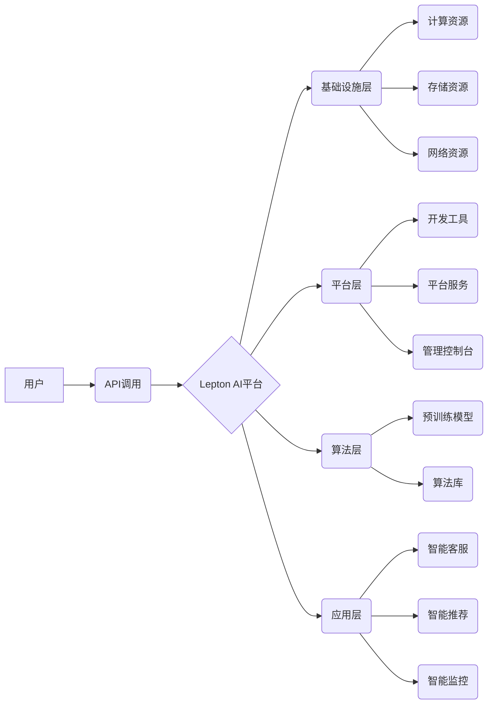

                 

## 云服务的AI赋能：Lepton AI的增值服务

> 关键词：云服务、AI赋能、Lepton AI、增值服务、机器学习、深度学习、自然语言处理、计算机视觉、数据分析

## 1. 背景介绍

随着云计算技术的蓬勃发展，云服务已成为现代企业数字化转型和业务创新不可或缺的基础设施。云平台提供弹性、可扩展、按需付费的计算资源，极大地降低了企业技术门槛和运营成本。然而，云服务本身仅仅提供基础设施，无法满足企业对智能化应用的需求。

人工智能（AI）作为第四次工业革命的核心技术，正在深刻地改变着各行各业。AI技术能够赋予云服务以智能化能力，为企业提供更丰富的增值服务，帮助企业提升效率、降低成本、创造新的商业价值。

Lepton AI 作为一家领先的云服务AI平台，致力于为企业提供一站式AI解决方案，帮助企业快速、高效地利用AI技术，实现业务智能化转型。

## 2. 核心概念与联系

Lepton AI 的核心概念是将云计算平台与人工智能技术深度融合，构建一个开放、灵活、可扩展的AI生态系统。

Lepton AI 的架构主要包括以下几个模块：

* **基础设施层:** 提供计算、存储、网络等基础资源，支持AI模型的训练和部署。
* **平台层:** 提供AI开发工具、平台服务和管理控制台，方便开发者构建和管理AI应用。
* **算法层:** 提供预训练的AI模型和算法库，涵盖自然语言处理、计算机视觉、数据分析等多个领域。
* **应用层:** 提供基于AI技术的增值服务，例如智能客服、智能推荐、智能监控等。

Lepton AI 的架构图如下：



## 3. 核心算法原理 & 具体操作步骤

Lepton AI 平台基于深度学习算法，提供多种AI模型和服务。以下以自然语言处理（NLP）为例，详细介绍核心算法原理和具体操作步骤。

### 3.1  算法原理概述

自然语言处理（NLP）是人工智能领域的一个重要分支，旨在使计算机能够理解、处理和生成人类语言。深度学习算法在NLP领域取得了突破性进展，例如Transformer模型，能够有效地捕捉语言的上下文信息，提升文本理解和生成能力。

Lepton AI 平台采用Transformer模型作为其核心NLP算法，该模型通过多头注意力机制，能够捕捉文本序列中不同词语之间的长距离依赖关系，从而实现更准确的文本理解和生成。

### 3.2  算法步骤详解

Lepton AI 平台的NLP服务流程如下：

1. **数据预处理:** 将用户输入的文本数据进行清洗、分词、词向量化等预处理操作，以便模型能够理解和处理文本信息。
2. **模型训练:** 使用预训练的Transformer模型，对预处理后的文本数据进行训练，学习语言的语法规则和语义关系。
3. **模型部署:** 将训练好的模型部署到Lepton AI 平台，以便用户能够调用模型进行文本处理任务。
4. **文本处理:** 用户通过API调用Lepton AI 平台的NLP服务，将文本数据发送到模型进行处理，例如文本分类、情感分析、机器翻译等。
5. **结果输出:** 模型处理完文本数据后，将结果以文本、json等格式返回给用户。

### 3.3  算法优缺点

**优点:**

* **高准确率:** Transformer模型能够有效地捕捉语言的上下文信息，提升文本理解和生成能力，从而实现更高的准确率。
* **可扩展性强:** Transformer模型的架构能够轻松扩展到处理更长的文本序列，满足不同规模的文本处理需求。
* **通用性强:** Transformer模型能够应用于多种NLP任务，例如文本分类、情感分析、机器翻译等。

**缺点:**

* **训练成本高:** Transformer模型参数量大，训练需要大量的计算资源和时间。
* **推理速度慢:** Transformer模型的推理速度相对较慢，对于实时文本处理任务可能存在延迟。

### 3.4  算法应用领域

Lepton AI 平台的NLP服务广泛应用于以下领域：

* **客服机器人:** 自动回复用户咨询，提高客服效率。
* **内容推荐:** 根据用户兴趣推荐相关内容，提升用户体验。
* **舆情监测:** 分析社交媒体数据，监测用户对品牌和产品的舆情。
* **文本摘要:** 自动生成文本摘要，节省用户阅读时间。
* **机器翻译:** 将文本从一种语言翻译成另一种语言。

## 4. 数学模型和公式 & 详细讲解 & 举例说明

Transformer模型的核心是多头注意力机制，该机制能够捕捉文本序列中不同词语之间的长距离依赖关系。

### 4.1  数学模型构建

多头注意力机制的数学模型可以表示为：

$$
Attention(Q, K, V) = softmax(\frac{QK^T}{\sqrt{d_k}})V
$$

其中：

* $Q$：查询矩阵
* $K$：键矩阵
* $V$：值矩阵
* $d_k$：键向量的维度
* $softmax$：softmax函数

### 4.2  公式推导过程

多头注意力机制的公式推导过程如下：

1. 将查询矩阵 $Q$、键矩阵 $K$ 和值矩阵 $V$ 分别线性变换，得到 $Q'$, $K'$ 和 $V'$。

2. 计算 $Q'$ 和 $K'$ 的点积，并进行归一化，得到注意力权重矩阵 $A$。

3. 将注意力权重矩阵 $A$ 与值矩阵 $V'$ 进行加权求和，得到最终的注意力输出 $O$。

### 4.3  案例分析与讲解

例如，在机器翻译任务中，查询矩阵 $Q$ 包含源语言的词向量，键矩阵 $K$ 包含目标语言的词向量，值矩阵 $V$ 包含目标语言的词嵌入。

通过多头注意力机制，模型能够学习到源语言和目标语言之间的语义关系，从而实现更准确的机器翻译。

## 5. 项目实践：代码实例和详细解释说明

以下是一个使用Lepton AI平台进行文本分类的代码实例：

### 5.1  开发环境搭建

* 安装Python3.x
* 安装Lepton AI SDK

### 5.2  源代码详细实现

```python
import leptonai

# 初始化Lepton AI客户端
client = leptonai.Client(api_key="YOUR_API_KEY")

# 定义文本分类任务
task = "text_classification"

# 定义文本数据
text = "这是一个关于人工智能的新闻文章。"

# 调用Lepton AI平台的文本分类服务
result = client.predict(task, text)

# 打印结果
print(result)
```

### 5.3  代码解读与分析

* `leptonai.Client(api_key="YOUR_API_KEY")`: 初始化Lepton AI客户端，需要替换为您的API密钥。
* `task = "text_classification"`: 定义文本分类任务。
* `text = "这是一个关于人工智能的新闻文章。"`: 定义需要分类的文本数据。
* `client.predict(task, text)`: 调用Lepton AI平台的文本分类服务，传入任务名称和文本数据。
* `print(result)`: 打印分类结果，包含分类类别和置信度等信息。

### 5.4  运行结果展示

运行代码后，将返回一个包含分类类别和置信度的JSON格式结果。例如：

```json
{
  "category": "科技",
  "confidence": 0.95
}
```

## 6. 实际应用场景

Lepton AI 平台的AI赋能服务已广泛应用于各个行业，例如：

### 6.1  金融行业

* **欺诈检测:** 利用机器学习算法分析交易数据，识别异常交易行为，降低欺诈风险。
* **风险评估:** 根据客户数据和市场信息，评估客户的信用风险和投资风险。
* **智能客服:** 利用自然语言处理技术，构建智能客服机器人，自动回复客户咨询，提高客服效率。

### 6.2  医疗行业

* **疾病诊断:** 利用深度学习算法分析医学影像数据，辅助医生诊断疾病。
* **药物研发:** 利用机器学习算法分析药物数据，加速药物研发过程。
* **个性化医疗:** 根据患者的基因信息和生活习惯，提供个性化的医疗建议。

### 6.3  零售行业

* **商品推荐:** 利用机器学习算法分析用户购买历史和浏览记录，推荐个性化的商品。
* **库存管理:** 利用预测分析技术预测商品需求，优化库存管理。
* **客户关系管理:** 利用自然语言处理技术分析客户反馈，提升客户满意度。

### 6.4  未来应用展望

随着人工智能技术的不断发展，Lepton AI 平台将继续推出更多创新性的AI赋能服务，帮助企业更好地利用AI技术，实现业务智能化转型。

## 7. 工具和资源推荐

### 7.1  学习资源推荐

* **Lepton AI 官方文档:** https://docs.leptonai.com/
* **深度学习教程:** https://www.deeplearning.ai/
* **自然语言处理教程:** https://www.nltk.org/book/

### 7.2  开发工具推荐

* **Python:** https://www.python.org/
* **TensorFlow:** https://www.tensorflow.org/
* **PyTorch:** https://pytorch.org/

### 7.3  相关论文推荐

* **Attention Is All You Need:** https://arxiv.org/abs/1706.03762
* **BERT: Pre-training of Deep Bidirectional Transformers for Language Understanding:** https://arxiv.org/abs/1810.04805

## 8. 总结：未来发展趋势与挑战

### 8.1  研究成果总结

Lepton AI 平台的AI赋能服务已取得了一定的成果，为企业提供了丰富的增值服务，帮助企业提升效率、降低成本、创造新的商业价值。

### 8.2  未来发展趋势

未来，Lepton AI 平台将继续深耕AI技术，推出更多创新性的AI赋能服务，例如：

* **更强大的AI模型:** 开发更强大的AI模型，提升AI应用的准确率和效率。
* **更丰富的服务场景:** 将AI技术应用到更多场景，例如智能制造、智慧城市等。
* **更易用的开发平台:** 提供更易用的开发平台，降低企业使用AI技术的门槛。

### 8.3  面临的挑战

Lepton AI 平台也面临着一些挑战，例如：

* **数据安全:** 保护用户数据安全是Lepton AI 平台的首要任务。
* **算法可解释性:** 提升AI算法的可解释性，帮助用户理解AI模型的决策过程。
* **人才短缺:** 吸引和培养AI人才是Lepton AI 平台持续发展的关键。

### 8.4  研究展望

Lepton AI 平台将继续致力于AI技术的研发和应用，为企业提供更智能、更便捷的云服务，推动数字经济的蓬勃发展。

## 9. 附录：常见问题与解答

### 9.1  如何获取Lepton AI API密钥？

您可以通过Lepton AI官网注册账号，并申请API密钥。

### 9.2  Lepton AI平台支持哪些编程语言？

Lepton AI平台目前支持Python语言。

### 9.3  Lepton AI平台的收费标准是什么？

Lepton AI平台采用按需付费的模式，您可以根据实际使用情况选择不同的套餐。

### 9.4  Lepton AI平台的安全性如何保障？

Lepton AI平台采用多种安全措施保障用户数据安全，例如数据加密、访问控制等。

作者：禅与计算机程序设计艺术 / Zen and the Art of Computer Programming


<end_of_turn>

