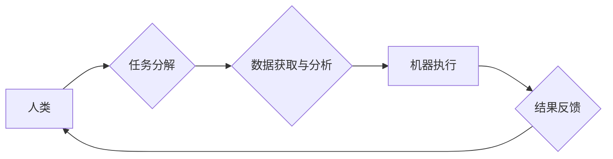

                 

## 人机协同：未来工作的核心竞争力

> 关键词： 人机协同、人工智能、自动化、协作机器人、未来工作、数字转型、工作模式、技能发展

## 1. 背景介绍

随着人工智能 (AI) 技术的飞速发展，人机协同已成为未来工作的重要趋势。传统的工作模式正在被颠覆，人类与机器将更加紧密地合作，共同完成复杂的任务。这种协同关系不仅会改变工作内容和流程，还会对技能需求、职业发展和社会结构产生深远影响。

**1.1. 人工智能的兴起**

人工智能技术的进步，特别是深度学习的突破，使得机器具备了更强的学习、推理和决策能力。AI 算法能够自动识别模式、分析数据、生成文本和图像，甚至进行创造性思考。这些能力正在被广泛应用于各个领域，例如医疗诊断、金融分析、自动驾驶和客户服务。

**1.2. 协作机器人技术的进步**

协作机器人 (Cobot) 是一种与人类安全协作的机器人，能够感知环境、理解人类指令并执行任务。Cobot 通常具有灵活的运动能力、易于编程的特点，可以与人类共享工作空间，共同完成生产、物流和服务等任务。

**1.3. 数字化的加速**

数字化转型正在加速推进，企业和组织越来越依赖于数据和技术来提高效率和竞争力。云计算、大数据、物联网等技术的融合，为人机协同提供了强大的技术基础。

## 2. 核心概念与联系

人机协同是指人类和机器在工作中相互配合、共同完成任务的过程。这种协同关系并非简单的机器替代人类，而是强调人类和机器的优势互补，共同发挥作用。

**2.1. 人类优势**

* **创造力和创新能力:** 人类拥有独特的创造力和创新能力，能够提出新想法、解决复杂问题和进行战略决策。
* **情感智能和社交能力:** 人类能够理解和处理情感，建立良好的 interpersonal relationship，这对于许多工作任务至关重要。
* **适应性和学习能力:** 人类能够快速适应变化的环境，学习新的知识和技能。

**2.2. 机器优势**

* **计算能力和数据处理能力:** 机器能够快速处理海量数据，进行复杂的计算和分析。
* **重复性任务的执行效率:** 机器能够高效地执行重复性任务，提高工作效率。
* **精准性和稳定性:** 机器能够以更高的精度和稳定性完成任务，减少人为错误。

**2.3. 人机协同架构**



## 3. 核心算法原理 & 具体操作步骤

人机协同的核心算法原理包括机器学习、自然语言处理、计算机视觉等。这些算法赋予机器学习能力、理解人类语言和感知环境的能力，从而实现与人类的有效交互和协作。

**3.1. 算法原理概述**

* **机器学习:** 机器学习算法能够从数据中学习模式和规律，并根据学习到的知识进行预测和决策。例如，在人机协同中，机器学习算法可以用于预测人类的需求、识别人类的情绪、自动完成重复性任务等。
* **自然语言处理:** 自然语言处理 (NLP) 算法能够理解和处理人类语言，例如文本和语音。在人机协同中，NLP 算法可以用于机器理解人类指令、进行对话交互、自动生成文本等。
* **计算机视觉:** 计算机视觉算法能够使机器“看到”和理解图像和视频。在人机协同中，计算机视觉算法可以用于机器识别物体、场景和人脸，辅助人类完成视觉任务。

**3.2. 算法步骤详解**

以机器学习为例，其基本步骤包括：

1. **数据收集和预处理:** 收集相关数据并进行清洗、转换和特征提取。
2. **模型选择:** 根据任务需求选择合适的机器学习算法模型。
3. **模型训练:** 使用训练数据训练机器学习模型，使其能够学习数据中的模式和规律。
4. **模型评估:** 使用测试数据评估模型的性能，并进行调整和优化。
5. **模型部署:** 将训练好的模型部署到实际应用场景中。

**3.3. 算法优缺点**

* **优点:** 能够自动学习和适应，提高效率和准确性。
* **缺点:** 需要大量数据进行训练，算法复杂度高，解释性较差。

**3.4. 算法应用领域**

* **医疗诊断:** 利用机器学习算法分析患者数据，辅助医生诊断疾病。
* **金融风险控制:** 利用机器学习算法识别欺诈行为和风险投资。
* **自动驾驶:** 利用计算机视觉和机器学习算法实现车辆自动驾驶。

## 4. 数学模型和公式 & 详细讲解 & 举例说明

人机协同的算法模型通常基于数学公式和统计方法。这些模型能够量化人机协作过程中的各种因素，并进行优化和控制。

**4.1. 数学模型构建**

一个简单的数学模型可以用来描述人机协作中的任务分配问题。假设有 $n$ 个任务需要完成，每个任务需要 $t_i$ 的时间，其中 $i = 1, 2, ..., n$。人类和机器分别拥有 $h$ 和 $m$ 的时间效率，则任务分配的目标是最大化完成任务的总量。

**4.2. 公式推导过程**

我们可以使用以下公式来计算完成任务的总量：

$$
T = \frac{n}{h + m}
$$

其中 $T$ 表示完成任务的总量。

**4.3. 案例分析与讲解**

例如，假设有 10 个任务需要完成，每个任务需要 1 小时完成，人类的时间效率为 1，机器的时间效率为 2。则根据公式计算，完成任务的总量为：

$$
T = \frac{10}{1 + 2} = \frac{10}{3} \approx 3.33
$$

这意味着在人机协作的情况下，可以完成大约 3.33 个任务。

## 5. 项目实践：代码实例和详细解释说明

以下是一个简单的 Python 代码实例，演示了人机协作中的任务分配问题：

**5.1. 开发环境搭建**

* Python 3.x
* Jupyter Notebook

**5.2. 源代码详细实现**

```python
def calculate_task_completion(n, h, m):
  """
  计算完成任务的总量。

  Args:
    n: 任务数量。
    h: 人类时间效率。
    m: 机器时间效率。

  Returns:
    完成任务的总量。
  """
  return n / (h + m)

# 任务数量
n = 10
# 人类时间效率
h = 1
# 机器时间效率
m = 2

# 计算完成任务的总量
total_tasks = calculate_task_completion(n, h, m)

# 打印结果
print(f"完成任务的总量: {total_tasks}")
```

**5.3. 代码解读与分析**

* `calculate_task_completion()` 函数接收任务数量、人类时间效率和机器时间效率作为参数，并根据公式计算完成任务的总量。
* 主程序部分定义了任务数量、人类时间效率和机器时间效率，并调用 `calculate_task_completion()` 函数计算完成任务的总量。
* 最后，打印出完成任务的总量。

**5.4. 运行结果展示**

```
完成任务的总量: 3.3333333333333335
```

## 6. 实际应用场景

人机协同已在各个行业得到广泛应用，例如：

**6.1. 制造业**

* 协作机器人与人类工人在生产线上共同工作，提高生产效率和产品质量。
* 机器人自动完成危险或重复性任务，减轻人类劳动强度。

**6.2. 医疗保健**

* 机器人辅助医生进行手术，提高手术精度和安全性。
* AI 算法辅助医生诊断疾病，提高诊断准确率。

**6.3. 金融服务**

* 机器人处理客户服务请求，提高服务效率和客户满意度。
* AI 算法分析市场数据，辅助投资决策。

**6.4. 未来应用展望**

未来，人机协同将更加深入地融入到各个领域，例如：

* **个性化教育:** AI 算法根据学生的学习情况提供个性化学习方案。
* **智能家居:** 机器人与智能设备协同工作，为用户提供更加便捷舒适的生活体验。
* **自动驾驶:** 自动驾驶汽车将更加安全可靠，并改变人们的出行方式。

## 7. 工具和资源推荐

**7.1. 学习资源推荐**

* **在线课程:** Coursera, edX, Udacity 等平台提供人工智能、机器学习、自然语言处理等方面的在线课程。
* **书籍:** 《深度学习》、《机器学习实战》、《自然语言处理入门》等书籍。
* **开源项目:** TensorFlow, PyTorch, scikit-learn 等开源项目提供丰富的学习资源和实践案例。

**7.2. 开发工具推荐**

* **Python:** 人工智能开发的常用编程语言。
* **Jupyter Notebook:** 用于编写和运行 Python 代码的交互式环境。
* **TensorFlow:** 深度学习框架。
* **PyTorch:** 深度学习框架。

**7.3. 相关论文推荐**

* **《ImageNet Classification with Deep Convolutional Neural Networks》**
* **《Attention Is All You Need》**
* **《BERT: Pre-training of Deep Bidirectional Transformers for Language Understanding》**

## 8. 总结：未来发展趋势与挑战

人机协同是未来工作的重要趋势，它将带来巨大的机遇和挑战。

**8.1. 研究成果总结**

近年来，人工智能技术取得了长足进步，人机协同领域也取得了显著成果。机器学习、自然语言处理、计算机视觉等算法不断发展，为人机协同提供了强大的技术支撑。

**8.2. 未来发展趋势**

* **更智能的人机交互:** 人机交互将更加自然、智能和人性化。
* **更广泛的应用场景:** 人机协同将应用于更多领域，例如教育、医疗、金融等。
* **更强的协作能力:** 人机协作将更加高效、协同和智能。

**8.3. 面临的挑战**

* **伦理问题:** 人机协同引发的伦理问题，例如算法偏见、数据隐私等需要得到解决。
* **技术难题:** 人机协同技术还面临着许多技术难题，例如安全性和可靠性。
* **社会影响:** 人机协同将对就业市场、社会结构等产生深远影响，需要进行相应的社会调整和应对。

**8.4. 研究展望**

未来，人机协同研究将更加注重以下方面：

* **更安全、可靠的人机交互:** 研究更安全的算法和机制，确保人机协作过程的安全性和可靠性。
* **更智能、更灵活的人机协作:** 研究更智能的算法和模型，使人机协作更加灵活、适应性和自主性。
* **人机协作的伦理规范:** 制定人机协作的伦理规范，引导人机协作的健康发展。


## 9. 附录：常见问题与解答

**9.1. 人机协同会取代人类工作吗？**

人机协同不会完全取代人类工作，而是会改变工作内容和模式。人类仍然需要发挥创造力、创新能力和社交能力，而机器则可以帮助人类完成重复性、高强度和危险的任务。

**9.2. 如何适应人机协同的工作环境？**

需要不断学习新的技能，例如数据分析、编程和机器学习，以适应人机协同的工作环境。同时，也要注重培养自己的创造力和创新能力，以及人际交往和沟通能力。

**9.3. 人机协同对社会有什么影响？**

人机协同将对就业市场、社会结构等产生深远影响。一方面，它将创造新的工作岗位，另一方面，也可能导致一些传统工作岗位消失。因此，需要进行相应的社会调整和应对，例如提供职业培训和社会保障。


作者：禅与计算机程序设计艺术 / Zen and the Art of Computer Programming 
<end_of_turn>

