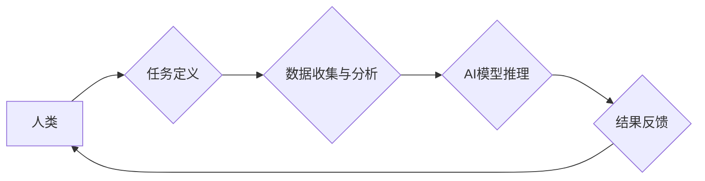

                 

## 人类-AI协作：增强人类智慧与AI能力的融合发展趋势预测分析机遇趋势分析

> 关键词：人工智能、人类-AI协作、智慧增强、AI能力、融合发展、趋势预测、机遇分析

## 1. 背景介绍

人工智能（AI）技术近年来发展迅速，已渗透到各个领域，深刻地改变着人类的生活方式和工作模式。从自动驾驶、语音识别到医疗诊断、金融分析，AI技术的应用日益广泛，展现出强大的潜力。然而，AI技术也面临着一些挑战，例如数据依赖、算法偏见、解释性不足等。

人类-AI协作，即人类与人工智能系统共同完成任务，正成为解决这些挑战并充分发挥AI潜力的重要方向。这种协作模式强调人类和AI的互补性，将人类的创造力、决策能力和情感智能与AI的计算能力、数据处理能力和自动化能力相结合，从而实现智慧的增强和协同发展。

## 2. 核心概念与联系

**2.1 核心概念**

* **人工智能 (AI):** 指计算机模拟人类智能行为的能力，包括学习、推理、决策、感知、语言理解等。
* **人类-AI协作 (Human-AI Collaboration):** 指人类和人工智能系统共同完成任务，双方相互补充，共同提高效率和效果。
* **智慧增强 (Augmented Intelligence):** 指通过AI技术辅助人类提升认知能力、决策能力和创造力，从而实现智慧的提升和发展。

**2.2 架构图**



**2.3 联系**

人类-AI协作的核心是将人类和AI的优势结合起来，实现协同工作。人类负责定义任务、提供上下文信息、进行决策和评估结果，而AI负责收集和分析数据、进行推理和预测、提供建议和自动化执行任务。这种合作模式可以有效地弥补双方各自的不足，从而提高整体效率和效果。

## 3. 核心算法原理 & 具体操作步骤

**3.1 算法原理概述**

人类-AI协作的核心算法原理包括：

* **强化学习 (Reinforcement Learning):** AI系统通过与环境交互，学习最佳策略以获得最大奖励。
* **迁移学习 (Transfer Learning):** 利用已训练好的模型，在新的任务上进行微调，提高学习效率。
* **知识图谱 (Knowledge Graph):** 建立知识的结构化表示，帮助AI理解和推理复杂关系。
* **自然语言处理 (Natural Language Processing):** 允许AI理解和生成人类语言，实现人机交互。

**3.2 算法步骤详解**

1. **任务定义:** 人类明确定义需要完成的任务目标和范围。
2. **数据收集与预处理:** 收集相关数据，并进行清洗、转换和特征提取。
3. **模型选择与训练:** 选择合适的AI算法模型，并根据训练数据进行模型训练。
4. **模型评估与优化:** 对模型进行评估，并根据评估结果进行模型优化。
5. **部署与监控:** 将训练好的模型部署到实际应用场景，并进行持续监控和维护。

**3.3 算法优缺点**

* **优点:** 提高效率、降低成本、增强决策能力、发现新知识。
* **缺点:** 数据依赖、算法偏见、解释性不足、伦理风险。

**3.4 算法应用领域**

* **医疗保健:** 辅助诊断、个性化治疗、药物研发。
* **金融服务:** 风险管理、欺诈检测、投资决策。
* **制造业:** 自动化生产、质量控制、预测维护。
* **教育:** 个性化学习、智能辅导、自动批改。

## 4. 数学模型和公式 & 详细讲解 & 举例说明

**4.1 数学模型构建**

人类-AI协作可以建模为一个博弈论框架，其中人类和AI是参与者，任务目标是共同利益最大化。

**4.2 公式推导过程**

假设人类和AI分别拥有决策权重为 $w_h$ 和 $w_a$，则决策结果可以表示为：

$$
d = w_h * d_h + w_a * d_a
$$

其中，$d$ 是最终决策结果，$d_h$ 和 $d_a$ 分别是人类和AI的决策。

**4.3 案例分析与讲解**

例如，在自动驾驶场景中，人类负责制定最终行驶路线，而AI负责根据实时路况进行路径规划和控制车辆。

* 人类决策权重 $w_h$ 可以根据驾驶经验和风险偏好进行设定。
* AI决策权重 $w_a$ 可以根据AI模型的准确性和可靠性进行设定。

通过调整权重，可以实现人类和AI的协同决策，从而提高驾驶安全性和效率。

## 5. 项目实践：代码实例和详细解释说明

**5.1 开发环境搭建**

* 操作系统: Ubuntu 20.04
* Python 版本: 3.8
* 必要的库: TensorFlow, PyTorch, scikit-learn

**5.2 源代码详细实现**

```python
import tensorflow as tf

# 定义模型
model = tf.keras.models.Sequential([
  tf.keras.layers.Dense(64, activation='relu', input_shape=(10,)),
  tf.keras.layers.Dense(10, activation='softmax')
])

# 编译模型
model.compile(optimizer='adam',
              loss='sparse_categorical_crossentropy',
              metrics=['accuracy'])

# 训练模型
model.fit(x_train, y_train, epochs=10)

# 评估模型
loss, accuracy = model.evaluate(x_test, y_test)
print('Loss:', loss)
print('Accuracy:', accuracy)
```

**5.3 代码解读与分析**

这段代码实现了简单的深度学习模型训练。

* `tf.keras.models.Sequential` 定义了一个顺序模型，其中层级依次连接。
* `tf.keras.layers.Dense` 定义了一个全连接层，用于处理输入数据。
* `activation='relu'` 指定了激活函数为ReLU，用于引入非线性。
* `optimizer='adam'` 指定了优化器为Adam，用于更新模型参数。
* `loss='sparse_categorical_crossentropy'` 指定了损失函数为稀疏类别交叉熵，用于分类任务。
* `metrics=['accuracy']` 指定了评估指标为准确率。

**5.4 运行结果展示**

训练完成后，模型会输出训练损失和准确率，可以根据这些指标评估模型的性能。

## 6. 实际应用场景

**6.1 医疗诊断辅助**

AI可以辅助医生进行疾病诊断，例如分析医学影像、识别病理特征、预测疾病风险。

**6.2 金融风险管理**

AI可以帮助金融机构识别欺诈交易、评估信用风险、预测市场波动。

**6.3 制造业智能化**

AI可以用于优化生产流程、预测设备故障、实现智能制造。

**6.4 教育个性化学习**

AI可以根据学生的学习进度和能力，提供个性化的学习内容和辅导。

**6.5 未来应用展望**

随着AI技术的不断发展，人类-AI协作将在更多领域得到应用，例如：

* **科学研究:** 辅助科学家进行数据分析、模型构建、实验设计。
* **艺术创作:** 帮助艺术家生成创意内容、探索新的艺术形式。
* **社会治理:** 提高公共服务效率、优化资源分配、促进社会公平。

## 7. 工具和资源推荐

**7.1 学习资源推荐**

* **在线课程:** Coursera, edX, Udacity
* **书籍:** 《深度学习》、《人工智能：一种现代方法》
* **开源项目:** TensorFlow, PyTorch, scikit-learn

**7.2 开发工具推荐**

* **编程语言:** Python
* **深度学习框架:** TensorFlow, PyTorch
* **数据可视化工具:** Matplotlib, Seaborn

**7.3 相关论文推荐**

* **人类-AI协作:** "Human-AI Collaboration: A Survey"
* **智慧增强:** "Augmented Intelligence: A Survey"
* **AI伦理:** "AI Ethics: A Survey"

## 8. 总结：未来发展趋势与挑战

**8.1 研究成果总结**

人类-AI协作已取得显著成果，在多个领域实现了实际应用。

**8.2 未来发展趋势**

* **更强的协作能力:** AI系统将更加智能化，能够更好地理解人类意图和需求。
* **更广泛的应用场景:** 人类-AI协作将应用于更多领域，例如科学研究、艺术创作、社会治理。
* **更注重伦理和可解释性:** 人类-AI协作将更加注重伦理和可解释性，确保AI技术的安全和可控性。

**8.3 面临的挑战**

* **数据安全和隐私保护:** 人类-AI协作需要处理大量数据，因此数据安全和隐私保护是一个重要挑战。
* **算法偏见和公平性:** AI算法可能存在偏见，需要采取措施确保算法公平性和公正性。
* **人类技能的演变:** 人类需要不断学习和适应AI技术的变革，提升自身技能和竞争力。

**8.4 研究展望**

未来研究将重点关注以下几个方面：

* **更有效的协作机制:** 研究更有效的协作机制，使人类和AI能够更加协同工作。
* **更智能的AI系统:** 开发更智能的AI系统，能够更好地理解人类意图和需求。
* **更安全的AI技术:** 研究确保AI技术的安全性和可控性，避免潜在的风险。


## 9. 附录：常见问题与解答

**9.1 如何评估人类-AI协作的效率？**

可以根据任务完成时间、错误率、决策质量等指标评估人类-AI协作的效率。

**9.2 如何解决AI算法偏见的问题？**

可以通过数据预处理、算法设计、模型评估等方式来解决AI算法偏见的问题。

**9.3 人类-AI协作会取代人类工作吗？**

人类-AI协作更倾向于增强人类能力，而不是取代人类工作。

**9.4 如何确保AI技术的安全和可控性？**

可以通过制定相关法律法规、加强技术监管、促进伦理研究等方式来确保AI技术的安全和可控性。


作者：禅与计算机程序设计艺术 / Zen and the Art of Computer Programming 
<end_of_turn>

