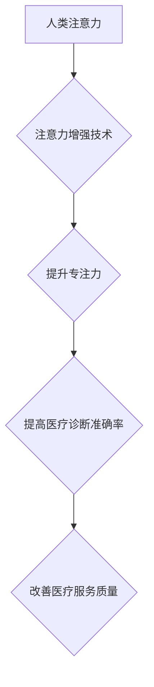

                 

## 人类注意力增强：提升专注力和注意力在医疗中的应用场景

> 关键词：注意力增强、专注力、深度学习、医疗诊断、脑机接口、生物反馈、神经网络、数据分析

## 1. 背景介绍

在当今信息爆炸的时代，人类的注意力面临着前所未有的挑战。分散的信息流、社交媒体的诱惑以及工作和生活的压力，都使得人们难以集中注意力，专注于眼前的任务。注意力力的下降不仅影响着学习、工作和生活效率，也可能导致认知能力下降、情绪波动和心理健康问题。

医疗领域对高度集中注意力尤为重要。医生需要快速准确地分析患者的症状、解读医学影像、做出诊断和制定治疗方案。护士需要密切关注患者的病情变化、及时记录数据、并进行必要的护理操作。注意力力的下降可能会导致医疗错误、延误治疗，甚至危及患者的生命安全。

近年来，随着人工智能技术的快速发展，注意力增强技术逐渐成为一个热门的研究方向。通过利用深度学习、脑机接口等技术，我们可以开发出能够提升人类注意力、增强专注力的工具和系统，并在医疗领域发挥重要作用。

## 2. 核心概念与联系

### 2.1 注意力增强

注意力增强是指通过各种技术手段，提高个体对特定信息或任务的关注程度，增强其专注力和认知能力。

### 2.2  专注力

专注力是指个体能够将注意力集中在特定目标或任务上，并持续保持这种集中状态的能力。

### 2.3  医疗诊断

医疗诊断是指通过对患者的病史、体征、实验室检查等信息进行分析，确定患者的疾病类型和程度的过程。

### 2.4  脑机接口

脑机接口 (Brain-Computer Interface，BCI) 是指将大脑信号与外部设备连接起来，实现人机交互的一种技术。

**核心概念与联系流程图**



## 3. 核心算法原理 & 具体操作步骤

### 3.1  算法原理概述

注意力增强算法通常基于深度学习技术，利用神经网络模型学习人类大脑的注意力机制，并将其应用于提升注意力和专注力的任务。常见的算法包括：

* **Transformer网络:** Transformer网络是一种强大的深度学习模型，能够捕捉序列数据中的长距离依赖关系，在自然语言处理领域取得了突破性进展。其注意力机制能够有效地识别和关注重要的信息，因此也被应用于注意力增强领域。
* **Recurrent Neural Network (RNN):** RNN是一种能够处理序列数据的深度学习模型，其内部循环结构能够捕捉时间序列中的模式和趋势。RNN的注意力机制能够帮助模型关注序列中重要的信息，并忽略无关的信息。
* **Convolutional Neural Network (CNN):** CNN是一种擅长处理图像数据的深度学习模型，其卷积层能够提取图像中的特征。CNN的注意力机制能够帮助模型关注图像中重要的区域，并忽略无关的区域。

### 3.2  算法步骤详解

1. **数据收集和预处理:** 收集大量人类注意力相关的数据，例如眼动追踪数据、脑电波数据、行为数据等。对数据进行清洗、格式化和特征提取。
2. **模型构建:** 选择合适的深度学习模型，例如Transformer网络、RNN或CNN，并根据任务需求进行调整和优化。
3. **模型训练:** 利用训练数据训练深度学习模型，使其能够学习人类注意力机制。
4. **模型评估:** 使用测试数据评估模型的性能，例如注意力预测准确率、专注力提升程度等。
5. **模型部署:** 将训练好的模型部署到实际应用场景中，例如开发注意力增强软件、硬件设备等。

### 3.3  算法优缺点

**优点:**

* **高准确率:** 深度学习算法能够学习复杂的注意力机制，并实现高准确率的注意力预测和增强。
* **可定制性强:** 不同的深度学习模型和算法参数可以根据不同的任务需求进行调整和优化。
* **持续改进:** 随着数据量的增加和算法的改进，注意力增强算法的性能将不断提升。

**缺点:**

* **数据依赖性强:** 深度学习算法需要大量的数据进行训练，数据质量和数量直接影响模型的性能。
* **计算资源需求高:** 训练深度学习模型需要大量的计算资源和时间。
* **黑盒效应:** 深度学习模型的内部工作机制较为复杂，难以解释其决策过程。

### 3.4  算法应用领域

注意力增强算法在医疗领域具有广泛的应用前景，例如：

* **辅助诊断:** 利用注意力增强算法分析医学影像，帮助医生识别病灶、提高诊断准确率。
* **手术辅助:** 利用注意力增强算法指导手术机器人，提高手术精度和安全性。
* **患者康复:** 利用注意力增强算法训练患者进行认知训练，帮助他们恢复注意力和专注力。
* **远程医疗:** 利用注意力增强算法提高远程医疗的效率和准确性。

## 4. 数学模型和公式 & 详细讲解 & 举例说明

### 4.1  数学模型构建

注意力机制的核心是计算每个输入元素对输出的影响权重。常用的数学模型包括：

* **Scaled Dot-Product Attention:** 这种模型计算输入元素和查询向量之间的点积，然后进行缩放和softmax操作，得到每个元素的注意力权重。

* **Multi-Head Attention:** 这种模型使用多个独立的注意力头，每个头学习不同的注意力模式，并将其结果进行融合，提高模型的表达能力。

### 4.2  公式推导过程

**Scaled Dot-Product Attention:**

假设输入序列为 $X = \{x_1, x_2, ..., x_n\}$, 查询向量为 $Q$,  键向量为 $K$, 值向量为 $V$. 

1. 计算每个元素 $x_i$ 与查询向量 $Q$ 的点积:

 $$score(x_i, Q) = x_i^T Q$$

2. 对所有元素的点积进行缩放:

 $$z_i = \frac{score(x_i, Q)}{\sqrt{d_k}}$$

3. 应用 softmax 函数计算每个元素的注意力权重:

 $$a_i = \frac{exp(z_i)}{\sum_{j=1}^{n} exp(z_j)}$$

4. 计算输出向量:

 $$Output = \sum_{i=1}^{n} a_i V_i$$

其中 $d_k$ 是键向量的维度。

### 4.3  案例分析与讲解

**举例说明:**

假设我们有一个句子 "The cat sat on the mat."，我们想使用 Scaled Dot-Product Attention 来计算每个单词对句子整体语义的影响权重。

1. 将句子中的每个单词作为输入元素，查询向量 $Q$ 和键向量 $K$ 可以是预训练的词嵌入向量。
2. 计算每个单词与查询向量的点积，并进行缩放。
3. 应用 softmax 函数计算每个单词的注意力权重。
4. 将每个单词的值向量与其注意力权重相乘，得到输出向量，即句子整体的语义表示。

## 5. 项目实践：代码实例和详细解释说明

### 5.1  开发环境搭建

* **操作系统:** Ubuntu 20.04
* **编程语言:** Python 3.8
* **深度学习框架:** TensorFlow 2.x
* **其他工具:** Jupyter Notebook, Git

### 5.2  源代码详细实现

```python
import tensorflow as tf

# 定义 Scaled Dot-Product Attention 函数
def scaled_dot_product_attention(query, key, value, mask=None):
    # 计算点积
    scores = tf.matmul(query, key, transpose_b=True)
    # 进行缩放
    scores /= tf.math.sqrt(tf.cast(key.shape[-1], tf.float32))
    # 应用 softmax
    if mask is not None:
        scores += (mask * -1e9)
    attention_weights = tf.nn.softmax(scores, axis=-1)
    # 计算输出向量
    output = tf.matmul(attention_weights, value)
    return output, attention_weights

# 示例代码
# 定义查询向量、键向量和值向量
query = tf.random.normal([32, 64])
key = tf.random.normal([32, 64])
value = tf.random.normal([32, 64])

# 计算注意力输出和注意力权重
output, attention_weights = scaled_dot_product_attention(query, key, value)

# 打印输出结果
print(output.shape)
print(attention_weights.shape)
```

### 5.3  代码解读与分析

* `scaled_dot_product_attention` 函数实现了 Scaled Dot-Product Attention 的计算过程。
* `query`, `key`, `value` 分别代表查询向量、键向量和值向量。
* `mask` 用于屏蔽某些输入元素，例如在机器翻译中屏蔽已经翻译过的单词。
* `tf.matmul` 函数用于计算矩阵乘法。
* `tf.math.sqrt` 函数用于计算平方根。
* `tf.nn.softmax` 函数用于计算 softmax 分布。
* `tf.cast` 函数用于将数据类型转换为指定类型。

### 5.4  运行结果展示

运行上述代码后，会输出注意力输出的形状和注意力权重的形状。

## 6. 实际应用场景

### 6.1  医疗诊断辅助

注意力增强算法可以帮助医生更准确地分析医学影像，例如 X 光片、CT 扫描、MRI 图像等。通过关注图像中重要的区域，例如肿瘤、骨折或其他异常结构，医生可以更快地做出诊断，并制定更有效的治疗方案。

### 6.2  手术辅助

注意力增强算法可以用于指导手术机器人，提高手术精度和安全性。例如，在脑外科手术中，注意力增强算法可以帮助机器人专注于目标区域，避免损伤周围的健康组织。

### 6.3  患者康复

注意力增强算法可以用于训练患者进行认知训练，帮助他们恢复注意力和专注力。例如，对于患有注意力缺陷多动障碍 (ADHD) 的患者，注意力增强算法可以帮助他们提高专注力，更好地完成学习和工作任务。

### 6.4  未来应用展望

注意力增强技术在医疗领域的应用前景广阔，未来可能在以下方面得到进一步发展：

* **个性化医疗:** 根据患者的个体差异，定制化的注意力增强方案，提高治疗效果。
* **远程医疗:** 利用注意力增强技术提高远程医疗的效率和准确性，为更多患者提供优质医疗服务。
* **人工智能辅助诊断:** 将注意力增强算法与其他人工智能技术结合，开发更智能、更准确的医疗诊断系统。

## 7. 工具和资源推荐

### 7.1  学习资源推荐

* **书籍:**
    * Deep Learning by Ian Goodfellow, Yoshua Bengio, and Aaron Courville
    * Attention Is All You Need by Ashish Vaswani et al.
* **在线课程:**
    * TensorFlow 官方教程: https://www.tensorflow.org/tutorials
    * Coursera 上的深度学习课程: https://www.coursera.org/search?query=deep%20learning

### 7.2  开发工具推荐

* **深度学习框架:** TensorFlow, PyTorch, Keras
* **编程语言:** Python
* **数据处理工具:** Pandas, NumPy

### 7.3  相关论文推荐

* **Attention Is All You Need:** https://arxiv.org/abs/1706.03762
* **BERT: Pre-training of Deep Bidirectional Transformers for Language Understanding:** https://arxiv.org/abs/1810.04805

## 8. 总结：未来发展趋势与挑战

### 8.1  研究成果总结

注意力增强技术在医疗领域取得了显著的进展，例如在医学影像分析、手术辅助和患者康复方面展现出巨大的潜力。

### 8.2  未来发展趋势

* **更精准的注意力模型:** 研究更精准、更有效的注意力模型，能够更好地捕捉人类大脑的注意力机制。
* **个性化注意力增强:** 根据患者的个体差异，定制化的注意力增强方案，提高治疗效果。
* **多模态注意力增强:** 将注意力增强技术应用于多模态数据，例如文本、图像、音频等，提高医疗诊断的准确性和效率。

### 8.3  面临的挑战

* **数据获取和隐私保护:** 医疗数据具有敏感性和隐私性，获取和使用医疗数据需要遵守严格的伦理和法律规定。
* **算法解释性和可信度:** 深度学习模型的内部工作机制较为复杂，难以解释其决策过程，这可能会影响医疗决策的可信度。
* **技术推广和应用:** 将注意力增强技术推广到临床实践中，需要克服技术、经济和社会等方面的挑战。

### 8.4  研究展望

未来，注意力增强技术将继续在医疗领域发挥重要作用，为患者提供更精准、更有效的医疗服务。


## 9. 附录：常见问题与解答

**Q1: 注意力增强技术与脑机接口技术有什么区别？**

**A1:** 注意力增强技术主要通过软件算法来提升人类的注意力和专注力，而脑机接口技术则通过硬件设备直接连接大脑，实现人机交互。两者可以相互补充，例如，脑机接口技术可以帮助监测大脑活动，为注意力增强算法提供反馈信息。

**Q2: 注意力增强技术是否会对人类大脑造成伤害？**

**A2:** 目前还没有证据表明注意力增强技术会对人类大脑造成伤害。但是，过度使用注意力增强技术可能会导致依赖和心理问题，因此需要谨慎使用。

**Q3: 注意力增强技术在医疗领域的应用前景如何？**

**A3:** 注意力增强技术在医疗领域的应用前景非常广阔，例如在医学影像分析、手术辅助、患者康复等方面都具有巨大的潜力。随着技术的不断发展，注意力增强技术将在医疗领域发挥越来越重要的作用。


作者：禅与计算机程序设计艺术 / Zen and the Art of Computer Programming 
<end_of_turn>

