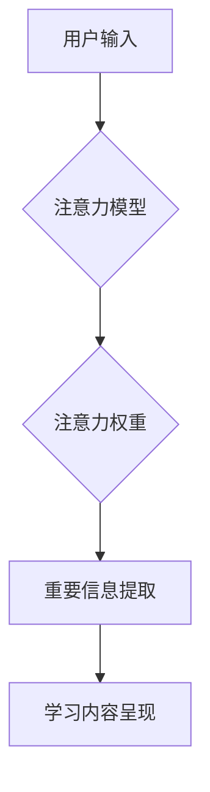

                 

## 人类注意力增强：提升专注力和注意力在教育中的应用

> 关键词：注意力增强、专注力、深度学习、神经网络、教育科技、认知科学、脑机接口

## 1. 背景介绍

在当今信息爆炸的时代，人类的注意力面临着前所未有的挑战。来自社交媒体、电子游戏、新闻推送等各种信息源的不断干扰，使得人们难以集中精力完成任务，学习效率也随之降低。注意力问题已经成为影响个人学习、工作和生活质量的普遍现象，尤其在教育领域，注意力缺失严重阻碍了学生的学习进步。

传统的教育模式往往依赖于学生的被动接受和记忆，忽视了注意力在学习过程中的重要作用。随着人工智能技术的快速发展，注意力增强技术逐渐成为教育科技领域的新兴热点。通过利用人工智能算法和技术，我们可以帮助学生提升专注力，提高学习效率，并更好地应对信息时代的挑战。

## 2. 核心概念与联系

### 2.1 注意力机制

注意力机制是深度学习领域的重要发展方向，它能够帮助模型模拟人类的注意力机制，专注于输入数据中最重要的部分。注意力机制的核心思想是通过一个加权机制，将输入数据中的不同部分赋予不同的权重，从而突出重要信息，抑制无关信息。

### 2.2 人工智能与教育

人工智能在教育领域的应用已经取得了显著成果，例如智能辅导系统、个性化学习平台、自动批改系统等。注意力增强技术作为人工智能的重要组成部分，可以进一步提升教育科技的智能化水平，为学生提供更个性化、更有效的学习体验。

### 2.3 流程图



## 3. 核心算法原理 & 具体操作步骤

### 3.1 算法原理概述

注意力增强算法通常基于深度学习模型，例如 Transformer、RNN 等。这些模型能够学习输入数据中的复杂模式和关系，并根据学习到的知识，自动分配注意力权重，突出重要信息。

### 3.2 算法步骤详解

1. **数据预处理:** 将学习内容转换为模型可理解的格式，例如文本转换为词向量。
2. **模型训练:** 利用深度学习算法训练注意力模型，使其能够学习到注意力机制。
3. **注意力计算:** 将学习内容输入到训练好的注意力模型中，模型会计算出每个词或片段的注意力权重。
4. **重要信息提取:** 根据注意力权重，提取学习内容中最重要的部分。
5. **学习内容呈现:** 将提取出的重要信息以更易于理解的方式呈现给学生，例如突出显示关键语句、提供简洁的总结等。

### 3.3 算法优缺点

**优点:**

* **提高学习效率:** 通过突出重要信息，帮助学生更快地理解和记忆学习内容。
* **个性化学习:** 可以根据学生的学习风格和进度，动态调整注意力权重，提供个性化的学习体验。
* **增强学习兴趣:** 通过互动式学习和游戏化设计，提高学生的学习兴趣和参与度。

**缺点:**

* **数据依赖:** 需要大量的学习数据进行模型训练，数据质量直接影响模型性能。
* **计算资源:** 训练深度学习模型需要大量的计算资源，成本较高。
* **伦理问题:** 需要关注注意力增强技术的伦理问题，例如数据隐私、算法偏见等。

### 3.4 算法应用领域

注意力增强算法在教育领域具有广泛的应用前景，例如：

* **智能辅导系统:** 为学生提供个性化的学习辅导，帮助他们克服学习困难。
* **个性化学习平台:** 根据学生的学习进度和风格，定制化学习内容和学习路径。
* **在线课程:** 提高在线课程的互动性和吸引力，帮助学生更好地理解和记忆课程内容。
* **考试辅助:** 通过分析学生的作答情况，提供针对性的学习建议和考试技巧。

## 4. 数学模型和公式 & 详细讲解 & 举例说明

### 4.1 数学模型构建

注意力机制通常使用一个加权机制来分配注意力权重。假设我们有一个输入序列 $X = \{x_1, x_2, ..., x_n\}$, 其中每个元素 $x_i$ 代表一个词或片段。我们希望计算每个词 $x_i$ 的注意力权重 $a_i$, 然后根据这些权重对输入序列进行加权求和，得到最终的输出 $O$.

### 4.2 公式推导过程

注意力权重 $a_i$ 通常使用一个评分函数 $s(x_i, h)$ 计算，其中 $h$ 是一个隐藏状态向量，代表模型对输入序列的理解。评分函数可以是任何可微函数，例如点积、余弦相似度等。

$$a_i = \frac{exp(s(x_i, h))}{\sum_{j=1}^{n} exp(s(x_j, h))}$$

最终的输出 $O$ 可以通过对输入序列进行加权求和得到：

$$O = \sum_{i=1}^{n} a_i x_i$$

### 4.3 案例分析与讲解

例如，在机器翻译任务中，注意力机制可以帮助模型关注源语言中与目标语言词语相关的部分，从而提高翻译质量。

## 5. 项目实践：代码实例和详细解释说明

### 5.1 开发环境搭建

* Python 3.x
* TensorFlow 或 PyTorch 深度学习框架
* Jupyter Notebook 或 VS Code 代码编辑器

### 5.2 源代码详细实现

```python
import tensorflow as tf

# 定义注意力机制
def attention_layer(inputs, hidden_state):
    # 计算注意力权重
    scores = tf.matmul(inputs, hidden_state, transpose_b=True)
    attention_weights = tf.nn.softmax(scores, axis=-1)
    # 对输入序列进行加权求和
    context_vector = tf.matmul(attention_weights, inputs)
    return context_vector

# 定义模型
model = tf.keras.Sequential([
    # ... 其他层 ...
    attention_layer(inputs, hidden_state)
    # ... 其他层 ...
])

# 训练模型
model.compile(optimizer='adam', loss='mse')
model.fit(train_data, train_labels, epochs=10)
```

### 5.3 代码解读与分析

* `attention_layer` 函数定义了注意力机制，计算注意力权重并对输入序列进行加权求和。
* `model` 对象定义了深度学习模型，其中包含注意力层。
* `model.compile` 方法配置模型的训练参数。
* `model.fit` 方法训练模型。

### 5.4 运行结果展示

训练完成后，可以将模型应用于实际数据，例如预测文本的下一个词，翻译文本，生成图像等。

## 6. 实际应用场景

### 6.1 智能辅导系统

注意力增强技术可以帮助智能辅导系统更好地理解学生的学习情况，并提供个性化的学习辅导。例如，系统可以根据学生的注意力分布，识别出学生在哪些知识点上存在困难，并提供针对性的练习和讲解。

### 6.2 个性化学习平台

个性化学习平台可以根据学生的学习风格和进度，动态调整学习内容和学习路径。注意力增强技术可以帮助平台更好地理解学生的学习偏好，并推荐更适合学生的学习资源。

### 6.3 在线课程

在线课程可以通过注意力增强技术提高学生的学习兴趣和参与度。例如，系统可以根据学生的注意力分布，突出显示关键信息，并提供互动式练习和游戏化设计，帮助学生更好地理解和记忆课程内容。

### 6.4 未来应用展望

注意力增强技术在教育领域的应用前景广阔，未来可能在以下方面得到进一步发展：

* **脑机接口:** 通过脑机接口技术，直接读取学生的脑电信号，实时监测学生的注意力状态，并根据学生的注意力变化动态调整学习内容和学习方式。
* **虚拟现实:** 利用虚拟现实技术，创造沉浸式的学习环境，并通过注意力增强技术，引导学生更好地参与虚拟世界中的学习活动。
* **人工智能教师:** 开发更加智能的人工智能教师，能够根据学生的学习情况，提供个性化的学习辅导和指导。

## 7. 工具和资源推荐

### 7.1 学习资源推荐

* **书籍:**
    * 《深度学习》 by Ian Goodfellow, Yoshua Bengio, and Aaron Courville
    * 《Attention Is All You Need》 by Vaswani et al.
* **在线课程:**
    * Coursera: Deep Learning Specialization
    * Udacity: Deep Learning Nanodegree

### 7.2 开发工具推荐

* **TensorFlow:** https://www.tensorflow.org/
* **PyTorch:** https://pytorch.org/
* **Jupyter Notebook:** https://jupyter.org/

### 7.3 相关论文推荐

* **Attention Is All You Need:** https://arxiv.org/abs/1706.03762
* **BERT: Pre-training of Deep Bidirectional Transformers for Language Understanding:** https://arxiv.org/abs/1810.04805

## 8. 总结：未来发展趋势与挑战

### 8.1 研究成果总结

注意力增强技术在教育领域取得了显著成果，能够有效提升学生的学习效率和学习兴趣。

### 8.2 未来发展趋势

未来注意力增强技术将朝着以下方向发展：

* **更精准的注意力控制:** 通过更深入的认知科学研究，开发更精准的注意力控制机制，能够更好地适应学生的个性化需求。
* **更丰富的学习体验:** 利用虚拟现实、增强现实等技术，创造更丰富的学习体验，并通过注意力增强技术，引导学生更好地参与虚拟世界中的学习活动。
* **更智能的教育系统:** 开发更加智能的人工智能教师，能够根据学生的学习情况，提供个性化的学习辅导和指导。

### 8.3 面临的挑战

注意力增强技术在教育领域的应用也面临一些挑战：

* **数据隐私:** 需要关注注意力增强技术的应用过程中，学生数据的隐私安全问题。
* **算法偏见:** 需要避免算法偏见，确保注意力增强技术能够公平地服务于所有学生。
* **伦理问题:** 需要关注注意力增强技术的伦理问题，例如过度依赖技术，影响学生的自主学习能力等。

### 8.4 研究展望

未来，我们需要继续深入研究注意力增强技术，探索其在教育领域的更多应用场景，并积极应对其带来的挑战，最终实现注意力增强技术在教育领域的良性发展。

## 9. 附录：常见问题与解答

### 9.1 如何评估注意力增强技术的有效性？

可以通过多种方法评估注意力增强技术的有效性，例如：

* **学生学习成绩:** 比较使用注意力增强技术的学生和不使用该技术的学生的学习成绩。
* **注意力持续时间:** 测量学生在使用注意力增强技术时，注意力持续的时间。
* **学习兴趣:** 通过问卷调查等方式，了解学生对使用注意力增强技术的学习体验。

### 9.2 注意力增强技术会取代老师吗？

注意力增强技术可以帮助老师更好地完成教学工作，例如提供个性化的学习辅导，提高学生的学习效率，但它不会取代老师。老师仍然是教育的核心，需要提供情感支持、引导学生思考、培养学生的独立学习能力等。

### 9.3 注意力增强技术有哪些潜在的风险？

注意力增强技术也存在一些潜在的风险，例如：

* **过度依赖技术:** 学生过度依赖注意力增强技术，可能会影响他们的自主学习能力。
* **算法偏见:** 算法可能存在偏见，导致某些学生受到不公平的对待。
* **数据隐私:** 学生数据的隐私安全需要得到保障。

作者：禅与计算机程序设计艺术 / Zen and the Art of Computer Programming


<end_of_turn>

