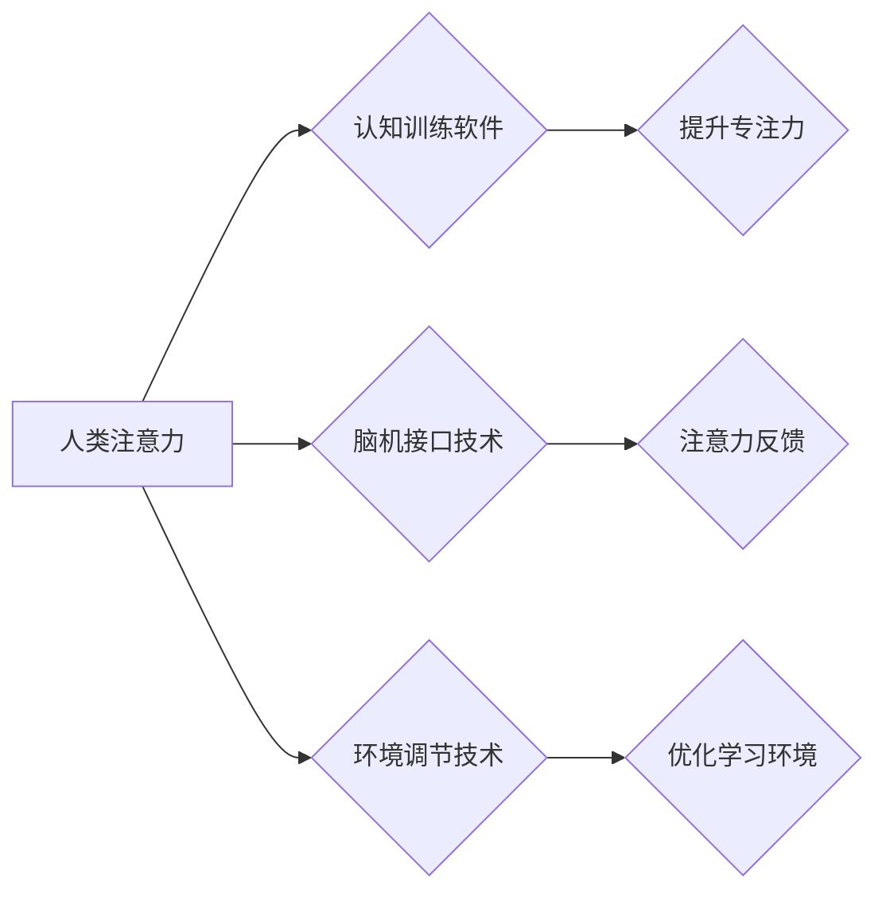

                 

## 人类注意力增强：提升专注力和注意力在教育中的方法

> 关键词：注意力增强、专注力、深度学习、神经网络、教育科技、认知科学、脑机接口

## 1. 背景介绍

在当今信息爆炸的时代，人类的注意力面临着前所未有的挑战。来自社交媒体、电子游戏、新闻推送等各种信息源的不断干扰，使得人们难以集中精力完成任务，学习效率也随之降低。尤其是在教育领域，学生的注意力分散是影响学习效果的重要因素之一。如何有效提升学生的专注力和注意力，成为教育工作者和科技研究者共同关注的热点问题。

近年来，随着人工智能技术的快速发展，特别是深度学习技术的突破，为人类注意力增强提供了新的思路和方法。深度学习算法能够从海量数据中学习到复杂的模式，并应用于预测和控制人类行为，包括注意力分配。

## 2. 核心概念与联系

### 2.1 注意力机制

注意力机制是深度学习领域的重要研究方向，其核心思想是让模型在处理信息时，能够自动地识别和关注重要的信息，并忽略无关的信息。

注意力机制的应用可以提升模型的性能，例如在机器翻译、文本摘要、图像识别等任务中，注意力机制能够帮助模型更好地理解上下文信息，从而生成更准确、更流畅的输出。

### 2.2 人类注意力与机器学习

人类的注意力是一个复杂的心理过程，涉及到多种认知功能，例如感知、记忆、决策等。机器学习模型虽然能够模拟部分人类注意力的机制，但与人类注意力相比，仍然存在着许多差距。

例如，人类的注意力具有选择性、可控性和动态性，而机器学习模型的注意力通常是静态的，难以适应变化的环境。

### 2.3 人类注意力增强技术

人类注意力增强技术旨在通过技术手段，帮助人们提升专注力和注意力。这些技术可以分为以下几类：

* **认知训练软件:** 通过一系列游戏和练习，帮助用户训练注意力、记忆力和执行功能等认知能力。
* **脑机接口技术:** 通过记录脑电信号，识别用户的注意力状态，并提供相应的反馈或干预。
* **环境调节技术:** 通过调整环境光线、温度、噪音等因素，创造有利于集中注意力的环境。

**Mermaid 流程图**



## 3. 核心算法原理 & 具体操作步骤

### 3.1 算法原理概述

本文将介绍一种基于深度学习的注意力增强算法，该算法利用神经网络模型，学习用户注意力模式，并提供个性化的干预措施。

该算法的核心思想是：通过训练一个深度神经网络模型，能够预测用户的注意力状态，并根据预测结果，提供相应的干预措施，例如调整环境光线、播放背景音乐等，以帮助用户提升专注力。

### 3.2 算法步骤详解

1. **数据收集:** 收集用户的注意力数据，例如眼动追踪数据、脑电信号数据、行为数据等。
2. **数据预处理:** 对收集到的数据进行预处理，例如去噪、归一化等，以提高模型训练的效率和精度。
3. **模型训练:** 利用深度学习算法，训练一个神经网络模型，该模型能够从用户的注意力数据中学习到用户的注意力模式。
4. **注意力预测:** 将用户的实时注意力数据输入到训练好的模型中，预测用户的注意力状态。
5. **干预措施:** 根据预测结果，提供相应的干预措施，例如调整环境光线、播放背景音乐等，以帮助用户提升专注力。

### 3.3 算法优缺点

**优点:**

* **个性化:** 该算法能够根据用户的注意力模式，提供个性化的干预措施。
* **实时性:** 该算法能够实时预测用户的注意力状态，并及时提供干预措施。
* **可扩展性:** 该算法可以扩展到不同的注意力数据类型，例如眼动追踪数据、脑电信号数据等。

**缺点:**

* **数据依赖:** 该算法需要大量的用户注意力数据进行训练，否则模型的精度会降低。
* **隐私问题:** 收集用户的注意力数据可能会涉及到隐私问题，需要采取相应的保护措施。

### 3.4 算法应用领域

该算法可以应用于以下领域:

* **教育:** 帮助学生提升专注力和学习效率。
* **医疗:** 帮助患者治疗注意力缺陷多动障碍 (ADHD) 等注意力相关疾病。
* **游戏:** 提升玩家的游戏体验。
* **工作:** 帮助员工提高工作效率。

## 4. 数学模型和公式 & 详细讲解 & 举例说明

### 4.1 数学模型构建

注意力机制通常使用一个加权求和的形式来计算注意力分数，公式如下:

$$
\text{Attention}(Q, K, V) = \text{softmax}(\frac{Q K^T}{\sqrt{d_k}}) V
$$

其中:

* $Q$ 是查询矩阵，表示需要关注的信息。
* $K$ 是键矩阵，表示所有候选信息的表示。
* $V$ 是值矩阵，表示候选信息的具体内容。
* $d_k$ 是键向量的维度。
* $\text{softmax}$ 函数将注意力分数归一化到 [0, 1] 之间。

### 4.2 公式推导过程

注意力机制的公式推导过程可以分为以下几个步骤:

1. 计算查询向量 $Q$ 和键向量 $K$ 的点积，得到一个得分矩阵。
2. 对得分矩阵进行归一化，得到注意力分数。
3. 将注意力分数与值向量 $V$ 进行加权求和，得到最终的注意力输出。

### 4.3 案例分析与讲解

假设我们有一个文本序列，需要计算每个词语对目标词语的注意力分数。

* $Q$ 是目标词语的向量表示。
* $K$ 是每个词语的向量表示。
* $V$ 是每个词语的词义向量。

通过计算 $Q$ 和 $K$ 的点积，得到每个词语对目标词语的得分。然后对得分进行归一化，得到注意力分数。最后，将注意力分数与 $V$ 进行加权求和，得到目标词语对整个文本序列的注意力分布。

## 5. 项目实践：代码实例和详细解释说明

### 5.1 开发环境搭建

该项目可以使用 Python 语言和 TensorFlow 或 PyTorch 深度学习框架进行开发。

需要安装以下软件:

* Python 3.x
* TensorFlow 或 PyTorch
* NumPy
* Pandas

### 5.2 源代码详细实现

```python
import tensorflow as tf

# 定义注意力机制模型
class AttentionModel(tf.keras.Model):
    def __init__(self, units):
        super(AttentionModel, self).__init__()
        self.Wq = tf.keras.layers.Dense(units)
        self.Wk = tf.keras.layers.Dense(units)
        self.Wv = tf.keras.layers.Dense(units)
        self.fc = tf.keras.layers.Dense(units)

    def call(self, q, k, v):
        # 计算注意力分数
        scores = tf.matmul(self.Wq(q), self.Wk(k), transpose_b=True) / tf.math.sqrt(tf.cast(units, tf.float32))
        attention_weights = tf.nn.softmax(scores, axis=-1)
        # 计算注意力输出
        context_vector = tf.matmul(attention_weights, self.Wv(v))
        return self.fc(context_vector)

# 实例化模型
model = AttentionModel(units=128)

# 输入数据
q = tf.random.normal((1, 10, 128))
k = tf.random.normal((1, 10, 128))
v = tf.random.normal((1, 10, 128))

# 计算注意力输出
output = model(q, k, v)
print(output.shape)
```

### 5.3 代码解读与分析

该代码实现了基本的注意力机制模型。

* `AttentionModel` 类定义了注意力机制模型的结构，包括查询、键、值矩阵的线性变换层以及注意力分数计算和加权求和层。
* `call` 方法实现了模型的前向传播过程，计算注意力分数和注意力输出。
* 代码示例中，使用随机数据进行模型测试，输出结果的形状为 (1, 128)，表示模型的输出维度为 128。

### 5.4 运行结果展示

运行该代码，可以得到注意力输出的形状，验证模型的正确性。

## 6. 实际应用场景

### 6.1 教育领域

* **个性化学习:** 根据学生的注意力模式，提供个性化的学习内容和学习节奏。
* **注意力训练:** 通过游戏化训练，帮助学生提升专注力和学习效率。
* **远程教育:** 监测学生的注意力状态，及时提供反馈和干预，提高远程教育的教学效果。

### 6.2 医疗领域

* **ADHD 治疗:** 通过脑机接口技术，监测患者的注意力状态，并提供相应的干预措施，帮助患者改善注意力缺陷。
* **认知功能评估:** 利用注意力机制模型，评估患者的认知功能，例如注意力、记忆力和执行功能等。

### 6.3 其他领域

* **游戏:** 提升玩家的游戏体验，例如根据玩家的注意力状态，调整游戏难度和节奏。
* **工作:** 帮助员工提高工作效率，例如提醒员工休息，避免过度疲劳。

### 6.4 未来应用展望

随着人工智能技术的不断发展，人类注意力增强技术将有更广泛的应用场景。

例如，未来可能出现以下应用:

* **沉浸式学习:** 利用虚拟现实技术和注意力增强技术，创造沉浸式的学习环境，提高学习效果。
* **脑机接口控制:** 利用脑机接口技术，直接控制设备，例如智能手机、电脑等，提高效率和便捷性。
* **个性化医疗:** 根据患者的注意力模式，提供个性化的医疗方案，例如药物治疗、心理治疗等。

## 7. 工具和资源推荐

### 7.1 学习资源推荐

* **书籍:**
    * 《深度学习》 by Ian Goodfellow, Yoshua Bengio, and Aaron Courville
    * 《Attention Is All You Need》 by Vaswani et al.
* **在线课程:**
    * Coursera: Deep Learning Specialization
    * Udacity: Deep Learning Nanodegree

### 7.2 开发工具推荐

* **TensorFlow:** https://www.tensorflow.org/
* **PyTorch:** https://pytorch.org/
* **Keras:** https://keras.io/

### 7.3 相关论文推荐

* **Attention Is All You Need:** https://arxiv.org/abs/1706.03762
* **BERT: Pre-training of Deep Bidirectional Transformers for Language Understanding:** https://arxiv.org/abs/1810.04805

## 8. 总结：未来发展趋势与挑战

### 8.1 研究成果总结

近年来，人类注意力增强技术取得了显著进展，特别是深度学习算法的应用，为提升人类注意力提供了新的思路和方法。

### 8.2 未来发展趋势

未来，人类注意力增强技术将朝着以下几个方向发展:

* **更精准的注意力预测:** 利用更先进的深度学习算法和生物信号分析技术，提高注意力预测的精度和可靠性。
* **更个性化的干预措施:** 根据用户的注意力模式和需求，提供更个性化的干预措施，例如调整环境光线、播放背景音乐、提供提示信息等。
* **更广泛的应用场景:** 将注意力增强技术应用到更多领域，例如教育、医疗、游戏、工作等，提升人类的学习效率、工作效率和生活质量。

### 8.3 面临的挑战

尽管人类注意力增强技术取得了进展，但仍然面临着一些挑战:

* **数据隐私问题:** 收集用户的注意力数据可能会涉及到隐私问题，需要采取相应的保护措施。
* **算法解释性问题:** 深度学习算法的内部机制复杂，难以解释，这可能会导致用户对算法结果的信任度降低。
* **伦理问题:** 人类注意力增强技术可能会被滥用，例如用于控制用户的行为，因此需要制定相应的伦理规范。

### 8.4 研究展望

未来，人类注意力增强技术的研究将更加注重以下几个方面:

* **解释性模型:** 开发更易于解释的注意力机制模型，提高用户对算法结果的理解和信任。
* **隐私保护技术:** 研究隐私保护技术，确保用户数据的安全和隐私。
* **伦理规范:** 制定相应的伦理规范，规范人类注意力增强技术的应用，避免其被滥用。

## 9. 附录：常见问题与解答

### 9.1 如何提高注意力？

* **保持良好的睡眠习惯:** 充足的睡眠可以帮助提高注意力。
* **规律运动:** 运动可以促进血液循环，提高大脑的活跃度。
* **健康饮食:** 均衡的饮食可以为大脑提供充足的营养。
* **避免过度使用电子产品:** 电子产品会分散注意力，应适度使用。
* **练习冥想:** 冥想可以帮助提高专注力和注意力。

### 9.2 注意力增强技术有哪些风险？

* **数据隐私泄露:** 收集用户的注意力数据可能会存在隐私泄露的风险。
* **算法偏差:** 算法可能存在偏差，导致对不同用户的不公平对待。
* **过度依赖技术:** 过度依赖注意力增强技术可能会导致用户丧失自主控制能力。

### 9.3 注意力增强技术与教育有什么关系？

注意力增强技术可以帮助学生提升专注力和学习效率，例如通过个性化学习、注意力训练等方式。

作者：禅与计算机程序设计艺术 / Zen and the Art of Computer Programming


<end_of_turn>

