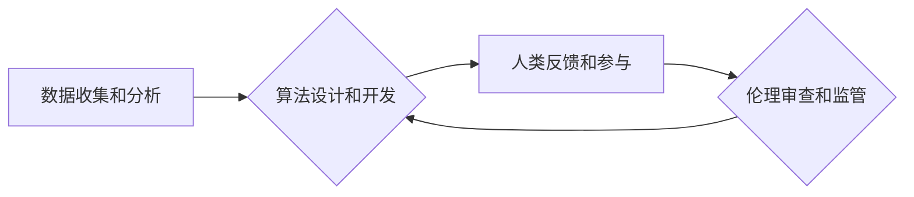

                 

## 人类计算：AI时代的道德和社会责任

> 关键词：人工智能、道德、社会责任、算法偏见、透明度、可解释性、公平性、监管

### 1. 背景介绍

人工智能（AI）正以惊人的速度发展，其应用领域从医疗保健到金融、交通到娱乐，无处不在。AI算法的强大能力可以帮助我们解决复杂问题、提高效率、创造新的价值。然而，随着AI技术的日益成熟，其带来的伦理和社会责任问题也日益凸显。

人类计算是指将人类的智慧和判断力融入到AI系统中，以更好地解决复杂问题，并确保AI技术的应用符合人类的价值观和道德标准。在AI时代，人类计算至关重要，因为它可以帮助我们：

* **避免算法偏见：** AI算法的训练数据可能包含人类社会中的偏见，导致算法产生不公平的结果。人类计算可以帮助我们识别和纠正这些偏见，确保AI算法的公平性和公正性。
* **提高透明度和可解释性：** 许多AI算法是“黑箱”模型，其决策过程难以理解。人类计算可以帮助我们解释AI算法的决策逻辑，提高透明度，并增强公众对AI技术的信任。
* **确保人类控制：** AI技术的发展可能会对人类社会产生深远影响。人类计算可以帮助我们保持对AI技术的控制，确保其应用符合人类的利益和价值观。

### 2. 核心概念与联系

**2.1 人类计算的本质**

人类计算的核心是将人类的智慧和判断力融入到AI系统中，以弥补AI算法的局限性，并确保AI技术的应用符合人类的价值观和道德标准。

**2.2 人类计算与AI技术的融合**

人类计算与AI技术并非相互排斥，而是相互补充。AI技术可以提供强大的计算能力和数据分析能力，而人类的智慧和判断力可以帮助我们理解数据、解释结果，并做出符合人类价值观的决策。

**2.3 人类计算的架构**

人类计算的架构通常包括以下几个关键要素：

* **数据收集和分析：** 收集和分析人类行为、决策和价值观的数据，为AI算法提供训练数据和参考依据。
* **算法设计和开发：** 设计和开发能够融入人类智慧和判断力的AI算法，例如强化学习、进化算法等。
* **人类反馈和参与：** 允许人类参与到AI系统的决策过程中，提供反馈和指导，以确保AI算法的决策符合人类的价值观和道德标准。
* **伦理审查和监管：** 建立伦理审查机制和监管框架，确保AI技术的应用符合人类的利益和价值观。

**Mermaid 流程图**



### 3. 核心算法原理 & 具体操作步骤

**3.1 算法原理概述**

人类计算的核心算法原理是将人类的知识和经验融入到AI算法中，以提高算法的决策能力和适应性。常用的算法包括：

* **强化学习：** 通过奖励和惩罚机制，训练AI算法学习最佳决策策略。
* **进化算法：** 借鉴自然进化机制，通过选择、交叉和变异操作，优化AI算法的性能。
* **案例推理：** 基于人类经验案例库，通过相似性匹配和规则推理，解决新的问题。

**3.2 算法步骤详解**

以强化学习为例，其具体操作步骤如下：

1. **环境建模：** 建立模拟真实世界的环境模型，定义状态、动作和奖励函数。
2. **代理设计：** 设计AI代理，使其能够与环境交互，并根据环境状态选择动作。
3. **策略学习：** 使用强化学习算法，例如Q学习或深度强化学习，训练代理学习最佳策略，以最大化奖励。
4. **策略评估：** 在测试环境中评估代理的策略性能，并进行调整和优化。

**3.3 算法优缺点**

**优点：**

* 能够学习复杂决策策略。
* 适应性强，能够应对不断变化的环境。
* 不需要明确的规则和知识库。

**缺点：**

* 训练过程可能需要大量数据和计算资源。
* 算法的决策过程可能难以解释。
* 容易陷入局部最优解。

**3.4 算法应用领域**

强化学习在许多领域都有广泛的应用，例如：

* **机器人控制：** 训练机器人学习完成复杂的任务，例如导航、抓取和操作。
* **游戏人工智能：** 开发能够与人类玩家进行竞争的游戏AI。
* **金融投资：** 优化投资策略，提高投资回报率。

### 4. 数学模型和公式 & 详细讲解 & 举例说明

**4.1 数学模型构建**

强化学习的数学模型通常包括以下几个关键要素：

* **状态空间 S：** 表示环境可能存在的各种状态。
* **动作空间 A：** 表示代理可以采取的各种动作。
* **奖励函数 R(s, a)：** 给定状态 s 和动作 a，奖励函数 R(s, a) 返回代理获得的奖励值。
* **价值函数 V(s)：** 给定状态 s，价值函数 V(s) 表示从该状态开始执行最佳策略的预期累积奖励。

**4.2 公式推导过程**

Q学习算法的目标是学习一个动作价值函数 Q(s, a)，该函数估计在状态 s 执行动作 a 的预期累积奖励。Q学习算法的更新规则如下：

$$Q(s, a) \leftarrow Q(s, a) + \alpha [r + \gamma \max_{a'} Q(s', a') - Q(s, a)]$$

其中：

* $\alpha$ 是学习率，控制着学习速度。
* $\gamma$ 是折扣因子，控制着未来奖励的权重。
* $r$ 是在状态 s 执行动作 a 后获得的奖励。
* $s'$ 是执行动作 a 后进入的状态。
* $\max_{a'} Q(s', a')$ 是在状态 $s'$ 执行所有可能的动作 a' 的最大动作价值。

**4.3 案例分析与讲解**

假设我们有一个简单的强化学习任务，例如训练一个代理学习玩一个简单的游戏。游戏环境的状态空间包括游戏棋盘的布局，动作空间包括向上、向下、向左、向右四个方向移动。代理的目标是通过移动棋子到达游戏目标位置，获得奖励。

使用Q学习算法，我们可以训练代理学习最佳移动策略。代理会根据当前状态和动作价值函数 Q(s, a) 选择动作，并根据游戏规则获得奖励。通过不断地学习和更新动作价值函数，代理最终会学习到能够到达游戏目标位置的最佳策略。

### 5. 项目实践：代码实例和详细解释说明

**5.1 开发环境搭建**

为了实现人类计算的项目实践，我们需要搭建一个合适的开发环境。常用的开发环境包括：

* **Python：** Python 是一个流行的编程语言，拥有丰富的AI库和工具，例如TensorFlow、PyTorch、Scikit-learn等。
* **Jupyter Notebook：** Jupyter Notebook 是一个交互式编程环境，方便进行代码编写、调试和可视化。
* **云计算平台：** 云计算平台，例如AWS、Azure、GCP等，可以提供强大的计算资源和存储空间，支持大型AI模型的训练和部署。

**5.2 源代码详细实现**

以下是一个简单的强化学习代码实例，使用Python和TensorFlow框架实现：

```python
import tensorflow as tf

# 定义状态空间和动作空间
state_size = 4
action_size = 4

# 定义Q网络
model = tf.keras.Sequential([
    tf.keras.layers.Dense(16, activation='relu', input_shape=(state_size,)),
    tf.keras.layers.Dense(action_size)
])

# 定义损失函数和优化器
optimizer = tf.keras.optimizers.Adam(learning_rate=0.01)
loss_fn = tf.keras.losses.MeanSquaredError()

# 训练Q网络
for episode in range(1000):
    # ... (模拟环境，收集数据，更新Q网络)
```

**5.3 代码解读与分析**

这段代码定义了一个简单的Q网络，用于学习玩一个简单的游戏。

* `state_size` 和 `action_size` 定义了游戏环境的状态空间和动作空间。
* `model` 定义了Q网络的结构，使用两层全连接神经网络。
* `optimizer` 和 `loss_fn` 定义了训练Q网络的优化器和损失函数。
* 训练循环中，模拟游戏环境，收集数据，并使用梯度下降算法更新Q网络的权重。

**5.4 运行结果展示**

训练完成后，我们可以使用训练好的Q网络来玩游戏。代理会根据当前状态和Q网络的输出选择动作，并最终达到游戏目标。

### 6. 实际应用场景

**6.1 医疗保健**

* **疾病诊断：** 利用AI算法分析患者的医疗影像、病史和基因信息，辅助医生进行疾病诊断。
* **个性化治疗：** 根据患者的个体特征，推荐个性化的治疗方案。
* **药物研发：** 利用AI算法加速药物研发过程，发现新的药物靶点和候选药物。

**6.2 金融服务**

* **欺诈检测：** 利用AI算法分析交易数据，识别异常交易行为，防止金融欺诈。
* **风险管理：** 利用AI算法评估投资风险，帮助金融机构进行风险管理。
* **个性化金融服务：** 根据客户的财务状况和需求，提供个性化的金融产品和服务。

**6.3 交通运输**

* **自动驾驶：** 利用AI算法控制车辆，实现自动驾驶功能。
* **交通流量优化：** 利用AI算法分析交通流量数据，优化交通信号灯控制和道路规划。
* **物流配送：** 利用AI算法优化物流配送路线，提高配送效率。

**6.4 未来应用展望**

随着AI技术的不断发展，人类计算将在更多领域得到应用，例如：

* **教育：** 利用AI算法个性化教学，提高学习效率。
* **艺术创作：** 利用AI算法辅助艺术家创作艺术作品。
* **科学研究：** 利用AI算法加速科学研究，发现新的科学规律。

### 7. 工具和资源推荐

**7.1 学习资源推荐**

* **在线课程：** Coursera、edX、Udacity 等平台提供丰富的AI课程。
* **书籍：** 《深度学习》、《人工智能：一种现代方法》等书籍介绍了AI的基本原理和应用。
* **开源项目：** TensorFlow、PyTorch 等开源项目提供了丰富的AI工具和代码示例。

**7.2 开发工具推荐**

* **Python：** Python 是一个流行的编程语言，拥有丰富的AI库和工具。
* **Jupyter Notebook：** Jupyter Notebook 是一个交互式编程环境，方便进行代码编写、调试和可视化。
* **云计算平台：** AWS、Azure、GCP 等云计算平台可以提供强大的计算资源和存储空间，支持大型AI模型的训练和部署。

**7.3 相关论文推荐**

* **《深度学习》**
* **《强化学习：原理、算法和应用》**
* **《人工智能：一种现代方法》**

### 8. 总结：未来发展趋势与挑战

**8.1 研究成果总结**

人类计算在AI领域取得了显著的进展，例如：

* **算法性能提升：** 强化学习算法的性能不断提升，能够解决更复杂的任务。
* **可解释性增强：** 研究人员开发了新的方法，提高AI算法的透明度和可解释性。
* **伦理框架建立：** 针对AI技术的伦理问题，学者和实践者正在建立相应的伦理框架和监管机制。

**8.2 未来发展趋势**

未来，人类计算的发展趋势包括：

* **更强大的AI算法：** 研究人员将继续开发更强大的AI算法，例如通用人工智能。
* **更广泛的应用场景：** 人类计算将应用于更多领域，例如医疗保健、教育、艺术创作等。
* **更深入的人机交互：** 人类和AI将进行更深入的交互，例如自然语言交互、情感识别等。

**8.3 面临的挑战**

人类计算也面临着一些挑战：

* **算法偏见：** AI算法可能继承人类社会中的偏见，导致不公平的结果。
* **数据隐私：** 人类计算需要收集大量数据，如何保护数据隐私是一个重要问题。
* **伦理监管：** 如何制定有效的伦理监管框架，确保AI技术的应用符合人类的利益和价值观，是一个需要不断探索的问题。

**8.4 研究展望**

未来，我们需要继续加强对人类计算的理论研究和实践探索，以确保AI技术的应用安全、有效、可持续。


### 9. 附录：常见问题与解答

**9.1 如何避免AI算法的偏见？**

* 使用多样化的训练数据，确保数据代表真实世界。
* 开发算法检测和纠正偏见的机制。
* 建立伦理审查机制，对AI算法进行评估和监管。

**9.2 如何保护数据隐私？**

* 使用匿名化技术，保护个人身份信息。
* 加密数据传输和存储，防止数据泄露。
* 建立数据使用协议，明确数据使用范围和权限。

**9.3 如何确保AI技术的应用符合人类的利益和价值观？**

* 建立伦理框架和监管机制，明确AI技术的应用边界。
* 促进公众对AI技术的理解和参与，确保AI技术的发展符合社会需求。
* 培养AI技术的伦理意识，引导AI技术应用朝着更加安全、有效、可持续的方向发展。


作者：禅与计算机程序设计艺术 / Zen and the Art of Computer Programming 
<end_of_turn>

