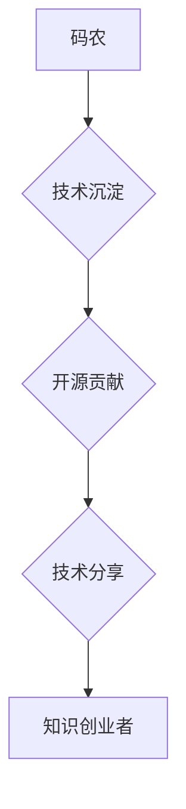

                 

## 从码农到知识创业者的蜕变之路

> 关键词：码农、知识创业、技术迁移、价值创造、知识体系、技术博客、开源社区、技术分享、持续学习

### 1. 背景介绍

在当今科技飞速发展的时代，程序员，也被称为“码农”，是炙手可热的职业。他们用代码构建数字世界，驱动着互联网的蓬勃发展。然而，随着技术的不断迭代和市场竞争的加剧，单纯依靠技术技能的“码农”生涯，逐渐面临着瓶颈。如何从“码农”蜕变为“知识创业者”，创造更大的价值，成为越来越多程序员思考的问题。

### 2. 核心概念与联系

**2.1 码农与知识创业者的区别**

* **码农:** 
    * 以技术技能为核心，专注于代码编写和软件开发。
    * 价值输出主要体现在完成项目和交付成果。
    * 收入来源主要来自薪资或项目报酬。
* **知识创业者:**
    * 以知识和技能为核心，专注于知识的创造、传播和应用。
    * 价值输出主要体现在知识的价值转化和影响力。
    * 收入来源主要来自知识产权、咨询服务、课程培训等。

**2.2 知识创业的本质**

知识创业的核心是将个人积累的知识和技能转化为有价值的产品或服务，并通过有效的传播和应用，创造经济效益和社会价值。

**2.3 码农到知识创业者的技术迁移**

码农拥有扎实的技术基础和解决问题的能力，这些都是知识创业的重要资产。通过以下技术迁移，码农可以逐步转型为知识创业者：

* **技术沉淀:** 将工作经验和技术积累整理成文档、博客文章、视频教程等形式，形成自己的知识体系。
* **开源贡献:** 参与开源项目，积累经验，提升技术水平，并建立个人品牌。
* **技术分享:** 通过技术博客、演讲、培训等方式，分享自己的技术经验和见解，建立个人影响力。

**2.4 Mermaid 流程图**

### 3. 核心算法原理 & 具体操作步骤

**3.1 算法原理概述**

知识创业的核心算法是“价值创造算法”。它包括以下几个步骤：

1. **识别价值需求:** 发现市场或用户存在哪些未被满足的需求。
2. **知识转化:** 将自己的技术技能和经验转化为能够满足需求的产品或服务。
3. **传播推广:** 通过有效的渠道和方式，将产品或服务推广到目标用户。
4. **价值反馈:** 收集用户反馈，不断改进产品或服务，提升价值。

**3.2 算法步骤详解**

1. **识别价值需求:** 
    * 通过市场调研、用户访谈、数据分析等方式，了解用户痛点和需求。
    * 分析行业趋势和技术发展方向，寻找新的价值机会。
2. **知识转化:** 
    * 将技术技能和经验转化为产品或服务，例如开发软件、编写教程、提供咨询服务等。
    * 创新和优化现有产品或服务，提升其价值和竞争力。
3. **传播推广:** 
    * 利用互联网平台、社交媒体、线下活动等渠道，推广产品或服务。
    * 建立个人品牌和影响力，提升产品或服务的信誉度。
4. **价值反馈:** 
    * 收集用户反馈，分析用户体验和需求变化。
    * 根据反馈进行产品或服务迭代优化，不断提升其价值。

**3.3 算法优缺点**

* **优点:** 
    * 能够创造新的价值，实现个人价值和经济效益。
    * 具有较高的自主性和自由度，可以根据自己的兴趣和能力选择发展方向。
* **缺点:** 
    * 需要付出更多的努力和时间，才能积累足够的知识和经验。
    * 需要具备一定的商业意识和市场营销能力。
    * 竞争激烈，需要不断学习和创新，才能保持竞争优势。

**3.4 算法应用领域**

* **软件开发:** 开发新软件、优化现有软件、提供软件咨询服务。
* **技术培训:** 编写技术教程、开设技术培训课程、提供技术指导服务。
* **技术博客:** 分享技术经验和见解，建立个人品牌和影响力。
* **开源社区:** 参与开源项目，积累经验，提升技术水平。

### 4. 数学模型和公式 & 详细讲解 & 举例说明

**4.1 数学模型构建**

知识创业的价值创造过程可以抽象为一个数学模型：

$$Value = Function(Knowledge, Market, Effort)$$

其中：

* **Value:** 创造的价值，可以是经济效益、社会影响力等。
* **Knowledge:** 个人积累的知识和技能。
* **Market:** 市场需求和竞争环境。
* **Effort:** 投入的努力和时间。

**4.2 公式推导过程**

* **Knowledge:** 知识的质量和深度直接影响价值创造的能力。
* **Market:** 市场需求越大，竞争越激烈，价值创造的难度越大。
* **Effort:** 投入的努力和时间越多，价值创造的可能性越大。

**4.3 案例分析与讲解**

例如，一位程序员拥有扎实的软件开发技能（Knowledge），他发现市场对移动应用开发的需求很大（Market），他投入大量时间和精力开发了一款受欢迎的移动应用（Effort），最终获得了丰厚的收益（Value）。

### 5. 项目实践：代码实例和详细解释说明

**5.1 开发环境搭建**

* 选择合适的编程语言和开发工具。
* 设置开发环境，例如安装IDE、数据库、服务器等。

**5.2 源代码详细实现**

* 提供具体的代码示例，展示知识创业项目的实现过程。
* 解释代码的功能和逻辑，帮助读者理解代码的运作机制。

**5.3 代码解读与分析**

* 分析代码的优缺点，例如代码的可读性、效率、安全性等。
* 提出改进建议，帮助读者优化代码质量。

**5.4 运行结果展示**

* 展示项目运行的结果，例如软件界面、数据分析图表等。
* 解释运行结果的含义，验证项目的功能和效果。

### 6. 实际应用场景

**6.1 技术博客写作**

* 分享技术经验和见解，建立个人品牌和影响力。
* 通过博客广告、赞助等方式获得收入。

**6.2 开源项目贡献**

* 参与开源项目，积累经验，提升技术水平。
* 通过开源项目获得认可和声誉，吸引潜在客户或雇主。

**6.3 技术培训课程开发**

* 开发技术培训课程，分享自己的知识和技能。
* 通过线上线下课程销售获得收入。

**6.4 未来应用展望**

* 人工智能、大数据、云计算等新兴技术的应用，将为知识创业提供更多机会。
* 知识经济的不断发展，将更加重视知识的创造和传播。

### 7. 工具和资源推荐

**7.1 学习资源推荐**

* 在线学习平台：Coursera、Udemy、edX等。
* 技术博客和论坛：Stack Overflow、GitHub等。
* 技术书籍和期刊：ACM Digital Library、IEEE Xplore等。

**7.2 开发工具推荐**

* 代码编辑器：VS Code、Sublime Text等。
* 版本控制系统：Git、GitHub等。
* 项目管理工具：Trello、Jira等。

**7.3 相关论文推荐**

* Nonaka, I., & Takeuchi, H. (1995). The knowledge-creating company: How Japanese companies create the dynamics of innovation. Oxford University Press.
* Drucker, P. F. (1999). Management challenges for the 21st century. HarperBusiness.

### 8. 总结：未来发展趋势与挑战

**8.1 研究成果总结**

* 知识创业是未来经济发展的重要趋势。
* 码农可以通过技术迁移，逐步转型为知识创业者。
* 知识创造、传播和应用是知识创业的核心要素。

**8.2 未来发展趋势**

* 人工智能、大数据、云计算等新兴技术的应用，将为知识创业提供更多机会。
* 知识经济的不断发展，将更加重视知识的创造和传播。
* 知识创业将更加注重个性化、定制化和协作性。

**8.3 面临的挑战**

* 知识创业需要付出更多的努力和时间，才能积累足够的知识和经验。
* 需要具备一定的商业意识和市场营销能力。
* 竞争激烈，需要不断学习和创新，才能保持竞争优势。

**8.4 研究展望**

* 深入研究知识创业的机制和模式，探索更有效的知识创造和传播方法。
* 研究知识创业对个人和社会的影响，促进知识经济的健康发展。

### 9. 附录：常见问题与解答

* **Q1: 如何积累知识和经验？**
    * **A1:** 通过阅读技术书籍、参加技术培训、参与开源项目、撰写技术博客等方式积累知识和经验。
* **Q2: 如何找到合适的知识创业方向？**
    * **A2:** 分析市场需求、关注技术发展趋势、结合自己的兴趣和能力选择合适的知识创业方向。
* **Q3: 如何推广自己的知识产品或服务？**
    * **A3:** 利用互联网平台、社交媒体、线下活动等渠道推广知识产品或服务。
* **Q4: 如何应对知识创业的挑战？**
    * **A4:** 保持学习和创新，不断提升自己的知识和技能，积极拓展人脉和资源，克服困难，坚持不懈。

作者：禅与计算机程序设计艺术 / Zen and the Art of Computer Programming 
<end_of_turn>

