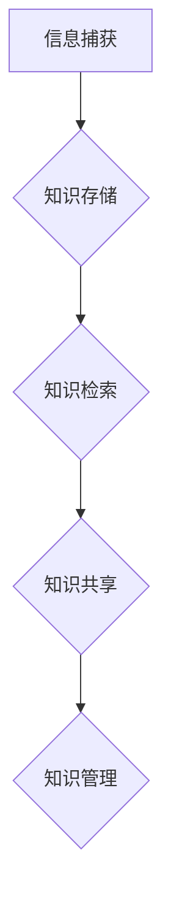

                 

## 信息过载与知识管理系统实施：有效组织和检索信息的指南

> 关键词：信息过载、知识管理系统、知识组织、信息检索、人工智能、机器学习、自然语言处理、数据可视化、知识图谱

### 1. 背景介绍

在当今信息爆炸的时代，我们每天接触的海量信息呈指数级增长。从新闻资讯到学术论文，从社交媒体到专业文档，信息无处不在，却也带来了“信息过载”的困境。过度的信息涌入不仅难以消化，还会导致注意力分散、效率低下，甚至影响决策的准确性。

面对这一挑战，知识管理系统 (Knowledge Management System, KMS) 应运而生。KMS 旨在帮助个人和组织有效地收集、组织、存储、检索和共享知识，从而提高知识利用率，促进知识创新和决策支持。

### 2. 核心概念与联系

**2.1 信息过载与知识管理的关联**

信息过载是指个体或组织在短时间内接收和处理信息量过大，导致认知能力超负荷，难以有效地获取、理解和利用信息的状态。知识管理系统旨在解决信息过载带来的问题，通过建立知识库、提供知识检索工具和促进知识共享机制，帮助个人和组织有效地管理和利用知识。

**2.2 KMS 的核心功能**

KMS 的核心功能包括：

* **知识捕获:** 收集和记录来自各种来源的知识，包括文档、数据、经验和专家的见解。
* **知识存储:** 将捕获的知识进行组织和存储，以便于检索和访问。
* **知识共享:** 提供机制和平台，方便知识的传播和交流。
* **知识检索:** 提供高效的工具和方法，帮助用户快速找到所需的信息。
* **知识管理:** 评估知识的价值，制定知识管理策略，并不断优化知识管理流程。

**2.3 KMS 架构**

KMS 的架构通常包括以下几个关键组件：

* **知识库:** 存储各种形式的知识，包括文本、图像、音频、视频等。
* **检索引擎:** 使用人工智能和机器学习算法，帮助用户快速找到所需的信息。
* **知识共享平台:** 提供协作工具和机制，方便知识的传播和交流。
* **用户界面:** 提供友好的用户界面，方便用户访问和使用 KMS。

**2.4 Mermaid 流程图**



### 3. 核心算法原理 & 具体操作步骤

**3.1 算法原理概述**

KMS 中常用的算法包括：

* **文本挖掘:** 用于从文本数据中提取关键信息，如主题、关键词、情感等。
* **机器学习:** 用于构建知识图谱、实现知识推荐和个性化信息推送等功能。
* **自然语言处理:** 用于理解和处理自然语言文本，例如文本分类、问答系统等。

**3.2 算法步骤详解**

以文本挖掘为例，其基本步骤包括：

1. **数据预处理:** 清洗文本数据，去除停用词、标点符号等，并进行分词和词干提取等操作。
2. **特征提取:** 使用词频统计、TF-IDF等方法提取文本特征。
3. **模型训练:** 使用机器学习算法，例如朴素贝叶斯、支持向量机等，训练文本分类模型。
4. **模型评估:** 使用测试数据评估模型的性能，并进行调参优化。
5. **应用部署:** 将训练好的模型部署到 KMS 系统中，用于文本分类、主题提取等任务。

**3.3 算法优缺点**

* **优点:** 可以自动提取文本中的关键信息，提高知识发现效率。
* **缺点:** 需要大量的训练数据，算法效果受数据质量影响较大。

**3.4 算法应用领域**

* 文本分类、主题提取、情感分析
* 知识图谱构建、知识推荐
* 问答系统、智能搜索

### 4. 数学模型和公式 & 详细讲解 & 举例说明

**4.1 数学模型构建**

文本挖掘中常用的数学模型包括：

* **词频统计:** 计算每个词在文本中出现的频率。
* **TF-IDF:** 衡量词在文档中的重要性，并考虑词在整个语料库中的稀疏性。

**4.2 公式推导过程**

* **词频统计:**

$$
TF(t,d) = \frac{f(t,d)}{ \sum_{t' \in d} f(t',d)}
$$

其中：

* $TF(t,d)$ 表示词 $t$ 在文档 $d$ 中的词频。
* $f(t,d)$ 表示词 $t$ 在文档 $d$ 中出现的次数。
* $\sum_{t' \in d} f(t',d)$ 表示文档 $d$ 中所有词的总次数。

* **TF-IDF:**

$$
IDF(t) = log_e \frac{N}{df(t)}
$$

$$
TF-IDF(t,d) = TF(t,d) \times IDF(t)
$$

其中：

* $IDF(t)$ 表示词 $t$ 在整个语料库中的逆向文档频率。
* $N$ 表示语料库中文档总数。
* $df(t)$ 表示词 $t$ 在语料库中出现的文档数。

**4.3 案例分析与讲解**

假设我们有一个语料库包含1000篇文档，其中包含以下词语：

* “计算机”
* “编程”
* “人工智能”

如果词语“计算机”在100篇文档中出现，则其IDF值为：

$$
IDF("计算机") = log_e \frac{1000}{100} = 2
$$

如果词语“计算机”在文档 $d$ 中出现5次，则其TF值为：

$$
TF("计算机", d) = \frac{5}{10} = 0.5
$$

因此，词语“计算机”在文档 $d$ 中的TF-IDF值为：

$$
TF-IDF("计算机", d) = 0.5 \times 2 = 1
$$

### 5. 项目实践：代码实例和详细解释说明

**5.1 开发环境搭建**

* Python 3.x
* scikit-learn
* NLTK
* SpaCy

**5.2 源代码详细实现**

```python
from sklearn.feature_extraction.text import TfidfVectorizer

# 文本数据
documents = [
    "This is the first document.",
    "This document is the second document.",
    "And this is the third one.",
    "Is this the first document?"
]

# 创建 TF-IDF 向量化器
vectorizer = TfidfVectorizer()

# 将文本数据转换为 TF-IDF 向量
tfidf_matrix = vectorizer.fit_transform(documents)

# 打印 TF-IDF 向量
print(tfidf_matrix.toarray())
```

**5.3 代码解读与分析**

* 使用 `TfidfVectorizer` 类创建 TF-IDF 向量化器。
* 使用 `fit_transform` 方法将文本数据转换为 TF-IDF 向量。
* 使用 `toarray` 方法将 TF-IDF 向量转换为 NumPy 数组，以便打印输出。

**5.4 运行结果展示**

运行代码后，将输出一个 TF-IDF 向量矩阵，其中每一行代表一个文档，每一列代表一个词语，矩阵元素表示词语在文档中的 TF-IDF 值。

### 6. 实际应用场景

KMS 在各个领域都有广泛的应用场景：

* **企业知识管理:** 记录和共享企业内部的知识资产，提高知识利用率和创新能力。
* **教育领域:** 建立知识库，提供在线学习资源，促进知识传播和学习。
* **医疗保健:** 记录和共享患者信息、医疗知识和最佳实践，提高医疗服务质量。
* **科研领域:** 建立知识图谱，促进科研成果的发现和共享。

**6.4 未来应用展望**

随着人工智能和机器学习技术的不断发展，KMS 将更加智能化和个性化。未来 KMS 可能具备以下功能：

* **主动知识发现:** 基于用户行为和知识需求，主动推荐相关知识。
* **个性化知识服务:** 根据用户的角色、兴趣和知识水平，提供个性化的知识服务。
* **跨领域知识融合:** 将不同领域的知识进行融合，促进跨学科研究和创新。

### 7. 工具和资源推荐

**7.1 学习资源推荐**

* **书籍:**
    * 《知识管理：理论与实践》
    * 《知识管理系统设计与实施》
* **在线课程:**
    * Coursera: Knowledge Management
    * edX: Introduction to Knowledge Management

**7.2 开发工具推荐**

* **开源 KMS 平台:**
    * Alfresco
    * Confluence
    * Drupal
* **商业 KMS 平台:**
    * IBM Connections
    * Microsoft SharePoint
    * Oracle WebCenter

**7.3 相关论文推荐**

* **Davenport, T. H., & Prusak, L. (1998). Working knowledge: How organizations manage what they know. Harvard Business School Press.**
* **Nonaka, I., & Takeuchi, H. (1995). The knowledge-creating company: How Japanese companies create the dynamics of innovation. Oxford University Press.**

### 8. 总结：未来发展趋势与挑战

**8.1 研究成果总结**

KMS 已经取得了显著的成果，帮助个人和组织有效地管理和利用知识。

**8.2 未来发展趋势**

未来 KMS 将更加智能化、个性化和跨领域融合。

**8.3 面临的挑战**

* **数据质量:** KMS 的效果依赖于数据质量，如何保证数据准确性和完整性是一个挑战。
* **知识共享:** 知识共享需要克服组织文化和个人心理障碍。
* **技术复杂性:** KMS 的技术复杂性不断增加，需要不断提升技术人员的技能水平。

**8.4 研究展望**

未来 KMS 研究将重点关注以下几个方面:

* **人工智能和机器学习的应用:** 利用人工智能和机器学习技术，提高 KMS 的智能化和自动化程度。
* **知识图谱的构建和应用:** 建立更加完善的知识图谱，促进跨领域知识融合。
* **个性化知识服务:** 提供更加个性化的知识服务，满足不同用户的需求。

### 9. 附录：常见问题与解答

**9.1 如何选择合适的 KMS 平台？**

选择 KMS 平台需要考虑以下因素:

* **组织规模和需求:** 不同规模的组织和不同的知识管理需求，需要选择不同的 KMS 平台。
* **预算和成本:** KMS 平台的成本包括软件费用、硬件费用、维护费用等。
* **技术支持:** 选择具有良好技术支持的 KMS 平台，可以及时解决技术问题。

**9.2 如何提高 KMS 的使用率？**

提高 KMS 的使用率需要采取以下措施:

* **提供易于使用的界面:** KMS 的界面应该简洁易懂，方便用户操作。
* **提供丰富的知识资源:** KMS 应该包含丰富的知识资源，满足用户的需求。
* **鼓励知识共享:** 建立良好的知识共享文化，鼓励用户积极参与知识分享。


作者：禅与计算机程序设计艺术 / Zen and the Art of Computer Programming 
<end_of_turn>

