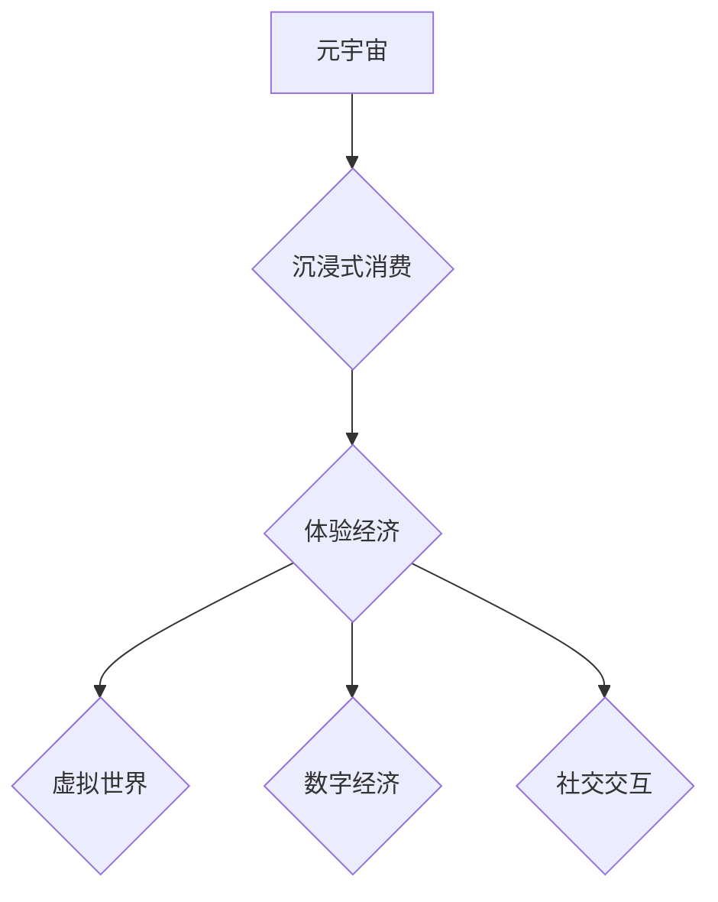

                 

## 元宇宙体验经济：沉浸式消费的新形态

> 关键词：元宇宙、体验经济、沉浸式消费、虚拟现实、增强现实、区块链、NFT

## 1. 背景介绍

近年来，随着虚拟现实 (VR)、增强现实 (AR) 和区块链技术的快速发展，元宇宙的概念逐渐从科幻小说走向现实。元宇宙被定义为一个由虚拟世界、数字经济和社交交互构成的下一代互联网，它将打破物理世界和虚拟世界的界限，为用户提供更加沉浸式、交互式和个性化的体验。

体验经济的兴起为元宇宙的发展提供了重要的理论基础。体验经济强调的是提供独特的、难忘的体验，而非仅仅提供产品或服务。在元宇宙中，用户可以参与到各种虚拟活动中，例如游戏、社交、购物、学习和工作，这些活动都能够提供独特的体验，从而满足用户的精神需求和情感需求。

## 2. 核心概念与联系

元宇宙体验经济的核心概念包括：

* **元宇宙 (Metaverse):** 一个由虚拟世界、数字经济和社交交互构成的下一代互联网。
* **体验经济 (Experience Economy):** 强调提供独特的、难忘的体验，而非仅仅提供产品或服务。
* **沉浸式消费 (Immersive Consumption):** 通过VR、AR等技术，将用户沉浸到虚拟世界中，提供更加真实、互动和个性化的消费体验。

**核心概念架构图:**



## 3. 核心算法原理 & 具体操作步骤

元宇宙体验经济的实现依赖于多种核心算法，例如：

* **3D建模和渲染算法:** 用于构建虚拟世界中的场景、物体和人物。
* **物理模拟算法:** 用于模拟虚拟世界中的物理现象，例如重力、碰撞和运动。
* **人工智能算法:** 用于实现虚拟角色的智能行为和对话。
* **区块链算法:** 用于保障虚拟资产的安全性和可追溯性。

### 3.1  算法原理概述

* **3D建模和渲染算法:** 基于数学模型和图形学原理，将三维物体数字化并生成图像。常用的算法包括三角网格法、NURBS曲面法和体素法。
* **物理模拟算法:** 基于牛顿运动定律和力学原理，模拟物体之间的相互作用和运动轨迹。常用的算法包括有限元法、粒子系统和布料模拟。
* **人工智能算法:** 包括机器学习、深度学习和自然语言处理等，用于训练虚拟角色的智能行为和对话能力。

### 3.2  算法步骤详解

* **3D建模和渲染算法:**
    1. 建立三维模型：使用3D建模软件创建虚拟世界的场景、物体和人物。
    2. 划分三角网格：将三维模型分解成多个三角形，方便进行渲染。
    3. 计算光照和阴影：根据光源的位置和强度，计算物体表面上的光照和阴影效果。
    4. 生成图像：将渲染后的数据转换为图像，显示在用户设备上。
* **物理模拟算法:**
    1. 建立物理模型：定义物体的形状、质量、材质和运动状态。
    2. 计算力：根据物体之间的相互作用，计算每个物体的受力情况。
    3. 更新运动状态：根据牛顿运动定律，更新每个物体的速度和位置。
    4. 渲染结果：将模拟后的运动轨迹渲染成图像，显示在用户设备上。

### 3.3  算法优缺点

* **3D建模和渲染算法:**
    * 优点：能够创建逼真的虚拟世界，提供沉浸式的视觉体验。
    * 缺点：计算量大，对硬件性能要求高。
* **物理模拟算法:**
    * 优点：能够模拟真实世界的物理现象，增强虚拟世界的真实感。
    * 缺点：计算复杂度高，容易出现精度问题。

### 3.4  算法应用领域

* **游戏开发:** 创建逼真的游戏场景和物理效果。
* **虚拟现实 (VR) 和增强现实 (AR):** 提供沉浸式的虚拟体验和增强现实效果。
* **建筑设计和模拟:** 模拟建筑物的结构和功能，进行虚拟设计和测试。
* **医疗培训:** 提供虚拟手术模拟和医疗培训场景。

## 4. 数学模型和公式 & 详细讲解 & 举例说明

元宇宙体验经济的实现依赖于多种数学模型和公式，例如：

* **3D空间坐标系:** 用于描述虚拟世界中的物体位置和方向。
* **线性代数:** 用于处理矩阵和向量，实现物体变换和运动。
* **微积分:** 用于计算物体运动的速度和加速度，实现物理模拟。
* **概率论和统计学:** 用于分析用户行为和预测用户需求。

### 4.1  数学模型构建

* **3D空间坐标系:** 使用笛卡尔坐标系描述虚拟世界中的三维空间，每个物体的位置可以用三个坐标值 (x, y, z) 表示。
* **线性代数:** 使用矩阵和向量来表示物体的位置、方向和运动状态。例如，可以使用旋转矩阵来描述物体的旋转运动，使用平移矩阵来描述物体的平移运动。
* **微积分:** 使用微积分的导数和积分来计算物体的速度和加速度，实现物理模拟。例如，可以使用牛顿第二定律 (F = ma) 来计算物体的加速度，根据速度和加速度的积分关系来计算物体的运动轨迹。

### 4.2  公式推导过程

* **物体运动方程:** 根据牛顿第二定律，物体运动方程可以表示为：

$$
F = ma
$$

其中，F 是物体所受的合力，m 是物体的质量，a 是物体的加速度。

* **速度和位置的积分关系:** 物体的速度和位置可以通过积分关系来计算：

$$
v = \int a dt
$$

$$
x = \int v dt
$$

其中，v 是物体的速度，x 是物体的位移，t 是时间。

### 4.3  案例分析与讲解

例如，在模拟一个球体的自由落体运动时，我们可以使用以下公式：

* **重力加速度:**  g = 9.8 m/s²
* **物体运动方程:**  F = mg，a = g
* **速度方程:** v = gt
* **位置方程:** x = (1/2)gt²

通过这些公式，我们可以计算出球体在不同时间点的速度和位置，从而模拟出球体的自由落体运动轨迹。

## 5. 项目实践：代码实例和详细解释说明

以下是一个简单的元宇宙体验经济项目示例，使用Python语言实现一个虚拟商店的场景：

### 5.1  开发环境搭建

* Python 3.x
* Pygame 库

### 5.2  源代码详细实现

```python
import pygame

# 初始化 Pygame
pygame.init()

# 设置窗口大小
width = 800
height = 600
screen = pygame.display.set_mode((width, height))

# 设置标题
pygame.display.set_caption("虚拟商店")

# 加载图像
background_image = pygame.image.load("background.png").convert()
product_image = pygame.image.load("product.png").convert()

# 设置产品位置
product_x = 300
product_y = 200

# 游戏循环
running = True
while running:
    # 处理事件
    for event in pygame.event.get():
        if event.type == pygame.QUIT:
            running = False

    # 清空屏幕
    screen.blit(background_image, (0, 0))

    # 绘制产品
    screen.blit(product_image, (product_x, product_y))

    # 更新显示
    pygame.display.flip()

# 退出 Pygame
pygame.quit()
```

### 5.3  代码解读与分析

* 该代码使用Pygame库创建了一个简单的虚拟商店场景。
* 首先，初始化Pygame并设置窗口大小和标题。
* 然后，加载背景图像和产品图像。
* 在游戏循环中，处理事件，清空屏幕，绘制产品，并更新显示。
* 当用户点击关闭按钮时，游戏循环结束，退出Pygame。

### 5.4  运行结果展示

运行该代码后，将显示一个虚拟商店的窗口，包含一个背景图像和一个产品图像。

## 6. 实际应用场景

元宇宙体验经济的应用场景非常广泛，例如：

* **虚拟购物:** 用户可以在虚拟商店中浏览商品、试穿衣服、体验产品，并进行在线购买。
* **虚拟旅游:** 用户可以虚拟游览世界各地，体验不同的文化和风景。
* **虚拟社交:** 用户可以在虚拟世界中与朋友和家人互动，参加虚拟聚会和活动。
* **虚拟教育:** 用户可以参与到虚拟课堂中，学习新的知识和技能。
* **虚拟娱乐:** 用户可以体验虚拟游戏、音乐会、电影等娱乐活动。

### 6.4  未来应用展望

随着元宇宙技术的不断发展，未来元宇宙体验经济将更加丰富和多元，例如：

* **更逼真的虚拟体验:** 使用更先进的VR/AR技术，创造更加逼真的虚拟世界。
* **更个性化的体验:** 利用人工智能技术，根据用户的喜好和需求，提供更加个性化的体验。
* **更丰富的互动方式:** 支持更多元的互动方式，例如手势识别、语音交互和脑机接口。
* **更广泛的应用场景:** 元宇宙体验经济将应用于更多领域，例如医疗、教育、金融和政府。

## 7. 工具和资源推荐

### 7.1  学习资源推荐

* **书籍:**
    * 《元宇宙：下一代互联网》
    * 《元宇宙：虚拟世界与现实世界的融合》
* **在线课程:**
    * Coursera: 元宇宙技术
    * Udemy: 元宇宙开发
* **博客和论坛:**
    * Metaculus: 元宇宙预测
    * Reddit: r/metaverse

### 7.2  开发工具推荐

* **Unity:** 游戏引擎，用于开发VR/AR应用。
* **Unreal Engine:** 游戏引擎，用于开发高品质的虚拟世界。
* **Blender:** 3D建模软件，用于创建虚拟世界中的场景和物体。
* **A-Frame:** 基于Web的VR开发框架。

### 7.3  相关论文推荐

* **The Metaverse: A New Paradigm for Human Interaction**
* **Towards a Framework for Understanding the Metaverse**
* **The Economics of the Metaverse**

## 8. 总结：未来发展趋势与挑战

元宇宙体验经济是一个充满机遇和挑战的领域。未来，元宇宙体验经济将朝着更加沉浸式、交互式和个性化的方向发展，并应用于更多领域。

### 8.1  研究成果总结

* 元宇宙体验经济的核心概念和技术已经初步形成。
* 虚拟现实、增强现实和区块链技术为元宇宙体验经济的发展提供了重要基础。
* 许多公司和研究机构正在积极探索元宇宙体验经济的应用场景。

### 8.2  未来发展趋势

* **更逼真的虚拟体验:** 使用更先进的VR/AR技术，创造更加逼真的虚拟世界。
* **更个性化的体验:** 利用人工智能技术，根据用户的喜好和需求，提供更加个性化的体验。
* **更丰富的互动方式:** 支持更多元的互动方式，例如手势识别、语音交互和脑机接口。
* **更广泛的应用场景:** 元宇宙体验经济将应用于更多领域，例如医疗、教育、金融和政府。

### 8.3  面临的挑战

* **技术挑战:** 构建更加逼真、交互性和沉浸式的虚拟世界仍然面临技术挑战。
* **伦理挑战:** 元宇宙体验经济涉及到隐私、安全、公平等伦理问题，需要谨慎对待。
* **社会挑战:** 元宇宙体验经济可能会改变人们的生活方式和社会结构，需要进行深入的社会研究和讨论。

### 8.4  研究展望

未来，元宇宙体验经济的研究将更加深入和广泛，涵盖技术、伦理、社会等多个方面。


## 9. 附录：常见问题与解答

* **什么是元宇宙？**

元宇宙是一个由虚拟世界、数字经济和社交交互构成的下一代互联网。

* **元宇宙体验经济是什么？**

元宇宙体验经济是指在元宇宙中提供独特的、难忘的体验，而非仅仅提供产品或服务。

* **元宇宙体验经济有哪些应用场景？**

元宇宙体验经济的应用场景非常广泛，例如虚拟购物、虚拟旅游、虚拟社交、虚拟教育和虚拟娱乐。

* **元宇宙体验经济面临哪些挑战？**

元宇宙体验经济面临的技术挑战、伦理挑战和社会挑战。

* **元宇宙体验经济的未来发展趋势是什么？**

元宇宙体验经济将朝着更加沉浸式、交互式和个性化的方向发展，并应用于更多领域。


作者：禅与计算机程序设计艺术 / Zen and the Art of Computer Programming 
<end_of_turn>

