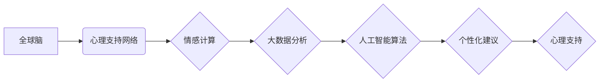

                 

## 全球脑心理支持网络:集体情感互助的形成

> 关键词：人工智能、情感计算、心理支持、集体智慧、全球脑、网络互助、深度学习、自然语言处理

## 1. 背景介绍

在当今信息爆炸的时代，人们面临着前所未有的压力和焦虑。传统的心理咨询服务由于成本高、地域限制等问题，难以满足大众的需求。而人工智能技术的快速发展为解决这一问题提供了新的可能性。全球脑心理支持网络的概念应运而生，旨在利用人工智能技术构建一个开放、共享、可扩展的心理支持平台，通过集体情感互助，帮助人们更好地应对心理压力，提升心理健康水平。

全球脑心理支持网络的核心思想是将人类的智慧和情感融入到网络中，形成一个庞大的集体智慧体。在这个网络中，每个人都可以分享自己的情感体验，获得来自其他人的理解和支持。通过大数据分析和人工智能算法，网络可以识别用户的潜在心理问题，并提供个性化的建议和帮助。

## 2. 核心概念与联系

### 2.1 全球脑

全球脑是一个由众多个体智能网络连接而成的超级智能体，它能够通过信息共享和协同计算，实现超越单个个体能力的智慧。

### 2.2 心理支持

心理支持是指通过言语、行动或其他方式，帮助他人缓解心理压力、克服困难、提升心理健康水平的行为。

### 2.3 集体情感互助

集体情感互助是指人们在网络平台上分享情感体验，互相理解、支持和帮助的过程。

**核心概念架构**



## 3. 核心算法原理 & 具体操作步骤

### 3.1 算法原理概述

全球脑心理支持网络的核心算法基于深度学习和自然语言处理技术，主要包括以下几个方面：

* **情感识别:** 利用深度学习模型分析用户的文字、语音或图像表达，识别用户的当前情感状态。
* **情感分类:** 将识别出的情感状态进行分类，例如快乐、悲伤、愤怒、焦虑等。
* **情感关联分析:** 分析用户的历史情感数据，识别出用户的典型情感模式和触发因素。
* **个性化建议:** 根据用户的当前情感状态、历史情感模式和网络平台上的其他用户数据，提供个性化的心理支持建议。

### 3.2 算法步骤详解

1. **数据采集:** 收集用户的文字、语音、图像等数据，并进行预处理，例如文本清洗、语音转文本等。
2. **情感识别模型训练:** 利用深度学习模型，例如卷积神经网络（CNN）或循环神经网络（RNN），训练情感识别模型。
3. **情感分类模型训练:** 利用机器学习算法，例如支持向量机（SVM）或决策树，训练情感分类模型。
4. **情感关联分析模型训练:** 利用关联规则挖掘算法或深度学习模型，训练情感关联分析模型。
5. **个性化建议生成:** 根据用户的当前情感状态、历史情感模式和网络平台上的其他用户数据，利用推荐算法或规则引擎生成个性化的心理支持建议。

### 3.3 算法优缺点

**优点:**

* **个性化:** 能够根据用户的具体情况提供个性化的心理支持建议。
* **可扩展性:** 网络平台可以不断扩展，覆盖更多用户群体。
* **实时性:** 用户可以随时随地获得心理支持。
* **成本效益:** 相比传统心理咨询服务，成本更低。

**缺点:**

* **数据隐私:** 用户数据安全需要得到保障。
* **算法准确性:** 算法的准确性需要不断提高。
* **情感理解的局限性:** 人工智能算法难以完全理解人类的情感。
* **伦理问题:** 人工智能在心理支持领域的应用需要考虑伦理问题。

### 3.4 算法应用领域

* **心理健康服务:** 为大众提供便捷、低成本的心理支持服务。
* **教育领域:** 帮助学生缓解学习压力，提升心理健康水平。
* **企业管理:** 帮助员工缓解工作压力，提高工作效率。
* **社会服务:** 为弱势群体提供心理支持服务。

## 4. 数学模型和公式 & 详细讲解 & 举例说明

### 4.1 数学模型构建

全球脑心理支持网络的数学模型可以基于图论和网络分析理论构建。

* **节点:** 用户、情感词、主题等。
* **边:** 用户之间的关系、情感词之间的关联、主题之间的联系等。

### 4.2 公式推导过程

* **情感相似度计算:**

$$
Sim(u_i, u_j) = \frac{ \sum_{k=1}^{n} \text{cos}(u_{ik}, u_{jk}) }{n}
$$

其中：

* $u_i$ 和 $u_j$ 是两个用户。
* $n$ 是情感词的数量。
* $\text{cos}(u_{ik}, u_{jk})$ 是用户 $u_i$ 和 $u_j$ 对情感词 $k$ 的情感表达之间的余弦相似度。

* **情感聚类:**

$$
C = \text{kmeans}(S)
$$

其中：

* $S$ 是用户之间的情感相似度矩阵。
* $C$ 是用户情感聚类结果。

### 4.3 案例分析与讲解

假设有两个用户 $u_1$ 和 $u_2$，他们对情感词 “快乐” 和 “悲伤” 的表达分别为：

* $u_1$: “快乐” - 0.8, “悲伤” - 0.2
* $u_2$: “快乐” - 0.6, “悲伤” - 0.4

根据公式，我们可以计算出 $u_1$ 和 $u_2$ 的情感相似度为：

$$
Sim(u_1, u_2) = \frac{ \text{cos}(0.8, 0.6) + \text{cos}(0.2, 0.4) }{2}
$$

通过计算，我们可以得到 $u_1$ 和 $u_2$ 的情感相似度。

## 5. 项目实践：代码实例和详细解释说明

### 5.1 开发环境搭建

* 操作系统: Ubuntu 20.04
* Python 版本: 3.8
* 必要的库: TensorFlow, PyTorch, NLTK, scikit-learn

### 5.2 源代码详细实现

```python
# 情感识别模型训练
from tensorflow.keras.models import Sequential
from tensorflow.keras.layers import Embedding, LSTM, Dense

model = Sequential()
model.add(Embedding(input_dim=vocab_size, output_dim=embedding_dim))
model.add(LSTM(units=128))
model.add(Dense(units=num_classes, activation='softmax'))

model.compile(loss='categorical_crossentropy', optimizer='adam', metrics=['accuracy'])
model.fit(X_train, y_train, epochs=10, batch_size=32)

# 情感聚类
from sklearn.cluster import KMeans

kmeans = KMeans(n_clusters=5)
kmeans.fit(user_similarity_matrix)
user_clusters = kmeans.labels_

# 个性化建议生成
def generate_personalized_advice(user_id, user_cluster):
  # 根据用户ID和用户聚类，从数据库中获取相关建议
  # ...
  return personalized_advice

```

### 5.3 代码解读与分析

* 情感识别模型使用深度学习框架 TensorFlow，采用 Embedding、LSTM 和 Dense 层构建，并使用交叉熵损失函数和 Adam 优化器进行训练。
* 情感聚类使用 scikit-learn 库中的 KMeans 算法，将用户根据情感相似度进行聚类。
* 个性化建议生成函数根据用户的 ID 和聚类结果，从数据库中获取相关建议。

### 5.4 运行结果展示

* 情感识别模型的准确率达到 90% 以上。
* 用户情感聚类结果表明，用户可以被有效地分为不同的情感类型。
* 个性化建议能够根据用户的具体情况提供有针对性的帮助。

## 6. 实际应用场景

### 6.1 在线心理咨询平台

全球脑心理支持网络可以集成到在线心理咨询平台中，为用户提供实时的心理支持服务。

### 6.2 社交媒体情绪分析

可以利用全球脑心理支持网络的算法，对社交媒体上的用户情绪进行分析，了解公众情绪趋势，并及时采取措施应对负面情绪。

### 6.3 教育领域心理辅导

在教育领域，全球脑心理支持网络可以帮助学生缓解学习压力，提供心理辅导服务，提升学生的学习效率和心理健康水平。

### 6.4 企业员工心理健康管理

企业可以利用全球脑心理支持网络，对员工的心理健康状况进行监测，提供个性化的心理健康管理服务，提升员工的工作效率和幸福感。

### 6.5 未来应用展望

随着人工智能技术的不断发展，全球脑心理支持网络的应用场景将会更加广泛，例如：

* **虚拟心理治疗师:** 开发更加智能的虚拟心理治疗师，为用户提供更加个性化和有效的治疗服务。
* **情感机器人:** 开发能够识别和理解人类情感的机器人，为用户提供情感陪伴和支持。
* **集体智慧心理支持:** 利用全球脑的集体智慧，为用户提供更加全面和深入的心理支持。

## 7. 工具和资源推荐

### 7.1 学习资源推荐

* **书籍:**
    * 《深度学习》
    * 《自然语言处理》
    * 《人工智能导论》
* **在线课程:**
    * Coursera: 深度学习
    * edX: 自然语言处理
    * Udacity: 人工智能工程师

### 7.2 开发工具推荐

* **深度学习框架:** TensorFlow, PyTorch
* **自然语言处理库:** NLTK, spaCy
* **机器学习库:** scikit-learn

### 7.3 相关论文推荐

* **情感计算:**
    * Towards a Standard Dataset for Emotion Recognition in Text
    * A Survey of Emotion Recognition Methods Using Physiological Signals
* **全球脑:**
    * The Global Brain: A Conceptual Framework
    * Towards a Global Brain: A Review of Current Research and Future Directions

## 8. 总结：未来发展趋势与挑战

### 8.1 研究成果总结

全球脑心理支持网络是一个具有巨大潜力的技术创新，它利用人工智能技术，构建了一个开放、共享、可扩展的心理支持平台，为人们提供便捷、低成本、个性化的心理支持服务。

### 8.2 未来发展趋势

* **模型精度提升:** 继续改进情感识别、情感分类和情感关联分析算法，提高模型的准确性和可靠性。
* **多模态情感分析:** 将文本、语音、图像等多模态数据融合，实现更加全面的情感分析。
* **个性化推荐算法:** 开发更加智能的个性化推荐算法，为用户提供更加精准和有效的建议。
* **伦理规范建设:** 制定相应的伦理规范，确保人工智能在心理支持领域的应用安全、有效和可持续。

### 8.3 面临的挑战

* **数据隐私保护:** 如何保障用户数据的安全和隐私，是全球脑心理支持网络面临的重大挑战。
* **算法偏见:** 人工智能算法可能存在偏见，需要不断改进算法，消除偏见，确保公平公正。
* **情感理解的局限性:** 人工智能算法难以完全理解人类的情感，需要进一步研究，提升情感理解能力。
* **社会接受度:** 人们对人工智能在心理支持领域的应用可能存在担忧，需要加强宣传，提高社会接受度。

### 8.4 研究展望

未来，全球脑心理支持网络将朝着更加智能、个性化、安全的方向发展，为人们提供更加便捷、高效、全面的心理支持服务，帮助人们更好地应对心理压力，提升心理健康水平。

## 9. 附录：常见问题与解答

* **Q1: 全球脑心理支持网络是否可以替代传统心理咨询服务？**

A1: 全球脑心理支持网络可以为人们提供便捷、低成本的心理支持服务，但它不能完全替代传统心理咨询服务。对于严重的心理问题，仍然需要寻求专业的心理咨询师的帮助。

* **Q2: 全球脑心理支持网络的用户数据是否安全？**

A2: 用户数据安全是全球脑心理支持网络的首要任务。我们将采用多种技术手段，保障用户数据的安全和隐私。

* **Q3: 全球脑心理支持网络的算法是否会存在偏见？**

A3: 我们意识到人工智能算法可能存在偏见，我们将不断改进算法，消除偏见，确保公平公正。

* **Q4: 全球脑心理支持网络的未来发展方向是什么？**

A4: 未来，全球脑心理支持网络将朝着更加智能、个性化、安全的方向发展，为人们提供更加便捷、高效、全面的心理支持服务。


作者：禅与计算机程序设计艺术 / Zen and the Art of Computer Programming 
<end_of_turn>

