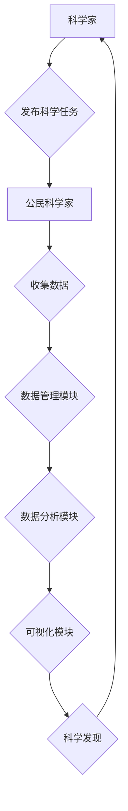

                 

## 公民科学平台：连接科学家与公众的桥梁

> 关键词：公民科学、数据收集、科学研究、大众参与、人工智能、机器学习、数据分析、可视化

## 1. 背景介绍

科学研究的本质是探索未知，而探索的动力源于好奇心和对世界的理解渴望。传统科学研究往往局限于学术界，需要庞大的资金、设备和专业人才。然而，随着科技的进步和互联网的普及，科学研究的边界正在不断扩展，公众参与的可能性也越来越大。

公民科学平台应运而生，它为公众提供了一个参与科学研究的机会，让每个人都能成为科学探险家。通过公民科学平台，公众可以参与数据收集、分析和解释，为科学研究提供宝贵的资源和视角。

## 2. 核心概念与联系

**2.1  公民科学的定义**

公民科学是指公众参与科学研究活动的现象，它打破了传统科学研究的壁垒，让每个人都能参与到科学探索中来。公民科学活动的形式多样，包括：

* **数据收集:** 公众通过手机、相机等设备收集自然现象、社会现象等数据。
* **数据分析:** 公众利用网络工具对收集到的数据进行分析，寻找规律和模式。
* **科学实验:** 公众参与科学实验，例如观测鸟类、记录植物生长等。
* **科学普及:** 公众通过写作、演讲、网络传播等方式普及科学知识。

**2.2  公民科学平台的架构**

公民科学平台通常由以下几个核心模块组成：

* **用户端:** 提供用户注册、登录、数据上传、任务发布、讨论交流等功能。
* **数据管理模块:** 负责数据存储、管理、安全和隐私保护。
* **任务管理模块:** 发布科学研究任务，分配给公民科学家，并跟踪任务进度。
* **数据分析模块:** 利用人工智能、机器学习等技术对收集到的数据进行分析，发现科学规律。
* **可视化模块:** 将数据分析结果以图表、地图等形式展示，方便公众理解。

**2.3  核心概念原理与架构**



## 3. 核心算法原理 & 具体操作步骤

**3.1  算法原理概述**

公民科学平台的核心算法主要包括数据收集、数据分析和可视化三大类。

* **数据收集算法:** 针对不同类型的科学研究任务，设计相应的收集算法，例如：
    * **图像识别算法:** 用于识别鸟类、植物等生物。
    * **语音识别算法:** 用于识别动物叫声、自然现象的声音等。
    * **文本分析算法:** 用于分析公众对科学问题的看法和态度。
* **数据分析算法:** 利用机器学习、深度学习等算法对收集到的数据进行分析，例如：
    * **分类算法:** 将数据分类到不同的类别，例如：鸟类种类、植物种类等。
    * **聚类算法:** 将数据聚类到不同的群组，例如：具有相似特征的鸟类、植物等。
    * **预测算法:** 根据历史数据预测未来的趋势，例如：物种分布变化、气候变化等。
* **可视化算法:** 将数据分析结果以图表、地图等形式展示，例如：
    * **热力图:** 显示数据在空间上的分布情况。
    * **折线图:** 显示数据随时间变化的趋势。
    * **饼图:** 显示不同类别的数据比例。

**3.2  算法步骤详解**

以图像识别算法为例，详细说明其步骤：

1. **数据收集:** 收集大量鸟类图像数据，并进行标注，例如：标注鸟类的种类、颜色、体型等特征。
2. **数据预处理:** 对图像数据进行预处理，例如：调整图像大小、颜色空间转换、噪声去除等。
3. **模型训练:** 利用深度学习算法，例如卷积神经网络（CNN），对预处理后的图像数据进行训练，学习鸟类特征的识别规则。
4. **模型评估:** 利用测试数据评估模型的识别准确率，并进行调优，提高模型性能。
5. **模型部署:** 将训练好的模型部署到公民科学平台，供公众使用。

**3.3  算法优缺点**

* **优点:**
    * 自动化程度高，可以处理大量数据。
    * 识别精度高，可以识别出细微的特征。
    * 可扩展性强，可以应用于多种类型的科学研究任务。
* **缺点:**
    * 需要大量的训练数据，数据质量对模型性能影响很大。
    * 模型训练需要较高的计算资源和时间成本。
    * 模型解释性较差，难以理解模型的决策过程。

**3.4  算法应用领域**

* **生物学:** 鸟类识别、植物分类、动物行为研究等。
* **环境科学:** 水质监测、空气质量监测、气候变化研究等。
* **社会科学:** 人口统计分析、舆情监测、社会行为研究等。

## 4. 数学模型和公式 & 详细讲解 & 举例说明

**4.1  数学模型构建**

公民科学平台的数据分析通常基于统计学和机器学习模型。

* **统计学模型:** 用于描述数据分布、关系和趋势，例如：

    * **均值、方差、标准差:** 描述数据的中心趋势和离散程度。
    * **相关系数:** 描述两个变量之间的线性关系强度。
    * **回归分析:** 建立变量之间的数学关系，用于预测。

* **机器学习模型:** 用于从数据中学习规律，并进行预测或分类，例如：

    * **线性回归:** 建立线性关系的预测模型。
    * **逻辑回归:** 用于二分类问题的预测模型。
    * **支持向量机:** 用于分类和回归问题的预测模型。
    * **决策树:** 用于分类问题的预测模型。
    * **神经网络:** 用于复杂问题的预测和分类模型。

**4.2  公式推导过程**

以线性回归为例，其目标是找到一条直线，使得这条直线与数据点之间的距离最小。

线性回归模型的公式为：

$$y = mx + c$$

其中：

* $y$ 是预测值。
* $x$ 是输入值。
* $m$ 是斜率。
* $c$ 是截距。

最小二乘法用于求解 $m$ 和 $c$ 的最佳值，其目标函数为：

$$J(m, c) = \sum_{i=1}^{n}(y_i - mx_i - c)^2$$

其中：

* $n$ 是数据点的数量。
* $y_i$ 是第 $i$ 个数据点的真实值。
* $x_i$ 是第 $i$ 个数据点的输入值。

通过求解 $J(m, c)$ 的最小值，可以得到最佳的 $m$ 和 $c$ 值。

**4.3  案例分析与讲解**

假设我们收集了大量鸟类图像数据，并对这些数据进行了标注，例如：标注鸟类的种类、颜色、体型等特征。我们可以利用机器学习算法，例如卷积神经网络（CNN），对这些数据进行训练，学习鸟类特征的识别规则。

训练好的模型可以用于识别新的鸟类图像，例如：当公众上传一张鸟类图像到公民科学平台时，模型可以识别出该鸟类的种类。

## 5. 项目实践：代码实例和详细解释说明

**5.1  开发环境搭建**

* **操作系统:** Linux、macOS、Windows
* **编程语言:** Python
* **开发框架:** Django、Flask
* **数据库:** PostgreSQL、MySQL
* **机器学习库:** scikit-learn、TensorFlow、PyTorch

**5.2  源代码详细实现**

以下是一个简单的公民科学平台代码示例，使用 Python 和 Flask 框架实现：

```python
from flask import Flask, render_template, request

app = Flask(__name__)

@app.route('/')
def index():
    return render_template('index.html')

@app.route('/submit_data', methods=['POST'])
def submit_data():
    data = request.form['data']
    # 保存数据到数据库
    return '数据已提交'

if __name__ == '__main__':
    app.run(debug=True)
```

**5.3  代码解读与分析**

* `index.html` 是首页模板，用于展示平台功能和引导用户提交数据。
* `submit_data` 函数处理用户提交的数据，并将数据保存到数据库。

**5.4  运行结果展示**

运行上述代码，访问 `http://127.0.0.1:5000/`，即可看到简单的公民科学平台首页。

## 6. 实际应用场景

**6.1  科学研究**

* **生物多样性监测:** 公众参与记录鸟类、植物、昆虫等生物的分布和数量，为生物多样性研究提供数据支持。
* **气候变化研究:** 公众记录当地气温、降雨量、雪量等数据，为气候变化研究提供长期观测数据。
* **疾病流行监测:** 公众报告疾病症状和流行情况，为疾病流行监测提供早期预警信息。

**6.2  科学普及**

* **科普活动:** 通过公民科学平台，组织线上线下科普活动，让公众了解科学知识和研究成果。
* **科学写作:** 公众参与科学写作，撰写科普文章、博客、视频等，传播科学知识。
* **科学讨论:** 公众在平台上讨论科学问题，交流科学观点，促进科学素养提升。

**6.3  教育教学**

* **科学实验:** 学生通过公民科学平台参与科学实验，例如：观测植物生长、记录天气变化等，加深对科学知识的理解。
* **科学项目:** 学生利用公民科学平台进行科学项目研究，例如：调查当地环境问题、分析社会现象等，培养科学研究能力。
* **科学竞赛:** 学生通过公民科学平台参与科学竞赛，例如：生物多样性调查、气候变化模拟等，提升科学竞赛水平。

**6.4  未来应用展望**

随着人工智能、物联网、大数据等技术的不断发展，公民科学平台将更加智能化、便捷化、个性化。

* **智能化:** 利用人工智能技术，自动识别数据、分析结果、提供个性化建议。
* **便捷化:** 通过移动端应用、语音识别等技术，让公众更加方便地参与科学研究。
* **个性化:** 根据用户的兴趣、技能、地理位置等信息，推荐个性化的科学任务和研究项目。

## 7. 工具和资源推荐

**7.1  学习资源推荐**

* **在线课程:** Coursera、edX、Udacity 等平台提供公民科学、数据科学、机器学习等方面的在线课程。
* **书籍:** 《公民科学：让每个人都能参与科学研究》等书籍介绍公民科学的概念、方法和案例。
* **网站:** Zooniverse、SciStarter 等网站提供大量的公民科学项目和资源。

**7.2  开发工具推荐**

* **编程语言:** Python、R、Java 等。
* **开发框架:** Django、Flask、Spring Boot 等。
* **数据库:** PostgreSQL、MySQL、MongoDB 等。
* **机器学习库:** scikit-learn、TensorFlow、PyTorch 等。

**7.3  相关论文推荐**

* **Citizen Science: A Global Phenomenon**
* **The Promise of Citizen Science**
* **Citizen Science and the Future of Research**

## 8. 总结：未来发展趋势与挑战

**8.1  研究成果总结**

公民科学平台已经取得了显著的成果，为科学研究、科学普及、教育教学等领域提供了新的途径和资源。

**8.2  未来发展趋势**

* **智能化:** 利用人工智能技术，提高平台的智能化程度，例如：自动识别数据、分析结果、提供个性化建议。
* **便捷化:** 通过移动端应用、语音识别等技术，让公众更加方便地参与科学研究。
* **个性化:** 根据用户的兴趣、技能、地理位置等信息，推荐个性化的科学任务和研究项目。

**8.3  面临的挑战**

* **数据质量:** 公众收集的数据质量参差不齐，需要开发有效的质量控制机制。
* **数据隐私:** 公众数据涉及隐私问题，需要采取措施保护数据安全。
* **平台可访问性:** 平台需要考虑不同用户的需求，例如：不同语言、不同设备等。

**8.4  研究展望**

未来，公民科学平台将继续发展壮大，成为连接科学家与公众的桥梁，推动科学研究和科学普及的进程。


## 9. 附录：常见问题与解答

**9.1  如何参与公民科学平台？**

* 注册成为平台用户。
* 选择感兴趣的科学任务。
* 按照任务要求收集数据、分析数据或参与讨论。

**9.2  公民科学平台的数据安全如何保障？**

平台采用多种技术手段保障数据安全，例如：数据加密、访问控制、隐私保护政策等。

**9.3  公民科学平台的项目有哪些？**

平台提供各种类型的科学项目，例如：生物多样性监测、气候变化研究、疾病流行监测等。

**9.4  公民科学平台的收益有哪些？**

参与公民科学平台可以获得以下收益：

* 贡献科学研究。
* 提升科学素养。
* 结识志同道合的朋友。
* 获得荣誉和奖励。

**9.5  公民科学平台的未来发展方向？**

未来，公民科学平台将更加智能化、便捷化、个性化，并与人工智能、物联网、大数据等技术深度融合，为科学研究和科学普及提供更加强大的支持。


作者：禅与计算机程序设计艺术 / Zen and the Art of Computer Programming 
<end_of_turn>

