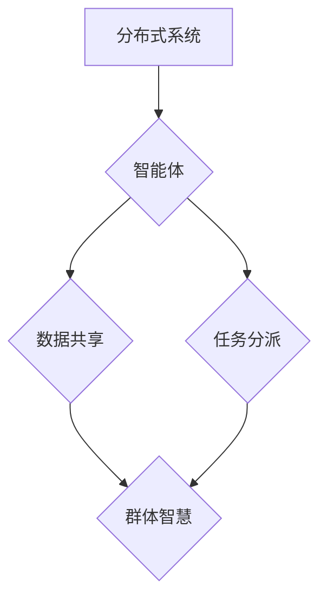

                 

## 分布式认知：揭秘群体智慧的涌现机制

> 关键词：分布式系统、群体智慧、协同计算、人工智能、机器学习、算法设计、网络效应

## 1. 背景介绍

人类社会自古以来就对群体智慧抱有敬畏和好奇。从古代的集体决策到现代的开源软件开发，我们不断地见证着群体协作带来的巨大力量。随着计算机技术的发展，特别是分布式计算和人工智能技术的蓬勃兴起，我们开始能够更深入地探索群体智慧的本质，并尝试将其应用于解决更复杂的问题。

分布式认知，作为一种新兴的计算范式，旨在模拟和放大群体智慧的涌现机制。它将多个独立的智能体（例如，计算机节点、传感器、机器人等）连接起来，通过协同计算和信息共享，实现超越单个智能体能力的整体智能。

## 2. 核心概念与联系

**2.1 核心概念**

* **分布式系统:** 由多个相互连接的计算节点组成，每个节点都具有独立的计算能力和存储资源。
* **群体智慧:** 指的是由多个个体协同合作产生的智能，其整体表现力超越了任何单个个体的能力。
* **协同计算:** 指的是多个计算节点共同完成一个任务，通过数据共享和任务分派，提高计算效率和解决问题的能力。
* **智能体:** 具有感知、决策和行动能力的个体，可以是计算机程序、机器人、传感器等。

**2.2 架构图**



**2.3 联系**

分布式认知的核心在于将分布式系统中的智能体连接起来，通过数据共享和任务分派，实现协同计算，从而产生群体智慧。

## 3. 核心算法原理 & 具体操作步骤

**3.1 算法原理概述**

分布式认知算法通常基于以下几个核心原理：

* **去中心化:** 每个智能体都拥有部分信息和计算能力，没有单一的控制中心。
* **自组织:** 智能体通过简单的规则和信息交互，自动形成复杂的组织结构和行为模式。
* **异步通信:** 智能体之间通过异步消息传递进行通信，提高了系统的容错性和效率。
* **反馈机制:** 系统通过反馈机制不断调整和优化智能体的行为，提高群体智慧的整体性能。

**3.2 算法步骤详解**

1. **智能体初始化:** 每个智能体都拥有初始状态和知识，并连接到分布式网络。
2. **数据共享:** 智能体通过网络交换信息，共享局部知识和观察结果。
3. **任务分派:** 系统根据任务需求，将任务分配给不同的智能体。
4. **协同计算:** 智能体根据任务要求，利用自身能力和共享信息进行计算和推理。
5. **结果汇总:** 智能体将计算结果反馈到系统，系统汇总所有结果，形成最终的决策或输出。
6. **反馈调整:** 系统根据结果反馈，调整智能体的行为策略和任务分配，不断优化群体智慧的性能。

**3.3 算法优缺点**

* **优点:**
    * **鲁棒性:** 去中心化的架构使得系统更具容错性，即使部分智能体失效，也能保持整体功能。
    * **可扩展性:** 可以轻松添加新的智能体，提高系统的计算能力和处理能力。
    * **适应性:** 通过反馈机制，系统可以不断适应环境变化和任务需求。
* **缺点:**
    * **复杂性:** 设计和实现分布式认知算法需要考虑多个因素，例如网络拓扑、数据同步、任务调度等，有一定的技术难度。
    * **效率:** 由于需要进行数据共享和信息交互，分布式计算的效率可能低于集中式计算。
    * **安全:** 分布式系统更容易受到攻击，需要采取相应的安全措施。

**3.4 算法应用领域**

* **人工智能:** 构建更智能的机器学习模型，例如群体决策、协同推理、多智能体机器人等。
* **大数据分析:** 利用分布式计算能力，对海量数据进行快速分析和处理。
* **科学计算:** 解决复杂科学问题，例如天气预报、药物发现、材料设计等。
* **网络安全:** 检测和防御网络攻击，例如入侵检测、恶意软件分析等。

## 4. 数学模型和公式 & 详细讲解 & 举例说明

**4.1 数学模型构建**

分布式认知系统可以抽象为一个图论模型，其中每个节点代表一个智能体，边代表信息交互或任务依赖关系。

* **节点:**  每个节点 $i$ 拥有状态 $s_i$ 和行为策略 $f_i$。
* **边:**  边 $(i,j)$ 表示节点 $i$ 和节点 $j$ 之间的信息交互或任务依赖关系。

**4.2 公式推导过程**

群体智慧的涌现可以看作是一个信息传播和聚合的过程。我们可以使用以下公式描述智能体状态的更新：

$$s_i^{t+1} = f_i(s_i^t, \sum_{j \in N(i)} w_{ij} s_j^t)$$

其中:

* $s_i^t$ 表示节点 $i$ 在时间 $t$ 的状态。
* $f_i$ 表示节点 $i$ 的行为策略。
* $N(i)$ 表示节点 $i$ 的邻居节点集合。
* $w_{ij}$ 表示节点 $i$ 和节点 $j$ 之间的权重，表示信息交互强度。

**4.3 案例分析与讲解**

例如，在蚁群算法中，每个蚂蚁代表一个智能体，它们在寻找最短路径时会留下信息素，其他蚂蚁根据信息素浓度选择路径。信息素浓度可以看作是节点状态，蚂蚁的行为策略是根据信息素浓度选择路径。通过信息传播和聚合，蚁群最终会找到最短路径。

## 5. 项目实践：代码实例和详细解释说明

**5.1 开发环境搭建**

* 操作系统: Ubuntu 20.04
* 编程语言: Python 3.8
* 软件包:

    * NetworkX: 用于构建图论模型
    * NumPy: 用于数值计算
    * matplotlib: 用于数据可视化

**5.2 源代码详细实现**

```python
import networkx as nx
import numpy as np
import matplotlib.pyplot as plt

# 创建图论模型
graph = nx.Graph()
# 添加节点
graph.add_nodes_from(range(10))
# 添加边
graph.add_edges_from([(0, 1), (0, 2), (1, 2), (1, 3), (2, 3), (2, 4), (3, 4), (3, 5), (4, 5), (4, 6), (5, 6), (5, 7), (6, 7), (6, 8), (7, 8), (7, 9), (8, 9)])

# 定义智能体状态更新函数
def update_state(graph, state):
    new_state = {}
    for node in graph.nodes():
        neighbors = list(graph.neighbors(node))
        # 计算邻居节点状态的加权平均值
        weighted_sum = np.average([state[neighbor] for neighbor in neighbors], weights=[graph.edges[node, neighbor]['weight'] for neighbor in neighbors])
        # 更新节点状态
        new_state[node] = weighted_sum
    return new_state

# 初始化智能体状态
initial_state = {node: np.random.rand() for node in graph.nodes()}

# 迭代更新智能体状态
for _ in range(10):
    initial_state = update_state(graph, initial_state)

# 可视化智能体状态
nx.draw(graph, with_labels=True, node_color=[initial_state[node] for node in graph.nodes()])
plt.show()
```

**5.3 代码解读与分析**

* 代码首先构建了一个简单的图论模型，代表分布式系统中的智能体和信息交互关系。
* 然后定义了一个 `update_state` 函数，模拟智能体状态的更新过程。该函数计算每个节点邻居节点状态的加权平均值，并将其作为新的状态值。
* 最后，代码迭代更新智能体状态，并使用 matplotlib 库可视化最终的状态分布。

**5.4 运行结果展示**

运行代码后，会生成一个图，其中每个节点代表一个智能体，节点颜色表示其状态值。通过观察图的整体颜色分布，可以了解群体智慧的涌现过程。

## 6. 实际应用场景

**6.1 医疗诊断**

分布式认知可以用于辅助医疗诊断，例如将多个医生、专家和患者数据进行整合分析，提高诊断准确率。

**6.2 金融风险管理**

分布式认知可以用于金融风险管理，例如分析市场数据、识别异常交易和预测金融风险。

**6.3 交通流量优化**

分布式认知可以用于交通流量优化，例如根据实时路况信息，调整交通信号灯和车辆行驶路线，减少拥堵。

**6.4 未来应用展望**

随着人工智能和分布式计算技术的不断发展，分布式认知将在更多领域得到应用，例如：

* **个性化教育:** 根据学生的学习情况，提供个性化的学习方案和教学内容。
* **智能制造:** 利用分布式认知，实现智能工厂的自动化和协同控制。
* **城市智能化:** 利用分布式认知，构建智慧城市，提高城市管理效率和居民生活质量。

## 7. 工具和资源推荐

**7.1 学习资源推荐**

* **书籍:**
    * 《分布式系统：从理论到实践》
    * 《人工智能：一种现代方法》
* **在线课程:**
    * Coursera: 分布式系统、机器学习
    * edX: 人工智能、数据科学

**7.2 开发工具推荐**

* **Apache Spark:** 大规模数据处理框架
* **Apache Kafka:** 流式数据处理平台
* **Kubernetes:** 集群管理平台

**7.3 相关论文推荐**

* **Collective Intelligence**
* **Ant Colony Optimization**
* **Swarm Intelligence**

## 8. 总结：未来发展趋势与挑战

**8.1 研究成果总结**

分布式认知作为一种新兴的计算范式，在人工智能、大数据分析、科学计算等领域取得了显著成果。

**8.2 未来发展趋势**

* **更强大的计算能力:** 随着硬件技术的进步，分布式系统将拥有更强大的计算能力，能够解决更复杂的问题。
* **更智能的算法:** 研究人员将开发更智能的分布式认知算法，使其能够更好地模拟和放大群体智慧。
* **更广泛的应用场景:** 分布式认知将应用于更多领域，例如医疗、金融、教育等。

**8.3 面临的挑战**

* **算法复杂性:** 设计和实现高效的分布式认知算法仍然是一个挑战。
* **数据安全:** 分布式系统更容易受到攻击，需要采取相应的安全措施。
* **伦理问题:** 分布式认知的应用可能会引发一些伦理问题，例如算法偏见、隐私泄露等。

**8.4 研究展望**

未来，分布式认知研究将继续深入，探索群体智慧的本质，并将其应用于解决更复杂、更具挑战性的问题。


## 9. 附录：常见问题与解答

**9.1 如何选择合适的分布式认知算法？**

选择合适的分布式认知算法需要根据具体应用场景和需求进行考虑。例如，对于需要快速收敛的应用场景，可以选择蚁群算法；对于需要探索全局最优解的应用场景，可以选择粒子群算法。

**9.2 如何保证分布式认知系统的安全性？**

分布式认知系统的安全性可以通过以下措施来保证：

* 使用加密技术保护数据传输。
* 使用身份验证和授权机制控制访问权限。
* 定期进行安全评估和漏洞修复。

**9.3 分布式认知与云计算的关系是什么？**

分布式认知和云计算是互补的技术。云计算可以提供强大的计算资源和存储能力，而分布式认知可以利用这些资源，实现更智能的计算和协作。


作者：禅与计算机程序设计艺术 / Zen and the Art of Computer Programming 
<end_of_turn>

