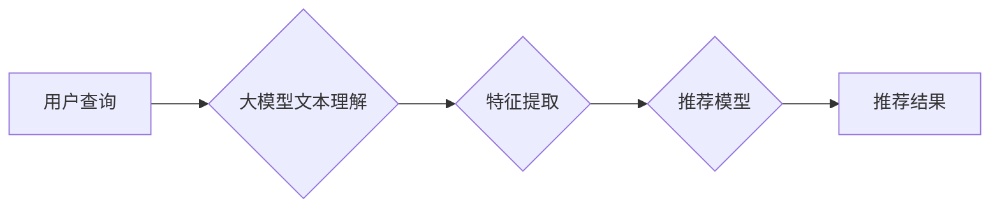

                 

## 利用大模型优化推荐系统的召回策略

> 关键词：大模型、推荐系统、召回策略、自然语言处理、信息检索、Transformer、BERT、Fine-tuning

## 1. 背景介绍

推荐系统是互联网时代的重要组成部分，其核心目标是根据用户的历史行为、偏好等信息，预测用户可能感兴趣的内容，并将其推荐给用户。召回策略是推荐系统中至关重要的环节，它负责从海量候选物品中筛选出与用户需求最相关的物品，并将其作为后续排序和打分阶段的输入。

传统的召回策略主要依赖于基于关键词的匹配、协同过滤等方法，这些方法在一定程度上能够满足用户的需求，但随着用户行为的复杂化和数据量的爆炸式增长，传统的召回策略面临着越来越多的挑战：

* **语义理解能力不足:** 基于关键词的匹配方法难以捕捉用户需求背后的语义信息，导致推荐结果缺乏精准度和个性化。
* **冷启动问题:** 对于新用户或新物品，由于缺乏历史数据，传统的召回策略难以准确地预测用户兴趣，导致推荐效果不佳。
* **数据稀疏性:** 用户行为数据往往是稀疏的，传统的协同过滤方法难以有效地挖掘用户兴趣的潜在关联。

## 2. 核心概念与联系

大模型的出现为推荐系统的召回策略带来了新的机遇。大模型是指参数量巨大、训练数据量庞大的深度学习模型，其强大的语义理解能力和泛化能力能够有效地解决传统召回策略面临的挑战。

大模型在推荐系统中的应用主要集中在以下几个方面：

* **文本理解:** 利用大模型对用户查询、商品描述等文本进行理解，提取用户需求的关键信息，并将其转化为推荐模型可以理解的特征。
* **知识图谱构建:** 大模型能够从海量文本数据中自动构建知识图谱，丰富物品的语义信息，并挖掘用户兴趣之间的潜在关联。
* **个性化推荐:** 大模型能够根据用户的历史行为、偏好等信息，构建用户个性化的推荐模型，提供更精准、更个性化的推荐结果。

**核心概念与架构流程图:**



## 3. 核心算法原理 & 具体操作步骤

### 3.1  算法原理概述

大模型在推荐系统的召回策略中主要应用的是基于Transformer的自然语言处理模型，例如BERT、RoBERTa等。这些模型通过学习大量的文本数据，能够捕捉语言的语义关系和上下文信息，从而实现对用户查询的理解和语义匹配。

### 3.2  算法步骤详解

1. **预训练:** 大模型在海量文本数据上进行预训练，学习语言的语法和语义知识。
2. **微调:** 将预训练好的大模型微调到推荐系统的特定任务上，例如商品搜索、用户画像构建等。
3. **特征提取:** 将用户查询或商品描述作为输入，通过大模型进行编码，提取其语义特征。
4. **召回:** 根据提取的语义特征，与候选物品的特征进行匹配，筛选出与用户需求最相关的物品。

### 3.3  算法优缺点

**优点:**

* **语义理解能力强:** 大模型能够捕捉用户需求背后的语义信息，提高推荐结果的精准度和个性化。
* **泛化能力强:** 预训练好的大模型能够应用于不同的推荐场景，无需大量的特定领域数据。
* **冷启动问题缓解:** 大模型能够通过学习用户行为模式和物品语义信息，对新用户和新物品进行有效的推荐。

**缺点:**

* **计算资源消耗大:** 大模型的训练和推理需要大量的计算资源，成本较高。
* **数据依赖性强:** 大模型的性能依赖于训练数据的质量和数量，数据不足会导致模型效果不佳。
* **可解释性差:** 大模型的决策过程较为复杂，难以解释其推荐结果背后的逻辑。

### 3.4  算法应用领域

大模型在推荐系统的召回策略中具有广泛的应用前景，例如：

* **电商推荐:** 根据用户的浏览历史、购买记录等信息，推荐相关的商品。
* **内容推荐:** 根据用户的阅读习惯、观看记录等信息，推荐相关的文章、视频等内容。
* **社交推荐:** 根据用户的社交关系、兴趣爱好等信息，推荐相关的用户和群组。

## 4. 数学模型和公式 & 详细讲解 & 举例说明

### 4.1  数学模型构建

大模型在推荐系统的召回策略中通常采用基于Transformer的序列模型，其核心思想是通过自注意力机制捕捉序列中不同元素之间的关系，从而实现对用户查询和物品描述的语义理解。

**数学模型:**

$$
\mathbf{h}_i = \text{Attention}(\mathbf{X}, \mathbf{W}_a)
$$

其中：

* $\mathbf{h}_i$ 表示第 $i$ 个词的隐藏状态。
* $\mathbf{X}$ 表示输入序列。
* $\mathbf{W}_a$ 表示注意力权重矩阵。

### 4.2  公式推导过程

注意力机制的核心是计算每个词与其他词之间的相关性，并根据相关性分配不同的权重。

**注意力权重计算:**

$$
\text{Attention}(\mathbf{X}, \mathbf{W}_a) = \frac{\exp(\mathbf{X} \cdot \mathbf{W}_a)}{\sum_{j=1}^{n} \exp(\mathbf{X}_j \cdot \mathbf{W}_a)}
$$

其中：

* $\mathbf{X}_j$ 表示第 $j$ 个词的嵌入向量。
* $n$ 表示序列长度。

### 4.3  案例分析与讲解

假设用户查询为 "购买笔记本电脑"，而候选物品包括 "苹果笔记本电脑"、 "联想笔记本电脑"、 "华为笔记本电脑" 等。

通过大模型的注意力机制，可以计算每个词与其他词之间的相关性，例如 "购买" 与 "笔记本电脑" 的相关性较高，而与 "苹果"、 "联想"、 "华为" 的相关性较低。

根据注意力权重，大模型可以将 "笔记本电脑" 作为用户需求的关键信息，并将其作为推荐模型的输入，从而提高推荐结果的精准度。

## 5. 项目实践：代码实例和详细解释说明

### 5.1  开发环境搭建

* Python 3.7+
* TensorFlow 2.0+
* PyTorch 1.0+
* CUDA 10.0+ (可选)

### 5.2  源代码详细实现

```python
from transformers import AutoTokenizer, AutoModel

# 加载预训练模型和词典
model_name = "bert-base-uncased"
tokenizer = AutoTokenizer.from_pretrained(model_name)
model = AutoModel.from_pretrained(model_name)

# 用户查询
query = "购买笔记本电脑"

# 对用户查询进行编码
input_ids = tokenizer.encode(query, add_special_tokens=True)
outputs = model(input_ids)

# 获取隐藏状态
hidden_states = outputs.last_hidden_state

# 对隐藏状态进行处理，提取语义特征
# ...

# 根据语义特征，与候选物品进行匹配，筛选出相关的物品
# ...
```

### 5.3  代码解读与分析

* 使用 `transformers` 库加载预训练的 BERT 模型和词典。
* 对用户查询进行编码，生成 token 化后的序列。
* 将编码后的序列输入 BERT 模型，获取隐藏状态。
* 对隐藏状态进行处理，提取语义特征。
* 根据语义特征，与候选物品进行匹配，筛选出相关的物品。

### 5.4  运行结果展示

运行上述代码后，可以得到用户查询 "购买笔记本电脑" 的语义特征，并根据这些特征，筛选出与用户需求相关的笔记本电脑候选物品。

## 6. 实际应用场景

大模型在推荐系统的召回策略中的应用场景非常广泛，例如：

* **电商平台:** 根据用户的浏览历史、购买记录等信息，推荐相关的商品。
* **内容平台:** 根据用户的阅读习惯、观看记录等信息，推荐相关的文章、视频等内容。
* **社交平台:** 根据用户的社交关系、兴趣爱好等信息，推荐相关的用户和群组。

### 6.4  未来应用展望

随着大模型技术的不断发展，其在推荐系统中的应用将更加广泛和深入。未来，大模型可能在以下方面发挥更大的作用:

* **更精准的个性化推荐:** 大模型能够更深入地理解用户的需求和偏好，提供更精准的个性化推荐。
* **跨模态推荐:** 大模型能够处理文本、图像、音频等多种模态数据，实现跨模态的推荐。
* **动态推荐:** 大模型能够根据用户的实时行为和环境变化，动态调整推荐策略。

## 7. 工具和资源推荐

### 7.1  学习资源推荐

* **论文:**
    * BERT: Pre-training of Deep Bidirectional Transformers for Language Understanding
    * RoBERTa: A Robustly Optimized BERT Pretraining Approach
* **博客:**
    * The Illustrated Transformer
    * Hugging Face Blog

### 7.2  开发工具推荐

* **transformers:** https://huggingface.co/docs/transformers/index
* **TensorFlow:** https://www.tensorflow.org/
* **PyTorch:** https://pytorch.org/

### 7.3  相关论文推荐

* **BERT for Recommender Systems:** https://arxiv.org/abs/1908.08822
* **Large Language Models for Recommender Systems:** https://arxiv.org/abs/2106.08654

## 8. 总结：未来发展趋势与挑战

### 8.1  研究成果总结

大模型在推荐系统的召回策略中取得了显著的成果，其强大的语义理解能力和泛化能力能够有效地解决传统召回策略面临的挑战。

### 8.2  未来发展趋势

未来，大模型在推荐系统中的应用将更加深入和广泛，例如：

* **更精准的个性化推荐:** 大模型能够更深入地理解用户的需求和偏好，提供更精准的个性化推荐。
* **跨模态推荐:** 大模型能够处理文本、图像、音频等多种模态数据，实现跨模态的推荐。
* **动态推荐:** 大模型能够根据用户的实时行为和环境变化，动态调整推荐策略。

### 8.3  面临的挑战

大模型在推荐系统中的应用也面临着一些挑战，例如：

* **计算资源消耗大:** 大模型的训练和推理需要大量的计算资源，成本较高。
* **数据依赖性强:** 大模型的性能依赖于训练数据的质量和数量，数据不足会导致模型效果不佳。
* **可解释性差:** 大模型的决策过程较为复杂，难以解释其推荐结果背后的逻辑。

### 8.4  研究展望

未来，研究者将继续探索大模型在推荐系统中的应用，并致力于解决其面临的挑战。例如：

* **开发更轻量级的模型:** 降低大模型的计算资源消耗，使其能够在移动设备等资源有限的设备上运行。
* **探索新的训练方法:** 降低大模型对训练数据的依赖，使其能够在数据稀疏的情况下也能有效工作。
* **提高模型的可解释性:** 研究大模型的决策过程，使其推荐结果更加透明和可理解。

## 9. 附录：常见问题与解答

**Q1: 大模型的训练需要多少数据？**

A1: 大模型的训练需要大量的文本数据，通常需要数十亿甚至数百亿个单词。

**Q2: 如何评估大模型在推荐系统中的性能？**

A2: 大模型在推荐系统中的性能通常通过指标如 NDCG、MAP 等进行评估。

**Q3: 如何部署大模型在生产环境中？**

A3: 大模型的部署需要考虑模型的规模、计算资源、数据传输等因素，通常需要使用云平台或边缘计算等技术。


作者：禅与计算机程序设计艺术 / Zen and the Art of Computer Programming 
<end_of_turn>

