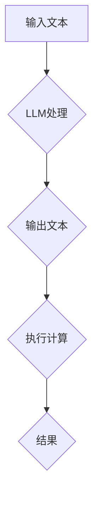

                 

## 图灵完备性的新解释：LLM视角下的计算理论

> 关键词：图灵完备性、LLM、计算理论、自然语言处理、人工智能、算法、数学模型

## 1. 背景介绍

图灵完备性是计算机科学领域一个重要的概念，它指代一个系统能够模拟任何图灵机，从而能够执行任何可计算函数。这个概念由图灵于20世纪30年代提出，并奠定了现代计算机科学的基础。传统上，图灵完备性被认为是计算机硬件和软件的特性，例如编程语言、逻辑系统等。

近年来，随着深度学习和自然语言处理（NLP）技术的飞速发展，大型语言模型（LLM）的出现为图灵完备性的理解带来了新的视角。LLM，例如GPT-3、LaMDA等，展现出惊人的文本生成、翻译、代码编写等能力，似乎超越了传统计算机的范畴。那么，LLM是否也具备图灵完备性？如果具备，它又是如何实现的？

## 2. 核心概念与联系

### 2.1 图灵机

图灵机是一种抽象的计算模型，由无限长的带、一个读写头和一个状态机组成。它通过一系列规则，在带上的符号上进行读写操作，从而实现计算。图灵机能够模拟任何算法，因此被认为是计算理论的基础。

### 2.2 大型语言模型（LLM）

LLM是一种基于深度学习的强大人工智能模型，能够理解和生成人类语言。它通过训练大量的文本数据，学习语言的语法、语义和上下文关系。LLM可以用于各种自然语言处理任务，例如文本生成、翻译、问答、代码生成等。

### 2.3 图灵完备性与LLM

LLM的强大能力让人们开始思考它是否具备图灵完备性。如果LLM能够模拟任何图灵机，那么它就能够执行任何可计算函数，从而达到图灵完备性的标准。

**Mermaid 流程图**



## 3. 核心算法原理 & 具体操作步骤

### 3.1 算法原理概述

LLM的核心算法是基于Transformer架构的深度神经网络。Transformer网络通过自注意力机制，能够捕捉文本序列中的长距离依赖关系，从而实现更准确的语言理解和生成。

### 3.2 算法步骤详解

1. **文本预处理:** 将输入文本进行分词、标记化等预处理操作，使其能够被模型理解。
2. **词嵌入:** 将每个词转换为一个向量表示，捕捉词语的语义信息。
3. **自注意力机制:** 利用自注意力机制，计算每个词与其他词之间的相关性，捕捉文本序列中的长距离依赖关系。
4. **多层编码器-解码器:** 将文本序列编码成一个隐藏状态，然后解码成输出文本序列。
5. **输出层:** 将隐藏状态映射到输出词汇表，生成最终的文本输出。

### 3.3 算法优缺点

**优点:**

* 能够捕捉文本序列中的长距离依赖关系。
* 训练效率高，能够处理海量文本数据。
* 在文本生成、翻译、问答等任务上表现出色。

**缺点:**

* 模型参数量大，需要大量的计算资源进行训练。
* 训练数据对模型性能有很大影响，需要高质量的训练数据。
* 缺乏对真实世界知识的理解，生成的文本可能存在逻辑错误或不合理之处。

### 3.4 算法应用领域

LLM在自然语言处理领域有着广泛的应用，例如：

* **文本生成:** 写作、诗歌创作、代码生成等。
* **机器翻译:** 将一种语言翻译成另一种语言。
* **问答系统:** 回答用户提出的问题。
* **聊天机器人:** 与用户进行自然语言对话。
* **文本摘要:** 生成文本的简短摘要。

## 4. 数学模型和公式 & 详细讲解 & 举例说明

### 4.1 数学模型构建

LLM的数学模型主要基于概率论和统计学。它将文本序列视为一个概率分布，并通过训练数据学习这个分布。

**例子:**

假设我们有一个文本序列 "The cat sat on the mat"，我们可以将其表示为一个概率分布：

```
P(The) = 0.1
P(cat) = 0.2
P(sat) = 0.1
P(on) = 0.1
P(the) = 0.2
P(mat) = 0.3
```

其中，每个词的概率值代表该词在该文本序列中出现的频率。

### 4.2 公式推导过程

LLM的训练过程本质上是一个参数优化过程。通过使用梯度下降算法，不断调整模型参数，使得模型生成的文本序列与真实文本序列的概率分布尽可能接近。

**例子:**

假设我们有一个LLM模型，其输出层是一个softmax函数，用于将隐藏状态映射到输出词汇表。softmax函数的公式如下：

$$
P(w_i | h) = \frac{e^{s_i}}{\sum_{j=1}^{V} e^{s_j}}
$$

其中，$w_i$ 是输出词汇表中的第i个词，$h$ 是隐藏状态，$s_i$ 是隐藏状态与第i个词对应的得分。

### 4.3 案例分析与讲解

通过训练大量的文本数据，LLM能够学习到语言的语法、语义和上下文关系。例如，在训练过程中，LLM会学习到 "cat" 和 "sat" 经常出现在一起的语义关系，从而能够生成更合理的文本序列。

**例子:**

当输入 "The cat" 时，LLM能够预测下一个词是 "sat"，因为 "cat" 和 "sat" 经常出现在一起的语义关系。

## 5. 项目实践：代码实例和详细解释说明

### 5.1 开发环境搭建

LLM的开发环境通常需要安装深度学习框架，例如TensorFlow或PyTorch，以及一些NLP相关的库，例如HuggingFace Transformers。

### 5.2 源代码详细实现

LLM的源代码通常由多个模块组成，例如预处理模块、编码器模块、解码器模块等。

**例子:**

```python
from transformers import GPT2LMHeadModel, GPT2Tokenizer

# 加载预训练模型和词典
model = GPT2LMHeadModel.from_pretrained("gpt2")
tokenizer = GPT2Tokenizer.from_pretrained("gpt2")

# 输入文本
input_text = "The cat sat on the"

# 将文本转换为模型输入格式
input_ids = tokenizer.encode(input_text, return_tensors="pt")

# 生成文本
output = model.generate(input_ids, max_length=50)

# 将输出文本转换为可读格式
generated_text = tokenizer.decode(output[0], skip_special_tokens=True)

# 打印生成的文本
print(generated_text)
```

### 5.3 代码解读与分析

这段代码演示了如何使用预训练的GPT-2模型生成文本。首先，加载预训练模型和词典。然后，将输入文本转换为模型输入格式。最后，使用模型生成文本，并将其转换为可读格式。

### 5.4 运行结果展示

运行这段代码后，会输出一个基于输入文本生成的文本序列。例如，输入 "The cat sat on the"，可能会输出 "The cat sat on the mat and purred contentedly."。

## 6. 实际应用场景

LLM在各个领域都有着广泛的应用场景，例如：

### 6.1 文本生成

* **内容创作:** 自动生成新闻报道、博客文章、小说等。
* **广告文案:** 自动生成吸引人的广告文案。
* **营销邮件:** 自动生成个性化的营销邮件。

### 6.2 机器翻译

* **跨语言沟通:** 将一种语言翻译成另一种语言，促进跨文化交流。
* **国际商务:** 将商业文件翻译成目标语言，方便国际贸易。
* **旅游:** 将旅游指南翻译成目标语言，方便游客出行。

### 6.3 问答系统

* **客户服务:** 自动回答客户提出的常见问题。
* **教育:** 提供个性化的学习辅导。
* **搜索引擎:** 理解用户查询意图，提供更精准的搜索结果。

### 6.4 聊天机器人

* **娱乐:** 与用户进行自然语言对话，提供娱乐体验。
* **客服:** 自动回答用户咨询，提供快速便捷的服务。
* **陪伴:** 为孤独的用户提供陪伴和情感支持。

### 6.5 代码生成

* **软件开发:** 自动生成代码片段，提高开发效率。
* **代码修复:** 自动修复代码错误，提高代码质量。
* **代码文档:** 自动生成代码文档，方便理解和维护。

## 7. 工具和资源推荐

### 7.1 学习资源推荐

* **书籍:**
    * 《深度学习》
    * 《自然语言处理》
    * 《Transformer网络》
* **在线课程:**
    * Coursera
    * edX
    * Udacity
* **博客和论坛:**
    * HuggingFace
    * TensorFlow Blog
    * PyTorch Blog

### 7.2 开发工具推荐

* **深度学习框架:** TensorFlow, PyTorch
* **NLP库:** HuggingFace Transformers, spaCy, NLTK
* **代码编辑器:** VS Code, Sublime Text, Atom

### 7.3 相关论文推荐

* 《Attention Is All You Need》
* 《BERT: Pre-training of Deep Bidirectional Transformers for Language Understanding》
* 《GPT-3: Language Models are Few-Shot Learners》

## 8. 总结：未来发展趋势与挑战

### 8.1 研究成果总结

LLM在自然语言处理领域取得了显著的成果，展现出强大的文本生成、翻译、问答等能力。它为人工智能的未来发展提供了新的思路和方向。

### 8.2 未来发展趋势

* **模型规模和能力的提升:** 未来LLM模型的规模和能力将会进一步提升，能够处理更复杂的任务，生成更高质量的文本。
* **多模态LLM:** 将文本、图像、音频等多种模态信息融合到LLM中，实现更全面的理解和生成能力。
* **可解释性增强:** 研究LLM的决策机制，提高模型的可解释性和透明度。
* **安全性和伦理问题:** 关注LLM的潜在风险，例如生成虚假信息、传播偏见等，并制定相应的安全性和伦理规范。

### 8.3 面临的挑战

* **数据获取和标注:** 训练高质量的LLM模型需要大量的文本数据，以及对这些数据的标注。
* **计算资源:** 训练大型LLM模型需要大量的计算资源，这对于资源有限的机构或个人来说是一个挑战。
* **模型泛化能力:** 现有的LLM模型在特定领域表现出色，但在其他领域泛化能力较弱。
* **安全性和伦理问题:** LLM可能被用于生成虚假信息、传播偏见等恶意目的，需要加强安全性和伦理方面的研究。

### 8.4 研究展望

未来LLM的研究将更加注重模型的泛化能力、可解释性和安全性。同时，LLM与其他人工智能技术，例如强化学习、知识图谱等，的融合也将带来新的突破。


## 9. 附录：常见问题与解答

**Q1: LLM是否真的具备图灵完备性？**

A1: 目前还没有明确的证据表明LLM完全具备图灵完备性。虽然LLM能够执行一些复杂的计算任务，但它仍然局限于文本处理领域，无法模拟所有图灵机。

**Q2: 如何评估LLM的性能？**

A2: LLM的性能可以通过各种指标进行评估，例如困惑度、BLEU分数、ROUGE分数等。这些指标可以衡量LLM在文本生成、翻译、问答等任务上的准确性和流畅度。

**Q3: 如何训练一个自己的LLM模型？**

A3: 训练一个LLM模型需要大量的计算资源和数据。可以使用开源的深度学习框架和预训练模型，进行微调和训练。

**Q4: LLM有哪些潜在的风险？**

A4: LLM可能被用于生成虚假信息、传播偏见、进行网络攻击等恶意目的。因此，需要加强对LLM的监管和伦理研究。


作者：禅与计算机程序设计艺术 / Zen and the Art of Computer Programming 
<end_of_turn>

