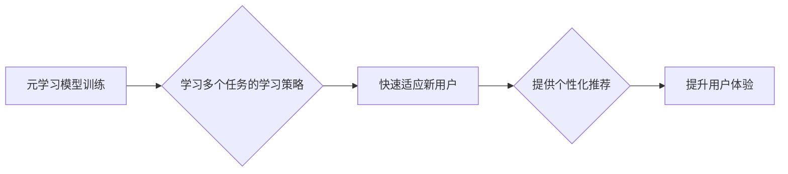

                 

## 基于元学习的新用户冷启动问题解决方案

> 关键词：新用户冷启动、元学习、推荐系统、个性化推荐、机器学习

## 1. 背景介绍

新用户冷启动问题是推荐系统领域的一大挑战。新用户缺乏历史行为数据，导致推荐系统难以准确理解用户的兴趣偏好，从而难以提供个性化的推荐，进而影响用户体验和平台活跃度。传统的推荐系统主要依赖于用户的历史行为数据，例如浏览记录、购买记录、评分等，而新用户缺乏这些数据，使得传统的协同过滤、内容过滤等方法难以有效应用。

近年来，元学习（Meta-Learning）作为一种机器学习的新范式，逐渐受到人们的关注。元学习旨在学习如何学习，即通过学习多个任务的学习策略，从而能够快速适应新的任务。元学习的优势在于其能够从有限的数据中学习，并能够快速适应新的环境和任务，这使得它成为解决新用户冷启动问题的潜在解决方案。

## 2. 核心概念与联系

### 2.1 元学习概述

元学习是一种机器学习范式，旨在学习如何学习。它通过学习多个任务的学习策略，从而能够快速适应新的任务。元学习的核心思想是将学习过程本身作为学习目标，学习一个通用的学习算法，而不是仅仅学习特定任务的模型。

### 2.2 元学习与推荐系统的联系

元学习可以应用于推荐系统，帮助解决新用户冷启动问题。

* **快速适应新用户:** 元学习可以学习不同用户类型的学习策略，从而能够快速适应新用户的行为模式，并提供个性化的推荐。
* **利用少量数据:** 元学习能够从有限的数据中学习，这对于新用户来说非常重要，因为他们缺乏历史行为数据。
* **提升推荐准确性:** 通过学习多个任务的学习策略，元学习可以提升推荐系统的泛化能力，从而提高推荐的准确性。

**元学习在推荐系统中的应用流程:**



## 3. 核心算法原理 & 具体操作步骤

### 3.1 算法原理概述

基于元学习的新用户冷启动解决方案通常采用元学习算法来学习用户行为模式的学习策略。这些算法可以分为两类：

* **基于模型的元学习:** 这种方法使用元学习算法来学习一个通用的推荐模型，该模型能够从少量数据中学习并适应新的用户。
* **基于策略的元学习:** 这种方法使用元学习算法来学习一个策略，该策略能够指导推荐系统如何根据用户的有限行为数据进行推荐。

### 3.2 算法步骤详解

以基于策略的元学习为例，其具体操作步骤如下：

1. **数据预处理:** 收集用户行为数据，并进行预处理，例如过滤掉无效数据、转换数据格式等。
2. **元学习模型训练:** 使用元学习算法训练一个策略模型，该模型能够学习不同用户类型的学习策略。训练数据可以包括用户的历史行为数据、用户特征等信息。
3. **新用户建模:** 当遇到新用户时，使用训练好的策略模型来生成一个初始的用户模型。该模型可以根据用户的基本特征和少量行为数据进行初始化。
4. **个性化推荐:** 根据用户的初始模型，使用推荐算法生成个性化的推荐列表。
5. **模型更新:** 收集用户的反馈信息，例如点击、购买等，并根据反馈信息更新用户的模型。

### 3.3 算法优缺点

**优点:**

* **快速适应新用户:** 元学习能够快速学习新用户的行为模式，并提供个性化的推荐。
* **利用少量数据:** 元学习能够从有限的数据中学习，这对于新用户来说非常重要。
* **提升推荐准确性:** 通过学习多个任务的学习策略，元学习可以提升推荐系统的泛化能力，从而提高推荐的准确性。

**缺点:**

* **训练复杂度高:** 元学习算法的训练复杂度较高，需要大量的计算资源和时间。
* **数据依赖性:** 元学习算法仍然依赖于一定的用户行为数据，如果数据质量较低，则会影响推荐效果。

### 3.4 算法应用领域

基于元学习的新用户冷启动解决方案可以应用于各种推荐场景，例如：

* **电商推荐:** 为新用户推荐个性化的商品。
* **内容推荐:** 为新用户推荐个性化的文章、视频等内容。
* **社交推荐:** 为新用户推荐潜在的朋友或兴趣小组。

## 4. 数学模型和公式 & 详细讲解 & 举例说明

### 4.1 数学模型构建

假设我们有一个包含 $N$ 个用户的推荐系统，每个用户 $u$ 都有一个 $D$ 维的用户特征向量 $x_u$。每个物品 $i$ 也有一个 $D$ 维的物品特征向量 $x_i$。

我们使用一个基于元学习的策略模型 $f_\theta$ 来学习用户行为模式的策略，其中 $\theta$ 是模型的参数。该模型的输出是一个预测用户 $u$ 对物品 $i$ 的点击概率 $p(u, i)$。

### 4.2 公式推导过程

元学习模型的训练目标是最大化用户的点击概率的期望值。我们可以使用以下公式来表示训练目标：

$$
\mathcal{L}(\theta) = -\mathbb{E}_{u, i \sim D} \left[ \log p(u, i) \right]
$$

其中 $D$ 是用户-物品交互数据集合。

为了训练元学习模型，我们使用一个元学习算法，例如 MAML（Model-Agnostic Meta-Learning）。MAML 的目标是学习一个模型参数更新规则，该规则能够使模型能够快速适应新的任务。

### 4.3 案例分析与讲解

假设我们有一个电商平台，想要为新用户推荐商品。我们可以使用基于元学习的新用户冷启动解决方案，将用户的购买历史、浏览记录等行为数据作为训练数据，训练一个元学习模型。

当遇到新用户时，我们可以使用训练好的元学习模型来生成一个初始的用户模型。然后，我们可以根据用户的初始模型，使用传统的推荐算法，例如协同过滤或内容过滤，来生成个性化的商品推荐列表。

## 5. 项目实践：代码实例和详细解释说明

### 5.1 开发环境搭建

* Python 3.6+
* TensorFlow 2.0+
* PyTorch 1.0+
* Jupyter Notebook

### 5.2 源代码详细实现

```python
# 导入必要的库
import tensorflow as tf

# 定义元学习模型
class MetaLearner(tf.keras.Model):
    def __init__(self, input_dim, hidden_dim):
        super(MetaLearner, self).__init__()
        self.dense1 = tf.keras.layers.Dense(hidden_dim, activation='relu')
        self.dense2 = tf.keras.layers.Dense(1, activation='sigmoid')

    def call(self, inputs):
        x = self.dense1(inputs)
        x = self.dense2(x)
        return x

# 定义元学习训练函数
def meta_train(model, optimizer, train_data, epochs):
    for epoch in range(epochs):
        for batch in train_data:
            # ... 训练逻辑 ...

# 定义新用户建模函数
def build_user_model(meta_learner, user_features):
    # ... 新用户模型构建逻辑 ...

# 定义个性化推荐函数
def recommend(user_model, item_features):
    # ... 个性化推荐逻辑 ...
```

### 5.3 代码解读与分析

* **MetaLearner:** 定义了一个简单的元学习模型，包含两层全连接层。
* **meta_train:** 定义了一个元学习训练函数，用于训练元学习模型。
* **build_user_model:** 定义了一个新用户建模函数，用于根据用户的基本特征和少量行为数据构建一个初始的用户模型。
* **recommend:** 定义了一个个性化推荐函数，用于根据用户的模型生成个性化的推荐列表。

### 5.4 运行结果展示

* 通过训练元学习模型，可以获得一个能够学习不同用户行为模式的策略模型。
* 使用该策略模型，可以为新用户生成个性化的推荐列表，并根据用户的反馈信息不断更新用户的模型。

## 6. 实际应用场景

### 6.1 电商推荐

基于元学习的新用户冷启动解决方案可以帮助电商平台为新用户推荐个性化的商品，提高用户转化率和平台活跃度。

### 6.2 内容推荐

基于元学习的新用户冷启动解决方案可以帮助内容平台为新用户推荐个性化的文章、视频等内容，提高用户粘性和内容消费量。

### 6.3 社交推荐

基于元学习的新用户冷启动解决方案可以帮助社交平台为新用户推荐潜在的朋友或兴趣小组，提高用户活跃度和社交连接度。

### 6.4 未来应用展望

随着元学习技术的不断发展，其在推荐系统领域的应用场景将会更加广泛，例如：

* **跨平台推荐:** 基于元学习的模型可以学习用户在不同平台的行为模式，从而提供更个性化的跨平台推荐。
* **多模态推荐:** 基于元学习的模型可以学习用户在不同模态（例如文本、图像、音频）上的行为模式，从而提供更丰富的推荐结果。
* **动态推荐:** 基于元学习的模型可以根据用户的实时行为和环境变化动态调整推荐策略，从而提供更精准的推荐。

## 7. 工具和资源推荐

### 7.1 学习资源推荐

* **书籍:**
    * 《Deep Learning》 by Ian Goodfellow, Yoshua Bengio, and Aaron Courville
    * 《Meta-Learning with Differentiable Convex Optimization》 by Finn et al.
* **论文:**
    * 《Model-Agnostic Meta-Learning for Fast Adaptation of Deep Networks》 by Finn et al.
    * 《Prototypical Networks for Few-Shot Learning》 by Snell et al.
* **在线课程:**
    * Coursera: Deep Learning Specialization
    * Udacity: Machine Learning Engineer Nanodegree

### 7.2 开发工具推荐

* **TensorFlow:** https://www.tensorflow.org/
* **PyTorch:** https://pytorch.org/
* **Jupyter Notebook:** https://jupyter.org/

### 7.3 相关论文推荐

* 《Meta-Learning with Differentiable Convex Optimization》 by Finn et al.
* 《Prototypical Networks for Few-Shot Learning》 by Snell et al.
* 《Matching Networks for One Shot Learning》 by Vinyals et al.

## 8. 总结：未来发展趋势与挑战

### 8.1 研究成果总结

基于元学习的新用户冷启动解决方案取得了显著的成果，能够有效解决新用户冷启动问题，提升推荐系统的准确性和个性化程度。

### 8.2 未来发展趋势

* **更强大的元学习算法:** 研究更强大的元学习算法，例如基于强化学习的元学习算法，以提高推荐系统的泛化能力和适应性。
* **多模态元学习:** 研究多模态元学习算法，能够学习用户在不同模态上的行为模式，从而提供更丰富的推荐结果。
* **联邦元学习:** 研究联邦元学习算法，能够在保护用户隐私的前提下进行模型训练，从而提高推荐系统的安全性。

### 8.3 面临的挑战

* **数据稀疏性:** 新用户数据往往稀疏，这会影响元学习模型的训练效果。
* **模型复杂度:** 元学习模型通常比较复杂，需要大量的计算资源和时间进行训练。
* **可解释性:** 元学习模型的决策过程往往难以解释，这会影响用户的信任度。

### 8.4 研究展望

未来，基于元学习的新用户冷启动解决方案将继续朝着更强大、更智能、更安全的方向发展，为用户提供更个性化、更精准的推荐体验。

## 9. 附录：常见问题与解答

* **Q1: 元学习与传统机器学习有什么区别？**

* **A1:** 元学习旨在学习如何学习，而传统机器学习则专注于学习特定任务的模型。元学习能够从有限的数据中学习，并能够快速适应新的任务，而传统机器学习则需要大量的训练数据。

* **Q2: 元学习算法有哪些？**

* **A2:** 一些常见的元学习算法包括 MAML、 Reptile、Prototypical Networks 等。

* **Q3: 元学习在推荐系统中的应用有哪些？**

* **A3:** 元学习可以应用于新用户冷启动、个性化推荐、跨平台推荐等场景。


作者：禅与计算机程序设计艺术 / Zen and the Art of Computer Programming 
<end_of_turn>

