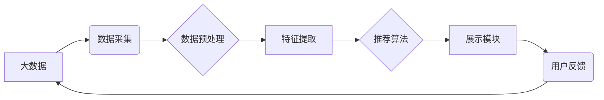

                 

## 大数据驱动的电商平台转型：搜索推荐系统是核心，AI 模型融合是关键

> 关键词：电商平台、搜索推荐系统、大数据、机器学习、深度学习、个性化推荐、AI 模型融合

## 1. 背景介绍

随着互联网技术的快速发展和移动互联网的普及，电商平台已成为人们购物的主要方式之一。然而，随着市场竞争的加剧，电商平台面临着用户增长放缓、用户留存率下降等挑战。为了应对这些挑战，电商平台需要不断进行转型升级，提升用户体验，挖掘新的增长点。

大数据技术为电商平台转型提供了强大的支撑。电商平台拥有海量用户数据、商品数据、交易数据等，通过对这些数据的分析和挖掘，可以洞察用户需求、商品特性、市场趋势等，为电商平台的运营决策提供数据支撑。

搜索推荐系统作为电商平台的核心功能之一，在提升用户体验、促进商品销售方面发挥着至关重要的作用。传统的搜索推荐系统主要依赖于规则引擎和基于内容的推荐算法，但随着用户行为数据的不断积累，这些算法已经难以满足电商平台日益增长的需求。

因此，电商平台需要将大数据技术与搜索推荐系统相结合，构建更加智能、精准、个性化的搜索推荐系统，以应对市场竞争的挑战。

## 2. 核心概念与联系

### 2.1  大数据

大数据是指规模庞大、结构复杂、更新速度快、类型多样化的数据。大数据具有以下四个特征：

* **海量 (Volume):** 数据量巨大，难以用传统数据库管理系统处理。
* **高速 (Velocity):** 数据产生和更新速度快，需要实时处理。
* **多样性 (Variety):** 数据类型多样，包括结构化数据、非结构化数据和半结构化数据。
* **价值 (Value):** 数据蕴含着巨大的价值，需要通过分析和挖掘来获取。

### 2.2  搜索推荐系统

搜索推荐系统是指根据用户搜索行为、浏览历史、购买记录等数据，为用户推荐相关商品的系统。搜索推荐系统通常由以下几个模块组成：

* **数据采集模块:** 收集用户行为数据、商品数据、交易数据等。
* **数据预处理模块:** 对收集到的数据进行清洗、转换、格式化等处理。
* **特征提取模块:** 从数据中提取用户特征、商品特征、交互特征等。
* **推荐算法模块:** 根据提取的特征，对商品进行排序和推荐。
* **展示模块:** 将推荐结果以用户友好的方式展示给用户。

### 2.3  AI 模型融合

AI 模型融合是指将多个不同的 AI 模型组合在一起，以提高推荐系统的准确性和个性化程度。常见的 AI 模型融合方法包括：

* **串联模型:** 将多个模型串联起来，每个模型的输出作为下一个模型的输入。
* **并行模型:** 将多个模型并行运行，然后将多个模型的输出进行融合。
* **混合模型:** 将多个模型的优势结合起来，构建一个更加强大的模型。

**核心概念与联系流程图**



## 3. 核心算法原理 & 具体操作步骤

### 3.1  算法原理概述

电商平台的搜索推荐系统通常采用基于协同过滤、基于内容的推荐和基于深度学习的推荐等算法。

* **协同过滤:** 这种算法基于用户的历史行为数据，推荐与用户相似兴趣的用户购买过的商品。
* **基于内容的推荐:** 这种算法基于商品的属性和描述信息，推荐与用户过去浏览或购买的商品相似属性的商品。
* **基于深度学习的推荐:** 这种算法利用深度神经网络对用户行为数据进行学习，并预测用户对商品的兴趣。

### 3.2  算法步骤详解

以基于协同过滤的推荐算法为例，其具体操作步骤如下：

1. **数据收集:** 收集用户购买历史数据、浏览历史数据等。
2. **用户相似度计算:** 计算用户之间的相似度，可以使用余弦相似度、皮尔逊相关系数等方法。
3. **推荐商品:** 根据用户相似度，推荐与相似用户购买过的商品。

### 3.3  算法优缺点

**协同过滤算法**

* **优点:** 可以推荐用户可能感兴趣但从未接触过的商品，能够发现用户隐性需求。
* **缺点:** 数据稀疏性问题，当用户购买历史数据较少时，难以计算出准确的相似度。

**基于内容的推荐算法**

* **优点:** 可以根据商品的属性和描述信息进行推荐，推荐结果更加精准。
* **缺点:** 难以发现用户隐性需求，推荐结果可能过于单一。

**基于深度学习的推荐算法**

* **优点:** 可以学习用户行为数据的复杂关系，推荐结果更加个性化。
* **缺点:** 需要大量的训练数据，模型训练成本较高。

### 3.4  算法应用领域

协同过滤、基于内容的推荐和基于深度学习的推荐算法广泛应用于电商平台、视频网站、音乐平台等领域。

## 4. 数学模型和公式 & 详细讲解 & 举例说明

### 4.1  数学模型构建

协同过滤算法的数学模型可以表示为用户-商品评分矩阵。

* **用户:**  表示用户集合，例如 U = {u1, u2, ..., un}
* **商品:** 表示商品集合，例如 I = {i1, i2, ..., im}
* **评分:** 表示用户对商品的评分，例如 r(u, i) 表示用户 u 对商品 i 的评分。

用户-商品评分矩阵可以表示为一个 n x m 的矩阵，其中 n 表示用户数量，m 表示商品数量。

### 4.2  公式推导过程

用户相似度计算可以使用余弦相似度公式：

$$
\text{相似度}(u, v) = \frac{\sum_{i \in I} r(u, i) * r(v, i)}{\sqrt{\sum_{i \in I} r(u, i)^2} * \sqrt{\sum_{i \in I} r(v, i)^2}}
$$

其中：

* u 和 v 表示两个用户
* I 表示商品集合

### 4.3  案例分析与讲解

假设有两个用户 u1 和 u2，他们对以下商品的评分如下：

| 商品 | u1 | u2 |
|---|---|---|
| i1 | 5 | 4 |
| i2 | 3 | 5 |
| i3 | 4 | 3 |

使用余弦相似度公式计算 u1 和 u2 的相似度：

$$
\text{相似度}(u1, u2) = \frac{(5 * 4) + (3 * 5) + (4 * 3)}{\sqrt{(5^2 + 3^2 + 4^2)} * \sqrt{(4^2 + 5^2 + 3^2)}} = \frac{20 + 15 + 12}{\sqrt{50} * \sqrt{50}} = \frac{47}{50} = 0.94
$$

因此，u1 和 u2 的相似度为 0.94，说明他们具有较高的相似度。

## 5. 项目实践：代码实例和详细解释说明

### 5.1  开发环境搭建

* **操作系统:** Linux 或 macOS
* **编程语言:** Python
* **库:** pandas, numpy, scikit-learn, tensorflow 等

### 5.2  源代码详细实现

```python
import pandas as pd
from sklearn.metrics.pairwise import cosine_similarity

# 加载用户-商品评分数据
ratings_data = pd.read_csv('ratings.csv')

# 计算用户相似度
user_similarity = cosine_similarity(ratings_data)

# 获取用户 u1 的相似用户
similar_users = user_similarity[0].argsort()[:-6:-1]  # 排序并获取前 5 个相似用户

# 推荐商品
recommended_items = ratings_data.iloc[similar_users, :].mean().sort_values(ascending=False)
```

### 5.3  代码解读与分析

* **加载数据:** 使用 pandas 库加载用户-商品评分数据。
* **计算相似度:** 使用 scikit-learn 库的 cosine_similarity 函数计算用户之间的相似度。
* **获取相似用户:** 根据相似度排序，获取用户 u1 的前 5 个相似用户。
* **推荐商品:** 计算相似用户对商品的平均评分，并根据评分排序推荐商品。

### 5.4  运行结果展示

运行代码后，将输出用户 u1 的推荐商品列表，其中包含商品名称和推荐评分。

## 6. 实际应用场景

### 6.1  电商平台商品推荐

电商平台可以利用搜索推荐系统为用户推荐相关商品，提高用户购物体验和转化率。

### 6.2  个性化广告推荐

搜索推荐系统可以根据用户的兴趣爱好和行为数据，推荐个性化的广告，提高广告精准度和点击率。

### 6.3  内容推荐

视频网站、音乐平台等可以利用搜索推荐系统为用户推荐相关内容，提高用户粘性和活跃度。

### 6.4  未来应用展望

随着大数据技术的不断发展，搜索推荐系统将更加智能化、个性化、精准化。未来，搜索推荐系统将应用于更多领域，例如医疗、教育、金融等。

## 7. 工具和资源推荐

### 7.1  学习资源推荐

* **书籍:**
    * 《推荐系统》
    * 《深度学习》
* **在线课程:**
    * Coursera 上的推荐系统课程
    * edX 上的机器学习课程

### 7.2  开发工具推荐

* **Python:** 
    * pandas
    * numpy
    * scikit-learn
    * tensorflow
* **Spark:** 
    * 用于大数据处理

### 7.3  相关论文推荐

* **协同过滤:**
    * "Collaborative Filtering for Implicit Feedback Datasets"
* **深度学习推荐:**
    * "Deep Learning for Recommender Systems"

## 8. 总结：未来发展趋势与挑战

### 8.1  研究成果总结

大数据驱动的电商平台转型，搜索推荐系统是核心，AI 模型融合是关键。通过对大数据进行分析和挖掘，可以构建更加智能、精准、个性化的搜索推荐系统，提升用户体验，促进电商平台的运营发展。

### 8.2  未来发展趋势

* **更精准的推荐:** 利用更先进的 AI 模型和算法，实现更精准的商品推荐。
* **更个性化的推荐:** 更加深入地理解用户的需求和偏好，提供更加个性化的推荐。
* **更丰富的推荐场景:** 将搜索推荐系统应用于更多场景，例如个性化营销、内容推荐等。

### 8.3  面临的挑战

* **数据质量问题:** 大数据往往存在质量问题，需要进行有效的数据清洗和处理。
* **模型训练成本:** 训练复杂的 AI 模型需要大量的计算资源和时间。
* **用户隐私保护:** 在使用用户数据进行推荐时，需要充分考虑用户隐私保护问题。

### 8.4  研究展望

未来，搜索推荐系统将朝着更智能、更个性化、更安全的方向发展。研究者将继续探索新的算法和模型，以提高推荐系统的准确性和效率，同时也要关注数据隐私和用户体验等问题。

## 9. 附录：常见问题与解答

**Q1: 如何解决数据稀疏性问题？**

**A1:** 可以使用矩阵分解、协同过滤等方法来解决数据稀疏性问题。

**Q2: 如何评估推荐系统的性能？**

**A2:** 可以使用准确率、召回率、F1 值等指标来评估推荐系统的性能。

**Q3: 如何保护用户隐私？**

**A3:** 可以使用匿名化技术、差分隐私等方法来保护用户隐私。


作者：禅与计算机程序设计艺术 / Zen and the Art of Computer Programming 
<end_of_turn>

