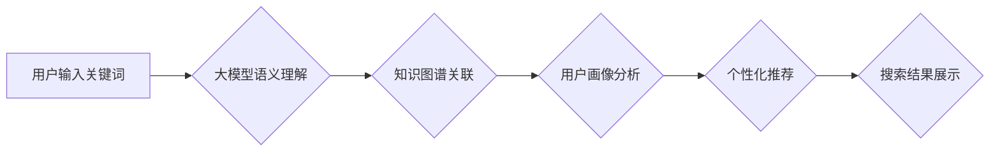

                 

## 大模型如何优化电商平台的搜索体验

> 关键词：大模型、电商平台、搜索体验、自然语言处理、推荐系统、知识图谱、用户画像

## 1. 背景介绍

在当今数字经济时代，电商平台已成为人们获取商品和服务的首选渠道。搜索体验作为电商平台的核心功能之一，直接影响着用户购物决策和平台的商业成功。传统的基于关键词匹配的搜索引擎难以满足用户日益增长的个性化需求，搜索结果往往缺乏精准度和相关性。

大模型的出现为电商平台搜索体验的优化提供了新的机遇。大模型，即大型语言模型，是一种基于深度学习的强大人工智能技术，能够理解和生成人类语言，并具备强大的文本处理能力。通过大模型的应用，电商平台可以实现更智能、更精准、更个性化的搜索体验，提升用户满意度和转化率。

## 2. 核心概念与联系

### 2.1  大模型

大模型是指参数量巨大、训练数据海量的人工智能模型。其强大的学习能力使其能够在自然语言处理、图像识别、语音合成等领域取得突破性进展。

### 2.2  电商平台搜索

电商平台搜索是指用户在平台上输入关键词或商品信息，系统根据算法规则返回匹配结果的过程。传统的搜索引擎主要依赖关键词匹配，但这种方法难以捕捉用户意图的复杂性和语义关联性。

### 2.3  大模型与电商平台搜索的联系

大模型可以将文本理解提升到新的高度，其强大的语义理解能力和文本生成能力可以有效解决传统搜索引擎的局限性。

**Mermaid 流程图**



## 3. 核心算法原理 & 具体操作步骤

### 3.1  算法原理概述

大模型在电商平台搜索体验优化中主要应用于以下几个方面：

* **语义理解:** 大模型可以理解用户输入的关键词背后的真实意图，即使关键词表达模糊或不完整。
* **知识图谱关联:** 大模型可以将用户输入的关键词与平台的知识图谱进行关联，挖掘商品之间的语义关系和用户兴趣偏好。
* **用户画像分析:** 大模型可以分析用户的历史搜索记录、购买行为、浏览习惯等数据，构建用户画像，为用户提供个性化的搜索结果。
* **文本生成:** 大模型可以生成更精准、更相关的商品描述、推荐文案等文本内容，提升用户体验。

### 3.2  算法步骤详解

1. **数据预处理:** 收集平台上的商品信息、用户数据、搜索日志等数据，进行清洗、格式化和特征提取。
2. **大模型训练:** 使用预处理后的数据训练大模型，例如BERT、GPT等，使其能够理解用户意图和商品语义。
3. **知识图谱构建:** 建立电商平台的知识图谱，将商品、品牌、类别、属性等信息进行关联，构建商品之间的语义网络。
4. **用户画像构建:** 利用大模型分析用户的历史数据，构建用户画像，包括用户兴趣、偏好、购买习惯等信息。
5. **搜索结果排序:** 根据用户输入的关键词、语义理解结果、知识图谱关联、用户画像分析等信息，对搜索结果进行排序，返回最相关的商品。
6. **个性化推荐:** 基于用户画像和搜索历史，为用户推荐个性化的商品和内容。

### 3.3  算法优缺点

**优点:**

* **语义理解能力强:** 大模型能够理解用户输入的真实意图，提升搜索结果的精准度。
* **个性化推荐效果好:** 大模型可以根据用户画像分析，提供个性化的商品推荐，提升用户体验。
* **持续学习和优化:** 大模型可以通过不断学习新的数据，不断优化搜索结果和推荐效果。

**缺点:**

* **训练成本高:** 大模型的训练需要大量的计算资源和数据，成本较高。
* **模型解释性差:** 大模型的决策过程较为复杂，难以解释其背后的逻辑，导致模型的可解释性较差。
* **数据安全问题:** 大模型的训练需要使用大量用户数据，需要做好数据安全和隐私保护工作。

### 3.4  算法应用领域

大模型在电商平台搜索体验优化之外，还可应用于以下领域：

* **智能客服:** 大模型可以理解用户的问题，并提供准确的答案，提升客服效率。
* **商品描述生成:** 大模型可以根据商品信息自动生成精准、吸引人的商品描述。
* **营销文案创作:** 大模型可以根据目标用户群体，创作个性化的营销文案。

## 4. 数学模型和公式 & 详细讲解 & 举例说明

### 4.1  数学模型构建

大模型的训练通常基于深度学习框架，例如TensorFlow或PyTorch。其数学模型主要包括以下几个部分：

* **词嵌入层:** 将单词映射到低维向量空间，捕捉单词之间的语义关系。
* **Transformer层:** 利用注意力机制，学习文本序列中的长距离依赖关系。
* **输出层:** 根据输入的文本序列，预测目标输出，例如关键词匹配得分、商品推荐概率等。

### 4.2  公式推导过程

由于大模型的数学模型非常复杂，其公式推导过程涉及大量的数学和统计知识。这里只简单介绍Transformer层的注意力机制公式：

**注意力权重:**

$$
\text{Attention}(Q, K, V) = \text{softmax}\left(\frac{QK^T}{\sqrt{d_k}}\right)V
$$

其中：

* $Q$：查询矩阵
* $K$：键矩阵
* $V$：值矩阵
* $d_k$：键向量的维度
* $\text{softmax}$：softmax函数，用于归一化注意力权重

**注意力机制**通过计算查询向量与键向量的相似度，来确定每个值向量的权重，从而对文本序列进行加权求和，学习文本中的重要信息。

### 4.3  案例分析与讲解

例如，用户输入关键词“智能手机”，大模型会将该关键词映射到词嵌入向量空间，并与商品信息中的词嵌入向量进行比较。通过注意力机制，大模型可以识别出与“智能手机”相关的关键信息，例如“屏幕尺寸”、“处理器”、“摄像头”等，并根据这些信息对商品进行排序和推荐。

## 5. 项目实践：代码实例和详细解释说明

### 5.1  开发环境搭建

* **操作系统:** Ubuntu 20.04
* **编程语言:** Python 3.8
* **深度学习框架:** TensorFlow 2.0
* **其他依赖:** numpy, pandas, matplotlib等

### 5.2  源代码详细实现

由于大模型的代码实现非常复杂，这里只提供一个简单的代码示例，用于演示大模型在电商平台搜索体验优化中的应用场景。

```python
import tensorflow as tf

# 定义一个简单的BERT模型
model = tf.keras.Sequential([
    tf.keras.layers.Embedding(input_dim=10000, output_dim=128),
    tf.keras.layers.LSTM(units=64),
    tf.keras.layers.Dense(units=1, activation='sigmoid')
])

# 训练模型
model.compile(optimizer='adam', loss='binary_crossentropy', metrics=['accuracy'])
model.fit(x_train, y_train, epochs=10)

# 使用模型进行预测
predictions = model.predict(x_test)
```

### 5.3  代码解读与分析

* **Embedding层:** 将输入的单词映射到低维向量空间。
* **LSTM层:** 学习文本序列中的长距离依赖关系。
* **Dense层:** 输出预测结果，例如商品匹配得分。

### 5.4  运行结果展示

训练完成后，可以使用测试数据对模型进行评估，并观察模型的预测结果。

## 6. 实际应用场景

大模型在电商平台搜索体验优化中的应用场景非常广泛，例如：

* **智能搜索:** 通过大模型的语义理解能力，实现更智能、更精准的搜索体验。
* **个性化推荐:** 根据用户的兴趣偏好和购买习惯，为用户提供个性化的商品推荐。
* **商品描述生成:** 利用大模型自动生成精准、吸引人的商品描述，提升商品的曝光率和转化率。
* **客服机器人:** 利用大模型构建智能客服机器人，自动回答用户常见问题，提升客服效率。

### 6.4  未来应用展望

随着大模型技术的不断发展，其在电商平台搜索体验优化中的应用场景将更加丰富，例如：

* **多模态搜索:** 将文本、图像、视频等多模态信息融合，实现更全面的商品搜索体验。
* **实时搜索:** 利用大模型的实时推理能力，实现实时搜索结果更新，提升用户体验。
* **跨语言搜索:** 利用大模型的跨语言理解能力，实现跨语言的商品搜索和推荐。

## 7. 工具和资源推荐

### 7.1  学习资源推荐

* **书籍:**
    * 《深度学习》
    * 《自然语言处理》
* **在线课程:**
    * Coursera: 深度学习
    * Udacity: 自然语言处理
* **博客和论坛:**
    * TensorFlow博客
    * PyTorch论坛

### 7.2  开发工具推荐

* **深度学习框架:** TensorFlow, PyTorch
* **自然语言处理库:** NLTK, spaCy
* **云计算平台:** AWS, Azure, GCP

### 7.3  相关论文推荐

* BERT: Pre-training of Deep Bidirectional Transformers for Language Understanding
* GPT-3: Language Models are Few-Shot Learners
* Transformer: Attention Is All You Need

## 8. 总结：未来发展趋势与挑战

### 8.1  研究成果总结

大模型在电商平台搜索体验优化方面取得了显著的成果，例如语义理解能力的提升、个性化推荐效果的增强等。

### 8.2  未来发展趋势

未来，大模型在电商平台搜索体验优化方面将朝着以下方向发展：

* **模型规模和能力的提升:** 随着计算资源的不断发展，大模型的规模和能力将进一步提升，能够处理更复杂的任务。
* **多模态搜索的融合:** 将文本、图像、视频等多模态信息融合，实现更全面的商品搜索体验。
* **实时搜索的应用:** 利用大模型的实时推理能力，实现实时搜索结果更新，提升用户体验。

### 8.3  面临的挑战

大模型在电商平台搜索体验优化方面也面临一些挑战：

* **训练成本高:** 大模型的训练需要大量的计算资源和数据，成本较高。
* **模型解释性差:** 大模型的决策过程较为复杂，难以解释其背后的逻辑，导致模型的可解释性较差。
* **数据安全问题:** 大模型的训练需要使用大量用户数据，需要做好数据安全和隐私保护工作。

### 8.4  研究展望

未来，需要进一步研究大模型的训练方法、模型架构、可解释性以及数据安全等问题，以更好地应用于电商平台搜索体验优化。


## 9. 附录：常见问题与解答

**Q1: 大模型的训练需要多少数据？**

A1: 大模型的训练需要海量数据，通常需要数十亿甚至上百亿条数据才能达到良好的效果。

**Q2: 大模型的训练成本很高吗？**

A2: 是的，大模型的训练成本很高，需要大量的计算资源和时间。

**Q3: 如何保证大模型的安全性？**

A3: 需要做好数据安全和隐私保护工作，避免模型被恶意利用。


作者：禅与计算机程序设计艺术 / Zen and the Art of Computer Programming 
<end_of_turn>

