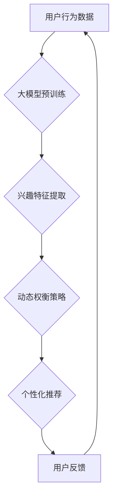

                 

## 大模型技术在电商平台用户兴趣探索与利用动态权衡中的创新

> 关键词：大模型、电商平台、用户兴趣探索、推荐系统、动态权衡、个性化推荐、深度学习、Transformer

## 1. 背景介绍

随着电商平台的蓬勃发展，用户兴趣的探索与利用已成为平台核心竞争力之一。传统推荐系统主要依赖用户历史行为和商品特征进行静态匹配，难以捕捉用户动态变化的兴趣偏好。大模型技术凭借其强大的语义理解和泛化能力，为电商平台用户兴趣探索与利用带来了新的机遇。

大模型是指参数规模巨大、训练数据海量的人工智能模型，例如GPT-3、BERT、LaMDA等。这些模型通过学习海量文本数据，掌握了丰富的语言知识和模式，能够理解用户意图、预测用户需求，并生成个性化的推荐结果。

## 2. 核心概念与联系

### 2.1 用户兴趣探索

用户兴趣探索是指通过分析用户行为、偏好、兴趣等信息，挖掘用户潜在需求，并将其转化为可行动的推荐。

### 2.2 大模型技术

大模型技术是指利用深度学习算法训练参数规模庞大的模型，使其具备强大的语义理解、文本生成、知识推理等能力。

### 2.3 动态权衡

动态权衡是指根据用户实时状态、上下文信息等因素，动态调整推荐策略和权重，以实现更精准、更个性化的推荐。

**核心概念与联系流程图**



## 3. 核心算法原理 & 具体操作步骤

### 3.1 算法原理概述

大模型技术在电商平台用户兴趣探索与利用中，主要通过以下核心算法实现：

* **Transformer模型**: Transformer模型是一种基于注意力机制的深度学习模型，能够有效捕捉文本序列中的长距离依赖关系，提升语义理解能力。
* **用户兴趣建模**: 利用Transformer模型对用户历史行为数据进行分析，构建用户兴趣模型，并提取用户兴趣特征。
* **商品特征表示**: 利用Transformer模型对商品信息进行分析，构建商品特征表示，并提取商品属性特征。
* **推荐策略**: 基于用户兴趣模型和商品特征表示，采用协同过滤、内容过滤等推荐策略，生成个性化推荐结果。

### 3.2 算法步骤详解

1. **数据预处理**: 收集用户行为数据、商品信息等数据，进行清洗、格式化、编码等预处理操作。
2. **大模型预训练**: 利用预训练的Transformer模型，对用户行为数据和商品信息进行训练，学习语义表示和特征提取能力。
3. **用户兴趣建模**: 利用训练好的Transformer模型，对用户历史行为数据进行分析，构建用户兴趣模型，并提取用户兴趣特征。
4. **商品特征表示**: 利用训练好的Transformer模型，对商品信息进行分析，构建商品特征表示，并提取商品属性特征。
5. **推荐策略**: 基于用户兴趣模型和商品特征表示，采用协同过滤、内容过滤等推荐策略，生成个性化推荐结果。
6. **结果评估**: 利用用户反馈数据，评估推荐结果的准确性和有效性，并进行模型调优。

### 3.3 算法优缺点

**优点**:

* **精准度提升**: 大模型能够捕捉用户细微的兴趣变化，提升推荐精准度。
* **个性化增强**: 大模型可以根据用户个性化需求，生成更个性化的推荐结果。
* **泛化能力强**: 预训练的Transformer模型具有强大的泛化能力，能够适应不同类型的电商平台和用户群体。

**缺点**:

* **计算资源需求高**: 大模型训练和推理需要大量的计算资源，成本较高。
* **数据依赖性强**: 大模型的性能依赖于训练数据的质量和规模。
* **可解释性较低**: 大模型的决策过程较为复杂，难以解释推荐结果背后的逻辑。

### 3.4 算法应用领域

大模型技术在电商平台用户兴趣探索与利用方面具有广泛的应用场景，例如：

* **商品推荐**: 根据用户兴趣和行为，推荐相关商品。
* **个性化营销**: 根据用户兴趣和需求，定制个性化营销方案。
* **内容推荐**: 根据用户兴趣，推荐相关资讯、文章、视频等内容。
* **搜索引擎优化**: 根据用户搜索意图，优化商品搜索结果。

## 4. 数学模型和公式 & 详细讲解 & 举例说明

### 4.1 数学模型构建

用户兴趣建模可以采用基于Transformer的深度学习模型，例如BERT或RoBERTa。这些模型将用户行为数据作为输入，学习用户兴趣特征的表示。

假设用户行为数据为序列 $U = \{u_1, u_2, ..., u_n\}$, 其中 $u_i$ 表示用户在时间 $t_i$ 的行为。

Transformer模型通过多头注意力机制和前馈神经网络，学习用户行为序列的语义表示 $H = \{h_1, h_2, ..., h_n\}$, 其中 $h_i$ 表示用户在时间 $t_i$ 的兴趣特征表示。

### 4.2 公式推导过程

Transformer模型的注意力机制公式如下：

$$
Attention(Q, K, V) = softmax(\frac{QK^T}{\sqrt{d_k}})V
$$

其中：

* $Q$：查询矩阵
* $K$：键矩阵
* $V$：值矩阵
* $d_k$：键向量的维度

Transformer模型通过多层堆叠的注意力机制和前馈神经网络，学习用户兴趣特征的表示。

### 4.3 案例分析与讲解

例如，用户浏览了服装、鞋子、包包等商品，Transformer模型可以学习到用户对时尚类商品的兴趣。

## 5. 项目实践：代码实例和详细解释说明

### 5.1 开发环境搭建

* Python 3.7+
* PyTorch 1.7+
* Transformers 4.0+

### 5.2 源代码详细实现

```python
from transformers import BertModel, BertTokenizer

# 加载预训练模型和词典
model_name = "bert-base-uncased"
tokenizer = BertTokenizer.from_pretrained(model_name)
model = BertModel.from_pretrained(model_name)

# 用户行为数据
user_behavior = ["浏览服装", "购买鞋子", "收藏包包"]

# 将用户行为数据转换为文本序列
input_ids = tokenizer(user_behavior, return_tensors="pt").input_ids

# 使用预训练模型提取用户兴趣特征
outputs = model(input_ids)
user_interest = outputs.last_hidden_state[:, 0, :]

# 打印用户兴趣特征
print(user_interest)
```

### 5.3 代码解读与分析

* 代码首先加载预训练的BERT模型和词典。
* 然后将用户行为数据转换为文本序列，并使用BERT模型提取用户兴趣特征。
* 最后打印用户兴趣特征。

### 5.4 运行结果展示

运行结果将输出用户兴趣特征的向量表示，该向量可以用于后续的推荐策略。

## 6. 实际应用场景

大模型技术在电商平台用户兴趣探索与利用方面具有广泛的应用场景，例如：

### 6.1 商品推荐

根据用户兴趣和行为，推荐相关商品。例如，用户浏览了运动鞋，平台可以推荐其他运动品牌、运动服饰等相关商品。

### 6.2 个性化营销

根据用户兴趣和需求，定制个性化营销方案。例如，用户对智能手机感兴趣，平台可以推送智能手机新品信息、优惠活动等。

### 6.3 内容推荐

根据用户兴趣，推荐相关资讯、文章、视频等内容。例如，用户对美食感兴趣，平台可以推荐美食博客、食谱、餐厅评价等内容。

### 6.4 未来应用展望

随着大模型技术的不断发展，其在电商平台用户兴趣探索与利用方面的应用场景将更加丰富，例如：

* **多模态推荐**: 将文本、图像、视频等多模态数据融合，实现更精准、更丰富的推荐。
* **实时个性化**: 基于用户实时状态和上下文信息，动态调整推荐策略，实现更个性化的推荐体验。
* **用户画像构建**: 利用大模型构建更精准的用户画像，深入了解用户需求和偏好。

## 7. 工具和资源推荐

### 7.1 学习资源推荐

* **论文**:
    * Vaswani, A., Shazeer, N., Parmar, N., Uszkoreit, J., Jones, L., Gomez, A. N., ... & Polosukhin, I. (2017). Attention is all you need. Advances in neural information processing systems, 30.
    * Devlin, J., Chang, M. W., Lee, K., & Toutanova, K. (2018). Bert: Pre-training of deep bidirectional transformers for language understanding. arXiv preprint arXiv:1810.04805.
* **博客**:
    * https://huggingface.co/blog/
    * https://www.tensorflow.org/blog

### 7.2 开发工具推荐

* **PyTorch**: https://pytorch.org/
* **Transformers**: https://huggingface.co/docs/transformers/index

### 7.3 相关论文推荐

* **BERT**: Devlin, J., Chang, M. W., Lee, K., & Toutanova, K. (2018). Bert: Pre-training of deep bidirectional transformers for language understanding. arXiv preprint arXiv:1810.04805.
* **GPT-3**: Brown, T. B., Mann, B., Ryder, N., Subbiah, M., Kaplan, J., Dhariwal, P., ... & Amodei, D. (2020). Language models are few-shot learners. arXiv preprint arXiv:2005.14165.

## 8. 总结：未来发展趋势与挑战

### 8.1 研究成果总结

大模型技术在电商平台用户兴趣探索与利用方面取得了显著成果，能够提升推荐精准度、个性化程度，并拓展应用场景。

### 8.2 未来发展趋势

未来，大模型技术在电商平台用户兴趣探索与利用方面将朝着以下方向发展：

* **多模态融合**: 将文本、图像、视频等多模态数据融合，实现更精准、更丰富的推荐。
* **实时个性化**: 基于用户实时状态和上下文信息，动态调整推荐策略，实现更个性化的推荐体验。
* **用户画像构建**: 利用大模型构建更精准的用户画像，深入了解用户需求和偏好。

### 8.3 面临的挑战

大模型技术在电商平台用户兴趣探索与利用方面也面临一些挑战：

* **计算资源需求高**: 大模型训练和推理需要大量的计算资源，成本较高。
* **数据依赖性强**: 大模型的性能依赖于训练数据的质量和规模。
* **可解释性较低**: 大模型的决策过程较为复杂，难以解释推荐结果背后的逻辑。

### 8.4 研究展望

未来研究将重点关注以下方面：

* **高效训练方法**: 研究更有效的训练方法，降低大模型训练成本。
* **数据增强技术**: 研究数据增强技术，提升训练数据的质量和规模。
* **可解释性研究**: 研究大模型的可解释性，提高推荐结果的可信度和用户接受度。

## 9. 附录：常见问题与解答

**Q1: 大模型技术与传统推荐系统相比有哪些优势？**

**A1:** 大模型技术相比传统推荐系统，具有以下优势：

* **精准度提升**: 大模型能够捕捉用户细微的兴趣变化，提升推荐精准度。
* **个性化增强**: 大模型可以根据用户个性化需求，生成更个性化的推荐结果。
* **泛化能力强**: 预训练的Transformer模型具有强大的泛化能力，能够适应不同类型的电商平台和用户群体。

**Q2: 大模型技术有哪些应用场景？**

**A2:** 大模型技术在电商平台用户兴趣探索与利用方面具有广泛的应用场景，例如：

* **商品推荐**: 根据用户兴趣和行为，推荐相关商品。
* **个性化营销**: 根据用户兴趣和需求，定制个性化营销方案。
* **内容推荐**: 根据用户兴趣，推荐相关资讯、文章、视频等内容。

**Q3: 大模型技术有哪些挑战？**

**A3:** 大模型技术在电商平台用户兴趣探索与利用方面也面临一些挑战：

* **计算资源需求高**: 大模型训练和推理需要大量的计算资源，成本较高。
* **数据依赖性强**: 大模型的性能依赖于训练数据的质量和规模。
* **可解释性较低**: 大模型的决策过程较为复杂，难以解释推荐结果背后的逻辑。


作者：禅与计算机程序设计艺术 / Zen and the Art of Computer Programming 
<end_of_turn>

