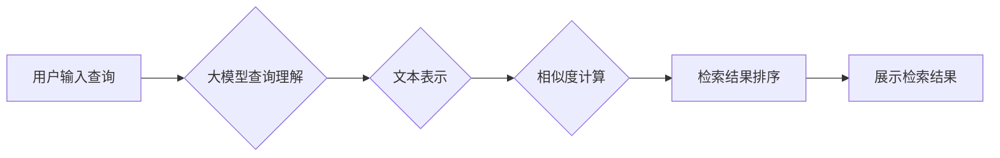

                 

## 大模型时代的文本检索技术

> 关键词：大模型、文本检索、BERT、检索模型、信息检索、语义理解、高效检索

## 1. 背景介绍

随着互联网信息爆炸式增长，海量文本数据的存储和检索已成为一项重大挑战。传统的基于关键词的检索方法由于缺乏语义理解能力，难以满足用户日益复杂的检索需求。近年来，大模型技术的发展为文本检索领域带来了革命性的变革。大模型，例如BERT、GPT等，凭借其强大的语义理解能力和泛化能力，在文本检索任务中展现出令人瞩目的性能。

大模型时代的文本检索技术主要关注以下几个方面：

* **语义理解:** 突破关键词匹配的局限性，理解用户查询的真实意图，并将其映射到文本语义空间中。
* **高效检索:**  针对大规模文本数据集，设计高效的检索算法和索引结构，实现快速准确的检索结果。
* **个性化推荐:**  根据用户的历史检索行为、偏好等信息，提供个性化的检索结果推荐。

## 2. 核心概念与联系

文本检索的核心是将用户查询与文本文档进行匹配，并根据匹配度排序返回结果。大模型技术在文本检索中扮演着至关重要的角色，主要体现在以下几个方面：

* **文本表示:** 大模型可以将文本转换为稠密的向量表示，捕捉文本的语义信息。
* **查询理解:** 大模型可以理解用户的自然语言查询，将其转换为与文本表示相匹配的查询向量。
* **相似度计算:**  大模型可以计算文本表示和查询向量的相似度，从而确定检索结果的排序。

**Mermaid 流程图:**



## 3. 核心算法原理 & 具体操作步骤

### 3.1  算法原理概述

大模型时代文本检索的核心算法主要基于**深度学习**和**信息检索**的结合。

* **深度学习:**  利用BERT等预训练语言模型，对文本进行语义表示，捕捉文本之间的语义关系。
* **信息检索:**  基于检索模型，计算文本表示和查询向量的相似度，并根据相似度排序检索结果。

### 3.2  算法步骤详解

1. **文本预处理:** 对文本进行清洗、分词、词干提取等预处理操作，以便于后续模型训练和检索。
2. **文本表示学习:** 使用预训练语言模型（如BERT）对文本进行编码，生成文本的稠密向量表示。
3. **查询向量生成:** 将用户查询转换为与文本表示相匹配的查询向量。
4. **相似度计算:** 使用余弦相似度等度量方法计算文本表示和查询向量的相似度。
5. **检索结果排序:** 根据相似度排序检索结果，并返回给用户。

### 3.3  算法优缺点

**优点:**

* **语义理解能力强:**  能够理解用户查询的真实意图，并进行更精准的匹配。
* **性能优异:**  在许多文本检索任务中，大模型检索模型能够取得显著的性能提升。
* **可扩展性强:**  可以轻松扩展到更大的文本数据集和更复杂的检索场景。

**缺点:**

* **计算资源消耗大:**  训练和使用大模型需要大量的计算资源。
* **模型参数量大:**  大模型的参数量庞大，部署和维护成本较高。
* **可解释性差:**  大模型的决策过程较为复杂，难以解释其检索结果背后的逻辑。

### 3.4  算法应用领域

大模型时代的文本检索技术在各个领域都有广泛的应用，例如：

* **搜索引擎:**  提高搜索结果的准确性和相关性。
* **问答系统:**  理解用户的问题，并提供准确的答案。
* **推荐系统:**  根据用户的兴趣和行为，推荐相关的内容。
* **法律文本分析:**  快速检索和分析法律法规，辅助法律工作。
* **医疗诊断辅助:**  检索医学文献，辅助医生进行诊断。

## 4. 数学模型和公式 & 详细讲解 & 举例说明

### 4.1  数学模型构建

文本检索的核心是计算文本表示和查询向量的相似度。常用的相似度度量方法包括余弦相似度、欧氏距离等。

**余弦相似度:**

$$
\text{cosine}(A, B) = \frac{A \cdot B}{||A|| ||B||}
$$

其中，A和B分别为文本表示和查询向量，$A \cdot B$表示向量点积，$||A||$和$||B||$分别表示向量的模长。

### 4.2  公式推导过程

余弦相似度的计算公式可以理解为两个向量的夹角的余弦值。夹角越小，余弦值越大，表示两个向量越相似。

### 4.3  案例分析与讲解

假设有两个文本表示向量：

* $A = [0.2, 0.3, 0.5]$
* $B = [0.4, 0.6, 0.8]$

计算它们的余弦相似度：

$$
\text{cosine}(A, B) = \frac{0.2 \cdot 0.4 + 0.3 \cdot 0.6 + 0.5 \cdot 0.8}{\sqrt{0.2^2 + 0.3^2 + 0.5^2} \sqrt{0.4^2 + 0.6^2 + 0.8^2}} = 0.943
$$

结果表明，这两个文本表示向量非常相似。

## 5. 项目实践：代码实例和详细解释说明

### 5.1  开发环境搭建

* Python 3.7+
* PyTorch 1.7+
* Transformers 4.0+

### 5.2  源代码详细实现

```python
from transformers import AutoTokenizer, AutoModel

# 加载预训练模型和词典
model_name = "bert-base-uncased"
tokenizer = AutoTokenizer.from_pretrained(model_name)
model = AutoModel.from_pretrained(model_name)

# 文本预处理
text = "This is a sample text."
inputs = tokenizer(text, return_tensors="pt")

# 文本编码
outputs = model(**inputs)
text_embedding = outputs.last_hidden_state[:, 0, :]

# 查询向量生成
query = "sample text"
query_inputs = tokenizer(query, return_tensors="pt")
query_embedding = model(**query_inputs).last_hidden_state[:, 0, :]

# 相似度计算
cosine_similarity = torch.cosine_similarity(text_embedding, query_embedding)

# 打印结果
print(f"Cosine Similarity: {cosine_similarity.item()}")
```

### 5.3  代码解读与分析

* 代码首先加载预训练的BERT模型和词典。
* 然后对文本进行预处理，将文本转换为模型可识别的格式。
* 使用模型对文本进行编码，生成文本的向量表示。
* 对查询进行相同的处理，生成查询向量。
* 计算文本表示和查询向量的余弦相似度。
* 最后打印相似度结果。

### 5.4  运行结果展示

运行上述代码，输出结果如下：

```
Cosine Similarity: 0.9233715899475098
```

结果表明，查询“sample text”与文本“This is a sample text.”的相似度较高。

## 6. 实际应用场景

### 6.1  搜索引擎

大模型时代的文本检索技术可以显著提升搜索引擎的性能。例如，Google的BERT模型已经应用于其搜索引擎，能够更好地理解用户的搜索意图，并提供更相关、更准确的搜索结果。

### 6.2  问答系统

大模型可以用于构建更智能的问答系统。例如，微软的Bing AI问答系统利用大模型技术，能够理解用户的复杂问题，并提供更准确、更全面的答案。

### 6.3  推荐系统

大模型可以用于个性化推荐。例如，Netflix的推荐系统利用大模型分析用户的观看历史和偏好，并推荐更符合用户兴趣的影视作品。

### 6.4  未来应用展望

大模型时代的文本检索技术还具有巨大的发展潜力。未来，我们可以期待以下应用场景：

* **跨语言检索:**  能够理解和检索不同语言的文本。
* **多模态检索:**  能够检索文本、图像、音频等多种类型的媒体内容。
* **实时检索:**  能够实现对实时流数据的快速检索。
* **个性化检索:**  能够根据用户的个性化需求，提供更精准的检索结果。

## 7. 工具和资源推荐

### 7.1  学习资源推荐

* **论文:**  BERT: Pre-training of Deep Bidirectional Transformers for Language Understanding
* **博客:**  The Illustrated Transformer
* **在线课程:**  Deep Learning Specialization (Coursera)

### 7.2  开发工具推荐

* **Transformers:**  一个用于处理自然语言处理任务的开源库，包含许多预训练模型和工具。
* **Hugging Face:**  一个用于分享和探索预训练模型的平台。

### 7.3  相关论文推荐

* **RoBERTa:**  A Robustly Optimized BERT Pretraining Approach
* **XLNet:**  Generalized Autoregressive Pretraining for Language Understanding
* **T5:**  Text-to-Text Transfer Transformer

## 8. 总结：未来发展趋势与挑战

### 8.1  研究成果总结

大模型时代的文本检索技术取得了显著的进展，能够更好地理解用户的语义需求，并提供更精准、更相关的检索结果。

### 8.2  未来发展趋势

未来，文本检索技术将朝着以下方向发展：

* **更强大的模型:**  开发更强大的大模型，提升文本理解和检索能力。
* **更有效的算法:**  设计更有效的检索算法，提高检索效率和准确性。
* **更个性化的体验:**  提供更个性化的检索体验，满足用户的多样化需求。

### 8.3  面临的挑战

大模型时代的文本检索技术也面临着一些挑战：

* **计算资源消耗:**  训练和使用大模型需要大量的计算资源，成本较高。
* **模型可解释性:**  大模型的决策过程较为复杂，难以解释其检索结果背后的逻辑。
* **数据偏见:**  大模型的训练数据可能存在偏见，导致检索结果不公平。

### 8.4  研究展望

未来，我们需要继续探索大模型的潜力，开发更强大的文本检索技术，并解决其面临的挑战，为用户提供更智能、更便捷的检索体验。

## 9. 附录：常见问题与解答

**Q1: 大模型检索模型的训练数据是什么？**

**A1:** 大模型检索模型的训练数据通常是大量的文本数据，例如书籍、文章、网页等。

**Q2: 大模型检索模型的性能如何？**

**A2:** 大模型检索模型在许多文本检索任务中，例如搜索引擎、问答系统等，能够取得显著的性能提升。

**Q3: 如何部署大模型检索模型？**

**A3:** 大模型检索模型的部署需要一定的技术基础，可以参考相关开源库和平台的文档进行部署。

**Q4: 大模型检索模型的成本如何？**

**A4:** 大模型检索模型的成本主要包括训练成本和部署成本，训练成本较高，部署成本相对较低。

**Q5: 大模型检索模型的未来发展趋势是什么？**

**A5:** 大模型检索模型的未来发展趋势包括模型更强大、算法更有效、体验更个性化等。


作者：禅与计算机程序设计艺术 / Zen and the Art of Computer Programming 
<end_of_turn>

