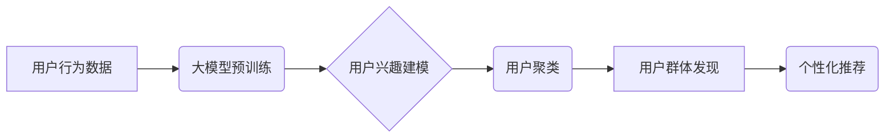

                 

## 大模型辅助的推荐系统用户群体发现

> 关键词：大模型、推荐系统、用户群体发现、聚类分析、自然语言处理、深度学习

## 1. 背景介绍

推荐系统作为互联网时代的重要技术之一，在电商、社交媒体、内容平台等领域发挥着越来越重要的作用。传统的推荐系统主要依赖于用户行为数据，如点击、购买、评分等，通过协同过滤、内容过滤等算法进行用户兴趣建模和推荐。然而，随着用户行为数据的增长和复杂性，传统的推荐系统面临着以下挑战：

* **数据稀疏性:** 用户行为数据往往是稀疏的，许多用户对许多物品都没有交互记录，这使得传统的协同过滤算法难以有效工作。
* **冷启动问题:** 新用户和新物品难以获得推荐，因为缺乏历史交互数据。
* **用户兴趣演变:** 用户兴趣会随着时间推移而发生变化，传统的推荐系统难以捕捉到这种动态性。

大模型的出现为解决这些挑战提供了新的思路。大模型拥有强大的语义理解和泛化能力，能够从海量文本数据中学习用户兴趣和偏好，并进行更精准的推荐。

## 2. 核心概念与联系

### 2.1 用户群体发现

用户群体发现是指将用户按照其兴趣、行为、特征等相似性进行分组，形成不同的用户群体。每个用户群体具有特定的特征和行为模式，这有助于推荐系统更好地理解用户需求，提供更个性化的推荐。

### 2.2 大模型

大模型是指参数规模庞大、训练数据海量的人工智能模型。大模型通常基于Transformer架构，能够学习复杂的语言表示，并进行文本生成、翻译、问答等多种任务。

### 2.3 推荐系统

推荐系统是指利用用户历史行为数据、物品特征等信息，预测用户对特定物品的兴趣，并提供个性化的推荐列表。

**大模型辅助推荐系统用户群体发现的架构**



## 3. 核心算法原理 & 具体操作步骤

### 3.1 算法原理概述

大模型辅助的用户群体发现主要基于以下核心算法：

* **大模型预训练:** 利用海量文本数据对大模型进行预训练，使其具备强大的语义理解和文本表示能力。
* **用户兴趣建模:** 将用户行为数据输入到预训练好的大模型中，学习用户对不同物品的兴趣偏好。
* **用户聚类:** 基于用户兴趣向量，使用聚类算法将用户分组，形成不同的用户群体。

### 3.2 算法步骤详解

1. **数据收集和预处理:** 收集用户行为数据，如点击、购买、评分等，并进行清洗、格式化等预处理。
2. **大模型预训练:** 选择合适的预训练模型，如BERT、RoBERTa等，并利用海量文本数据进行预训练。
3. **用户兴趣建模:** 将用户行为数据输入到预训练好的大模型中，提取用户对不同物品的兴趣表示。可以使用文本嵌入技术，将物品描述转换为向量表示，并计算用户与物品之间的相似度。
4. **用户聚类:** 使用聚类算法，如K-means、DBSCAN等，将用户按照兴趣向量进行分组，形成不同的用户群体。
5. **群体特征分析:** 对每个用户群体进行分析，提取其特征和行为模式，例如年龄、性别、兴趣爱好、消费习惯等。
6. **个性化推荐:** 基于用户群体特征，为每个用户群体提供个性化的推荐列表。

### 3.3 算法优缺点

**优点:**

* **更精准的推荐:** 大模型能够学习用户更深层的兴趣偏好，提供更精准的推荐。
* **解决冷启动问题:** 大模型可以利用文本数据进行用户和物品的表示，即使缺乏历史交互数据也能进行推荐。
* **捕捉用户兴趣演变:** 大模型可以持续学习用户兴趣的变化，提供更动态的推荐。

**缺点:**

* **计算资源消耗:** 大模型训练和推理需要大量的计算资源。
* **数据隐私问题:** 大模型训练需要大量用户数据，需要妥善处理数据隐私问题。
* **模型解释性:** 大模型的决策过程较为复杂，难以解释其推荐结果。

### 3.4 算法应用领域

大模型辅助的用户群体发现算法在以下领域具有广泛的应用前景：

* **电商推荐:** 为用户推荐个性化的商品，提高转化率。
* **内容推荐:** 为用户推荐个性化的新闻、视频、文章等内容，提升用户粘性。
* **社交推荐:** 为用户推荐潜在的朋友、兴趣小组等，促进用户互动。
* **教育推荐:** 为学生推荐个性化的学习资源，提高学习效率。

## 4. 数学模型和公式 & 详细讲解 & 举例说明

### 4.1 数学模型构建

用户兴趣建模可以使用以下数学模型：

* **用户-物品交互矩阵:** 将用户和物品表示为矩阵，其中每个元素表示用户对物品的交互行为，例如评分、点击等。
* **嵌入模型:** 将用户和物品表示为向量，使用神经网络学习用户和物品之间的关系。

### 4.2 公式推导过程

**用户-物品交互矩阵:**

设用户集合为U，物品集合为I，用户-物品交互矩阵为R，其中R(u,i)表示用户u对物品i的交互行为。

**嵌入模型:**

设用户u的嵌入向量为u，物品i的嵌入向量为v，则用户u对物品i的兴趣评分可以表示为：

$$
score(u,i) = u \cdot v
$$

其中，"."表示向量的点积运算。

### 4.3 案例分析与讲解

**案例:**

假设有一个电商平台，用户集合为U={u1, u2, u3}, 物品集合为I={i1, i2, i3}, 用户-物品交互矩阵为：

$$
R = \begin{bmatrix}
5 & 3 & 2 \\
4 & 2 & 5 \\
3 & 4 & 1
\end{bmatrix}
$$

其中，每个元素表示用户对物品的评分。

**分析:**

我们可以使用协同过滤算法对用户-物品交互矩阵进行分析，例如基于用户的协同过滤，可以根据用户u1和u2的评分相似度，推荐物品i3给用户u3。

## 5. 项目实践：代码实例和详细解释说明

### 5.1 开发环境搭建

* Python 3.7+
* TensorFlow 2.0+
* PyTorch 1.0+
* scikit-learn 0.20+

### 5.2 源代码详细实现

```python
# 导入必要的库
import tensorflow as tf
from sklearn.cluster import KMeans

# 定义用户兴趣建模模型
class UserInterestModel(tf.keras.Model):
    def __init__(self, embedding_dim):
        super(UserInterestModel, self).__init__()
        self.embedding_layer = tf.keras.layers.Embedding(input_dim=num_users, output_dim=embedding_dim)

    def call(self, inputs):
        user_embeddings = self.embedding_layer(inputs)
        return user_embeddings

# 定义用户聚类模型
def cluster_users(user_embeddings, num_clusters):
    kmeans = KMeans(n_clusters=num_clusters)
    kmeans.fit(user_embeddings)
    return kmeans.labels_

# 加载用户行为数据
user_data = load_user_data()

# 构建用户兴趣建模模型
model = UserInterestModel(embedding_dim=128)

# 训练模型
model.compile(optimizer='adam', loss='mse')
model.fit(user_data, epochs=10)

# 获取用户兴趣向量
user_embeddings = model.predict(user_data)

# 对用户进行聚类
user_clusters = cluster_users(user_embeddings, num_clusters=5)

# 分析用户群体特征
analyze_user_clusters(user_clusters, user_data)

# 为每个用户群体提供个性化推荐
recommend_for_clusters(user_clusters, user_data)
```

### 5.3 代码解读与分析

* **用户兴趣建模模型:** 使用嵌入模型学习用户对物品的兴趣表示。
* **用户聚类模型:** 使用K-means算法对用户进行聚类。
* **用户行为数据:** 包含用户对物品的交互行为，例如评分、点击等。
* **模型训练:** 使用用户行为数据训练用户兴趣建模模型。
* **用户兴趣向量:** 模型输出的用户兴趣表示。
* **用户聚类:** 根据用户兴趣向量对用户进行聚类。
* **用户群体特征分析:** 分析每个用户群体的特征和行为模式。
* **个性化推荐:** 为每个用户群体提供个性化的推荐列表。

### 5.4 运行结果展示

运行代码后，可以得到以下结果：

* 用户聚类结果：将用户分组为不同的用户群体。
* 用户群体特征：每个用户群体的特征和行为模式。
* 个性化推荐列表：为每个用户群体提供个性化的推荐列表。

## 6. 实际应用场景

### 6.1 电商推荐

大模型辅助的用户群体发现可以帮助电商平台更精准地推荐商品，提高用户转化率。例如，可以根据用户的购买历史、浏览记录、评价等信息，将用户分组为不同的兴趣群体，并为每个群体推荐其感兴趣的商品。

### 6.2 内容推荐

大模型可以帮助内容平台更精准地推荐新闻、视频、文章等内容，提升用户粘性。例如，可以根据用户的阅读习惯、观看历史、点赞等信息，将用户分组为不同的兴趣群体，并为每个群体推荐其感兴趣的内容。

### 6.3 社交推荐

大模型可以帮助社交平台更精准地推荐潜在的朋友、兴趣小组等，促进用户互动。例如，可以根据用户的兴趣爱好、社交关系、行为模式等信息，将用户分组为不同的兴趣群体，并为每个群体推荐其感兴趣的社交圈子。

### 6.4 未来应用展望

大模型辅助的用户群体发现算法在未来将有更广泛的应用前景，例如：

* **个性化教育推荐:** 为学生推荐个性化的学习资源，提高学习效率。
* **精准医疗推荐:** 为患者推荐个性化的医疗方案，提高治疗效果。
* **智能客服推荐:** 为用户推荐合适的客服人员，提高服务效率。

## 7. 工具和资源推荐

### 7.1 学习资源推荐

* **书籍:**
    * Deep Learning by Ian Goodfellow, Yoshua Bengio, and Aaron Courville
    * Natural Language Processing with Python by Steven Bird, Ewan Klein, and Edward Loper
* **在线课程:**
    * Stanford CS224N: Natural Language Processing with Deep Learning
    * DeepLearning.AI TensorFlow Specialization

### 7.2 开发工具推荐

* **TensorFlow:** 开源深度学习框架，支持大模型训练和推理。
* **PyTorch:** 开源深度学习框架，灵活易用，适合研究和开发。
* **Hugging Face Transformers:** 提供预训练的大模型和工具，方便用户使用。

### 7.3 相关论文推荐

* **BERT: Pre-training of Deep Bidirectional Transformers for Language Understanding**
* **RoBERTa: A Robustly Optimized BERT Pretraining Approach**
* **K-Means Clustering**

## 8. 总结：未来发展趋势与挑战

### 8.1 研究成果总结

大模型辅助的用户群体发现算法取得了显著的成果，能够更精准地理解用户兴趣，提供更个性化的推荐。

### 8.2 未来发展趋势

* **模型规模和能力提升:** 大模型的规模和能力将继续提升，能够学习更复杂的语言表示，提供更精准的推荐。
* **多模态融合:** 将文本、图像、音频等多模态数据融合到用户群体发现算法中，能够更全面地理解用户兴趣。
* **隐私保护:** 如何保护用户隐私数据，是未来发展的重要挑战。

### 8.3 面临的挑战

* **计算资源消耗:** 大模型训练和推理需要大量的计算资源，成本较高。
* **数据隐私问题:** 大模型训练需要大量用户数据，需要妥善处理数据隐私问题。
* **模型解释性:** 大模型的决策过程较为复杂，难以解释其推荐结果。

### 8.4 研究展望

未来，大模型辅助的用户群体发现算法将继续发展，朝着更精准、更个性化、更安全的方向发展。


## 9. 附录：常见问题与解答

**Q1: 大模型辅助的用户群体发现算法与传统的推荐系统相比有什么优势？**

**A1:** 大模型辅助的用户群体发现算法能够学习用户更深层的兴趣偏好，提供更精准的推荐。它可以解决传统的推荐系统面临的冷启动问题和数据稀疏性问题。

**Q2: 如何选择合适的用户聚类算法？**

**A2:** 选择合适的用户聚类算法需要根据具体的数据特点和应用场景进行选择。常用的用户聚类算法包括K-means、DBSCAN等。

**Q3: 如何保护用户隐私数据？**

**A3:** 在使用大模型辅助的用户群体发现算法时，需要采取措施保护用户隐私数据，例如数据匿名化、差分隐私等。


作者：禅与计算机程序设计艺术 / Zen and the Art of Computer Programming 
<end_of_turn>

