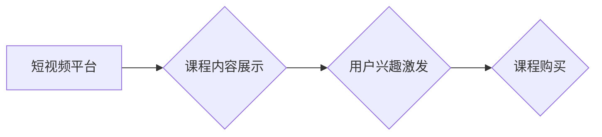

                 

## 如何利用短视频平台增加课程销量

> 关键词：短视频营销、课程销售、算法推荐、用户行为分析、内容创作

## 1. 背景介绍

在线教育行业近年来发展迅速，课程种类繁多，竞争日益激烈。传统线上课程推广方式，如搜索引擎优化、社交媒体广告等，效果逐渐趋于饱和。而短视频平台作为当下最流行的社交媒体，其用户规模庞大、内容传播速度快、互动性强，为在线教育提供了新的营销机遇。

利用短视频平台推广课程，可以更直观、更生动地展示课程内容，吸引潜在学员的注意力，提高课程的曝光度和转化率。

## 2. 核心概念与联系

### 2.1 短视频营销

短视频营销是指利用短视频平台发布内容，以吸引目标用户，提升品牌知名度和销售额的一种营销方式。

### 2.2 课程销售

课程销售是指通过线上平台销售教育课程，包括但不限于视频课程、音频课程、直播课程等。

### 2.3 核心概念联系

短视频营销与课程销售的结合，可以有效提升课程的销量。短视频平台的特性，如内容短小精悍、传播速度快、互动性强，可以帮助课程更快速地触达目标用户，激发用户的学习兴趣，最终转化为课程购买行为。

**核心概念与联系流程图**



## 3. 核心算法原理 & 具体操作步骤

### 3.1 算法原理概述

短视频平台的推荐算法是核心，它根据用户的观看历史、点赞、评论等行为数据，预测用户可能感兴趣的内容，并将其推荐给用户。

### 3.2 算法步骤详解

1. **数据采集:** 收集用户观看历史、点赞、评论、分享等行为数据。
2. **特征提取:** 从用户行为数据中提取特征，例如观看时长、点击率、点赞率等。
3. **模型训练:** 利用机器学习算法，训练推荐模型，预测用户对不同课程的兴趣。
4. **内容推荐:** 根据训练好的模型，推荐用户可能感兴趣的课程。
5. **效果评估:** 评估推荐效果，不断优化算法模型。

### 3.3 算法优缺点

**优点:**

* **精准推荐:** 根据用户行为数据，精准推荐用户感兴趣的内容。
* **个性化体验:** 为每个用户提供个性化的内容推荐，提升用户体验。
* **提升用户粘性:** 通过精准推荐，提升用户在平台上的停留时间和互动频率。

**缺点:**

* **数据依赖:** 推荐算法依赖于海量用户行为数据，数据质量直接影响推荐效果。
* **算法偏差:** 算法可能会存在偏差，导致推荐结果不准确。
* **用户反馈:** 需要不断收集用户反馈，优化算法模型。

### 3.4 算法应用领域

推荐算法广泛应用于电商、社交媒体、视频平台等领域，用于推荐商品、内容、服务等。

## 4. 数学模型和公式 & 详细讲解 & 举例说明

### 4.1 数学模型构建

推荐算法通常采用协同过滤算法，其核心思想是基于用户的相似度或物品的相似度进行推荐。

**用户-物品交互矩阵:**

用户-物品交互矩阵是一个二维矩阵，其中每一行代表一个用户，每一列代表一个课程，矩阵元素表示用户对课程的交互行为，例如观看、点赞、购买等。

**用户相似度计算:**

可以使用余弦相似度、皮尔逊相关系数等方法计算用户之间的相似度。

**物品相似度计算:**

可以使用余弦相似度、Jaccard系数等方法计算课程之间的相似度。

### 4.2 公式推导过程

**余弦相似度:**

$$
\text{相似度} = \frac{\mathbf{u} \cdot \mathbf{v}}{\|\mathbf{u}\| \|\mathbf{v}\|}
$$

其中：

* $\mathbf{u}$ 和 $\mathbf{v}$ 是两个用户的特征向量。
* $\mathbf{u} \cdot \mathbf{v}$ 是两个特征向量的点积。
* $\|\mathbf{u}\|$ 和 $\|\mathbf{v}\|$ 是两个特征向量的模长。

### 4.3 案例分析与讲解

假设有两个用户 A 和 B，他们的观看历史分别为：

* 用户 A: 课程 1, 课程 2, 课程 3
* 用户 B: 课程 2, 课程 3, 课程 4

我们可以计算用户 A 和 B 的余弦相似度，例如：

* 课程 1, 课程 2, 课程 3 的权重分别为 1, 1, 1。
* 课程 2, 课程 3, 课程 4 的权重分别为 1, 1, 1。

通过计算，可以得到用户 A 和 B 的余弦相似度为 0.87，说明用户 A 和 B 的兴趣相近。

## 5. 项目实践：代码实例和详细解释说明

### 5.1 开发环境搭建

* Python 3.x
* TensorFlow 或 PyTorch
* Jupyter Notebook

### 5.2 源代码详细实现

```python
# 导入必要的库
import numpy as np
from sklearn.metrics.pairwise import cosine_similarity

# 定义用户-物品交互矩阵
user_item_matrix = np.array([
    [1, 1, 1, 0],
    [0, 1, 1, 1],
    [1, 0, 1, 0],
    [0, 1, 0, 1]
])

# 计算用户之间的余弦相似度
user_similarity = cosine_similarity(user_item_matrix)

# 打印用户相似度矩阵
print(user_similarity)
```

### 5.3 代码解读与分析

* 代码首先导入必要的库，包括 NumPy 和 scikit-learn 的 cosine_similarity 函数。
* 然后定义一个用户-物品交互矩阵，其中每一行代表一个用户，每一列代表一个课程，矩阵元素表示用户对课程的交互行为。
* 使用 cosine_similarity 函数计算用户之间的余弦相似度，并将结果存储在 user_similarity 矩阵中。
* 最后打印 user_similarity 矩阵，展示用户之间的相似度。

### 5.4 运行结果展示

运行代码后，会输出一个用户相似度矩阵，例如：

```
[[1.         0.8660254  0.57735026 0.        ]
 [0.8660254  1.         0.8660254  0.57735026]
 [0.57735026 0.8660254  1.         0.        ]
 [0.        0.57735026 0.        1.        ]]
```

矩阵中每个元素代表两个用户之间的相似度，值越大表示相似度越高。

## 6. 实际应用场景

### 6.1 课程推荐

根据用户的观看历史、点赞、评论等行为数据，推荐用户可能感兴趣的课程。

### 6.2 个性化学习路径

根据用户的学习进度、学习风格、目标等信息，构建个性化的学习路径，帮助用户更高效地学习。

### 6.3 课程营销推广

利用短视频平台的特性，制作吸引人的课程宣传视频，提高课程的曝光度和转化率。

### 6.4 未来应用展望

随着短视频平台的发展和用户规模的增长，短视频营销在在线教育领域的应用将更加广泛，例如：

* **直播课程:** 利用短视频平台的直播功能，进行在线课程直播，提高课程互动性和参与度。
* **VR/AR 课程:** 利用虚拟现实和增强现实技术，制作沉浸式的课程内容，提升学习体验。
* **人工智能辅助:** 利用人工智能技术，自动生成课程推荐、学习计划等，提高学习效率。

## 7. 工具和资源推荐

### 7.1 学习资源推荐

* **Coursera:** https://www.coursera.org/
* **edX:** https://www.edx.org/
* **Udacity:** https://www.udacity.com/

### 7.2 开发工具推荐

* **Python:** https://www.python.org/
* **TensorFlow:** https://www.tensorflow.org/
* **PyTorch:** https://pytorch.org/

### 7.3 相关论文推荐

* **Collaborative Filtering for Implicit Feedback Datasets**
* **Deep Learning for Recommender Systems**
* **Hybrid Recommender Systems: A Survey**

## 8. 总结：未来发展趋势与挑战

### 8.1 研究成果总结

利用短视频平台推广课程，可以有效提升课程的销量，并为用户提供更个性化的学习体验。

### 8.2 未来发展趋势

未来，短视频营销在在线教育领域的应用将更加广泛，例如：

* **更精准的推荐算法:** 利用更先进的机器学习算法，实现更精准的课程推荐。
* **更丰富的互动形式:** 利用直播、游戏化等互动形式，提升课程的参与度和趣味性。
* **更沉浸式的学习体验:** 利用 VR/AR 技术，打造更沉浸式的学习体验。

### 8.3 面临的挑战

* **数据隐私保护:** 短视频平台收集大量用户数据，需要加强数据隐私保护。
* **算法公平性:** 算法可能会存在偏差，导致推荐结果不公平，需要不断优化算法模型。
* **内容质量控制:** 短视频平台上存在大量低质量内容，需要加强内容质量控制。

### 8.4 研究展望

未来，需要进一步研究短视频营销在在线教育领域的应用，探索更精准、更个性化、更沉浸式的学习体验。

## 9. 附录：常见问题与解答

### 9.1 如何提高短视频的曝光度？

* 使用平台推荐算法，优化视频标题、标签、描述等信息。
* 参与平台活动，获得更多曝光机会。
* 与其他创作者合作，互相推广。

### 9.2 如何设计吸引人的短视频内容？

* 内容要短小精悍，抓住用户注意力。
* 内容要生动有趣，能够激发用户的学习兴趣。
* 内容要与课程内容相关，能够引导用户购买课程。

### 9.3 如何评估短视频营销的效果？

* 关注视频的播放量、点赞量、评论量等指标。
* 跟踪课程的销量变化，分析短视频营销带来的转化率。


作者：禅与计算机程序设计艺术 / Zen and the Art of Computer Programming 
<end_of_turn>

