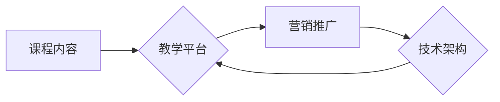

                 

## 如何打造个人知识付费线上课程

> 关键词：知识付费、线上课程、课程设计、教学平台、营销推广、技术架构、内容创作

### 1. 背景介绍

近年来，随着互联网技术的快速发展和普及，知识付费市场蓬勃发展，个人知识付费线上课程也成为一种热门的创业模式。越来越多的人选择利用自身专业知识和经验，通过线上课程的方式分享知识，并从中获得收益。

知识付费线上课程的优势主要体现在以下几个方面：

* **低门槛：** 相比传统线下课程，线上课程的制作成本相对较低，门槛也更低。
* **广阔市场：** 线上课程不受地域限制，可以面向全球用户，市场规模更大。
* **灵活便捷：** 用户可以根据自己的时间安排随时随地学习，学习体验更加灵活便捷。
* **持续收益：** 一次制作的课程可以反复销售，带来持续的收益。

然而，知识付费线上课程的市场竞争也日益激烈，想要脱颖而出，需要精心设计课程内容、选择合适的教学平台、制定有效的营销推广策略，以及掌握一定的技术架构和内容创作技巧。

### 2. 核心概念与联系

知识付费线上课程的核心概念包括：

* **课程内容：** 课程的核心内容是知识和技能的传递，需要根据目标用户的需求和市场趋势进行精心设计。
* **教学平台：** 课程的交付平台是线上学习的载体，需要选择功能完善、用户体验良好的平台。
* **营销推广：** 课程的推广和销售是获取收益的关键环节，需要制定有效的营销策略，吸引目标用户。
* **技术架构：** 课程的后台系统和技术支撑是保证课程稳定运行和用户体验的关键，需要合理的架构设计和技术选型。

这些核心概念相互关联，共同构成了知识付费线上课程的完整生态系统。

**Mermaid 流程图**



### 3. 核心算法原理 & 具体操作步骤

**3.1 算法原理概述**

知识付费线上课程的成功离不开对用户行为分析和学习路径优化等算法的应用。例如，推荐算法可以根据用户的学习历史和兴趣爱好，推荐相关的课程和学习资源，提高用户学习效率和满意度。

**3.2 算法步骤详解**

1. **数据收集:** 收集用户学习行为数据，包括学习时长、学习进度、课程评价等。
2. **数据预处理:** 对收集到的数据进行清洗、转换和特征工程，以便于算法训练。
3. **模型选择:** 选择合适的推荐算法模型，例如协同过滤、内容过滤、深度学习等。
4. **模型训练:** 使用训练数据训练推荐算法模型，并评估模型性能。
5. **模型部署:** 将训练好的模型部署到线上环境，实时推荐课程和学习资源。

**3.3 算法优缺点**

* **优点:** 可以个性化推荐课程，提高用户学习效率和满意度。
* **缺点:** 需要大量的用户数据进行训练，算法模型的准确性需要不断优化。

**3.4 算法应用领域**

推荐算法广泛应用于知识付费线上课程的各个环节，例如：

* **课程推荐:** 根据用户的学习兴趣和需求，推荐相关的课程。
* **学习资源推荐:** 根据用户的学习进度和知识点，推荐相关的学习资源，例如视频、文档、练习题等。
* **个性化学习路径:** 根据用户的学习能力和目标，构建个性化的学习路径。

### 4. 数学模型和公式 & 详细讲解 & 举例说明

**4.1 数学模型构建**

推荐算法通常使用矩阵分解模型，将用户和课程表示为低维向量，通过计算向量之间的相似度来进行推荐。

**4.2 公式推导过程**

假设用户集合为U，课程集合为C，用户-课程交互矩阵为R，其中R(u,c)表示用户u对课程c的评分。

目标是学习用户向量u和课程向量c，使得预测评分与实际评分之间的误差最小化。

常用的损失函数为均方误差：

$$
L = \frac{1}{2} \sum_{u \in U, c \in C} (R(u,c) - \hat{R}(u,c))^2
$$

其中，$\hat{R}(u,c)$为预测评分。

**4.3 案例分析与讲解**

假设用户A对课程1评分为5，对课程2评分为3，用户B对课程1评分为4，对课程2评分为2。

可以使用矩阵分解模型学习用户向量和课程向量，并预测用户A对课程2的评分。

### 5. 项目实践：代码实例和详细解释说明

**5.1 开发环境搭建**

可以使用Python语言和相关的机器学习库，例如TensorFlow或PyTorch，搭建开发环境。

**5.2 源代码详细实现**

```python
import tensorflow as tf

# 定义用户-课程交互矩阵
R = tf.constant([[5, 3], [4, 2]])

# 定义用户和课程向量
u = tf.Variable(tf.random.normal([2, 10]))
c = tf.Variable(tf.random.normal([10, 1]))

# 计算预测评分
predictions = tf.matmul(u, c, transpose_b=True)

# 定义损失函数
loss = tf.reduce_mean(tf.square(R - predictions))

# 定义优化器
optimizer = tf.keras.optimizers.Adam()

# 训练模型
for epoch in range(100):
    with tf.GradientTape() as tape:
        loss_value = loss
    gradients = tape.gradient(loss_value, [u, c])
    optimizer.apply_gradients(zip(gradients, [u, c]))

# 打印预测评分
print(predictions)
```

**5.3 代码解读与分析**

代码首先定义用户-课程交互矩阵和用户、课程向量。然后使用矩阵乘法计算预测评分。定义损失函数并使用Adam优化器进行模型训练。

**5.4 运行结果展示**

训练完成后，可以打印预测评分，并与实际评分进行比较。

### 6. 实际应用场景

知识付费线上课程的实际应用场景非常广泛，例如：

* **教育培训:** 提供各种学科的线上课程，满足不同用户的学习需求。
* **职业技能培训:** 提供职场技能培训课程，帮助用户提升职业竞争力。
* **兴趣爱好学习:** 提供各种兴趣爱好课程，满足用户个性化学习需求。
* **企业内部培训:** 企业可以利用线上课程平台进行内部员工培训，提升员工技能和效率。

**6.4 未来应用展望**

未来，知识付费线上课程将更加个性化、智能化和交互化。例如：

* **人工智能驱动的个性化学习路径:** 根据用户的学习能力和目标，自动生成个性化的学习路径。
* **虚拟现实和增强现实技术的应用:** 利用VR/AR技术打造沉浸式的学习体验。
* **社交学习和社区建设:** 建立线上学习社区，促进用户之间的互动和交流。

### 7. 工具和资源推荐

**7.1 学习资源推荐**

* **Coursera:** https://www.coursera.org/
* **edX:** https://www.edx.org/
* **Udemy:** https://www.udemy.com/

**7.2 开发工具推荐**

* **Python:** https://www.python.org/
* **TensorFlow:** https://www.tensorflow.org/
* **PyTorch:** https://pytorch.org/

**7.3 相关论文推荐**

* **Collaborative Filtering for Implicit Feedback Datasets**
* **Deep Learning for Recommender Systems**

### 8. 总结：未来发展趋势与挑战

**8.1 研究成果总结**

知识付费线上课程的发展取得了显著成果，为用户提供了便捷、高效的学习方式，也为创作者提供了新的收入来源。

**8.2 未来发展趋势**

未来，知识付费线上课程将更加个性化、智能化和交互化，并与其他技术融合发展，例如人工智能、虚拟现实和增强现实技术。

**8.3 面临的挑战**

知识付费线上课程也面临一些挑战，例如：

* **内容质量控制:** 确保课程内容的质量和权威性。
* **用户体验优化:** 提升用户学习体验，提高用户粘性和复购率。
* **商业模式创新:** 探索新的商业模式，实现可持续发展。

**8.4 研究展望**

未来研究方向包括：

* **更精准的推荐算法:** 开发更精准的推荐算法，满足用户个性化学习需求。
* **更沉浸式的学习体验:** 利用VR/AR技术打造更沉浸式的学习体验。
* **更有效的学习评估机制:** 开发更有效的学习评估机制，提高学习效果。

### 9. 附录：常见问题与解答

**常见问题:**

* 如何选择合适的教学平台？
* 如何设计高质量的课程内容？
* 如何进行有效的营销推广？

**解答:**

* 选择教学平台时，需要考虑平台的功能、用户体验、收费标准等因素。
* 课程内容需要根据目标用户的需求和市场趋势进行精心设计，并保证内容的质量和权威性。
* 营销推广需要制定有效的策略，例如内容营销、社交媒体推广、付费广告等。


作者：禅与计算机程序设计艺术 / Zen and the Art of Computer Programming 
<end_of_turn>

