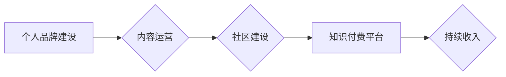

                 

## 如何打造个人知识付费订阅模式

> 关键词：知识付费、订阅模式、个人品牌、内容运营、社区建设、技术博客、在线课程、付费会员

### 1. 背景介绍

在互联网时代，知识成为最宝贵的资源。越来越多的人开始意识到知识的价值，也渴望通过学习提升自身能力和获得更多机会。与此同时，互联网平台的普及和发展为知识传播提供了便捷的渠道。在这种背景下，知识付费模式应运而生，并迅速发展成为一种新的商业模式。

个人知识付费订阅模式是指个人或机构通过提供独家内容、服务或社区，向用户收取订阅费用，从而实现持续收入的模式。这种模式相对于传统的产品销售模式，更注重用户粘性和长期价值。

### 2. 核心概念与联系

**2.1 知识付费的核心概念**

知识付费是指通过提供有价值的知识、技能或信息，向用户收取费用的一种商业模式。其核心价值在于为用户提供解决问题、提升能力或获得收益的知识和技能。

**2.2 订阅模式的核心概念**

订阅模式是指用户预先支付一定费用，获得持续一段时间内的服务或内容访问权限。其特点是用户付费后可以长期享受服务或内容，而提供者可以获得稳定的收入。

**2.3 个人品牌与知识付费的联系**

个人品牌是个人在特定领域或行业内建立的声誉和影响力。个人品牌建设是知识付费成功的关键因素之一。拥有良好个人品牌的个人更容易获得用户的信任和认可，从而更容易转化为付费用户。

**2.4 内容运营与知识付费的联系**

内容运营是知识付费的核心环节。优质的内容是吸引用户、提升用户粘性和实现盈利的重要保障。内容运营需要考虑用户需求、内容质量、内容形式和内容推广等多个方面。

**2.5 社区建设与知识付费的联系**

社区建设可以帮助知识付费平台建立用户粘性和增强用户互动。通过构建一个活跃的社区，用户可以互相交流学习，分享经验，从而提升用户体验和平台价值。

**2.6 Mermaid 流程图**



### 3. 核心算法原理 & 具体操作步骤

**3.1 算法原理概述**

知识付费订阅模式的核心算法原理在于用户价值最大化和平台持续盈利。

* **用户价值最大化:** 通过提供个性化内容、互动服务和社区体验，满足用户多样化的需求，提升用户粘性和价值。
* **平台持续盈利:** 通过订阅模式实现稳定的收入来源，并通过内容升级、会员权益和增值服务，不断提升用户付费意愿。

**3.2 算法步骤详解**

1. **用户画像分析:** 收集用户数据，分析用户兴趣、需求、行为等，构建用户画像。
2. **内容规划与制作:** 根据用户画像，规划和制作优质、有价值的内容，包括文章、视频、音频、直播等多种形式。
3. **订阅方案设计:** 设计不同等级的订阅方案，提供不同内容和服务，满足不同用户需求。
4. **社区建设与运营:** 建立线上线下社区，促进用户互动交流，增强用户粘性和归属感。
5. **用户运营与服务:** 提供优质的用户服务，及时解决用户问题，提升用户体验。
6. **数据分析与优化:** 持续分析用户数据，优化内容、服务和运营策略，不断提升平台价值。

**3.3 算法优缺点**

* **优点:** 
    * 用户体验更佳，内容更精准
    * 平台收入更稳定，可持续发展
    * 增强用户粘性和品牌忠诚度
* **缺点:** 
    * 需要投入更多时间和精力进行内容运营和用户服务
    * 需要不断创新内容和服务，才能保持用户兴趣
    * 需要建立完善的运营体系和团队

**3.4 算法应用领域**

* **技术领域:** 软件开发、数据分析、人工智能等
* **商业领域:** 营销推广、销售管理、财务分析等
* **教育领域:** 在线课程、职业培训、语言学习等
* **生活领域:** 健康养生、旅行美食、兴趣爱好等

### 4. 数学模型和公式 & 详细讲解 & 举例说明

**4.1 数学模型构建**

知识付费订阅模式的数学模型可以简单地表示为：

$$
\text{平台收入} = \text{订阅用户数} \times \text{平均订阅费用}
$$

其中：

* **订阅用户数:** 指平台拥有付费订阅的用户数量。
* **平均订阅费用:** 指用户平均支付的订阅费用。

**4.2 公式推导过程**

该公式的推导过程基于订阅模式的本质：用户支付订阅费用以获得持续的服务或内容。平台收入取决于用户数量和每个用户的付费金额。

**4.3 案例分析与讲解**

假设一个技术博客平台，每月有1000名用户订阅付费会员，平均订阅费用为10美元。根据公式，该平台的每月收入为：

$$
\text{平台收入} = 1000 \times 10 = 10000 \text{美元}
$$

### 5. 项目实践：代码实例和详细解释说明

**5.1 开发环境搭建**

* **操作系统:** Linux/macOS/Windows
* **编程语言:** Python/JavaScript/Go
* **框架:** Django/Flask/Node.js/React
* **数据库:** MySQL/PostgreSQL/MongoDB

**5.2 源代码详细实现**

以下是一个简单的Python代码示例，演示如何使用Flask框架构建一个基本的知识付费订阅平台：

```python
from flask import Flask, render_template, request

app = Flask(__name__)

# 模拟用户数据
users = {
    "user1": {"name": "张三", "subscribed": True},
    "user2": {"name": "李四", "subscribed": False},
}

@app.route("/")
def index():
    return render_template("index.html")

@app.route("/subscribe", methods=["POST"])
def subscribe():
    user_id = request.form.get("user_id")
    users[user_id]["subscribed"] = True
    return "订阅成功！"

if __name__ == "__main__":
    app.run(debug=True)
```

**5.3 代码解读与分析**

* 该代码使用Flask框架构建了一个简单的网站。
* `/` 路由返回首页模板 `index.html`。
* `/subscribe` 路由处理用户订阅请求，更新用户订阅状态。

**5.4 运行结果展示**

运行该代码后，访问 `http://127.0.0.1:5000/`，即可看到一个简单的网站首页。点击订阅按钮，用户可以订阅服务。

### 6. 实际应用场景

**6.1 技术博客平台**

技术博客平台可以提供付费会员服务，提供独家文章、代码库、在线答疑等内容和服务，吸引用户付费订阅。

**6.2 在线课程平台**

在线课程平台可以提供付费课程订阅服务，用户可以根据自己的学习需求选择不同的课程和学习计划，并获得老师的指导和答疑服务。

**6.3 社区平台**

社区平台可以提供付费会员服务，提供独家社区资源、活动参与机会、专家交流等内容和服务，增强用户粘性和社区价值。

**6.4 未来应用展望**

随着互联网技术的不断发展，知识付费订阅模式将更加广泛地应用于各个领域。例如，可以应用于医疗健康、金融理财、法律咨询等领域，为用户提供更个性化、更专业化的服务。

### 7. 工具和资源推荐

**7.1 学习资源推荐**

* **书籍:** 《零基础入门Python》、《Flask Web Development》
* **在线课程:** Udemy、Coursera、Udacity
* **博客:** Real Python、Flask Mega-Tutorial

**7.2 开发工具推荐**

* **代码编辑器:** VS Code、Sublime Text
* **数据库管理工具:** MySQL Workbench、DataGrip
* **版本控制工具:** Git、GitHub

**7.3 相关论文推荐**

* **The Economics of Online Education**
* **The Rise of the Subscription Economy**
* **Building a Successful Knowledge Sharing Platform**

### 8. 总结：未来发展趋势与挑战

**8.1 研究成果总结**

知识付费订阅模式是一种有效的商业模式，可以为个人和平台带来可持续的收入。通过用户价值最大化和平台持续盈利两个核心原则，可以构建一个成功的知识付费平台。

**8.2 未来发展趋势**

* **内容形式多样化:** 除了文字、视频、音频等传统形式，未来将会有更多创新内容形式出现，例如虚拟现实、增强现实等。
* **个性化定制:** 平台将更加注重用户个性化需求，提供定制化的内容和服务。
* **社区化运营:** 社区将成为知识付费平台的核心，用户可以通过社区互动交流学习，提升平台价值。

**8.3 面临的挑战**

* **内容质量保证:** 优质的内容是知识付费平台成功的关键，需要持续投入精力进行内容创作和运营。
* **用户粘性提升:** 知识付费平台需要不断创新内容和服务，才能保持用户兴趣和粘性。
* **商业模式探索:** 知识付费模式还处于发展阶段，需要不断探索新的商业模式和盈利模式。

**8.4 研究展望**

未来研究可以关注以下几个方面：

* **人工智能在知识付费领域的应用:** 如何利用人工智能技术，提升内容创作效率、个性化推荐和用户服务质量。
* **知识付费平台的商业模式创新:** 如何探索新的商业模式和盈利模式，实现平台的可持续发展。
* **知识付费对社会的影响:** 如何利用知识付费模式，促进知识共享和社会进步。

### 9. 附录：常见问题与解答

**9.1 如何选择合适的知识付费平台？**

选择知识付费平台时，需要考虑以下因素：

* **平台内容质量:** 平台提供的知识内容是否优质、有价值？
* **平台用户群体:** 平台的用户群体是否与你的目标用户相符？
* **平台运营模式:** 平台的运营模式是否稳定、可靠？
* **平台收费标准:** 平台的收费标准是否合理？

**9.2 如何打造优质的知识付费内容？**

打造优质的知识付费内容需要以下几个步骤：

* **确定目标用户:** 了解目标用户的需求和痛点。
* **选择合适的主题:** 选择自己熟悉的领域，并有价值的内容。
* **进行深入研究:** 确保内容的准确性和深度。
* **采用多种形式:** 结合文字、视频、音频等多种形式，提升内容的吸引力和趣味性。
* **不断更新:** 定期更新内容，保持用户新鲜感。


作者：禅与计算机程序设计艺术 / Zen and the Art of Computer Programming 
<end_of_turn>

