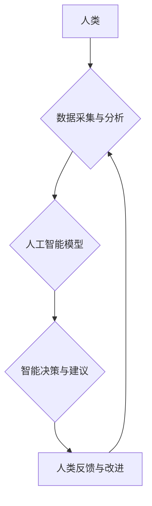

                 

## 应对人类共同挑战：人类计算的使命担当

> 关键词：人类计算、人工智能、大数据、机器学习、深度学习、可解释性、伦理、未来趋势

### 1. 背景介绍

人类正处于一个前所未有的时代。科技进步日新月异，人工智能（AI）正在深刻地改变着我们的生活。从自动驾驶汽车到智能医疗，从个性化教育到精准农业，AI技术的应用前景广阔，为解决人类面临的诸多挑战提供了新的希望。然而，AI技术的发展也带来了新的伦理和社会问题，例如算法偏见、数据隐私和工作岗位替代等。

人类计算作为一种新兴的计算范式，旨在将人类的智慧和机器的计算能力有机结合，以应对人类共同挑战。它强调人机协作、数据共享和知识共建，旨在构建一个更加智能、可持续和包容的未来。

### 2. 核心概念与联系

**2.1 人类计算的概念**

人类计算是指将人类的智慧和机器的计算能力有机结合，共同解决复杂问题的一种计算范式。它强调人机协作、数据共享和知识共建，旨在利用人类的创造力、洞察力和判断能力，以及机器的计算速度、存储能力和数据处理能力，实现协同共赢。

**2.2 人类计算与人工智能的关系**

人工智能是人类计算的重要组成部分，但并非全部。人工智能侧重于模拟人类智能，通过算法和数据训练机器完成特定任务。而人类计算则更强调人机协作，将人工智能技术作为工具，辅助人类进行决策、解决问题和创造价值。

**2.3 人类计算的架构**



**2.4 人类计算的优势**

* **增强人类智能:** 人类计算可以帮助人类更好地理解复杂问题，做出更明智的决策。
* **提高效率和准确性:** 人类计算可以自动化许多重复性任务，提高工作效率和准确性。
* **促进创新和创造:** 人类计算可以帮助人类探索新的领域，激发创新和创造力。
* **解决人类共同挑战:** 人类计算可以帮助人类应对气候变化、医疗保健、教育等全球性挑战。

### 3. 核心算法原理 & 具体操作步骤

**3.1 算法原理概述**

人类计算的核心算法原理是基于机器学习和深度学习技术，通过训练模型，使机器能够从数据中学习，并根据学习到的知识进行预测、分类和决策。

**3.2 算法步骤详解**

1. **数据收集和预处理:** 收集相关数据，并进行清洗、转换和特征工程等预处理工作。
2. **模型选择:** 根据具体任务选择合适的机器学习或深度学习模型，例如线性回归、决策树、支持向量机、神经网络等。
3. **模型训练:** 使用训练数据训练模型，调整模型参数，使模型能够准确地预测或分类。
4. **模型评估:** 使用测试数据评估模型的性能，例如准确率、召回率、F1-score等。
5. **模型部署:** 将训练好的模型部署到实际应用场景中，用于进行预测、分类或决策。

**3.3 算法优缺点**

**优点:**

* **自动化:** 可以自动化许多重复性任务，提高效率。
* **精准度:** 可以根据数据进行精准的预测和分类。
* **可扩展性:** 可以处理海量数据，并随着数据量的增加而提升性能。

**缺点:**

* **数据依赖:** 算法性能依赖于数据的质量和数量。
* **黑盒效应:** 一些复杂的算法难以解释，其决策过程难以理解。
* **偏见问题:** 算法可能存在偏见，导致不公平的结果。

**3.4 算法应用领域**

* **医疗保健:** 疾病诊断、药物研发、个性化治疗
* **金融服务:** 风险评估、欺诈检测、投资决策
* **制造业:** 质量控制、预测维护、生产优化
* **教育:** 个性化学习、智能辅导、自动批改
* **交通运输:** 自动驾驶、交通流量预测、物流优化

### 4. 数学模型和公式 & 详细讲解 & 举例说明

**4.1 数学模型构建**

人类计算的数学模型通常基于概率论、统计学和机器学习算法。例如，在分类问题中，可以使用逻辑回归模型来预测样本属于某个类别或不属于该类别的概率。

**4.2 公式推导过程**

逻辑回归模型的损失函数是交叉熵损失函数，其公式如下：

$$
L(w) = -\frac{1}{N} \sum_{i=1}^{N} y_i \log(p_i) + (1-y_i) \log(1-p_i)
$$

其中：

* $w$ 是模型参数
* $N$ 是样本数量
* $y_i$ 是样本 $i$ 的真实标签（0 或 1）
* $p_i$ 是模型预测样本 $i$ 属于正类的概率

**4.3 案例分析与讲解**

假设我们有一个二分类问题，要预测邮件是否为垃圾邮件。我们可以使用逻辑回归模型训练一个分类器。训练过程中，模型会根据邮件内容的特征，学习出邮件属于垃圾邮件的概率。

当收到一封新的邮件时，模型会根据邮件内容的特征，预测该邮件属于垃圾邮件的概率。如果概率大于某个阈值，则将该邮件分类为垃圾邮件；否则，将该邮件分类为正常邮件。

### 5. 项目实践：代码实例和详细解释说明

**5.1 开发环境搭建**

* Python 3.x
* TensorFlow 或 PyTorch
* Jupyter Notebook

**5.2 源代码详细实现**

```python
import tensorflow as tf

# 定义模型
model = tf.keras.models.Sequential([
    tf.keras.layers.Dense(128, activation='relu', input_shape=(num_features,)),
    tf.keras.layers.Dense(1, activation='sigmoid')
])

# 编译模型
model.compile(optimizer='adam',
              loss='binary_crossentropy',
              metrics=['accuracy'])

# 训练模型
model.fit(X_train, y_train, epochs=10)

# 评估模型
loss, accuracy = model.evaluate(X_test, y_test)
print('Loss:', loss)
print('Accuracy:', accuracy)
```

**5.3 代码解读与分析**

这段代码实现了使用 TensorFlow 库训练一个简单的逻辑回归模型。

* `tf.keras.models.Sequential` 创建了一个顺序模型，即层级结构的模型。
* `tf.keras.layers.Dense` 定义了一个全连接层，其中 `128` 是神经元的数量，`relu` 是激活函数，`input_shape=(num_features,)` 指定了输入数据的维度。
* `tf.keras.layers.Dense(1, activation='sigmoid')` 定义了输出层，只有一个神经元，激活函数为 sigmoid 函数，用于输出属于正类的概率。
* `model.compile` 编译模型，指定优化器、损失函数和评价指标。
* `model.fit` 训练模型，使用训练数据 `X_train` 和标签 `y_train`，训练 10 个 epochs。
* `model.evaluate` 评估模型，使用测试数据 `X_test` 和标签 `y_test`，计算损失和准确率。

**5.4 运行结果展示**

训练完成后，会输出模型的损失和准确率。

### 6. 实际应用场景

**6.1 医疗保健**

* **疾病诊断:** 利用机器学习算法分析患者的病历、影像数据等，辅助医生诊断疾病。
* **药物研发:** 利用深度学习算法分析药物分子结构和生物活性数据，加速药物研发过程。
* **个性化治疗:** 根据患者的基因信息、生活习惯等数据，制定个性化的治疗方案。

**6.2 金融服务**

* **风险评估:** 利用机器学习算法分析客户的信用记录、交易行为等数据，评估客户的信用风险。
* **欺诈检测:** 利用机器学习算法分析交易数据，识别异常交易行为，防止欺诈行为。
* **投资决策:** 利用机器学习算法分析市场数据、公司财务数据等，辅助投资者做出投资决策。

**6.3 制造业**

* **质量控制:** 利用机器视觉技术和深度学习算法分析产品图像，识别产品缺陷。
* **预测维护:** 利用机器学习算法分析设备运行数据，预测设备故障，进行及时维护。
* **生产优化:** 利用机器学习算法分析生产数据，优化生产流程，提高生产效率。

**6.4 未来应用展望**

随着人工智能技术的不断发展，人类计算将在更多领域得到应用，例如：

* **教育:** 个性化学习、智能辅导、自动批改
* **交通运输:** 自动驾驶、交通流量预测、物流优化
* **环境保护:** 气候变化预测、污染监测、资源管理
* **艺术创作:** 音乐创作、绘画创作、文学创作

### 7. 工具和资源推荐

**7.1 学习资源推荐**

* **在线课程:** Coursera、edX、Udacity 等平台提供丰富的机器学习和深度学习课程。
* **书籍:** 《深度学习》、《机器学习实战》等书籍是学习人工智能的经典教材。
* **开源项目:** TensorFlow、PyTorch 等开源项目提供了丰富的代码示例和工具。

**7.2 开发工具推荐**

* **Python:** 人工智能开发的常用编程语言。
* **Jupyter Notebook:** 用于编写和运行 Python 代码的交互式笔记本环境。
* **TensorFlow:** 开源深度学习框架。
* **PyTorch:** 开源深度学习框架。

**7.3 相关论文推荐**

* **《ImageNet Classification with Deep Convolutional Neural Networks》**
* **《Attention Is All You Need》**
* **《BERT: Pre-training of Deep Bidirectional Transformers for Language Understanding》**

### 8. 总结：未来发展趋势与挑战

**8.1 研究成果总结**

近年来，人工智能技术取得了长足的进步，在图像识别、自然语言处理、语音识别等领域取得了突破性进展。人类计算作为一种新兴的计算范式，为解决人类共同挑战提供了新的思路和方法。

**8.2 未来发展趋势**

* **模型更加强大:** 人工智能模型将更加强大，能够处理更加复杂的任务。
* **数据更加丰富:** 人类计算将依赖于更加丰富的数据，例如传感器数据、社交媒体数据等。
* **算法更加透明:** 人工智能算法将更加透明，更容易被理解和解释。
* **人机协作更加紧密:** 人类和机器将更加紧密地协作，共同解决问题。

**8.3 面临的挑战**

* **算法偏见:** 人工智能算法可能存在偏见，导致不公平的结果。
* **数据隐私:** 人类计算需要处理大量数据，如何保护数据隐私是一个重要挑战。
* **伦理问题:** 人工智能技术的发展引发了许多伦理问题，例如人工智能的责任和义务。

**8.4 研究展望**

未来，人类计算的研究将更加注重以下几个方面:

* **开发更加公平、透明和可解释的算法。**
* **构建更加安全、可靠和可控的人工智能系统。**
* **探索人工智能与人类智慧的协同共赢模式。**

### 9. 附录：常见问题与解答

**9.1 如何解决算法偏见问题？**

* 使用更加多样化的训练数据。
* 开发更加公平的算法设计方法。
* 对算法进行定期评估和调整。

**9.2 如何保护数据隐私？**

* 使用加密技术保护数据。
* 采用匿名化技术处理数据。
* 遵守数据隐私相关的法律法规。

**9.3 人工智能技术会取代人类工作吗？**

人工智能技术可能会改变一些工作岗位，但同时也创造新的工作机会。重要的是，人类需要不断学习和提升自己的技能，适应未来的发展趋势。


作者：禅与计算机程序设计艺术 / Zen and the Art of Computer Programming 
<end_of_turn>

