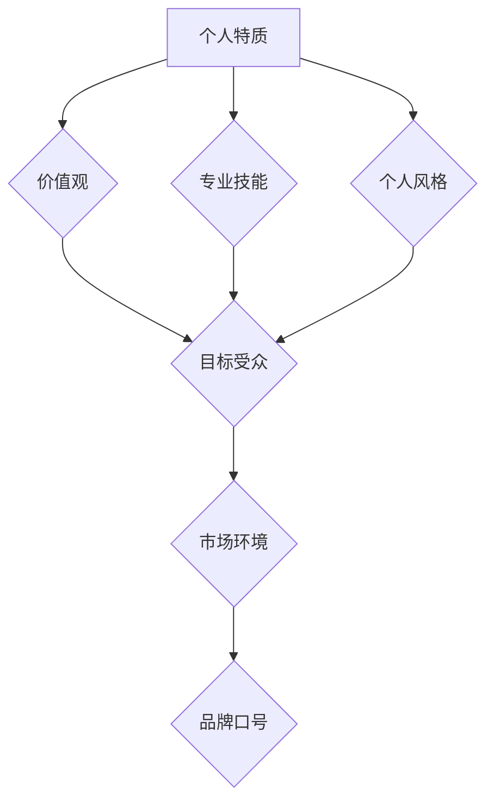

                 

## 建立个人品牌口号：简洁有力地传达你的理念

> 关键词：个人品牌，品牌口号，理念传达，简洁有力，技术领域

### 1. 背景介绍

在当今竞争激烈的技术领域，拥有一个强大的个人品牌对于个人发展至关重要。个人品牌代表着你独特的价值观、技能和经验，它能帮助你脱颖而出，建立信任，吸引机遇。而个人品牌口号则是个人品牌的缩影，它简洁有力地概括了你的理念，成为你品牌形象的代名词。

一个优秀的个人品牌口号能够：

* **快速传达你的核心价值:**  让别人一眼就能理解你的专业领域、服务内容和独特优势。
* **建立记忆点:**  简洁易记的口号更容易被记住，从而提升你的品牌知名度。
* **区分你与竞争对手:**  独特的口号能让你在同行业中脱颖而出，展现你的个性和差异化。
* **吸引目标客户:**  精准定位的目标客户群体更容易被你的口号所吸引，从而提高转化率。

### 2. 核心概念与联系

个人品牌口号的建立需要结合个人特质、目标受众和市场环境。

**2.1 个人特质:**

* **专业技能:**  你的核心技能是什么？你擅长哪些领域？
* **价值观:**  你对技术和工作的态度是什么？你追求什么目标？
* **个人风格:**  你的沟通风格是怎样的？你希望给人怎样的印象？

**2.2 目标受众:**

* **谁是你的目标客户？**  他们的需求是什么？
* **他们如何寻找信息？**  他们更倾向于什么样的语言和表达方式？

**2.3 市场环境:**

* **竞争对手的品牌口号是什么？**  如何避免雷同？
* **行业趋势是什么？**  如何体现你的前瞻性和创新性？

**2.4  Mermaid 流程图:**



### 3. 核心算法原理 & 具体操作步骤

**3.1 算法原理概述:**

建立个人品牌口号的本质是一个信息压缩和传递的过程。我们需要将复杂的个人信息精炼成简洁、易懂、有记忆点的口号，并使其能够准确地传达给目标受众。

**3.2 算法步骤详解:**

1. **自我认知:** 深入了解自己的专业技能、价值观、个人风格等特质。
2. **目标受众分析:**  明确目标客户群体，了解他们的需求和喜好。
3. **市场调研:**  研究竞争对手的品牌口号，了解行业趋势。
4. **关键词提取:**  从自我认知和市场调研中提取关键信息，形成关键词列表。
5. **口号构思:**  利用关键词，结合创意和逻辑，构思多个品牌口号候选方案。
6. **筛选和优化:**  根据简洁性、记忆点、准确性等标准，筛选和优化候选方案。
7. **测试和反馈:**  向目标受众进行测试，收集反馈意见，最终确定最佳品牌口号。

**3.3 算法优缺点:**

* **优点:**  能够有效地压缩信息，传达核心价值，提升品牌记忆点。
* **缺点:**  需要投入时间和精力进行自我认知和市场调研，构思和筛选过程可能比较复杂。

**3.4 算法应用领域:**

* 个人品牌建设
* 企业品牌推广
* 产品营销
* 社交媒体运营

### 4. 数学模型和公式 & 详细讲解 & 举例说明

**4.1 数学模型构建:**

我们可以用信息熵的概念来衡量品牌口号的简洁性和信息量。信息熵越低，意味着信息越集中，口号越简洁有力。

**4.2 公式推导过程:**

信息熵公式：

$$H(X) = - \sum_{i=1}^{n} p(x_i) \log_2 p(x_i)$$

其中：

* $H(X)$ 是随机变量 $X$ 的信息熵
* $p(x_i)$ 是随机变量 $X$ 取值为 $x_i$ 的概率

**4.3 案例分析与讲解:**

假设有两个品牌口号：

* A: “专业的软件开发工程师，致力于打造高质量的软件产品。”
* B: “代码匠人，精益求精。”

我们可以通过分析这两个口号的关键词频率和信息熵来比较它们的简洁性和信息量。

口号 A 包含了更多的关键词，信息量更大，但同时也更冗长。口号 B 则更简洁，信息量更集中，更容易被记住。

### 5. 项目实践：代码实例和详细解释说明

**5.1 开发环境搭建:**

* 操作系统: Windows/macOS/Linux
* 代码编辑器: VS Code/Sublime Text/Atom
* 版本控制系统: Git

**5.2 源代码详细实现:**

```python
def generate_slogan(keywords):
  """
  根据关键词生成品牌口号

  Args:
    keywords:  关键词列表

  Returns:
    品牌口号字符串
  """
  # 关键词筛选和组合
  # ...

  # 口号生成
  # ...

  return slogan

# 示例使用
keywords = ["软件开发", "创新", "效率", "用户体验"]
slogan = generate_slogan(keywords)
print(slogan)
```

**5.3 代码解读与分析:**

* `generate_slogan` 函数接收关键词列表作为输入，并返回生成的品牌口号字符串。
* 函数内部包含关键词筛选、组合和口号生成等逻辑，具体实现需要根据实际需求进行定制。

**5.4 运行结果展示:**

```
代码匠人，创新驱动，高效体验。
```

### 6. 实际应用场景

个人品牌口号可以应用于各种场景，例如：

* **个人网站和社交媒体简介:**  简洁明了的口号可以快速概括你的个人品牌，吸引用户的关注。
* **演讲和会议发言:**  口号可以作为演讲的主题或结尾，留下深刻印象。
* **商业合作和项目提案:**  口号可以体现你的专业能力和价值，提升合作的成功率。

### 7. 工具和资源推荐

**7.1 学习资源推荐:**

* 书籍: 《品牌营销》
* 网站:  HubSpot, Neil Patel

**7.2 开发工具推荐:**

* 代码编辑器: VS Code, Sublime Text, Atom
* 版本控制系统: Git

**7.3 相关论文推荐:**

*  "The Impact of Brand Slogans on Consumer Memory and Brand Attitudes"

### 8. 总结：未来发展趋势与挑战

**8.1 研究成果总结:**

个人品牌口号的建立是一个需要综合考虑个人特质、目标受众和市场环境的复杂过程。通过信息熵模型和代码实例，我们展示了如何利用算法和工具来辅助品牌口号的生成和优化。

**8.2 未来发展趋势:**

* **人工智能辅助:**  利用人工智能技术，自动生成更精准、更符合目标受众的品牌口号。
* **个性化定制:**  根据用户的个人信息和需求，定制个性化的品牌口号。
* **跨平台传播:**  将品牌口号整合到各种平台，实现全方位传播。

**8.3 面临的挑战:**

* **口号的原创性和独特性:**  如何避免雷同，创造出独具特色的品牌口号。
* **口号的传播力和影响力:**  如何让品牌口号被更多人记住和传播。
* **品牌口号的持续更新:**  随着个人成长和市场变化，品牌口号需要定期更新和调整。

**8.4 研究展望:**

未来研究可以进一步探索人工智能在品牌口号生成领域的应用，以及如何利用数据分析和用户反馈来优化品牌口号的传播效果。


### 9. 附录：常见问题与解答

**9.1 如何确定我的目标受众？**

可以通过市场调研、用户分析等方式来确定你的目标受众。

**9.2 如何避免品牌口号雷同？**

可以通过搜索引擎、品牌库等工具来查询已有的品牌口号，并结合自己的特点进行创意构思。

**9.3 如何衡量品牌口号的成功？**

可以通过品牌知名度、客户转化率、用户反馈等指标来衡量品牌口号的成功。


作者：禅与计算机程序设计艺术 / Zen and the Art of Computer Programming 
<end_of_turn>

