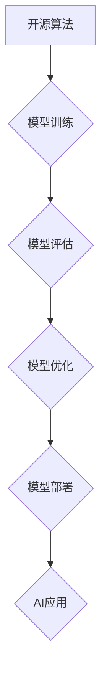

                 

## 开源技术如何推动AI的进步

> 关键词：开源、人工智能、机器学习、深度学习、算法、模型、社区、协作、创新

## 1. 背景介绍

人工智能（AI）正以惊人的速度发展，深刻地改变着我们生活的方方面面。从自动驾驶汽车到智能语音助手，从医疗诊断到金融预测，AI技术的应用场景日益广泛。然而，AI的发展离不开强大的技术基础和资源支持。开源技术在推动AI进步方面发挥着至关重要的作用，它打破了技术壁垒，促进了算法创新和模型共享，加速了AI技术的普及和应用。

## 2. 核心概念与联系

**2.1  开源技术**

开源技术是指源代码公开可供任何人免费使用、修改和再发布的技术。开源软件的开发和维护通常由全球范围内的开发者社区共同参与，这使得开源技术具有以下特点：

* **透明度高:** 源代码公开，任何人都可以查看和理解软件的内部结构和工作原理。
* **可定制性强:** 用户可以根据自己的需求修改和扩展开源软件的功能。
* **成本低廉:** 使用开源软件可以节省软件许可费用。
* **社区支持:** 开源社区提供丰富的技术支持和资源，帮助用户解决问题和改进软件。

**2.2  人工智能**

人工智能是指模拟人类智能的计算机系统。AI技术涵盖了多个领域，包括机器学习、深度学习、自然语言处理、计算机视觉等。

**2.3  联系**

开源技术为AI的发展提供了以下关键支持：

* **算法共享:** 开源社区分享各种AI算法和模型，降低了开发者开发AI应用的门槛。
* **工具和框架:** 开源提供了许多用于开发和训练AI模型的工具和框架，例如TensorFlow、PyTorch、Keras等。
* **数据集:** 开源数据集为AI模型的训练提供了丰富的样本数据。
* **协作开发:** 开源社区的协作开发模式加速了AI算法和模型的创新和改进。

**2.4  Mermaid 流程图**



## 3. 核心算法原理 & 具体操作步骤

**3.1  算法原理概述**

机器学习是人工智能的重要分支，它通过算法学习数据中的模式，从而实现预测、分类、聚类等任务。常见的机器学习算法包括：

* **线性回归:** 用于预测连续值，假设数据服从线性关系。
* **逻辑回归:** 用于分类问题，将数据映射到0或1的概率。
* **决策树:** 通过一系列规则进行分类或预测。
* **支持向量机:** 通过寻找最佳超平面将数据分类。
* **k-近邻:** 根据数据点之间的距离进行分类或预测。

**3.2  算法步骤详解**

以线性回归为例，其具体操作步骤如下：

1. **数据准备:** 收集和预处理数据，包括特征选择、数据清洗、数据标准化等。
2. **模型训练:** 使用训练数据训练线性回归模型，求解模型参数。
3. **模型评估:** 使用测试数据评估模型的性能，例如计算均方误差（MSE）或R-squared值。
4. **模型优化:** 根据评估结果调整模型参数，提高模型性能。
5. **模型部署:** 将训练好的模型部署到实际应用场景中，用于预测或分类。

**3.3  算法优缺点**

* **优点:** 
    * 算法简单易懂，易于实现。
    * 训练速度快，适合处理大规模数据。
    * 可解释性强，可以直观地理解模型的决策过程。
* **缺点:** 
    * 只能处理线性关系的数据。
    * 对异常值敏感。
    * 无法处理高维数据。

**3.4  算法应用领域**

线性回归广泛应用于以下领域：

* **预测分析:** 预测销售额、股票价格、客户流失率等。
* **风险评估:** 评估贷款风险、信用风险、欺诈风险等。
* **价格优化:** 优化产品定价、广告投放价格等。

## 4. 数学模型和公式 & 详细讲解 & 举例说明

**4.1  数学模型构建**

线性回归模型假设数据服从线性关系，可以用以下数学模型表示：

$$y = wx + b$$

其中：

* $y$ 是预测值。
* $x$ 是输入特征。
* $w$ 是权重参数。
* $b$ 是偏置参数。

**4.2  公式推导过程**

目标是找到最佳的 $w$ 和 $b$ 参数，使模型预测值与实际值之间的误差最小化。常用的误差函数是均方误差（MSE）：

$$MSE = \frac{1}{n} \sum_{i=1}^{n} (y_i - \hat{y}_i)^2$$

其中：

* $n$ 是样本数量。
* $y_i$ 是实际值。
* $\hat{y}_i$ 是模型预测值。

通过最小化MSE，可以求解出最佳的 $w$ 和 $b$ 参数。可以使用梯度下降算法迭代更新参数，直到达到最小误差。

**4.3  案例分析与讲解**

假设我们想要预测房屋价格，输入特征是房屋面积，目标是预测房屋价格。我们可以收集房屋面积和价格的数据，训练一个线性回归模型。

训练完成后，我们可以使用模型预测新房子的价格。例如，如果新房子的面积是100平方米，模型预测的价格可能是500万元。

## 5. 项目实践：代码实例和详细解释说明

**5.1  开发环境搭建**

* Python 3.x
* TensorFlow 或 PyTorch
* Jupyter Notebook

**5.2  源代码详细实现**

```python
import tensorflow as tf

# 构建线性回归模型
model = tf.keras.models.Sequential([
    tf.keras.layers.Dense(units=1, input_shape=[1])
])

# 编译模型
model.compile(optimizer='sgd', loss='mean_squared_error')

# 训练模型
model.fit(x_train, y_train, epochs=100)

# 预测新数据
predictions = model.predict(x_new)
```

**5.3  代码解读与分析**

* 首先，我们使用 TensorFlow 库构建一个线性回归模型。模型只有一个全连接层，输入特征维度为1，输出维度为1。
* 然后，我们使用随机梯度下降（SGD）算法编译模型，并使用均方误差（MSE）作为损失函数。
* 接着，我们使用训练数据训练模型，训练100个 epochs。
* 最后，我们使用训练好的模型预测新数据的价格。

**5.4  运行结果展示**

训练完成后，我们可以评估模型的性能，例如计算均方误差（MSE）或R-squared值。

## 6. 实际应用场景

**6.1  医疗诊断**

* 使用机器学习算法分析患者的医疗影像数据，辅助医生诊断疾病。
* 预测患者的风险，例如患心脏病或糖尿病的风险。

**6.2  金融预测**

* 预测股票价格、汇率、债券收益率等金融指标。
* 评估贷款风险、信用风险、欺诈风险等。

**6.3  自然语言处理**

* 机器翻译、文本摘要、情感分析等。
* 自动生成文本，例如新闻报道、产品描述等。

**6.4  未来应用展望**

* 更智能的虚拟助手和聊天机器人。
* 自动驾驶汽车和无人机。
* 个性化教育和医疗服务。
* 更高效的能源管理和环境保护。

## 7. 工具和资源推荐

**7.1  学习资源推荐**

* **书籍:**
    * 《深度学习》
    * 《机器学习实战》
    * 《Python机器学习》
* **在线课程:**
    * Coursera
    * edX
    * Udacity

**7.2  开发工具推荐**

* **TensorFlow:** 开源机器学习框架，支持多种深度学习算法。
* **PyTorch:** 开源机器学习框架，以其灵活性和易用性而闻名。
* **Keras:** 高级API，可以方便地构建和训练深度学习模型。

**7.3  相关论文推荐**

* **《ImageNet Classification with Deep Convolutional Neural Networks》**
* **《Attention Is All You Need》**
* **《BERT: Pre-training of Deep Bidirectional Transformers for Language Understanding》**

## 8. 总结：未来发展趋势与挑战

**8.1  研究成果总结**

开源技术在推动AI进步方面发挥了重要作用，加速了算法创新、模型共享和应用普及。

**8.2  未来发展趋势**

* **更强大的AI模型:** 研究人员将继续开发更强大、更智能的AI模型，例如通用人工智能（AGI）。
* **更广泛的应用场景:** AI技术将应用于更多领域，例如医疗、教育、金融、交通等。
* **更注重伦理和可解释性:** 随着AI技术的进步，伦理和可解释性将成为越来越重要的研究方向。

**8.3  面临的挑战**

* **数据安全和隐私:** AI模型的训练需要大量数据，如何保护数据安全和隐私是一个重要挑战。
* **算法偏见:** AI模型可能存在算法偏见，导致不公平的结果。
* **黑盒问题:** 许多AI模型难以解释，其决策过程难以理解。

**8.4  研究展望**

未来，开源技术将继续推动AI的发展，我们需要加强跨学科合作，解决AI面临的挑战，并确保AI技术造福人类。

## 9. 附录：常见问题与解答

**9.1  Q: 如何选择合适的开源AI工具？**

**A:** 选择合适的开源AI工具取决于具体的应用场景和需求。例如，如果需要训练图像识别模型，可以选择TensorFlow或PyTorch；如果需要进行自然语言处理，可以选择SpaCy或NLTK。

**9.2  Q: 如何参与开源AI社区？**

**A:** 可以通过以下方式参与开源AI社区：

* 贡献代码
* 报告bug
* 提出新的功能需求
* 参加社区论坛和会议

**9.3  Q: 开源AI技术对商业应用有什么影响？**

**A:** 开源AI技术降低了开发AI应用的门槛，促进了AI技术的普及和应用，对商业应用产生了深远的影响。企业可以利用开源AI工具快速开发AI应用，降低开发成本，提高效率。


作者：禅与计算机程序设计艺术 / Zen and the Art of Computer Programming 
<end_of_turn>

