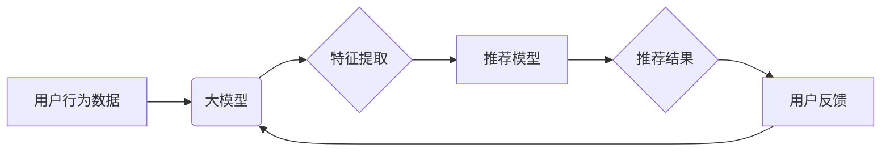

                 

## 推荐系统的未来发展趋势：大模型的主导作用

> 关键词：推荐系统、大模型、深度学习、Transformer、个性化推荐、冷启动问题、数据隐私

## 1. 背景介绍

推荐系统作为互联网时代的重要组成部分，旨在根据用户的历史行为、偏好和上下文信息，预测用户可能感兴趣的内容，并将其推荐给用户。从传统的基于内容的过滤和协同过滤推荐算法发展到如今的深度学习驱动的个性化推荐，推荐系统一直在不断演进。近年来，大模型的兴起为推荐系统带来了新的机遇和挑战。

大模型，指的是参数规模庞大、训练数据海量的人工智能模型。其强大的学习能力和泛化能力使其在自然语言处理、计算机视觉等领域取得了突破性进展。在推荐系统领域，大模型的应用也展现出巨大的潜力，能够更好地理解用户需求，提供更精准、更个性化的推荐结果。

## 2. 核心概念与联系

### 2.1 推荐系统概述

推荐系统旨在通过分析用户行为数据和物品特征，预测用户对物品的偏好，并推荐用户可能感兴趣的物品。

推荐系统主要分为以下几类：

* **基于内容的过滤推荐:** 根据用户历史行为和物品特征进行相似性匹配，推荐与用户兴趣相符的物品。
* **协同过滤推荐:** 基于用户的行为相似性，推荐与相似用户喜欢的物品。
* **混合推荐:** 结合基于内容的过滤和协同过滤推荐，提高推荐效果。
* **深度学习推荐:** 利用深度学习算法，从海量数据中学习用户和物品的潜在特征，进行更精准的推荐。

### 2.2 大模型概述

大模型是指参数规模庞大、训练数据海量的人工智能模型。其强大的学习能力和泛化能力使其在自然语言处理、计算机视觉等领域取得了突破性进展。

大模型的训练通常需要大量的计算资源和时间，但其强大的能力也为推荐系统带来了新的机遇。

### 2.3 大模型与推荐系统的联系

大模型可以应用于推荐系统的各个环节，例如：

* **特征提取:** 大模型可以从用户行为数据和物品描述中提取更丰富的特征，为推荐算法提供更精准的输入。
* **模型训练:** 大模型可以训练出更强大的推荐模型，提高推荐效果。
* **个性化推荐:** 大模型可以根据用户的个性化需求，提供更精准的推荐结果。

**大模型在推荐系统中的应用架构**



## 3. 核心算法原理 & 具体操作步骤

### 3.1 算法原理概述

大模型在推荐系统中的应用主要基于深度学习算法，例如Transformer模型。Transformer模型通过自注意力机制，能够捕捉用户行为数据和物品特征之间的复杂关系，从而实现更精准的推荐。

### 3.2 算法步骤详解

1. **数据预处理:** 收集用户行为数据和物品特征数据，进行清洗、转换和编码。
2. **特征工程:** 利用大模型的预训练能力，从用户行为数据和物品特征数据中提取更丰富的特征。
3. **模型训练:** 使用Transformer模型训练推荐模型，并根据用户反馈进行模型优化。
4. **推荐结果生成:** 将用户行为数据输入到训练好的推荐模型中，预测用户对物品的偏好，并生成推荐结果。

### 3.3 算法优缺点

**优点:**

* **精准度高:** 大模型能够捕捉用户行为数据和物品特征之间的复杂关系，提高推荐精准度。
* **个性化强:** 大模型可以根据用户的个性化需求，提供更精准的推荐结果。
* **泛化能力强:** 大模型在训练数据之外的数据上也能表现良好。

**缺点:**

* **计算资源消耗大:** 大模型的训练需要大量的计算资源和时间。
* **数据依赖性强:** 大模型的性能依赖于训练数据的质量和数量。
* **可解释性差:** 大模型的决策过程较为复杂，难以解释其推荐结果背后的原因。

### 3.4 算法应用领域

大模型在推荐系统领域的应用非常广泛，例如：

* **电商推荐:** 推荐用户可能感兴趣的商品。
* **内容推荐:** 推荐用户可能感兴趣的文章、视频、音乐等内容。
* **社交推荐:** 推荐用户可能想关注的人或群组。
* **广告推荐:** 推荐用户可能感兴趣的广告。

## 4. 数学模型和公式 & 详细讲解 & 举例说明

### 4.1 数学模型构建

推荐系统的核心是预测用户对物品的偏好。可以使用以下数学模型来表示用户对物品的评分：

$$
r_{u,i} = f(u, i, \theta)
$$

其中：

* $r_{u,i}$ 表示用户 $u$ 对物品 $i$ 的评分。
* $u$ 表示用户。
* $i$ 表示物品。
* $f$ 表示评分函数。
* $\theta$ 表示模型参数。

### 4.2 公式推导过程

大模型在推荐系统中通常使用深度学习算法，例如Transformer模型。Transformer模型通过自注意力机制，能够捕捉用户行为数据和物品特征之间的复杂关系。

Transformer模型的输出可以表示为：

$$
\hat{r}_{u,i} = \text{softmax}(W_o \cdot \text{Attention}(W_i \cdot u, W_j \cdot i))
$$

其中：

* $\hat{r}_{u,i}$ 表示模型预测的用户对物品 $i$ 的评分。
* $W_o$ 和 $W_i$ 和 $W_j$ 表示模型参数。
* $\text{Attention}$ 表示自注意力机制。

### 4.3 案例分析与讲解

假设我们有一个电商平台，想要推荐用户可能感兴趣的商品。我们可以使用大模型训练一个推荐模型，该模型可以从用户的历史购买记录、浏览记录、评分记录等数据中学习用户偏好，并根据用户的当前行为推荐相关的商品。

例如，如果用户最近购买了运动鞋，浏览了跑步服和运动耳机，那么模型可以预测用户对这些商品的偏好较高，并将其推荐给用户。

## 5. 项目实践：代码实例和详细解释说明

### 5.1 开发环境搭建

推荐系统开发环境通常需要以下软件：

* Python 3.x
* TensorFlow 或 PyTorch
* Jupyter Notebook

### 5.2 源代码详细实现

以下是一个使用TensorFlow实现简单推荐系统的代码示例：

```python
import tensorflow as tf

# 定义模型
model = tf.keras.Sequential([
    tf.keras.layers.Embedding(input_dim=10000, output_dim=64),
    tf.keras.layers.Flatten(),
    tf.keras.layers.Dense(1, activation='sigmoid')
])

# 编译模型
model.compile(optimizer='adam', loss='binary_crossentropy', metrics=['accuracy'])

# 训练模型
model.fit(x_train, y_train, epochs=10)

# 预测结果
predictions = model.predict(x_test)
```

### 5.3 代码解读与分析

* `Embedding` 层将用户和物品的ID转换为稠密的向量表示。
* `Flatten` 层将向量表示展平为一维向量。
* `Dense` 层是一个全连接层，用于预测用户对物品的评分。
* `sigmoid` 激活函数将输出值压缩到0到1之间，表示用户对物品的偏好程度。

### 5.4 运行结果展示

训练完成后，可以使用测试数据评估模型的性能。

## 6. 实际应用场景

### 6.1 电商推荐

大模型在电商推荐领域应用广泛，例如：

* **商品推荐:** 根据用户的历史购买记录、浏览记录、评分记录等数据，推荐用户可能感兴趣的商品。
* **个性化商品组合:** 根据用户的偏好，推荐用户可能喜欢的商品组合。
* **跨境电商推荐:** 根据用户的地理位置和语言偏好，推荐跨境电商平台上的商品。

### 6.2 内容推荐

大模型在内容推荐领域也发挥着重要作用，例如：

* **新闻推荐:** 根据用户的阅读历史和兴趣，推荐用户可能感兴趣的新闻。
* **视频推荐:** 根据用户的观看历史和兴趣，推荐用户可能喜欢的视频。
* **音乐推荐:** 根据用户的听歌历史和兴趣，推荐用户可能喜欢的音乐。

### 6.3 社交推荐

大模型可以用于社交平台的推荐，例如：

* **好友推荐:** 根据用户的兴趣和社交关系，推荐用户可能想添加的好友。
* **群组推荐:** 根据用户的兴趣和社交关系，推荐用户可能想加入的群组。
* **话题推荐:** 根据用户的兴趣和社交关系，推荐用户可能感兴趣的话题。

### 6.4 未来应用展望

随着大模型技术的不断发展，其在推荐系统领域的应用将更加广泛和深入。例如：

* **多模态推荐:** 将文本、图像、音频等多种模态数据融合，提供更丰富的推荐结果。
* **实时推荐:** 利用大模型的实时推理能力，提供更及时、更精准的推荐结果。
* **个性化解释:** 利用大模型的解释性技术，为用户提供推荐结果背后的原因解释。

## 7. 工具和资源推荐

### 7.1 学习资源推荐

* **书籍:**
    * Deep Learning by Ian Goodfellow, Yoshua Bengio, and Aaron Courville
    * Hands-On Machine Learning with Scikit-Learn, Keras & TensorFlow by Aurélien Géron
* **在线课程:**
    * TensorFlow Tutorials: https://www.tensorflow.org/tutorials
    * PyTorch Tutorials: https://pytorch.org/tutorials/

### 7.2 开发工具推荐

* **TensorFlow:** https://www.tensorflow.org/
* **PyTorch:** https://pytorch.org/
* **Keras:** https://keras.io/

### 7.3 相关论文推荐

* Attention Is All You Need (Vaswani et al., 2017)
* BERT: Pre-training of Deep Bidirectional Transformers for Language Understanding (Devlin et al., 2018)
* Transformer-XL: Attentive Language Modeling Beyond Millions of Tokens (Dai et al., 2019)

## 8. 总结：未来发展趋势与挑战

### 8.1 研究成果总结

大模型在推荐系统领域取得了显著的成果，能够提供更精准、更个性化的推荐结果。

### 8.2 未来发展趋势

* **多模态推荐:** 将文本、图像、音频等多种模态数据融合，提供更丰富的推荐结果。
* **实时推荐:** 利用大模型的实时推理能力，提供更及时、更精准的推荐结果。
* **个性化解释:** 利用大模型的解释性技术，为用户提供推荐结果背后的原因解释。

### 8.3 面临的挑战

* **数据隐私:** 大模型的训练需要大量的用户数据，如何保护用户隐私是一个重要的挑战。
* **模型可解释性:** 大模型的决策过程较为复杂，难以解释其推荐结果背后的原因，这可能会导致用户对推荐结果的信任度降低。
* **计算资源消耗:** 大模型的训练需要大量的计算资源和时间，这可能会限制其在实际应用中的推广。

### 8.4 研究展望

未来，研究者将继续探索大模型在推荐系统领域的应用，并致力于解决上述挑战，以实现更精准、更个性化、更可解释的推荐系统。

## 9. 附录：常见问题与解答

### 9.1 如何选择合适的推荐算法？

选择合适的推荐算法需要根据具体业务场景和数据特点进行考虑。

* **数据量:** 如果数据量较小，可以使用基于内容的过滤或协同过滤推荐算法。
* **用户行为:** 如果用户行为数据丰富，可以使用深度学习推荐算法。
* **推荐个性化程度:** 如果需要提供更个性化的推荐，可以使用混合推荐或深度学习推荐算法。

### 9.2 如何解决冷启动问题？

冷启动问题是指在推荐系统初期，由于缺乏用户行为数据，难以准确预测用户偏好。

* **利用用户属性信息:** 可以利用用户的年龄、性别、兴趣等属性信息进行推荐。
* **利用物品特征信息:** 可以利用物品的类别、描述、价格等特征信息进行推荐。
* **使用协同过滤的扩展方法:** 可以使用基于物品的协同过滤或基于内容的过滤进行推荐。

### 9.3 如何评估推荐系统的性能？

常用的推荐系统性能指标包括：

* **准确率:** 推荐结果与用户真实偏好的一致性。
* **召回率:** 推荐结果包含用户真实偏好的物品的比例。
* **点击率:** 用户点击推荐结果的比例。
* **转化率:** 用户通过推荐结果完成购买或其他目标行为的比例。


作者：禅与计算机程序设计艺术 / Zen and the Art of Computer Programming 
<end_of_turn>

